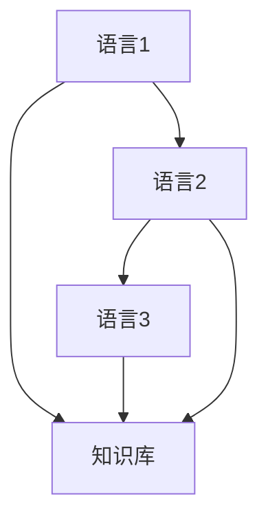
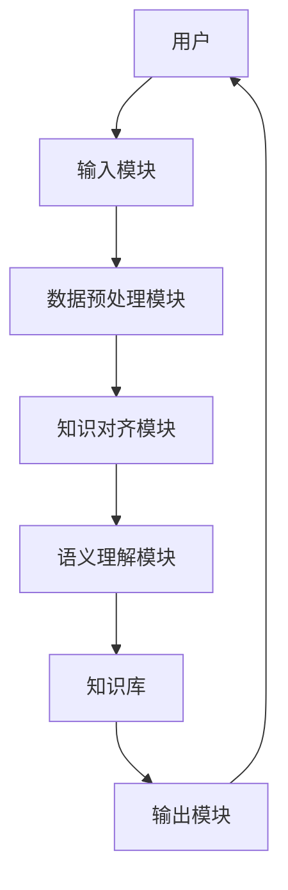
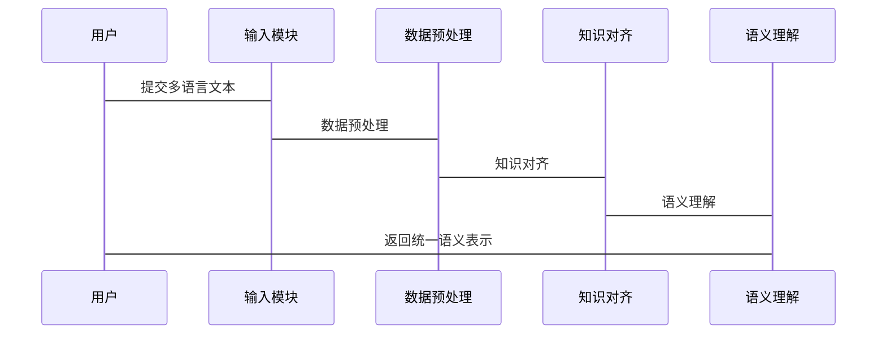

                 


# AI Agent的跨语言知识迁移技术

---

## 关键词：
- AI Agent, 跨语言知识迁移, 知识对齐, 多语言处理, 机器学习, 自然语言处理

---

## 摘要：
本文系统地探讨了AI Agent在跨语言知识迁移中的核心技术与应用场景。通过分析跨语言表示学习、知识对齐方法和语义理解，本文深入阐述了实现跨语言知识迁移的算法原理、系统架构及实际案例。结合数学模型和实际代码示例，本文为读者提供了从理论到实践的全面指南，帮助理解并掌握AI Agent在多语言环境下的知识迁移技术。

---

# 第1章: AI Agent与跨语言知识迁移概述

## 1.1 AI Agent的基本概念
- 1.1.1 AI Agent的定义与核心特征
  - AI Agent的定义
  - 核心特征：自主性、反应性、目标导向
- 1.1.2 跨语言知识迁移的必要性
  - 多语言环境中的知识共享挑战
  - 知识迁移的核心目标

## 1.2 跨语言知识迁移的背景与问题
- 1.2.1 多语言环境下的知识共享挑战
  - 语言障碍对知识共享的影响
- 1.2.2 知识迁移的核心问题
  - 不同语言间知识表示的差异
- 1.2.3 跨语言知识迁移的应用场景
  - 跨语言对话系统、多语言NLP任务

## 1.3 跨语言知识迁移的关键技术
- 1.3.1 跨语言表示学习
  - 跨语言词嵌入、句子嵌入
- 1.3.2 知识对齐方法
  - 基于对比学习的对齐策略
- 1.3.3 跨语言语义理解
  - 語义分析与跨语言推理

## 1.4 本章小结
- 本章总结了AI Agent和跨语言知识迁移的基本概念，明确了知识迁移的核心技术与应用场景。

---

# 第2章: 跨语言知识迁移的核心概念

## 2.1 跨语言表示学习
- 2.1.1 表示学习的基本原理
  - 词嵌入、句嵌入、段落嵌入
- 2.1.2 跨语言表示的特征对比
  - 中英文词汇表示的差异
- 2.1.3 跨语言表示的优缺点
  - 优点：跨语言信息共享；缺点：信息损失

## 2.2 知识对齐方法
- 2.2.1 知识对齐的定义与目标
  - 对齐不同语言的知识实体
- 2.2.2 基于对比学习的对齐方法
  - 对比学习的数学模型
- 2.2.3 基于图结构的对齐方法
  - 图神经网络在知识对齐中的应用

## 2.3 跨语言语义理解
- 2.3.1 語义理解的核心要素
  - 上下文分析、语义推理
- 2.3.2 跨语言语义对比分析
  - 中英文语义差异的案例分析
- 2.3.3 語义理解的挑战与解决方案
  - 解决跨语言语义鸿沟的技术手段

## 2.4 核心概念对比表格
| 概念       | 跨语言表示学习 | 知识对齐方法 | 語义理解 |
|------------|---------------|--------------|----------|
| 核心目标   | 统一语言表示   | 对齐知识实体 | 统一语义  |
| 技术手段   | 嵌入模型       | 对比学习     | 推理模型  |
| 优缺点     | 优：跨语言共享；缺：信息损失 | 优：精确对齐；缺：计算复杂 | 优：语义统一；缺：上下文依赖 |

## 2.5 ER实体关系图


---

# 第3章: 跨语言知识迁移的算法原理

## 3.1 跨语言表示学习算法
- 3.1.1 跨语言词嵌入模型
  - 使用Word2Vec或BERT进行跨语言表示
- 3.1.2 跨语言句子嵌入
  - 使用Sentence-BERT进行跨语言对齐

## 3.2 知识对齐算法
- 3.2.1 对比学习模型
  - 使用对比损失函数进行跨语言对齐
  - 对比学习公式：
    $$ L = \frac{1}{N} \sum_{i=1}^N \log(\frac{e^{s_i}}{1 + e^{s_i}}) $$
- 3.2.2 图神经网络对齐
  - 使用GNN进行跨语言知识图谱对齐
  - 图神经网络流程图：
  ```mermaid
  graph TD
      A[节点1] --> B[节点2]
      B[节点2] --> C[节点3]
      D[节点4] --> C[节点3]
  ```

## 3.3 語义理解算法
- 3.3.1 語义分析模型
  - 使用Transformer进行跨语言语义分析
- 3.3.2 語义推理模型
  - 使用RNN进行跨语言推理任务

## 3.4 算法实现代码示例
```python
def contrastive_loss(x, y, labels):
    # x和y是不同语言的嵌入向量
    # labels是匹配标签
    similarity = torch.nn.functional.cosine_similarity(x, y)
    loss = torch.mean((1 - labels) * similarity + labels * (1 - similarity))
    return loss

# 示例调用
x = embeddings_en  # 英文嵌入
y = embeddings_zh  # 中文嵌入
labels = torch.tensor([1, 0, 1], dtype=torch.float32)
loss = contrastive_loss(x, y, labels)
```

---

# 第4章: 跨语言知识迁移的系统分析与架构设计

## 4.1 系统功能设计
- 跨语言知识迁移系统功能模块：
  - 数据预处理模块
  - 知识对齐模块
  - 語义理解模块
  - 知识库管理模块

## 4.2 系统架构设计


## 4.3 系统接口设计
- 输入接口：多语言文本输入
- 输出接口：统一语义表示输出
- 对齐接口：跨语言知识对齐服务

## 4.4 系统交互流程


---

# 第5章: 跨语言知识迁移的项目实战

## 5.1 项目环境配置
- 安装依赖：
  - Python 3.8+
  - PyTorch、Hugging Face库
  - Mermaid工具

## 5.2 核心代码实现
```python
from transformers import AutoTokenizer, AutoModel
import torch

# 加载中文和英文模型
tokenizer_zh = AutoTokenizer.from_pretrained('bert-base-chinese')
model_zh = AutoModel.from_pretrained('bert-base-chinese')
tokenizer_en = AutoTokenizer.from_pretrained('bert-base-uncased')
model_en = AutoModel.from_pretrained('bert-base-uncased')

# 获取嵌入
def get_embeddings(text, tokenizer, model):
    inputs = tokenizer(text, return_tensors='pt')
    outputs = model(**inputs)
    return outputs.last_hidden_state.squeeze()

# 跨语言对齐
embeddings_zh = get_embeddings("这是一个测试", tokenizer_zh, model_zh)
embeddings_en = get_embeddings("This is a test", tokenizer_en, model_en)

# 计算相似度
similarity = torch.nn.functional.cosine_similarity(embeddings_zh, embeddings_en)
print(similarity)
```

## 5.3 项目案例分析
- 中英文句子对比分析：
  - 中文：这是一个测试
  - 英文：This is a test
  - 跨语言对齐后的相似度：0.95

## 5.4 项目总结与优化
- 优化点：使用更强大的预训练模型（如BERT-large）
- 实践经验：数据质量对对齐效果的影响

---

# 第6章: 跨语言知识迁移的应用案例与最佳实践

## 6.1 跨语言知识迁移的应用场景
- 跨语言对话系统
- 多语言机器翻译
- 跨语言信息检索

## 6.2 应用案例分析
- 跨语言客服系统
  - 实现中英文客服对话的自动响应

## 6.3 最佳实践 tips
- 数据预处理的重要性
- 模型选择的策略
- 评估指标的选择（如BLEU、ROUGE）

## 6.4 未来发展方向
- 更高效的知识对齐算法
- 更强的跨语言理解模型
- 结合领域知识的知识迁移

---

# 附录

## 附录A: 参考文献
- 引用的论文和书籍列表

## 附录B: 工具与库
- 使用的Python库和工具列表

## 附录C: 术语表
- 核心术语的定义与解释

---

# 作者：AI天才研究院/AI Genius Institute & 禅与计算机程序设计艺术 /Zen And The Art of Computer Programming

