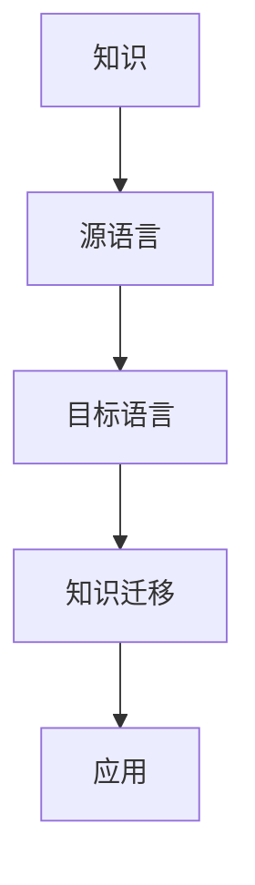
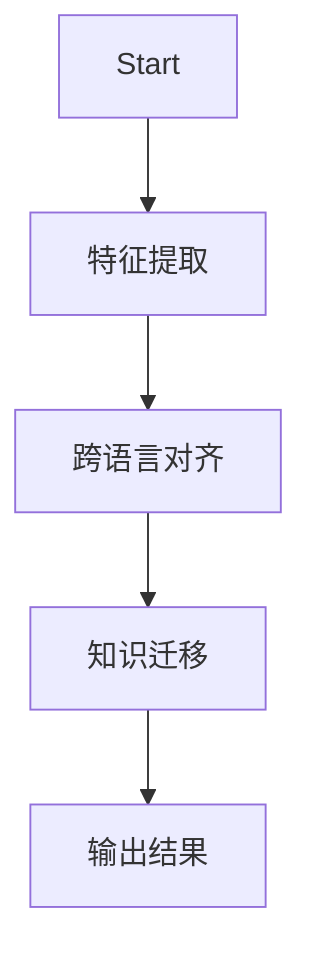
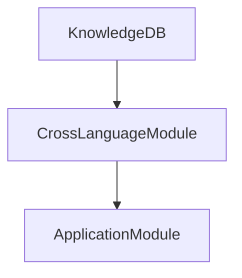
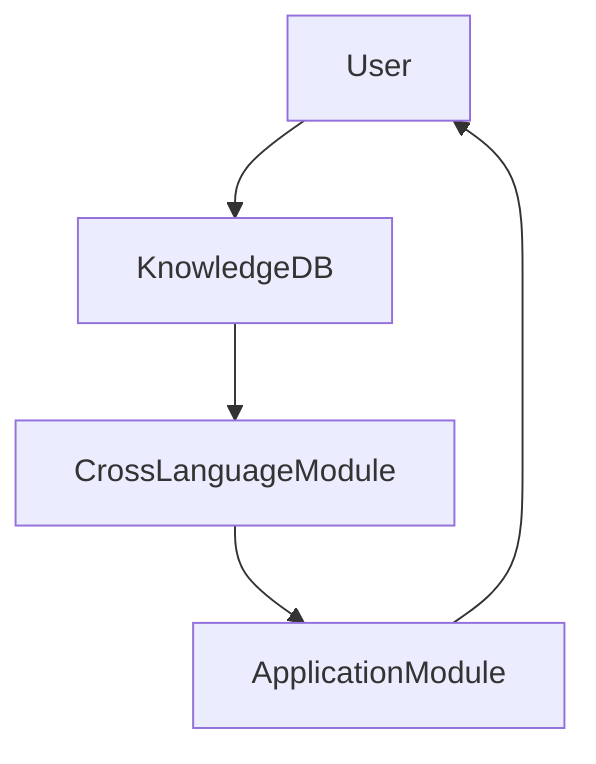

                 


# AI Agent的跨语言知识迁移技术

> 关键词：AI Agent, 跨语言知识迁移, 机器学习, 知识图谱, 多语言处理, 人工智能

> 摘要：  
AI Agent的跨语言知识迁移技术是人工智能领域的重要研究方向，旨在解决AI Agent在不同语言环境下高效迁移和应用知识的核心问题。本文从AI Agent的基本概念出发，系统阐述跨语言知识迁移的核心概念、算法原理、系统架构设计、项目实战及最佳实践，帮助读者深入理解并掌握这一前沿技术。

---

# 第1章 AI Agent与跨语言知识迁移概述

## 1.1 AI Agent的基本概念

### 1.1.1 AI Agent的定义与特点

AI Agent（人工智能代理）是指能够感知环境、自主决策并执行任务的智能实体。AI Agent的特点包括：

- **自主性**：能够在没有外部干预的情况下独立运行。
- **反应性**：能够实时感知环境并做出反应。
- **目标导向性**：基于目标驱动行为。
- **学习能力**：通过数据和经验提升性能。

### 1.1.2 AI Agent的核心功能与应用场景

AI Agent的核心功能包括感知、推理、规划和执行。其应用场景广泛，例如智能助手（如Siri）、推荐系统、自动驾驶等。

### 1.1.3 跨语言知识迁移的背景与意义

随着全球化的发展，跨语言场景越来越常见。AI Agent需要在多语言环境中高效工作，跨语言知识迁移技术能够帮助AI Agent在不同语言间共享和复用知识，提升其在多语言环境中的性能。

---

## 1.2 跨语言知识迁移的背景与挑战

### 1.2.1 跨语言知识迁移的定义与目标

跨语言知识迁移是指将一种语言中的知识迁移到另一种语言中，以提升目标语言环境下的任务性能。其目标是实现知识的跨语言共享和复用。

### 1.2.2 跨语言知识迁移的核心问题与挑战

跨语言知识迁移面临的主要挑战包括：

- **语言差异**：不同语言的语法、语义差异可能导致知识迁移困难。
- **数据稀疏性**：目标语言的数据可能较少，影响迁移效果。
- **语境理解**：跨语言迁移需要准确理解不同语言的语境。

### 1.2.3 跨语言知识迁移的应用价值与前景

跨语言知识迁移在机器翻译、跨语言问答系统、多语言推荐系统等领域具有广阔的应用前景。

---

## 1.3 本章小结

本章介绍了AI Agent的基本概念、核心功能及应用场景，并重点阐述了跨语言知识迁移的背景、核心问题及应用价值。

---

# 第2章 跨语言知识迁移的核心概念

## 2.1 跨语言知识迁移的关键要素

### 2.1.1 知识表示与编码

知识表示是跨语言迁移的基础。常用的知识表示方法包括向量表示和符号表示。

- **向量表示**：将知识编码为高维向量，便于计算和迁移。
- **符号表示**：使用符号逻辑表示知识，适合推理任务。

### 2.1.2 跨语言对齐与映射

跨语言对齐是将源语言和目标语言的知识进行对应的过程。常用方法包括基于词汇对齐和语义对齐。

- **词汇对齐**：基于词汇的直接对应关系。
- **语义对齐**：基于语义相似性进行对齐。

### 2.1.3 知识迁移的实现机制

知识迁移的实现机制包括直接迁移、适配迁移和自适应迁移。

- **直接迁移**：将源语言知识直接应用于目标语言。
- **适配迁移**：对源语言知识进行适应性调整后应用于目标语言。
- **自适应迁移**：通过自适应模型实现跨语言知识迁移。

---

## 2.2 跨语言知识迁移的分类与对比

### 2.2.1 跨语言迁移的类型

跨语言迁移主要分为以下几类：

- **零样本迁移**：目标语言没有标注数据。
- **小样本迁移**：目标语言有少量标注数据。
- **全样本迁移**：目标语言有大量标注数据。

### 2.2.2 不同迁移方式的优缺点对比

| 迁移方式 | 优点 | 缺点 |
|----------|------|------|
| 零样本迁移 | 无需目标语言数据 | 迁移效果有限 |
| 小样本迁移 | 迁移效果较好 | 需要少量目标数据 |
| 全样本迁移 | 迁移效果最优 | 需要大量目标数据 |

### 2.2.3 跨语言迁移的核心属性特征对比表格

| 属性 | 零样本迁移 | 小样本迁移 | 全样本迁移 |
|------|----------|----------|----------|
| 数据需求 | 无 | 少 | 多 |
| 迁移效果 | 低 | 中 | 高 |
| 计算复杂度 | 低 | 中 | 高 |

---

## 2.3 跨语言知识迁移的ER实体关系图



---

# 第3章 跨语言知识迁移的算法原理

## 3.1 跨语言知识迁移的基本算法框架

### 3.1.1 跨语言知识迁移的流程图（Mermaid）



### 3.1.2 跨语言知识迁移的数学模型

知识表示的数学模型：

$$ E(x) = f(x) $$

跨语言对齐的数学公式：

$$ y = g(x) $$

---

## 3.2 跨语言知识迁移的具体算法实现

### 3.2.1 基于向量空间的迁移算法

代码示例：

```python
def cross_language_alignment(src_embeddings, tgt_embeddings):
    # 计算相似度
    similarity = src_embeddings.dot(tgt_embeddings.T)
    return similarity.max()
```

### 3.2.2 基于图神经网络的迁移算法

代码示例：

```python
import torch
class CrossLanguageGNN(torch.nn.Module):
    def __init__(self, input_dim, hidden_dim):
        super(CrossLanguageGNN, self).__init__()
        self.gcn = GraphConvolution(input_dim, hidden_dim)
        self.fc = torch.nn.Linear(hidden_dim, 1)
    def forward(self, x):
        x = self.gcn(x)
        x = self.fc(x)
        return x
```

---

## 3.3 跨语言知识迁移的数学模型与公式

### 3.3.1 知识表示的数学模型

知识表示的向量空间模型：

$$ E(x) = f(x) $$

### 3.3.2 跨语言对齐的数学公式

跨语言对齐的相似性计算公式：

$$ y = g(x) $$

---

## 3.4 本章小结

本章详细介绍了跨语言知识迁移的基本算法框架、具体实现方法及数学模型，为后续章节的系统设计和项目实现奠定了基础。

---

# 第4章 跨语言知识迁移的系统架构设计

## 4.1 系统功能设计

### 4.1.1 知识库模块

知识库模块负责存储和管理多语言知识。

### 4.1.2 跨语言迁移模块

跨语言迁移模块负责实现知识的跨语言迁移。

### 4.1.3 应用模块

应用模块负责将迁移后的知识应用于目标任务。

---

## 4.2 系统架构设计

### 4.2.1 系统架构图（Mermaid）



---

## 4.3 系统接口设计

### 4.3.1 输入接口

- 输入源语言和目标语言的知识表示。
- 输入任务需求。

### 4.3.2 输出接口

- 输出目标语言下的任务结果。
- 输出迁移后的知识表示。

---

## 4.4 系统交互流程

### 4.4.1 交互流程图（Mermaid）



---

## 4.5 本章小结

本章从系统架构的角度，详细设计了跨语言知识迁移系统的功能模块、架构图及接口设计，为实际应用提供了参考。

---

# 第5章 跨语言知识迁移的项目实战

## 5.1 环境安装与配置

### 5.1.1 安装依赖

- Python 3.8+
- PyTorch 1.9+
- transformers库

### 5.1.2 环境配置

```bash
pip install torch transformers
```

---

## 5.2 核心代码实现

### 5.2.1 跨语言迁移模块实现

```python
from transformers import AutoTokenizer, AutoModel
import torch

class CrossLanguageKnowledgeTransfer:
    def __init__(self, source_lang, target_lang):
        self.source_lang = source_lang
        self.target_lang = target_lang
        self.tokenizer = AutoTokenizer.from_pretrained('bert-base-multilingual')
        self.model = AutoModel.from_pretrained('bert-base-multilingual')
    
    def transfer Knowledge(self, source_text):
        # 输入源语言文本，输出目标语言下的知识表示
        inputs = self.tokenizer(source_text, return_tensors='pt')
        outputs = self.model(**inputs)
        return outputs.last_hidden_state.mean(dim=1)
```

### 5.2.2 应用模块实现

```python
class ApplicationModule:
    def __init__(self, knowledge_representations):
        self.knowledge_representations = knowledge_representations
    
    def apply(self, task):
        # 应用知识表示到目标任务
        pass
```

---

## 5.3 案例分析与详细解读

### 5.3.1 案例背景

假设我们有一个中文问答系统，希望将其迁移到英文环境。

### 5.3.2 数据准备

- 中文问答数据：训练模型。
- 英文问答数据：用于迁移。

### 5.3.3 实现步骤

1. 使用BERT多语言模型进行知识表示。
2. 进行跨语言对齐。
3. 应用到英文问答系统中。

---

## 5.4 项目小结

本章通过一个实际案例，详细展示了跨语言知识迁移项目的环境配置、核心代码实现及应用流程，帮助读者更好地理解技术实现。

---

# 第6章 跨语言知识迁移的最佳实践

## 6.1 实践中的注意事项

### 6.1.1 数据预处理

- 确保数据质量。
- 处理语言差异。

### 6.1.2 模型选择

- 根据任务选择合适的模型。
- 考虑模型的多语言能力。

### 6.1.3 性能优化

- 优化跨语言对齐算法。
- 提升模型的迁移能力。

---

## 6.2 小结

跨语言知识迁移技术在实际应用中需要结合具体场景进行优化和调整。通过合理的数据处理和模型选择，可以显著提升迁移效果。

---

# 第7章 总结与展望

## 7.1 总结

本文系统地介绍了AI Agent的跨语言知识迁移技术，从基本概念到算法实现，再到系统设计和项目实战，为读者提供了全面的指导。

## 7.2 展望

未来，跨语言知识迁移技术将在多语言NLP任务中发挥重要作用，同时需要进一步研究如何提升迁移效率和效果。

---

# 作者

作者：AI天才研究院/AI Genius Institute & 禅与计算机程序设计艺术 /Zen And The Art of Computer Programming

