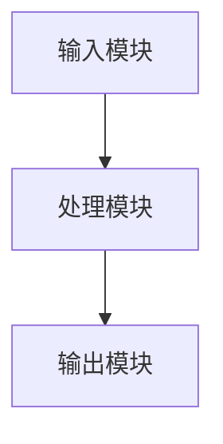
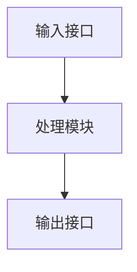
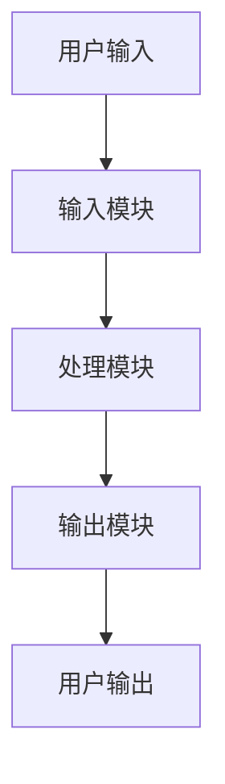

                 


# AI Agent的跨语言跨文化理解能力开发

> 关键词：AI Agent, 跨语言理解, 跨文化理解, 多语言模型, 文化敏感模型, 自然语言处理, 人工智能

> 摘要：AI Agent需要具备跨语言和跨文化理解能力，以在复杂的全球化环境中实现高效的人机交互和任务处理。本文将深入探讨AI Agent的跨语言跨文化理解能力的开发背景、核心概念、算法原理、系统架构设计、项目实战以及最佳实践，为开发者提供全面的技术指导。

---

# 第1章: AI Agent的基本概念与跨语言跨文化理解的重要性

## 1.1 AI Agent的基本概念

### 1.1.1 AI Agent的定义与核心特征
AI Agent（人工智能代理）是指能够感知环境、自主决策并执行任务的智能实体。其核心特征包括：
- **自主性**：能够自主决策和行动，无需人工干预。
- **反应性**：能够实时感知环境并做出反应。
- **目标导向性**：以目标为导向，优化任务执行效率。
- **学习能力**：通过数据和经验不断优化自身能力。

### 1.1.2 跨语言与跨文化理解能力的必要性
在全球化背景下，AI Agent需要与来自不同语言和文化背景的用户交互。例如：
- **多语言对话系统**：支持多种语言的实时对话，满足全球用户的需求。
- **跨文化内容生成**：生成符合目标文化背景的内容，如广告文案、客户服务响应等。
- **全球化服务中的文化适配**：在全球范围内提供本地化的服务，提升用户体验。

### 1.1.3 跨语言与跨文化理解能力的挑战与机遇
- **挑战**：不同语言和文化之间的差异可能导致语义歧义、文化敏感性等问题，增加了AI Agent理解的难度。
- **机遇**：通过跨语言跨文化理解能力的开发，可以拓展AI Agent的应用场景，提升其智能化水平。

## 1.2 跨语言跨文化理解能力的应用场景

### 1.2.1 多语言对话系统
AI Agent需要支持多种语言的对话，例如在国际会议、跨国客服等场景中提供实时翻译和对话支持。

### 1.2.2 跨文化内容生成
在广告、新闻报道等领域，AI Agent需要根据目标文化背景生成符合当地习惯的内容。

### 1.2.3 全球化服务中的文化适配
AI Agent需要在全球范围内提供本地化的服务，例如在不同国家提供符合当地法律法规的金融服务。

## 1.3 本章小结
本章介绍了AI Agent的基本概念，并重点阐述了跨语言跨文化理解能力的必要性及其应用场景，为后续章节的深入探讨奠定了基础。

---

# 第2章: 跨语言跨文化理解的核心概念与模型

## 2.1 跨语言理解的核心概念与特征

### 2.1.1 跨语言理解的定义
跨语言理解是指AI Agent能够理解并处理多种语言的文本或语音信息。

### 2.1.2 跨语言理解的主要特征
- **多语言支持**：能够处理多种语言。
- **语言无关性**：理解能力不依赖于特定语言。
- **语义一致性**：能够在不同语言中保持语义的一致性。

## 2.2 多语言模型的原理与架构

### 2.2.1 多语言模型的定义
多语言模型是指能够在多种语言上进行训练和推理的模型，例如多语言BERT（mBERT）。

### 2.2.2 多语言模型的架构设计
多语言模型通常采用以下架构：
1. **共享参数**：在不同语言之间共享参数，减少模型的参数数量。
2. **语言嵌入**：为每种语言添加语言嵌入，以区分不同语言的语义。

### 2.2.3 多语言模型的核心算法
- **多语言Transformer架构**：使用Transformer模型处理多种语言。
- **跨语言注意力机制**：通过注意力机制捕获不同语言之间的语义关系。

## 2.3 跨语言理解与文化敏感性的关系

### 2.3.1 跨语言理解与文化敏感性的定义
- **文化敏感性**：AI Agent能够理解并适应不同文化背景的需求。
- **文化适配性**：AI Agent能够根据目标文化生成符合当地习惯的内容。

### 2.3.2 跨语言理解与文化敏感性的区别与联系
- **区别**：跨语言理解关注语言的转换，而文化敏感性关注文化的适应。
- **联系**：两者相辅相成，共同实现AI Agent的跨语言跨文化理解能力。

### 2.3.3 跨语言理解中文化敏感性的实现方式
- **文化适配模型**：通过文化适配模型实现文化敏感性。
- **文化嵌入**：将文化特征嵌入到模型中，以提升文化敏感性。

## 2.4 本章小结
本章详细探讨了跨语言理解的核心概念与模型，并分析了文化敏感性与跨语言理解的关系，为后续章节的算法实现奠定了基础。

---

# 第3章: 跨语言跨文化理解能力的算法原理

## 3.1 跨语言模型的算法流程

### 3.1.1 数据预处理
- **文本清洗**：去除噪音数据，如特殊符号、停用词等。
- **分词与标注**：对文本进行分词和词性标注。

### 3.1.2 模型训练
- **多语言模型训练**：在多语言数据上进行训练，优化模型的跨语言理解能力。
- **文化适配训练**：在文化相关数据上进行训练，优化模型的文化敏感性。

### 3.1.3 模型推理
- **跨语言推理**：将目标语言的文本输入模型，生成相应的输出。
- **文化适配推理**：根据目标文化生成符合当地习惯的输出。

## 3.2 跨语言模型的核心算法

### 3.2.1 Transformer架构
- **输入层**：接收多语言文本输入。
- **编码层**：通过自注意力机制编码文本信息。
- **解码层**：通过自注意力机制解码生成目标语言文本。

### 3.2.2 多语言注意力机制
- **跨语言注意力**：捕获不同语言之间的语义关系。
- **语言嵌入**：为每种语言添加语言嵌入，区分不同语言的语义。

### 3.2.3 跨语言损失函数
- **交叉熵损失函数**：用于计算模型输出与真实标签之间的差异。
- **多任务损失函数**：结合跨语言和文化敏感性任务的损失函数。

## 3.3 跨语言模型的数学公式

### 3.3.1 注意力机制公式
$$\text{Attention}(Q, K, V) = \text{softmax}\left(\frac{QK^T}{\sqrt{d_k}}\right)V$$

### 3.3.2 多语言Transformer架构
$$\text{Output} = \text{Decoder}(\text{Encoder}(X))$$

### 3.3.3 跨语言损失函数
$$\mathcal{L} = -\sum_{i=1}^{n} \log p(y_i|x_i)$$

---

# 第4章: 跨语言跨文化理解能力的系统架构设计

## 4.1 系统架构设计

### 4.1.1 系统功能模块
- **输入模块**：接收多语言文本输入。
- **处理模块**：对输入文本进行跨语言和文化敏感性处理。
- **输出模块**：生成目标语言或符合目标文化的输出。

### 4.1.2 系统架构图


## 4.2 系统接口设计

### 4.2.1 系统接口描述
- **输入接口**：接收多语言文本输入。
- **输出接口**：生成目标语言或符合目标文化的输出。

### 4.2.2 系统接口图


## 4.3 系统交互流程

### 4.3.1 系统交互流程描述
1. **输入处理**：接收多语言文本输入。
2. **跨语言处理**：对输入文本进行跨语言理解。
3. **文化适配处理**：根据目标文化生成符合当地习惯的输出。

### 4.3.2 系统交互流程图


---

# 第5章: 跨语言跨文化理解能力的项目实战

## 5.1 环境配置

### 5.1.1 开发工具
- **编程语言**：Python 3.8+
- **深度学习框架**：TensorFlow 2.5+ 或 PyTorch 1.9+
- **NLP库**：Hugging Face Transformers

### 5.1.2 环境配置代码
```bash
pip install -r requirements.txt
```

## 5.2 核心代码实现

### 5.2.1 多语言模型实现
```python
from transformers import AutoTokenizer, AutoModelForMaskedLM
import torch

tokenizer = AutoTokenizer.from_pretrained('bert-base-multilingual-cased')
model = AutoModelForMaskedLM.from_pretrained('bert-base-multilingual-cased')
```

### 5.2.2 文化适配模型实现
```python
class CultureAdapter(nn.Module):
    def __init__(self, culture_dim):
        super(CultureAdapter, self).__init__()
        self.culture_embedding = nn.Embedding(culture_dim, culture_dim)
    
    def forward(self, inputs, culture_id):
        culture_emb = self.culture_embedding(culture_id)
        return inputs + culture_emb
```

## 5.3 项目实战案例分析

### 5.3.1 案例背景
假设我们需要构建一个多语言客服系统，支持中英文对话，并根据用户的文化背景生成相应的回复。

### 5.3.2 案例实现
```python
def multi_language_response(text, language):
    inputs = tokenizer(text, return_tensors='pt')
    outputs = model(**inputs)
    response = tokenizer.decode(outputs.logits.argmax(dim=-1).tolist()[0])
    return response
```

---

# 第6章: 跨语言跨文化理解能力开发的最佳实践

## 6.1 注意事项

### 6.1.1 数据质量
确保训练数据的多样性和代表性，避免数据偏差。

### 6.1.2 模型选择
根据具体需求选择合适的模型，例如选择多语言模型或文化适配模型。

### 6.1.3 文化适配
在实际应用中，需要结合具体的文化背景进行调整，确保生成内容的文化适配性。

## 6.2 小结
本章总结了AI Agent跨语言跨文化理解能力开发中的注意事项，并提出了未来的优化方向。

---

# 作者信息

作者：AI天才研究院/AI Genius Institute & 禅与计算机程序设计艺术 /Zen And The Art of Computer Programming

