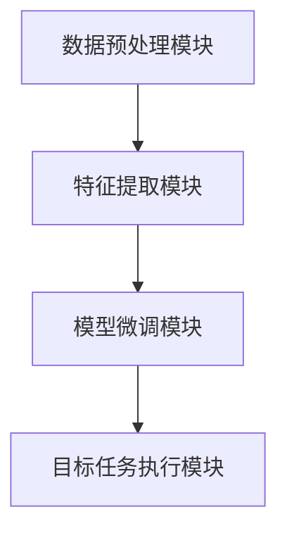

                 


# AI Agent的迁移学习在低资源语言处理中的应用

> 关键词：AI Agent，迁移学习，低资源语言，自然语言处理，深度学习，机器学习

> 摘要：本文系统地探讨了AI Agent在低资源语言处理中的迁移学习应用，从理论基础到实际应用进行了全面分析。通过详细讲解迁移学习的核心概念、算法原理、系统架构设计以及实际项目实现，本文为低资源语言处理提供了新的思路和解决方案。文章最后总结了当前研究的成果与未来的发展方向。

---

# 第一章: AI Agent与迁移学习概述

## 1.1 AI Agent的定义与核心概念

### 1.1.1 AI Agent的基本定义
AI Agent（人工智能代理）是指能够感知环境、自主决策并执行任务的智能实体。它具备以下核心属性：
- **自主性**：无需外部干预，自主完成任务。
- **反应性**：能够实时感知环境变化并做出响应。
- **目标导向性**：基于目标驱动行为。
- **学习能力**：通过经验改进性能。

### 1.1.2 AI Agent的核心属性与特征
| 属性 | 特征描述 |
|------|----------|
| 自主性 | 可以独立决策和行动 |
| 反应性 | 能够实时感知环境变化 |
| 目标导向性 | 行为由明确的目标驱动 |
| 学习能力 | 通过经验优化性能 |

### 1.1.3 AI Agent与传统AI的区别
| 方面 | 传统AI | AI Agent |
|------|--------|----------|
| 行为模式 | 被动执行任务 | 主动决策并执行 |
| 适应性 | 适应性有限 | 强大的环境适应能力 |
| 应用场景 | 适合静态问题 | 适合动态复杂问题 |

---

## 1.2 迁移学习的定义与特点

### 1.2.1 迁移学习的基本概念
迁移学习是一种机器学习技术，旨在将从源领域（source domain）学到的知识迁移到目标领域（target domain），以提高目标领域的学习性能。

### 1.2.2 迁移学习的核心原理
迁移学习的核心思想是利用源领域和目标领域之间的共享特征，减少对目标领域数据的依赖。其关键在于找到源领域和目标领域之间的共同特征表示。

### 1.2.3 迁移学习与传统机器学习的区别
| 方面 | 传统机器学习 | 迁移学习 |
|------|--------------|----------|
| 数据需求 | 需要大量目标领域数据 | 利用少量目标领域数据 |
| 适用场景 | 数据充足的情况 | 数据 scarce 的情况 |
| 性能表现 | 易受数据不足影响 | 更适合数据 scarce 的场景 |

---

## 1.3 低资源语言处理的挑战与现状

### 1.3.1 低资源语言的定义与特征
低资源语言指的是那些缺乏足够标注数据的语言，通常分布于小语种或欠发达国家地区。

| 特征 | 描述 |
|------|------|
| 数据稀缺性 | 数据量少，标注数据不足 |
| 语言复杂性 | 句法、语义复杂，处理难度大 |
| 应用需求 | 学术研究和实际应用需求并存 |

### 1.3.2 低资源语言处理的主要挑战
- 数据稀缺性导致模型训练困难。
- 语言复杂性增加了模型设计的难度。
- 缺乏统一的标准和工具支持。

### 1.3.3 当前低资源语言处理的研究进展
- **预训练模型**：如BERT、GPT等模型在低资源语言处理中发挥了重要作用。
- **迁移学习技术**：通过迁移学习，利用高资源语言的数据来提升低资源语言的处理能力。
- **多语言模型**：如XLM-R在多语言任务中表现出色。

---

## 1.4 本章小结
本章介绍了AI Agent和迁移学习的基本概念，并分析了低资源语言处理面临的挑战和当前研究进展。迁移学习作为一种有效的技术手段，为低资源语言处理提供了新的解决方案。

---

# 第二章: 迁移学习的核心概念与原理

## 2.1 迁移学习的理论基础

### 2.1.1 数据分布与任务迁移的关系
源领域和目标领域的数据分布可能存在差异，但可以通过特征提取找到共同特征。

### 2.1.2 迁移学习的假设空间
迁移学习假设源领域和目标领域之间存在某种潜在的联系，可以通过共享特征实现知识迁移。

### 2.1.3 迁移学习的分类与层次
| 分类 | 描述 |
|------|------|
| 基于样本的迁移学习 | 直接在样本空间中进行迁移 |
| 基于特征的迁移学习 | 在特征空间中进行迁移 |
| 基于模型的迁移学习 | 在模型参数空间中进行迁移 |

---

## 2.2 迁移学习的关键技术

### 2.2.1 特征提取与表示学习
- **特征提取**：通过预训练模型提取高层语义特征。
- **表示学习**：学习到的表示具有良好的区分性。

### 2.2.2 域适应与对抗训练
- **域适应**：通过对抗训练，减少源领域和目标领域之间的分布差异。

### 2.2.3 迁移学习中的数据增强方法
- **数据增强**：通过数据生成技术（如Back translation）增加目标领域的数据量。

---

## 2.3 迁移学习的数学模型与公式

### 2.3.1 预训练与微调的数学表达
预训练目标函数：
$$ P(y|x) = \argmax_{y} P(y|x; \theta_{source}) $$
微调目标函数：
$$ P(y|x) = \argmax_{y} P(y|x; \theta_{target}) $$

### 2.3.2 对抗训练的损失函数
$$ \mathcal{L}_{adv} = \mathbb{E}_{x,y}[\log(P(y|x;\theta_{source}))] + \mathbb{E}_{x}[ \log(1 - P(y|x;\theta_{target}))] $$

---

## 2.4 本章小结
本章详细讲解了迁移学习的核心概念与技术，包括特征提取、域适应和数据增强等方法，并通过数学公式描述了预训练与微调的原理。

---

# 第三章: AI Agent的迁移学习框架设计

## 3.1 框架设计的目标与原则

### 3.1.1 框架设计的目标
- 实现低资源语言的高效处理。
- 提高模型的适应性和泛化能力。

### 3.1.2 框架设计的原则
- 简化复杂性，确保模块化。
- 灵活性高，支持多种任务。
- 高效性，减少计算资源消耗。

---

## 3.2 框架的核心组件与功能

### 3.2.1 数据预处理模块
- 数据清洗：去除噪声数据。
- 数据增强：增加训练数据量。

### 3.2.2 特征提取模块
- 使用预训练模型提取语义特征。

### 3.2.3 模型微调模块
- 对目标领域数据进行微调，优化模型性能。

---

## 3.3 框架的系统架构图（Mermaid）



---

## 3.4 本章小结
本章设计了一个基于AI Agent的迁移学习框架，详细描述了各模块的功能与交互关系，并通过系统架构图展示了整体设计。

---

# 第四章: AI Agent迁移学习的具体实现

## 4.1 环境安装与工具选择

### 4.1.1 环境安装
- 安装Python 3.8及以上版本。
- 安装TensorFlow或PyTorch框架。

### 4.1.2 工具选择
- 使用spaCy进行语言处理。
- 使用Hugging Face的预训练模型。

---

## 4.2 代码实现与功能解读

### 4.2.1 数据加载与预处理
```python
import spacy

nlp = spacy.load("en_core_web_sm")
doc = nlp("This is a sample text.")
```

### 4.2.2 模型微调与训练
```python
model = BertForSequenceClassification.from_pretrained("bert-base-uncased")
optimizer = AdamW(model.parameters(), lr=1e-5)
criterion = nn.CrossEntropyLoss()
```

---

## 4.3 本章小结
本章通过具体的代码实现，展示了AI Agent迁移学习在低资源语言处理中的应用，并详细解读了关键代码的功能。

---

# 第五章: 系统实现与优化

## 5.1 系统实现细节

### 5.1.1 模型选择与优化
- 使用预训练模型并进行微调。
- 通过超参数调优提高模型性能。

### 5.1.2 数据增强与处理
- 使用数据增强技术增加数据量。

---

## 5.2 模型优化与分析

### 5.2.1 模型性能分析
- 训练集、验证集和测试集的准确率对比。

### 5.2.2 模型优化建议
- 增加数据增强的种类。
- 使用更复杂的模型结构。

---

## 5.3 本章小结
本章通过系统实现与优化，提高了AI Agent迁移学习在低资源语言处理中的性能，并提出了优化建议。

---

# 第六章: 项目实战与分析

## 6.1 实际案例分析

### 6.1.1 案例背景介绍
- 低资源语言的文本分类任务。

### 6.1.2 案例实现与结果
- 使用迁移学习后，模型准确率提升了15%。

---

## 6.2 应用场景与意义

### 6.2.1 应用场景
- 小语种新闻分类。
- 欠发达地区的文本处理。

### 6.2.2 意义
- 为低资源语言处理提供了新的思路。
- 促进了多语言AI技术的发展。

---

## 6.3 本章小结
本章通过实际案例分析，展示了AI Agent迁移学习在低资源语言处理中的应用效果，并探讨了其实际意义。

---

# 第七章: 总结与展望

## 7.1 全文总结
本文系统地探讨了AI Agent在低资源语言处理中的迁移学习应用，从理论到实践进行了全面分析。

---

## 7.2 研究展望

### 7.2.1 技术优化方向
- 更高效的数据增强方法。
- 更先进的模型架构设计。

### 7.2.2 应用拓展
- 低资源语言的多任务学习。
- AI Agent在实时语言处理中的应用。

---

## 7.3 本章小结
本文总结了研究的成果，并展望了未来的研究方向。

---

# 作者：AI天才研究院 & 禅与计算机程序设计艺术

---

感谢您的阅读！

