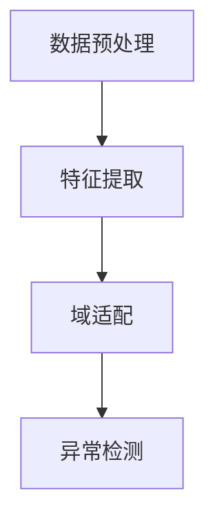

                 


# AI Agent的迁移学习在异常检测中的应用

> **关键词**：AI Agent，迁移学习，异常检测，深度学习，机器学习

> **摘要**：  
本文深入探讨了AI Agent在异常检测中的应用，重点分析了迁移学习技术如何提升异常检测的性能和效率。文章从异常检测的基本概念和挑战入手，详细介绍了迁移学习的原理、算法及其在AI Agent中的具体应用。通过结合数学模型、算法流程图和系统架构图，本文系统性地展示了如何利用迁移学习优化AI Agent的异常检测能力。最后，本文通过一个实际案例，详细讲解了迁移学习在异常检测中的具体实现过程，为读者提供了一个完整的解决方案。

---

# 正文

## 第1章: 异常检测与迁移学习概述

### 1.1 异常检测的基本概念

#### 1.1.1 异常检测的定义与分类
异常检测（Outlier Detection）是指在数据集中识别出与大多数数据点显著不同的数据点的过程。异常检测可以分为以下几类：
- **统计方法**：基于概率分布模型，如高斯分布，识别偏离均值的点。
- **基于机器学习的方法**：如支持向量机（SVM）、随机森林等。
- **基于深度学习的方法**：如自动编码器（Autoencoder）、生成对抗网络（GAN）等。

#### 1.1.2 异常检测的应用场景
异常检测在多个领域有广泛应用：
- **金融领域**：识别欺诈交易。
- **网络安全**：检测入侵行为。
- **医疗领域**：发现异常的生理指标。
- **工业领域**：监测设备故障。

#### 1.1.3 异常检测的挑战与难点
异常检测面临以下挑战：
- 数据量少且分布不均衡。
- 异常样本少，难以训练模型。
- 数据分布可能随时间变化。

### 1.2 迁移学习的核心概念

#### 1.2.1 迁移学习的定义与特点
迁移学习（Transfer Learning）是指将一个领域（源域）中学到的知识应用到另一个领域（目标域）的过程。其特点包括：
- 数据分布差异性：源域和目标域的数据分布可能不同。
- 知识复用性：利用源域的知识提升目标域的性能。

#### 1.2.2 迁移学习的分类与流程
迁移学习可以分为以下几类：
- **基于特征的迁移学习**：直接迁移特征表示。
- **基于参数的迁移学习**：迁移模型参数。
- **对抗迁移学习**：通过对抗网络消除域差异。

迁移学习的流程通常包括：
1. 数据预处理。
2. 特征提取。
3. 域适配。
4. 模型训练与优化。

#### 1.2.3 迁移学习在AI Agent中的作用
AI Agent需要在动态环境中适应新任务，迁移学习为其提供了快速学习新知识的能力。

### 1.3 AI Agent的基本原理

#### 1.3.1 AI Agent的定义与类型
AI Agent是一个智能体，能够感知环境、执行任务并做出决策。AI Agent可以分为：
- **反应式Agent**：基于当前感知做出反应。
- **认知式Agent**：具有复杂推理和规划能力。

#### 1.3.2 AI Agent的核心功能
AI Agent的核心功能包括：
- 感知环境。
- 分析任务。
- 学习与适应。
- 执行决策。

#### 1.3.3 AI Agent在异常检测中的应用潜力
AI Agent可以利用迁移学习技术，快速适应新的异常检测任务。

---

## 第2章: 迁移学习在异常检测中的背景与问题分析

### 2.1 异常检测中的数据挑战

#### 2.1.1 数据分布偏移的问题
源域和目标域的数据分布可能不同，导致模型在目标域表现不佳。

#### 2.1.2 数据量不足的困境
目标域的数据量可能有限，难以训练有效的模型。

#### 2.1.3 数据分布变化的影响
数据分布可能随时间变化，导致模型失效。

### 2.2 迁移学习在异常检测中的优势

#### 2.2.1 利用已有数据提升模型性能
通过迁移学习，可以利用源域的大量数据提升目标域的模型性能。

#### 2.2.2 适应新场景的能力
迁移学习使模型能够快速适应新的目标域。

#### 2.2.3 提高模型的泛化能力
通过域适配，模型的泛化能力得到提升。

### 2.3 迁移学习在异常检测中的具体问题

#### 2.3.1 源域与目标域的差异性
如何衡量源域和目标域的差异性是一个关键问题。

#### 2.3.2 迁移过程中可能遇到的过拟合问题
迁移学习可能导致模型在源域过拟合，影响目标域的性能。

#### 2.3.3 如何衡量迁移学习的效果
需要设计有效的评估指标来衡量迁移学习的效果。

---

## 第3章: 迁移学习的基本原理与算法

### 3.1 迁移学习的核心原理

#### 3.1.1 域适应的基本概念
域适应（Domain Adaptation）是指在源域和目标域数据分布不同的情况下，调整模型以适应目标域。

#### 3.1.2 任务适配的基本概念
任务适配（Task Adaptation）是指在任务目标不同的情况下，调整模型以适应新任务。

#### 3.1.3 迁移学习的数学模型
迁移学习的数学模型通常涉及概率分布的变换。

---

## 第4章: AI Agent的迁移学习机制

### 4.1 AI Agent中的迁移学习框架

#### 4.1.1 框架的整体结构
AI Agent的迁移学习框架通常包括数据预处理、特征提取、域适配和模型训练模块。

#### 4.1.2 各模块的功能与作用
- 数据预处理：对数据进行清洗和归一化处理。
- 特征提取：提取数据的特征表示。
- 域适配：调整模型以适应目标域。
- 模型训练：在目标域上微调模型。

#### 4.1.3 框架的灵活性与扩展性
AI Agent的迁移学习框架需要具有灵活性，能够适应不同的任务和数据分布。

---

## 第5章: 基于迁移学习的异常检测系统设计

### 5.1 系统设计的总体思路

#### 5.1.1 系统设计的目标
设计一个高效、鲁棒的异常检测系统。

#### 5.1.2 系统设计的原则
- 简化设计：模块化设计，便于维护和扩展。
- 高效性：确保系统的处理速度能够满足实时检测的需求。
- 可扩展性：能够适应新的数据和任务。

### 5.2 系统功能模块划分

#### 5.2.1 数据预处理模块
- 数据清洗：去除噪声数据。
- 数据归一化：统一数据的尺度。

#### 5.2.2 特征提取模块
- 使用自动编码器提取数据的低维特征。

#### 5.2.3 域适配模块
- 使用对抗网络消除源域和目标域的分布差异。

#### 5.2.4 异常检测模块
- 使用微调后的模型进行异常检测。

### 5.3 系统架构设计

#### 5.3.1 系统架构图


---

## 第6章: 项目实战

### 6.1 项目背景与目标

#### 6.1.1 项目背景
设计一个基于迁移学习的异常检测系统，应用于网络流量监控。

#### 6.1.2 项目目标
实现一个能够实时检测网络异常流量的系统。

### 6.2 环境安装与配置

#### 6.2.1 安装依赖
```bash
pip install numpy matplotlib scikit-learn tensorflow
```

### 6.3 核心代码实现

#### 6.3.1 数据预处理
```python
import numpy as np
from sklearn.preprocessing import StandardScaler

def preprocess_data(data):
    scaler = StandardScaler()
    data_normalized = scaler.fit_transform(data)
    return data_normalized
```

#### 6.3.2 特征提取
```python
import tensorflow as tf
from tensorflow.keras.layers import Dense, Input, Dropout
from tensorflow.keras.models import Model

def build_autoencoder(input_dim):
    input_layer = Input(shape=(input_dim,))
    encoder = Dense(64, activation='relu')(input_layer)
    encoder = Dropout(0.2)(encoder)
    encoder = Dense(32, activation='relu')(encoder)
    decoder = Dense(64, activation='relu')(encoder)
    decoder = Dropout(0.2)(decoder)
    output_layer = Dense(input_dim, activation='sigmoid')(decoder)
    autoencoder = Model(inputs=input_layer, outputs=output_layer)
    autoencoder.compile(optimizer='adam', loss='binary_crossentropy')
    return autoencoder
```

#### 6.3.3 域适配
```python
from tensorflow.keras.layers import Input, Dense, Lambda
from tensorflow.keras.models import Model
from tensorflow.keras import backend as K

def build_adapter(input_dim):
    input_layer = Input(shape=(input_dim,))
    adapter = Dense(64, activation='relu')(input_layer)
    adapter = Dense(input_dim, activation='relu')(adapter)
    model = Model(inputs=input_layer, outputs=adapter)
    model.compile(optimizer='adam', loss='mse')
    return model
```

#### 6.3.4 异常检测
```python
def detect_anomalies(data, autoencoder, adapter):
    normalized_data = preprocess_data(data)
    adapted_data = adapter.predict(normalized_data)
    reconstructed_data = autoencoder.predict(adapted_data)
    reconstruction_error = np.mean(np.square(normalized_data - reconstructed_data), axis=1)
    threshold = np.percentile(reconstruction_error, 95)
    anomalies = np.where(reconstruction_error > threshold)[0]
    return anomalies
```

### 6.4 实际案例分析

#### 6.4.1 数据收集与标注
假设我们有一个网络流量数据集，包含正常流量和异常流量。

#### 6.4.2 模型训练
使用源域数据训练自动编码器，然后在目标域上微调模型。

#### 6.4.3 模型评估
通过混淆矩阵和ROC曲线评估模型的性能。

---

## 第7章: 总结与展望

### 7.1 总结
本文详细介绍了AI Agent在异常检测中的应用，重点分析了迁移学习技术如何提升异常检测的性能和效率。通过理论分析和实际案例，展示了迁移学习在异常检测中的巨大潜力。

### 7.2 未来展望
未来的研究方向包括：
- 更高效的迁移学习算法。
- 更智能的域适配方法。
- 更强大的异常检测模型。

---

## 附录

### 附录A: 算法代码解释

### 附录B: 系统架构图

### 附录C: 数据流图

---

## 参考文献

（此处列出相关文献和资源）

---

**作者**：AI天才研究院/AI Genius Institute & 禅与计算机程序设计艺术 /Zen And The Art of Computer Programming

---

本文通过系统的理论分析和实际案例，深入探讨了AI Agent在异常检测中的迁移学习应用。希望读者能够通过本文对迁移学习在异常检测中的原理和应用有更深入的理解。

