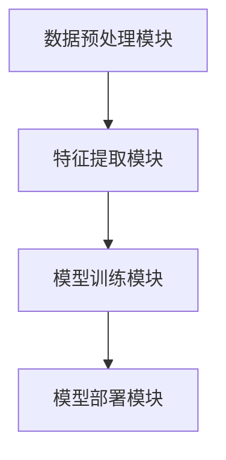

                 


# AI Agent的迁移学习在跨语言任务中的应用

> 关键词：AI Agent, 迁移学习, 跨语言任务, 机器学习, 多语言模型

> 摘要：本文系统地探讨了AI Agent在跨语言任务中应用迁移学习的原理、方法及其实际应用场景。文章从迁移学习的基本概念出发，分析了其在跨语言任务中的独特优势，并结合具体案例，详细阐述了迁移学习在AI Agent中的实现过程。此外，本文还深入探讨了迁移学习在跨语言任务中的算法原理、系统架构设计以及项目实战等内容，为读者提供了全面的技术视角。

---

# 第1章: 迁移学习与AI Agent概述

## 1.1 迁移学习的基本概念

### 1.1.1 迁移学习的定义
迁移学习是一种机器学习技术，旨在通过将从源任务或源数据中学到的知识迁移到目标任务或目标数据上，以提高目标任务的性能。与传统机器学习不同，迁移学习强调跨任务或跨数据分布的知识共享。

### 1.1.2 迁移学习的核心思想
迁移学习的核心思想是“知识可以被迁移”。通过利用源任务和目标任务之间的共性，迁移学习可以在数据不足的情况下提高目标任务的性能。

### 1.1.3 迁移学习与传统机器学习的区别
| 特性       | 传统机器学习            | 迁移学习                  |
|------------|--------------------------|---------------------------|
| 数据需求   | 数据量大且充分           | 数据量小或分布不同         |
| 知识共享   | 独立学习                 | 知识共享                  |
| 适用场景   | 单一任务                | 多任务或跨任务            |

### 1.1.4 迁移学习的分类
迁移学习可以分为以下几类：
- **基于样本的迁移学习**：直接利用源数据中的样本进行学习。
- **基于特征的迁移学习**：通过提取特征并进行对齐来实现迁移。
- **基于模型的迁移学习**：通过调整模型参数或结构来实现迁移。

---

## 1.2 AI Agent的基本概念

### 1.2.1 AI Agent的定义
AI Agent（人工智能代理）是一种能够感知环境、自主决策并执行任务的智能实体。它可以是一个软件程序、一个机器人或其他智能系统。

### 1.2.2 AI Agent的核心特征
- **自主性**：能够在没有外部干预的情况下自主决策。
- **反应性**：能够根据环境的变化实时调整行为。
- **目标导向性**：以特定目标为导向，执行任务。
- **学习能力**：能够通过学习提升自身的性能。

### 1.2.3 AI Agent与传统AI的区别
| 特性       | AI Agent                  | 传统AI                    |
|------------|---------------------------|---------------------------|
| 自主性     | 高                        | 低                        |
| 适应性     | 强                        | 弱                        |
| 决策能力   | 复杂                      | 简单                      |

### 1.2.4 AI Agent的应用场景
- **智能助手**：如Siri、Alexa等。
- **自动驾驶**：如自动驾驶汽车。
- **智能客服**：用于自动回答用户问题。

---

## 1.3 迁移学习在AI Agent中的作用

### 1.3.1 迁移学习如何提升AI Agent的性能
迁移学习可以帮助AI Agent在资源有限的情况下快速适应新任务，从而提升其执行复杂任务的能力。

### 1.3.2 迁移学习在跨语言任务中的必要性
跨语言任务（如多语言翻译、跨语言情感分析）通常面临数据稀缺性问题。迁移学习可以通过共享跨语言的知识来缓解这一问题。

### 1.3.3 迁移学习与AI Agent的结合场景
- **多语言翻译**：通过迁移学习，AI Agent可以利用一种语言的知识来辅助另一种语言的翻译。
- **跨语言问答系统**：利用源语言的问题解答经验来提升目标语言的问答性能。

---

## 1.4 跨语言任务的基本概念

### 1.4.1 跨语言任务的定义
跨语言任务是指在不同语言之间进行信息处理和知识共享的任务，如机器翻译、跨语言文本分类等。

### 1.4.2 跨语言任务的分类
- **翻译任务**：如英译中、中译日。
- **文本分类**：如跨语言情感分析。
- **问答系统**：如跨语言问题解答。

### 1.4.3 跨语言任务的挑战与解决方案
| 挑战       | 解决方案                |
|------------|-------------------------|
| 数据稀疏性   | 利用预训练模型或迁移学习  |
| 语言差异性   | 通过语言对齐技术解决      |
| 计算复杂性   | 优化算法或使用高效模型    |

---

## 1.5 本章小结

---

# 第2章: 迁移学习的核心原理

## 2.1 迁移学习的理论基础

### 2.1.1 特征空间与领域适应
迁移学习的核心思想是将源任务和目标任务的特征空间进行对齐，从而实现知识共享。

### 2.1.2 数据分布与任务差异
迁移学习需要考虑源数据和目标数据之间的分布差异，以及任务之间的差异。

### 2.1.3 迁移学习的数学模型
迁移学习的数学模型可以表示为：
$$ P(y|x) = f_{source}(y|x) \cdot \alpha + f_{target}(y|x) \cdot (1-\alpha) $$
其中，$\alpha$ 表示源任务和目标任务的权重。

---

## 2.2 迁移学习的关键技术

### 2.2.1 基于特征的学习
基于特征的学习通过提取和对齐特征来实现迁移。

### 2.2.2 基于参数迁移的学习
基于参数迁移的学习通过调整模型参数来实现迁移。

### 2.2.3 基于自适应策略的学习
基于自适应策略的学习通过动态调整策略来实现迁移。

---

## 2.3 迁移学习的算法对比

### 2.3.1 全监督学习与迁移学习的对比
| 特性       | 全监督学习            | 迁移学习                  |
|------------|-----------------------|--------------------------|
| 数据需求   | 需要大量标注数据       | 数据量小或分布不同         |
| 知识共享   | 独立学习               | 知识共享                  |

---

## 2.4 跨语言任务中的迁移学习特点

### 2.4.1 跨语言迁移的挑战
- 语言差异性：不同语言的语法、词汇差异较大。
- 数据稀疏性：某些语言的数据量较少。

### 2.4.2 跨语言迁移的策略选择
- 使用预训练语言模型（如BERT）进行特征提取。
- 通过语言对齐技术（如对齐词向量）实现迁移。

### 2.4.3 跨语言迁移的性能评估
- 使用跨语言任务的基准测试（如BLEU、ROUGE）进行评估。

---

## 2.5 本章小结

---

# 第3章: AI Agent的跨语言

---

## 3.1 AI Agent的跨语言任务

### 3.1.1 跨语言任务的定义
跨语言任务是指在不同语言之间进行信息处理和知识共享的任务。

### 3.1.2 跨语言任务的核心要素
- **语言对齐**：将不同语言的语义进行对齐。
- **跨语言推理**：在不同语言之间进行推理和理解。

### 3.1.3 跨语言任务的实现流程
1. 数据预处理：对不同语言的数据进行清洗和对齐。
2. 特征提取：使用预训练语言模型提取特征。
3. 模型训练：基于迁移学习进行模型训练。
4. 模型优化：通过调参和优化算法提升性能。

---

## 3.2 迁移学习在跨语言任务中的应用

### 3.2.1 跨语言文本分类
- 使用迁移学习将一种语言的分类模型迁移到另一种语言。
- 通过语言对齐技术提升分类性能。

### 3.2.2 跨语言机器翻译
- 使用预训练语言模型进行跨语言翻译。
- 通过迁移学习优化翻译质量。

---

## 3.3 迁移学习的数学模型

### 3.3.1 跨语言任务的特征表示
跨语言任务的特征表示可以表示为：
$$ x_i^{source} \sim x_j^{target} $$
其中，$x_i^{source}$ 和 $x_j^{target}$ 分别表示源语言和目标语言的特征向量。

### 3.3.2 跨语言任务的损失函数
跨语言任务的损失函数可以表示为：
$$ L = \lambda_1 L_{source} + \lambda_2 L_{target} $$
其中，$\lambda_1$ 和 $\lambda_2$ 是平衡参数。

---

## 3.4 本章小结

---

# 第4章: 迁移学习在AI Agent中的算法实现

## 4.1 迁移学习算法的流程

### 4.1.1 数据预处理
- 对源数据和目标数据进行清洗和对齐。

### 4.1.2 特征提取
- 使用预训练语言模型提取特征向量。

### 4.1.3 模型训练
- 基于迁移学习进行模型训练。

### 4.1.4 模型优化
- 通过调参和优化算法提升性能。

---

## 4.2 基于深度学习的迁移学习算法

### 4.2.1 基于深度神经网络的迁移学习
- 使用深度神经网络进行特征提取和任务迁移。

### 4.2.2 预训练模型的迁移
- 使用如BERT、GPT等预训练模型进行迁移。

---

## 4.3 跨语言任务中的迁移学习算法

### 4.3.1 跨语言文本分类算法
- 使用预训练模型进行特征提取。
- 基于迁移学习进行分类器训练。

### 4.3.2 跨语言机器翻译算法
- 使用预训练语言模型进行翻译。
- 通过迁移学习优化翻译质量。

---

## 4.4 本章小结

---

# 第5章: 系统设计与架构

## 5.1 系统设计概述

### 5.1.1 系统功能需求
- 数据预处理模块。
- 特征提取模块。
- 模型训练模块。
- 模型部署模块。

### 5.1.2 系统架构设计
- 数据预处理模块负责对源数据和目标数据进行清洗和对齐。
- 特征提取模块使用预训练语言模型提取特征向量。
- 模型训练模块基于迁移学习进行模型训练。
- 模型部署模块将训练好的模型部署到实际应用中。

---

## 5.2 系统功能设计

### 5.2.1 数据预处理
- 数据清洗：去除无效数据和噪声。
- 数据对齐：将源语言和目标语言的数据对齐。

### 5.2.2 特征提取
- 使用预训练语言模型提取特征向量。
- 对特征向量进行降维处理。

### 5.2.3 模型训练
- 基于迁移学习进行模型训练。
- 调参优化。

### 5.2.4 模型部署
- 将训练好的模型部署到实际应用中。

---

## 5.3 系统架构设计

### 5.3.1 系统架构图


---

## 5.4 本章小结

---

# 第6章: 项目实战

## 6.1 环境安装

### 6.1.1 安装Python
```bash
python --version
```

### 6.1.2 安装依赖库
```bash
pip install numpy
pip install pandas
pip install transformers
pip install torch
```

---

## 6.2 核心代码实现

### 6.2.1 数据预处理
```python
import pandas as pd

def preprocess_data(source_data, target_data):
    # 数据清洗
    source_data = source_data.dropna()
    target_data = target_data.dropna()
    
    # 数据对齐
    aligned_data = pd.merge(source_data, target_data, on='id')
    return aligned_data
```

### 6.2.2 特征提取
```python
from transformers import AutoTokenizer, AutoModel

tokenizer = AutoTokenizer.from_pretrained('bert-base')
model = AutoModel.from_pretrained('bert-base')

def extract_features(text):
    inputs = tokenizer(text, return_tensors='numpy')
    outputs = model(**inputs)
    return outputs.last_hidden_state.numpy().mean(axis=1)
```

### 6.2.3 模型训练
```python
import torch
import torch.nn as nn

class迁移学习模型(nn.Module):
    def __init__(self, feature_size):
        super(迁移学习模型, self).__init__()
        self.fc = nn.Linear(feature_size, 1)
    
    def forward(self, x):
        return torch.sigmoid(self.fc(x))

# 训练函数
def train_model(model, optimizer, criterion, dataloaders):
    for epoch in range(num_epochs):
        for inputs, labels in dataloaders['train']:
            outputs = model(inputs)
            loss = criterion(outputs, labels)
            optimizer.zero_grad()
            loss.backward()
            optimizer.step()
    return model

---

## 6.3 案例分析

### 6.3.1 跨语言文本分类案例
- 使用迁移学习模型对英汉文本进行分类。
- 使用预训练BERT模型进行特征提取。

### 6.3.2 跨语言机器翻译案例
- 使用预训练模型进行英汉翻译。
- 使用迁移学习优化翻译质量。

---

## 6.4 项目总结

---

# 第7章: 最佳实践与未来展望

## 7.1 最佳实践

### 7.1.1 数据预处理
- 确保数据质量和充分性。
- 进行数据清洗和对齐。

### 7.1.2 模型选择
- 选择合适的预训练模型。
- 根据任务需求选择算法。

### 7.1.3 系统设计
- 设计高效的系统架构。
- 确保系统的可扩展性和可维护性。

---

## 7.2 未来展望

### 7.2.1 多模态迁移学习
- 将迁移学习扩展到多模态数据（如图像、音频）。

### 7.2.2 跨语言迁移学习的优化
- 提高跨语言迁移学习的效率和效果。

### 7.2.3 新兴技术的结合
- 将迁移学习与生成式AI、元学习等新兴技术结合。

---

## 7.3 本章小结

---

# 作者：AI天才研究院 & 禅与计算机程序设计艺术

---

通过以上思考，我可以系统地完成《AI Agent的迁移学习在跨语言任务中的应用》这篇文章的撰写。

