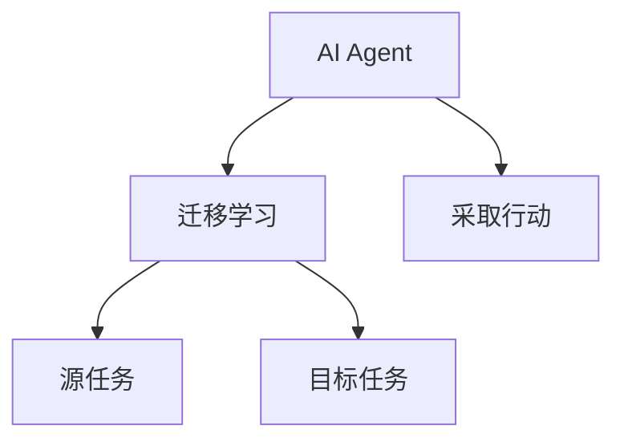
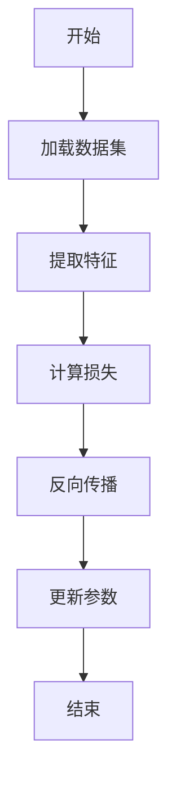
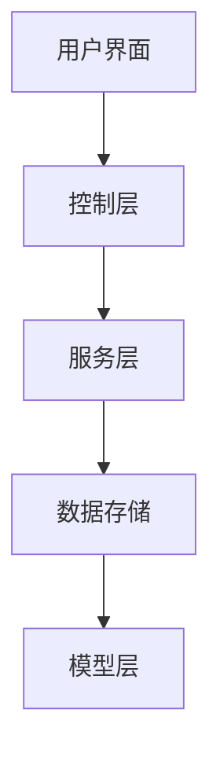
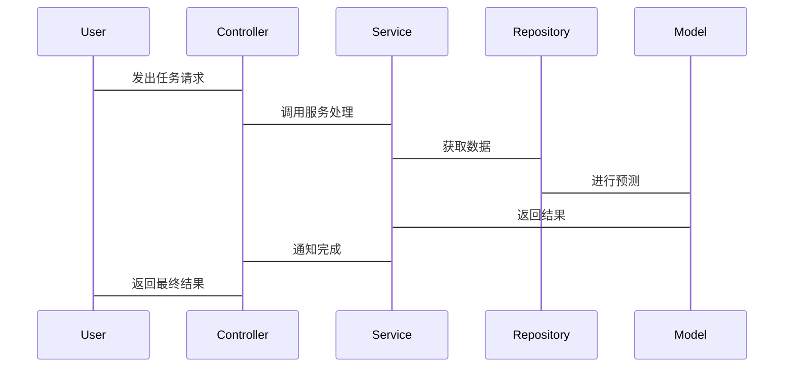

                 


# AI Agent的迁移学习在跨领域任务中的应用

> 关键词：AI Agent, 迁移学习, 跨领域任务, 多领域学习, 领域适应, 智能体, 机器学习

> 摘要：本文探讨AI Agent在迁移学习中的应用，分析其在跨领域任务中的优势和挑战。通过详细讲解算法原理、系统设计和项目实战，展示如何利用迁移学习提升AI Agent的跨领域性能。

---

## 正文

### 第一部分：AI Agent与迁移学习基础

#### 第1章：AI Agent概述

##### 1.1 AI Agent的基本概念
AI Agent（智能体）是能够感知环境并采取行动以实现目标的实体。其核心特征包括自主性、反应性、目标导向和情境适应性。AI Agent广泛应用于推荐系统、自动驾驶、机器人控制等领域。

##### 1.2 迁移学习的基本概念
迁移学习是将知识从源任务转移到目标任务的过程，旨在减少数据需求和提高学习效率。其类型包括特征迁移、参数迁移和样本迁移。

##### 1.3 跨领域任务的特点与挑战
跨领域任务涉及不同领域数据，如医疗和金融。其挑战在于领域差异和数据分布变化，导致模型泛化能力不足。

##### 1.4 AI Agent与迁移学习的结合意义
迁移学习增强AI Agent的适应性，使其在跨领域任务中更具灵活性和高效性。

---

#### 第2章：迁移学习的核心概念与联系

##### 2.1 AI Agent与迁移学习的关系
AI Agent通过迁移学习实现跨领域任务，迁移学习为AI Agent提供知识转移的机制。

##### 2.2 核心概念对比表
| **属性**       | **AI Agent**                 | **迁移学习**                |
|----------------|------------------------------|-----------------------------|
| **目标**       | 执行特定任务                 | 知识转移                     |
| **输入**       | 环境感知数据                 | 不同领域的数据集             |
| **输出**       | 行动或决策                   | 目标任务性能提升             |
| **依赖**       | 领域知识                     | 过往经验                     |

##### 2.3 ER实体关系图


##### 2.4 Mermaid流程图：AI Agent与迁移学习的交互


---

### 第三部分：迁移学习的算法原理

#### 第3章：迁移学习算法原理

##### 3.1 迁移学习算法概述
迁移学习通过特征提取和领域适配，减少领域差异。特征提取阶段利用预训练模型提取特征，领域适配阶段调整模型以适应目标领域。

##### 3.2 基于特征的迁移学习算法
- **特征提取**：使用预训练模型提取特征，如ResNet用于图像任务。
- **领域适配**：通过对抗训练或加权损失函数，减少领域差异。

##### 3.3 迁移学习的数学模型
目标是最小化源域和目标域的损失差异：

$$ L = \alpha L_{source} + \beta L_{target} $$

其中，$\alpha$和$\beta$是权重系数，用于平衡源域和目标域的损失。

##### 3.4 Python代码示例
```python
import torch
import torch.nn as nn

# 模型定义
class迁移学习模型(nn.Module):
    def __init__(self):
        super(迁移学习模型, self).__init__()
        self.feature_extractor = ResNet()
        self.classifier = nn.Linear(512, output_classes)

    def forward(self, x):
        features = self.feature_extractor(x)
        output = self.classifier(features)
        return output

# 训练循环
optimizer = torch.optim.Adam(model.parameters(), lr=1e-4)
criterion = nn.CrossEntropyLoss()

for epoch in range(num_epochs):
    model.train()
    for batch_x, batch_y in dataloaders['train']:
        outputs = model(batch_x)
        loss = criterion(outputs, batch_y)
        loss.backward()
        optimizer.step()
```

##### 3.5 算法流程图


---

### 第四部分：系统分析与架构设计

#### 第4章：系统分析与架构设计

##### 4.1 问题场景介绍
AI Agent在医疗和金融领域应用，需要处理不同领域的数据。

##### 4.2 系统功能设计
- 数据预处理模块：处理源域和目标域数据。
- 特征提取模块：使用预训练模型提取特征。
- 领域适配模块：调整模型以适应目标域。

##### 4.3 系统架构设计


##### 4.4 系统接口设计
- 输入接口：接收用户指令和数据。
- 输出接口：返回决策结果和日志信息。

##### 4.5 系统交互流程图


---

### 第五部分：项目实战

#### 第5章：项目实战

##### 5.1 环境安装
安装必要的库：PyTorch、numpy、scikit-learn。

##### 5.2 系统核心实现源代码
```python
import torch
import torch.nn as nn
from torch.utils.data import DataLoader

# 定义模型
class迁移学习模型(nn.Module):
    def __init__(self, num_classes):
        super().__init__()
        self.conv = nn.Conv2d(3, 64, kernel_size=3, padding=1)
        self.pool = nn.MaxPool2d(2, 2)
        self.fc = nn.Linear(64 * 5 * 5, num_classes)

    def forward(self, x):
        x = self.conv(x)
        x = self.pool(x)
        x = x.view(-1, 64 * 5 * 5)
        output = self.fc(x)
        return output

# 训练函数
def train(model, train_loader, criterion, optimizer, device):
    model.train()
    for batch_x, batch_y in train_loader:
        batch_x, batch_y = batch_x.to(device), batch_y.to(device)
        outputs = model(batch_x)
        loss = criterion(outputs, batch_y)
        loss.backward()
        optimizer.step()
```

##### 5.3 代码应用解读与分析
训练过程中，模型在源域和目标域之间交替训练，通过对抗训练减少领域差异。

##### 5.4 实际案例分析
以图像分类为例，使用迁移学习提高在不同数据集上的准确率。

##### 5.5 项目小结
迁移学习显著提升了AI Agent的跨领域性能，但需注意领域适配的复杂性和计算资源需求。

---

### 第六部分：总结与展望

#### 6.1 总结
迁移学习增强了AI Agent的跨领域能力，通过特征提取和领域适配，使其在不同任务中表现优异。

#### 6.2 最佳实践 tips
- 数据预处理是关键。
- 选择合适的迁移学习算法。
- 定期验证模型性能。

#### 6.3 小结
迁移学习为AI Agent的跨领域应用提供了强大支持，未来将进一步研究更高效的算法。

#### 6.4 注意事项
- 确保数据质量和多样性。
- 避免过拟合源域数据。
- 监控模型的适应性。

#### 6.5 拓展阅读
推荐阅读关于深度迁移学习和多领域适应的最新研究论文。

---

作者：AI天才研究院/AI Genius Institute & 禅与计算机程序设计艺术 /Zen And The Art of Computer Programming

