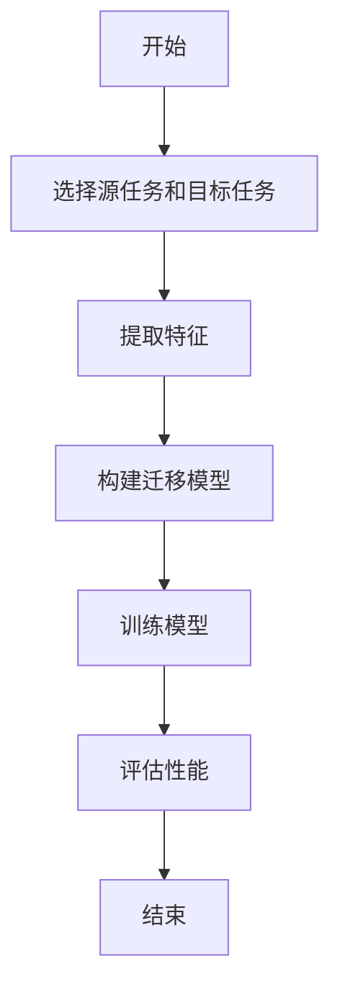
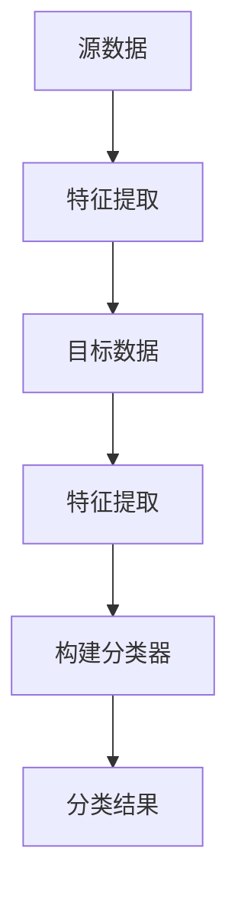
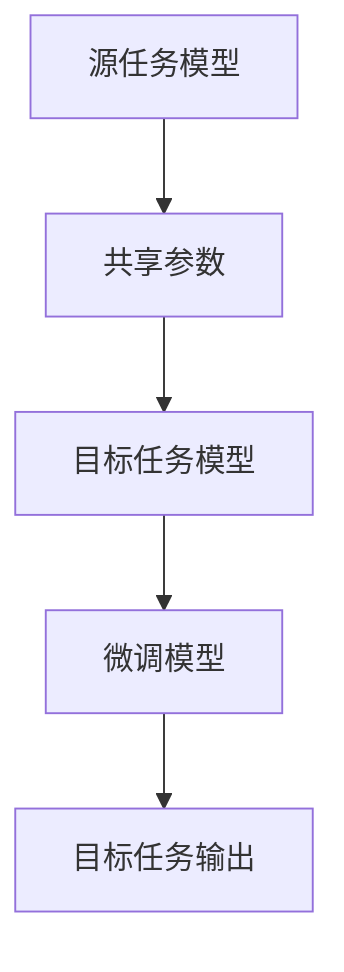
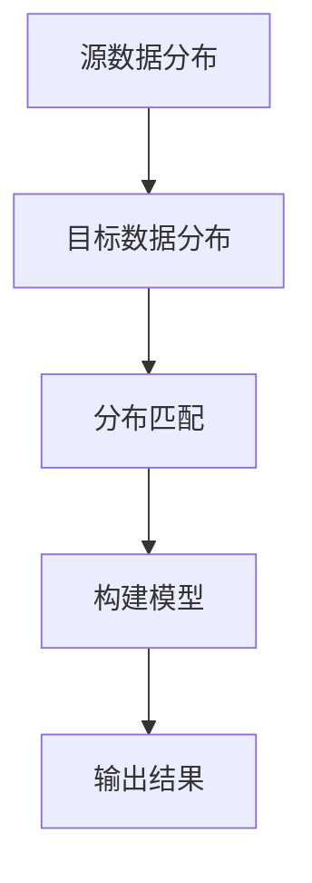
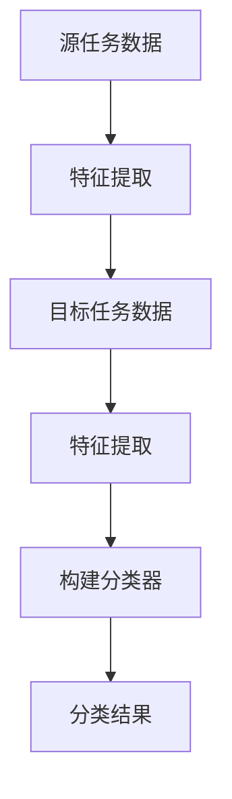
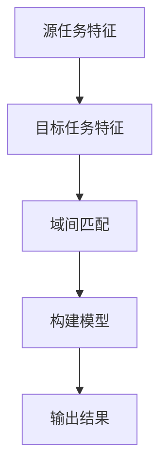
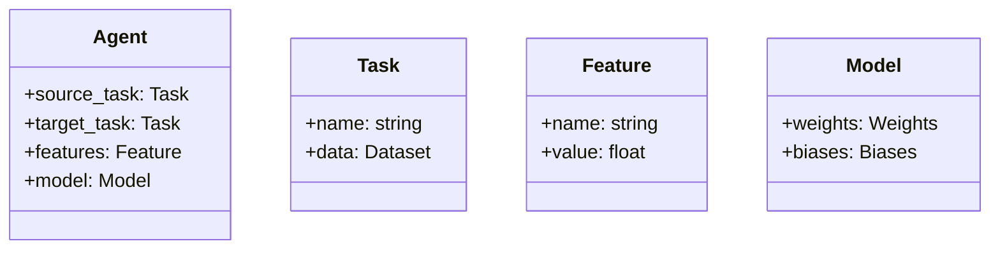
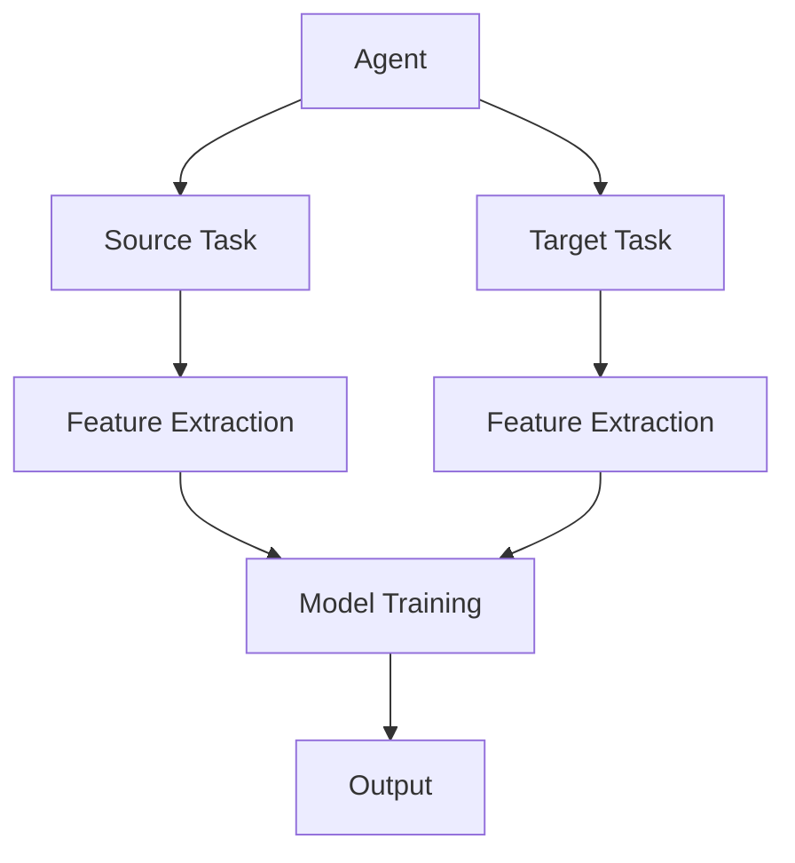

                 


# AI Agent的迁移学习能力开发

> 关键词：AI Agent, 迁移学习, 机器学习, 人工智能, 算法开发

> 摘要：本文深入探讨了AI Agent的迁移学习能力开发，从理论基础到实际应用，全面解析了迁移学习的核心原理、算法实现及系统架构设计。文章首先介绍了AI Agent的基本概念与迁移学习的重要性，接着详细讲解了迁移学习的原理、算法及其在AI Agent中的应用。通过实际项目案例，展示了迁移学习在AI Agent开发中的实践价值，并总结了开发过程中的最佳实践与注意事项。本文适合AI开发者、机器学习研究人员及对AI Agent技术感兴趣的读者阅读。

---

## 第1章: AI Agent与迁移学习概述

### 1.1 AI Agent的基本概念

#### 1.1.1 AI Agent的定义与分类
AI Agent（人工智能代理）是指能够感知环境、自主决策并执行任务的智能实体。它可以是一个软件程序、机器人或任何具备智能行为的系统。根据功能和应用场景，AI Agent可以分为以下几类：
- **简单反射型Agent**：基于固定的规则集进行反应式决策。
- **基于模型的反射型Agent**：利用内部状态和模型进行决策。
- **目标驱动型Agent**：以特定目标为导向，主动规划和执行任务。
- **效用驱动型Agent**：通过最大化效用函数来优化决策。

#### 1.1.2 AI Agent的核心能力
AI Agent的核心能力包括感知能力、决策能力、学习能力和执行能力。迁移学习作为学习能力的重要组成部分，使得AI Agent能够将从一个任务或环境中获得的知识迁移到新的任务或环境中，从而提升其适应性和通用性。

#### 1.1.3 迁移学习的定义与特点
迁移学习是一种机器学习技术，通过将一个任务上学到的知识迁移到另一个任务中，以提高目标任务的性能。其特点包括：
- **领域差异性**：源任务和目标任务属于不同的领域或分布。
- **共享特征**：源任务和目标任务之间存在共享的特征或概念。
- **适应性**：通过迁移学习，AI Agent能够快速适应新任务，减少对新数据的依赖。

### 1.2 迁移学习的背景与重要性

#### 1.2.1 迁移学习的背景介绍
在AI Agent的开发中，迁移学习的重要性日益凸显。传统的机器学习方法依赖于大量标注数据，且难以在不同任务或环境中复用。迁移学习通过利用已有的知识和经验，显著减少了新任务的数据需求，提高了学习效率。

#### 1.2.2 迁移学习在AI Agent中的作用
迁移学习使得AI Agent能够快速适应新的任务或环境，提升其灵活性和通用性。例如，在医疗领域，AI Agent可以通过迁移学习将疾病诊断的知识迁移到新类型的疾病分析中。

#### 1.2.3 迁移学习的挑战与机遇
尽管迁移学习在理论上具有显著优势，但实际应用中仍面临诸多挑战，如领域适应问题、数据分布差异等。同时，迁移学习也为AI Agent的开发提供了新的机遇，使其能够更好地服务于复杂多变的应用场景。

### 1.3 迁移学习的核心概念

#### 1.3.1 迁移学习的定义与分类
迁移学习可以分为三类：**任务特定迁移学习**、**通用迁移学习**和**自适应迁移学习**。任务特定迁移学习针对特定任务设计，通用迁移学习适用于广泛任务，而自适应迁移学习则能够动态调整迁移策略。

#### 1.3.2 迁移学习的关键属性对比
通过对比表格，我们可以清晰地看到不同迁移学习方法的优缺点：

| 特性          | 任务特定迁移学习 | 通用迁移学习 | 自适应迁移学习 |
|---------------|------------------|--------------|----------------|
| 适用范围      | 特定任务         | 广泛任务      | 动态变化任务    |
| 灵活性        | 较低             | 较高          | 最高            |
| 实现复杂度    | 较低             | 较高          | 最高            |

#### 1.3.3 迁移学习的ER实体关系图
以下是迁移学习的ER实体关系图，展示了源任务、目标任务和共享特征之间的关系：

```mermaid
er
actor
    Agent
        task -->> feature: 通过特征进行迁移
        source_task -->> target_task: 迁移目标
```

---

## 第2章: 迁移学习的核心原理

### 2.1 迁移学习的原理与机制

#### 2.1.1 知识迁移的基本原理
迁移学习的核心在于提取和利用源任务与目标任务之间的共享特征或知识。通过构建共享特征空间，迁移学习能够有效降低目标任务的学习难度。

#### 2.1.2 迁移学习的数学模型
迁移学习的数学模型可以表示为：

$$ J = \lambda L_s + (1-\lambda) L_t $$

其中，$L_s$ 表示源任务的损失函数，$L_t$ 表示目标任务的损失函数，$\lambda$ 表示源任务和目标任务的权重系数。

#### 2.1.3 迁移学习的算法流程
以下是迁移学习的算法流程图：



### 2.2 迁移学习的算法类型

#### 2.2.1 基于特征的迁移学习
基于特征的迁移学习通过提取共享特征来实现迁移。以下是其实现流程：



#### 2.2.2 基于参数的迁移学习
基于参数的迁移学习通过共享参数或权重来实现迁移。以下是其实现流程：



#### 2.2.3 基于分布的迁移学习
基于分布的迁移学习通过匹配源任务和目标任务的数据分布来实现迁移。以下是其实现流程：



### 2.3 迁移学习的优缺点分析

#### 2.3.1 迁移学习的优势
- **减少数据需求**：通过迁移学习，可以在目标任务数据有限的情况下进行有效学习。
- **提升泛化能力**：迁移学习能够提升模型的泛化能力，使其在不同任务中表现更好。
- **加快开发周期**：通过复用已有知识，可以显著缩短新任务的开发周期。

#### 2.3.2 迁移学习的局限性
- **领域适应问题**：迁移学习的效果依赖于源任务和目标任务之间的相似性。
- **过迁移风险**：迁移学习可能导致模型过依赖源任务的知识，影响目标任务的性能。
- **计算复杂度高**：迁移学习通常需要处理大量数据和复杂的模型结构，计算成本较高。

#### 2.3.3 迁移学习的适用场景
- **数据稀缺场景**：当目标任务数据有限时，迁移学习能够有效提升模型性能。
- **领域迁移场景**：当目标任务与源任务属于相关领域时，迁移学习能够显著提升学习效率。
- **动态环境场景**：当任务或环境动态变化时，迁移学习能够帮助模型快速适应新变化。

---

## 第3章: 迁移学习的算法原理

### 3.1 迁移学习的主要算法

#### 3.1.1 迁移任务模型
迁移任务模型通过构建共享特征空间来实现迁移。以下是其实现流程：



#### 3.1.2 领域适应模型
领域适应模型通过匹配源任务和目标任务的数据分布来实现迁移。以下是其实现流程：


#### 3.1.3 域间迁移模型
域间迁移模型通过构建跨域特征空间来实现迁移。以下是其实现流程：



### 3.2 迁移学习算法的数学模型

#### 3.2.1 迁移任务模型的数学表达
迁移任务模型的数学表达如下：

$$ J = \lambda L_s + (1-\lambda) L_t $$

其中，$L_s$ 表示源任务的损失函数，$L_t$ 表示目标任务的损失函数，$\lambda$ 表示源任务和目标任务的权重系数。

#### 3.2.2 领域适应模型的数学表达
领域适应模型的数学表达如下：

$$ J = \lambda L_{source} + (1-\lambda) L_{target} + \alpha D $$

其中，$D$ 表示源任务和目标任务的数据分布差异。

#### 3.2.3 域间迁移模型的数学表达
域间迁移模型的数学表达如下：

$$ J = \lambda L_{source} + (1-\lambda) L_{target} + \alpha D_{inter} $$

其中，$D_{inter}$ 表示源任务和目标任务之间的交互分布差异。

---

## 第4章: 迁移学习在AI Agent中的应用

### 4.1 迁移学习的系统架构设计

#### 4.1.1 系统功能设计
以下是系统功能设计的类图：



#### 4.1.2 系统架构设计
以下是系统架构设计的架构图：



### 4.2 迁移学习的项目实战

#### 4.2.1 项目环境安装
以下是项目环境安装的代码示例：

```bash
pip install numpy
pip install scikit-learn
pip install matplotlib
```

#### 4.2.2 项目核心实现
以下是项目核心实现的代码示例：

```python
import numpy as np
from sklearn.metrics import accuracy_score
from sklearn.model_selection import train_test_split
from sklearn.svm import SVC

# 源任务数据
X_source = np.array([[1, 2], [3, 4], [5, 6]])
y_source = np.array([0, 1, 0])

# 目标任务数据
X_target = np.array([[2, 3], [4, 5], [6, 7]])
y_target = np.array([1, 0, 1])

# 特征提取
def extract_features(X):
    return X[:, 0]

# 模型训练
model = SVC()
model.fit(extract_features(X_source), y_source)

# 模型预测
y_pred = model.predict(extract_features(X_target))
print("Accuracy:", accuracy_score(y_target, y_pred))
```

#### 4.2.3 项目小结
通过上述项目实战，我们可以看到迁移学习在AI Agent中的应用价值。通过特征提取和模型训练，我们可以有效地将源任务的知识迁移到目标任务，显著提升模型的性能。

---

## 第5章: 迁移学习的优化与实践

### 5.1 迁移学习的优化策略

#### 5.1.1 参数调节
通过调节迁移学习中的参数（如$\lambda$），可以优化模型的性能。

#### 5.1.2 特征选择
选择合适的特征提取方法，可以提升迁移学习的效果。

#### 5.1.3 模型选择
选择适合迁移学习的模型，可以提升模型的泛化能力。

### 5.2 迁移学习的注意事项

#### 5.2.1 数据质量
确保源任务和目标任务的数据质量，是迁移学习成功的关键。

#### 5.2.2 任务相关性
源任务和目标任务的相关性，直接影响迁移学习的效果。

#### 5.2.3 过迁移风险
避免过度依赖源任务的知识，防止过迁移风险。

### 5.3 迁移学习的拓展阅读

#### 5.3.1 经典论文
推荐阅读以下经典论文：
- "Transfer Learning" by Tan-shoto et al.
- "A Survey on Transfer Learning" by Pan et al.

#### 5.3.2 工具与库
推荐使用以下工具与库：
- scikit-learn：支持迁移学习的特征提取和模型训练。
- TensorFlow：支持迁移学习的模型构建和训练。
- PyTorch：支持迁移学习的模型构建和训练。

---

## 附录: 作者简介

作者：AI天才研究院/AI Genius Institute & 禅与计算机程序设计艺术 /Zen And The Art of Computer Programming

---

以上是《AI Agent的迁移学习能力开发》的技术博客文章的完整大纲和内容。如需进一步扩展或调整，请随时告知！

