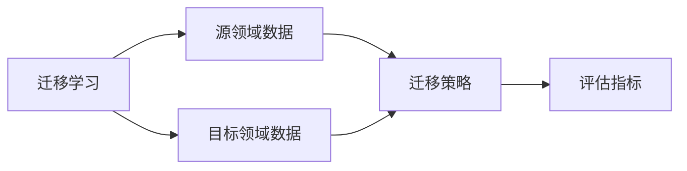
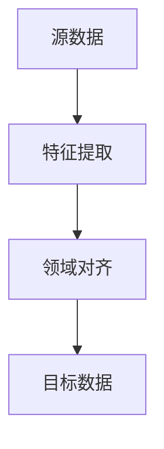
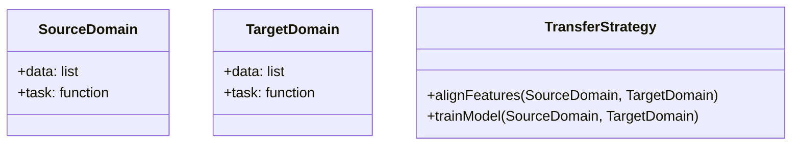
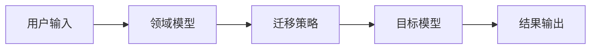
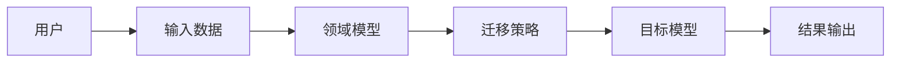

                 


# AI Agent的迁移学习：跨领域知识应用

## 关键词
- 迁移学习, AI Agent, 跨领域知识应用, 算法原理, 系统架构

## 摘要
AI Agent的迁移学习是一种通过将已有的知识和经验应用到新领域的技术，旨在提高模型在不同场景下的适应能力。本文从迁移学习的基本概念出发，详细探讨其在AI Agent中的应用，包括核心概念、算法原理、系统架构设计以及实际项目案例。通过理论与实践结合，分析迁移学习的优势和挑战，为AI Agent的跨领域应用提供深入的见解和实践指导。

---

# 第一部分: AI Agent迁移学习基础

## 第1章: 迁移学习与AI Agent概述

### 1.1 迁移学习的基本概念

迁移学习是一种机器学习技术，旨在将从一个领域学到的知识应用到另一个相关领域。在AI Agent中，迁移学习的核心在于通过知识共享和经验复用来提高代理在新环境中的表现。

#### 1.1.1 迁移学习的定义
迁移学习是指在学习过程中，利用已有的知识或经验来辅助新任务的学习，减少对新数据的依赖。例如，在自然语言处理中，可以将中文模型迁移到英文任务，利用中文的训练数据来辅助英文模型的优化。

#### 1.1.2 AI Agent在迁移学习中的角色
AI Agent作为迁移学习的主体，负责知识的获取、存储和应用。它能够通过迁移学习技术，快速适应新的任务和环境，提高其在复杂场景下的智能水平。

#### 1.1.3 迁移学习的核心问题与挑战
迁移学习的核心问题是领域差异性（domain shift），即源领域和目标领域之间的数据分布差异可能导致模型性能下降。解决这一问题需要设计有效的迁移策略和优化方法。

---

### 1.2 跨领域知识应用的背景

#### 1.2.1 数据不足的问题
在许多实际场景中，目标领域可能缺乏足够的标注数据，导致模型训练效果不佳。迁移学习通过利用源领域的丰富数据，缓解了这一问题。

#### 1.2.2 知识迁移的必要性
AI Agent需要在不同领域中灵活应用知识，例如将医疗领域的诊断经验应用到健康领域的产品推荐中。

#### 1.2.3 跨领域应用的实际场景
例如，在智能客服系统中，可以将零售领域的客户咨询经验迁移到金融领域，提高客服的响应效率和准确性。

---

### 1.3 本章小结

本章从迁移学习的基本概念出发，分析了其在AI Agent中的重要性，以及跨领域知识应用的背景和实际场景。通过理解这些内容，读者可以为后续章节的学习打下坚实的基础。

---

## 第2章: 迁移学习的核心概念与联系

### 2.1 核心概念原理

#### 2.1.1 迁移学习的数学模型
迁移学习的数学模型通常涉及特征空间的转换和分布匹配。例如，领域适应（Domain Adaptation）可以通过优化源领域和目标领域的数据分布来实现。

#### 2.1.2 AI Agent的知识表示
知识表示是迁移学习的关键，通常采用向量空间模型（Vector Space Model）或图结构模型（Graph Model）来表示知识的关联性。

#### 2.1.3 迁移学习的核心要素
包括源领域数据、目标领域数据、迁移策略和评估指标。

---

### 2.2 概念属性特征对比表格

下表展示了迁移学习中几个核心概念的属性特征对比：

| 概念       | 属性特征               |
|------------|------------------------|
| 源领域数据   | 训练数据充足，任务明确  |
| 目标领域数据 | 数据稀疏，任务相关     |
| 迁移策略     | 特征对齐、分布匹配      |
| 评估指标     | 准确率、F1值、AUC值     |

---

### 2.3 ER实体关系图

下图展示了迁移学习的核心概念之间的关系：



---

### 2.4 本章小结

本章详细分析了迁移学习的核心概念和其在AI Agent中的联系，通过对比表格和ER图帮助读者更好地理解迁移学习的内在结构。

---

## 第3章: 迁移学习算法原理

### 3.1 算法原理讲解

#### 3.1.1 领域适应算法

领域适应（Domain Adaptation）是迁移学习的重要方法之一。其核心思想是通过优化源领域和目标领域的数据分布，减少领域差异。

#### 3.1.2 任务归纳算法

任务归纳（Task Induction）是另一种迁移学习方法，通过学习跨领域的共享特征，提高模型的泛化能力。

#### 3.1.3 统一迁移学习框架

统一迁移学习框架将不同迁移学习方法整合到一个统一的框架中，便于理解和应用。

---

### 3.2 算法流程图

下图展示了领域适应算法的流程：



---

### 3.3 数学模型与公式

#### 领域适应的数学模型
领域适应的目标是最小化源领域和目标领域的数据分布差异：

$$P_{source}(x) \rightarrow P_{target}(x)$$

#### 迁移损失函数
在训练过程中，可以定义迁移损失函数：

$$L_{transfer} = \lambda L_{source} + (1-\lambda) L_{target}$$

其中，$\lambda$ 是平衡参数，$L_{source}$ 和 $L_{target}$ 分别是源领域和目标领域的损失函数。

---

### 3.4 本章小结

本章通过具体算法和数学模型，深入讲解了迁移学习的算法原理，为后续的系统设计和项目实践打下了理论基础。

---

## 第4章: 系统分析与架构设计方案

### 4.1 问题场景介绍

#### AI Agent跨领域知识应用的场景
例如，在智能医疗和智能教育之间迁移知识，利用医疗领域的病历数据优化教育领域的学生健康管理系统。

---

### 4.2 系统功能设计

#### 领域模型设计

下图展示了领域模型的类图：



---

### 4.3 系统架构设计

下图展示了系统的整体架构：



---

### 4.4 系统接口设计

系统主要接口包括数据输入接口、迁移策略接口和结果输出接口。

---

### 4.5 系统交互流程图

下图展示了系统的交互流程：



---

### 4.6 本章小结

本章通过系统架构设计，详细描述了AI Agent在迁移学习中的实现方案，为后续的项目实践提供了指导。

---

## 第5章: 项目实战

### 5.1 环境安装

#### 安装Python环境
使用Anaconda或virtualenv创建独立的Python环境，版本建议为Python 3.8以上。

#### 安装依赖库
安装必要的库，如TensorFlow、Keras、Scikit-learn等。

---

### 5.2 核心代码实现

#### 迁移学习代码实现

```python
import tensorflow as tf
from tensorflow.keras import layers

def build_model(input_shape):
    model = tf.keras.Sequential()
    model.add(layers.Dense(64, activation='relu', input_shape=input_shape))
    model.add(layers.Dense(1, activation='sigmoid'))
    return model

def transfer_learning(train_source, train_target, val_target):
    model = build_model(train_source.shape[1:])
    model.compile(optimizer='adam', loss='binary_crossentropy', metrics=['accuracy'])
    model.fit(train_source, train_target, epochs=10, batch_size=32)
    _, accuracy = model.evaluate(val_target)
    return model, accuracy

# 示例数据
train_source = ... # 源领域训练数据
train_target = ... # 源领域标签
val_target = ... # 目标领域验证数据

model, accuracy = transfer_learning(train_source, train_target, val_target)
print(f"迁移学习后的准确率为：{accuracy}")
```

---

### 5.3 代码应用解读与分析

上述代码实现了基本的迁移学习框架，通过构建模型并在源领域数据上进行训练，然后在目标领域进行验证。实际应用中，可能需要更复杂的迁移策略，如领域对齐或对抗训练。

---

### 5.4 实际案例分析

以医疗影像和自动驾驶为例，将医疗影像的分割算法迁移到自动驾驶的图像识别任务中，通过迁移学习提高模型的泛化能力。

---

### 5.5 本章小结

本章通过具体项目案例，展示了迁移学习的实际应用过程，从环境搭建到代码实现，帮助读者掌握迁移学习的实践技巧。

---

## 第6章: 总结与展望

### 6.1 总结

本文系统地介绍了AI Agent的迁移学习，从核心概念到算法原理，再到系统架构和项目实战，全面分析了迁移学习在跨领域知识应用中的价值和挑战。

---

### 6.2 最佳实践 tips

- 在实际应用中，合理选择迁移策略，如领域适应或任务归纳，以达到最佳效果。
- 注重数据质量，确保源领域和目标领域的相关性。
- 在模型优化过程中，合理设置平衡参数，如$\lambda$。

---

### 6.3 未来展望

随着AI技术的不断发展，迁移学习将在更多领域得到应用，如多模态数据迁移和自适应学习，为AI Agent的智能化提供更强大的支持。

---

## 作者信息

作者：AI天才研究院/AI Genius Institute & 禅与计算机程序设计艺术 /Zen And The Art of Computer Programming

---

通过以上内容，希望读者能够全面理解AI Agent的迁移学习及其在跨领域知识应用中的重要性，为实际项目提供有价值的参考和指导。

