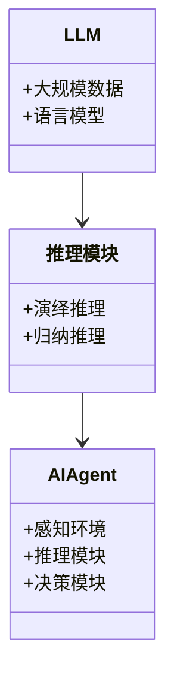
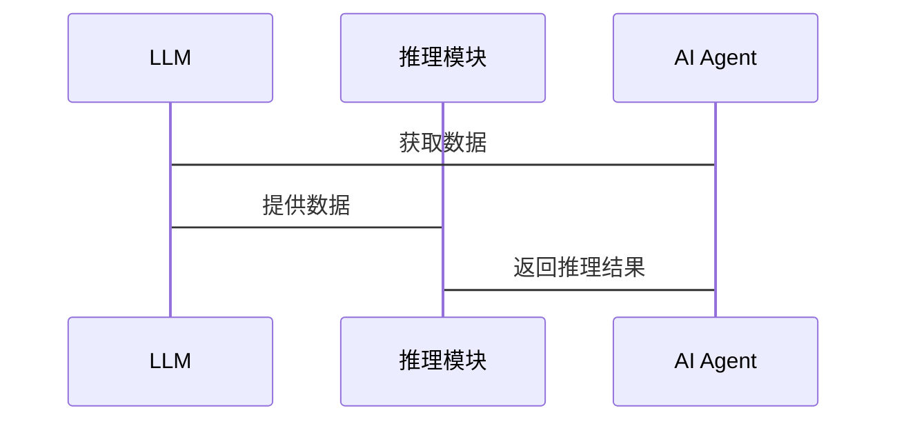

                 


# AI Agent的逻辑推理能力：增强LLM的演绎与归纳

> 关键词：AI Agent，逻辑推理，LLM，演绎推理，归纳推理，增强能力

> 摘要：本文深入探讨了AI Agent的逻辑推理能力，特别是如何增强LLM（大语言模型）的演绎与归纳能力。通过分析逻辑推理的核心原理，结合实际案例和系统设计，详细阐述了增强LLM逻辑推理能力的方法，为AI Agent的应用提供了理论和实践指导。

---

# 第一部分: AI Agent的逻辑推理能力基础

## 第1章: AI Agent与逻辑推理概述

### 1.1 AI Agent的基本概念

#### 1.1.1 AI Agent的定义
AI Agent（智能体）是指能够感知环境、自主决策并采取行动的实体。它能够根据输入的信息做出反应，具有目标导向性。

```mermaid
classDiagram
    class AI Agent {
        +环境：能够感知的环境
        +目标：追求的目标
        +决策：基于逻辑推理的决策
        +行动：采取的行动
    }
    note right of AI Agent: 目标导向性
    note right of AI Agent: 自主性
```

#### 1.1.2 AI Agent的核心特征
- **自主性**：无需外部干预，自主决策。
- **反应性**：能够感知环境并实时调整行为。
- **目标导向性**：所有行动都围绕实现特定目标。

#### 1.1.3 逻辑推理在AI Agent中的作用
逻辑推理是AI Agent实现智能决策的核心能力，帮助其从输入信息中推导出新的结论，从而做出更合理的决策。

### 1.2 逻辑推理的定义与分类

#### 1.2.1 逻辑推理的定义
逻辑推理是通过已知的前提和规则，推导出新的结论的过程。

#### 1.2.2 演绎推理与归纳推理的区别

| **特征** | **演绎推理** | **归纳推理** |
|----------|--------------|--------------|
| **定义** | 从一般到特定 | 从特定到一般 |
| **结论** | 结论必然正确 | 结论概率正确 |
| **应用** | 法律推理、数学证明 | 科学发现、数据分析 |

#### 1.2.3 类比推理与 abduction 推理的介绍

- **类比推理**：通过比较不同事物的相似性，推导出新的结论。
- **abduction 推理**：从观察到的现象推导出最可能的解释。

### 1.3 LLM与逻辑推理的结合

#### 1.3.1 LLM的基本原理
LLM通过大规模数据训练，能够生成连贯的文本，并在一定程度上理解上下文。

#### 1.3.2 LLM中的逻辑推理需求
为了提高LLM的智能性，需要增强其逻辑推理能力，使其能够处理复杂的逻辑问题。

#### 1.3.3 当前LLM在逻辑推理中的挑战
- **理解力不足**：LLM难以准确理解复杂的逻辑关系。
- **推理深度有限**：在处理多步推理时表现不佳。

## 第2章: 演绎推理与归纳推理的核心原理

### 2.1 演绎推理的原理

#### 2.1.1 演绎推理的定义
演绎推理是从一般性前提推导出特定结论的推理方式。

#### 2.1.2 演绎推理的规则与步骤

1. **前提**：所有人类都是会推理的。
2. **假设**：苏格拉底是人类。
3. **结论**：苏格拉底会推理。

#### 2.1.3 演绎推理的数学模型

$$ \text{如果 } A \rightarrow B \text{ 且 } A \text{ 为真，则 } B \text{ 为真} $$

### 2.2 归纳推理的原理

#### 2.2.1 归纳推理的定义
归纳推理是从特定实例推导出一般结论的推理方式。

#### 2.2.2 归纳推理的规则与步骤

1. **前提**：观察到多次下雨后地面湿。
2. **结论**：下雨会导致地面湿。

#### 2.2.3 归纳推理的数学模型

$$ P(B|A) = \frac{P(A|B)P(B)}{P(A)} $$

### 2.3 演绎与归纳推理的对比分析

#### 2.3.1 ER实体关系图架构

```mermaid
erDiagram
    class 演绎推理 {
        前提
        假设
        结论
    }
    class 归纳推理 {
        样例
        规律
        结论
    }
    演绎推理 --> 结论
    归纳推理 --> 结论
```

## 第3章: 增强LLM的演绎推理能力

### 3.1 演绎推理算法原理

#### 3.1.1 演绎推理算法的实现

```python
def deductive_reasoning(premise, hypothesis):
    # 前提和假设的逻辑关系
    if premise and hypothesis:
        return True
    else:
        return False
```

#### 3.1.2 演绎推理的数学模型

$$ \text{演绎推理：} A \rightarrow B, A \Rightarrow B $$

### 3.2 归纳推理算法的实现

#### 3.2.1 归纳推理算法的实现

```python
def inductive_reasoning(examples, target):
    # 统计样本中的规律
    count = 0
    for example in examples:
        if example[target]:
            count += 1
    return count / len(examples)
```

#### 3.2.2 归纳推理的数学模型

$$ \text{归纳推理：} P(B|A) = \frac{P(A|B)P(B)}{P(A)} $$

## 第4章: 系统分析与架构设计

### 4.1 系统功能设计

#### 4.1.1 领域模型设计



### 4.2 系统架构设计


### 4.3 系统接口设计

#### 4.3.1 推理模块接口

```python
interface IReasoning {
    def apply_deductive_reasoning(premise, hypothesis)
    def apply_inductive_reasoning(examples, target)
}
```

#### 4.3.2 交互流程



## 第5章: 项目实战

### 5.1 环境安装

```bash
pip install numpy
pip install matplotlib
pip install transformers
```

### 5.2 核心实现

#### 5.2.1 推理模块实现

```python
class ReasoningModule:
    def __init__(self):
        self.deductive = True
        self.inductive = True

    def apply_deductive_reasoning(self, premise, hypothesis):
        return premise and hypothesis

    def apply_inductive_reasoning(self, examples, target):
        count = sum(examples[target])
        return count / len(examples)
```

#### 5.2.2 应用解读

通过上述代码，AI Agent能够根据输入的数据进行演绎和归纳推理，从而做出更合理的决策。

### 5.3 案例分析

#### 5.3.1 案例选择

选择一个任务调度优化的案例，展示AI Agent如何通过逻辑推理提高效率。

#### 5.3.2 分析解读

AI Agent通过分析任务之间的依赖关系，利用演绎推理确定优先级，使用归纳推理预测可能的瓶颈，从而优化调度策略。

## 第6章: 总结与展望

### 6.1 总结

AI Agent的逻辑推理能力是实现智能决策的关键。通过增强LLM的演绎和归纳推理能力，能够显著提升其在复杂场景中的表现。

### 6.2 注意事项

- 数据质量对推理结果影响重大，需确保数据的准确性和完整性。
- 逻辑推理模型的复杂度与计算资源消耗成正比，需进行性能优化。

### 6.3 拓展阅读

- 推荐阅读《逻辑学导论》深入理解逻辑推理的基础知识。
- 《深度学习与逻辑推理》了解深度学习在逻辑推理中的应用。

---

# 作者：AI天才研究院 & 禅与计算机程序设计艺术

---

通过本文的详细阐述，读者可以系统地了解AI Agent的逻辑推理能力，并掌握增强LLM演绎与归纳推理的具体方法。希望这些内容能为相关领域的研究和实践提供有价值的参考。

