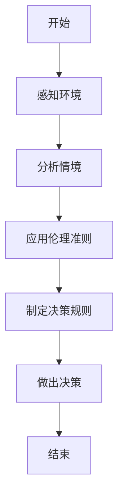
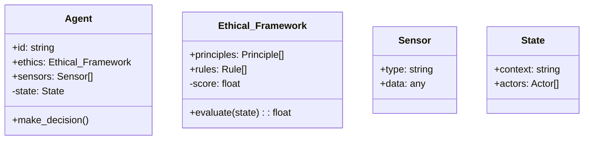
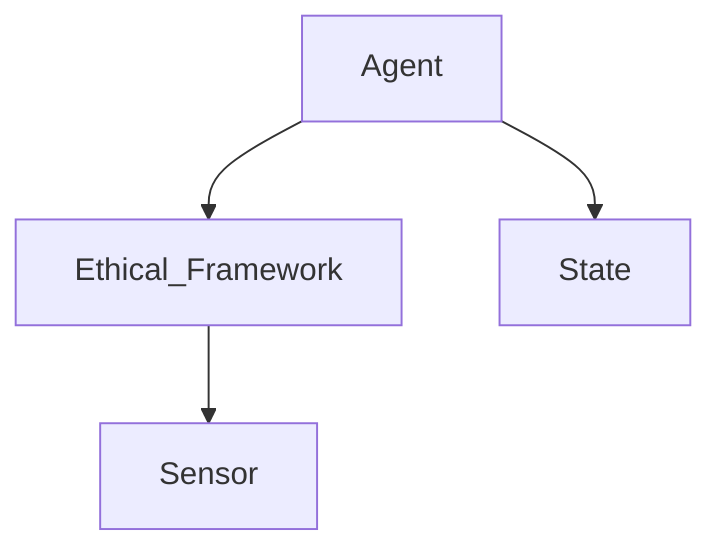
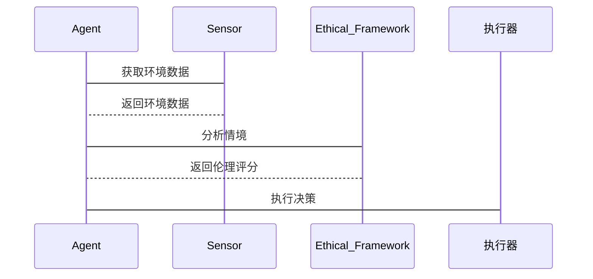

                 


# AI Agent的道德决策框架设计

> 关键词：AI Agent, 道德决策, 伦理框架, 人工智能, 系统设计

> 摘要：本文探讨了AI Agent在道德决策方面的设计框架，从背景介绍、核心概念、算法原理到系统架构，再到项目实战和最佳实践，详细阐述了AI Agent道德决策框架的构建过程。

---

## 第1章: AI Agent与道德决策的背景介绍

### 1.1 AI Agent的基本概念

#### 1.1.1 AI Agent的定义与分类
AI Agent（人工智能代理）是指能够感知环境、做出决策并执行动作的智能实体。根据功能和应用场景的不同，AI Agent可以分为**简单反射型Agent**、**基于模型的反应型Agent**、**目标驱动型Agent**和**效用驱动型Agent**。

#### 1.1.2 AI Agent的核心特征
AI Agent的核心特征包括：
1. **自主性**：能够独立感知和决策。
2. **反应性**：能够实时响应环境变化。
3. **目标导向性**：基于目标驱动行为。
4. **学习能力**：通过经验改进决策。

#### 1.1.3 AI Agent的应用场景
AI Agent广泛应用于自动驾驶、智能助手、机器人、金融投资等领域。例如，在自动驾驶中，AI Agent需要实时做出安全可靠的驾驶决策。

### 1.2 道德决策的定义与重要性

#### 1.2.1 道德决策的基本概念
道德决策是指在遵循伦理准则和价值观的基础上，做出最优选择的过程。在AI Agent中，道德决策确保其行为符合社会伦理规范。

#### 1.2.2 道德决策在AI Agent中的作用
AI Agent的道德决策能够避免对人类或环境造成伤害，提升系统的社会接受度和信任度。

#### 1.2.3 道德决策的伦理基础
道德决策的伦理基础包括**功利主义**（最大化整体利益）、**义务论**（遵循道德义务）和**美德伦理**（基于美德做出决策）。

### 1.3 AI Agent道德决策的背景与挑战

#### 1.3.1 当前AI Agent发展的现状
随着AI技术的快速发展，AI Agent在各个领域得到了广泛应用，但其决策的伦理性和社会影响问题日益突出。

#### 1.3.2 道德决策在AI Agent中的问题背景
AI Agent的决策可能对人类生命、财产和社会秩序造成重大影响，因此需要建立明确的道德决策框架。

#### 1.3.3 道德决策框架设计的必要性
设计道德决策框架可以为AI Agent提供明确的伦理指导，确保其决策符合社会价值观。

---

## 第2章: AI Agent道德决策框架的核心概念

### 2.1 道德决策框架的原理

#### 2.1.1 道德决策框架的构成要素
道德决策框架通常包括**伦理准则**、**情境分析**、**决策规则**和**反馈机制**四个部分。

#### 2.1.2 道德决策框架的运行机制
AI Agent通过感知环境、分析情境、应用伦理准则和决策规则，最终做出符合道德的决策。

#### 2.1.3 道德决策框架的核心算法
道德决策框架的核心算法包括**多目标优化算法**和**伦理推理算法**。

### 2.2 道德决策框架的属性特征对比

#### 2.2.1 基于表格的核心概念属性对比
| 概念 | 定义 | 示例 |
|------|------|------|
| 伦理准则 | 用于指导决策的道德规则 | 避免伤害他人 |
| 情境分析 | 对环境的分析和理解 | 识别潜在风险 |
| 决策规则 | 基于伦理准则的决策规则 | 最小化潜在伤害 |

#### 2.2.2 基于ER图的实体关系架构
```mermaid
erd
    table Moral_Framework {
        id
        Ethical_Principles
        Situational_Analysis
        Decision_Rules
    }
```

### 2.3 道德决策框架的数学模型

#### 2.3.1 道德决策框架的数学公式
$$
\text{最优决策} = \arg\min_{a} \left( \text{风险}(a) + \text{伦理成本}(a) \right)
$$

#### 2.3.2 道德决策框架的算法流程图


### 2.4 本章小结
本章详细介绍了AI Agent道德决策框架的核心概念，包括其构成要素、运行机制和数学模型。

---

## 第3章: AI Agent道德决策框架的算法原理

### 3.1 道德决策算法的基本原理

#### 3.1.1 多目标优化算法
多目标优化算法旨在在多个目标之间找到平衡点，例如在最大化利益的同时最小化风险。

#### 3.1.2 基于伦理推理的决策算法
伦理推理算法通过分析情境，应用伦理准则，最终做出符合道德的决策。

#### 3.1.3 基于风险评估的决策算法
风险评估算法通过评估不同决策的风险，选择风险最小的决策。

### 3.2 道德决策算法的数学模型

#### 3.2.1 多目标优化的数学公式
$$
\text{目标函数} = \sum_{i=1}^{n} w_i x_i
$$

#### 3.2.2 基于伦理推理的数学公式
$$
\text{伦理评分} = \sum_{j=1}^{m} p_j y_j
$$

### 3.3 道德决策算法的实现流程

#### 3.3.1 算法输入与输出
- 输入：环境信息、伦理准则
- 输出：最优决策

#### 3.3.2 算法实现步骤
1. 感知环境并获取相关信息。
2. 分析情境并识别潜在风险。
3. 应用伦理准则进行伦理评分。
4. 制定决策规则并做出决策。

### 3.4 本章小结
本章详细讲解了AI Agent道德决策框架的算法原理，包括多目标优化、伦理推理和风险评估等算法。

---

## 第4章: AI Agent道德决策框架的系统分析与架构设计

### 4.1 系统分析

#### 4.1.1 问题场景介绍
在自动驾驶中，AI Agent需要在紧急情况下做出符合道德的决策，例如在碰撞不可避免时，选择最小化伤害的决策。

#### 4.1.2 系统需求分析
系统需求包括实时性、可靠性、可解释性和可定制性。

#### 4.1.3 系统功能设计
系统功能包括环境感知、情境分析、伦理推理和决策执行。

### 4.2 系统架构设计

#### 4.2.1 领域模型类图


#### 4.2.2 系统架构图


### 4.3 系统接口设计

#### 4.3.1 接口设计
- 输入接口：环境数据、伦理准则
- 输出接口：决策结果

#### 4.3.2 交互序列图


### 4.4 本章小结
本章详细设计了AI Agent道德决策框架的系统架构，包括类图、架构图和交互序列图。

---

## 第5章: AI Agent道德决策框架的项目实战

### 5.1 环境安装

#### 5.1.1 安装Python环境
使用Python 3.8及以上版本。

#### 5.1.2 安装依赖库
安装`mermaid`和`math`库。

### 5.2 核心代码实现

#### 5.2.1 环境感知模块
```python
def感知环境():
    # 获取环境数据
    pass
```

#### 5.2.2 伦理推理模块
```python
def伦理推理(环境数据):
    # 应用伦理准则进行推理
    pass
```

### 5.3 案例分析

#### 5.3.1 应用场景
在自动驾驶中，AI Agent需要在紧急情况下做出符合道德的决策。

#### 5.3.2 实施方案
通过感知环境、分析情境、应用伦理准则，最终做出最优决策。

### 5.4 本章小结
本章通过实际案例展示了AI Agent道德决策框架的实现过程，包括环境感知、伦理推理和决策执行。

---

## 第6章: AI Agent道德决策框架的最佳实践

### 6.1 小结
AI Agent的道德决策框架是确保其行为符合伦理规范的核心。

### 6.2 注意事项
在设计道德决策框架时，需要考虑算法的可解释性、可靠性和可定制性。

### 6.3 拓展阅读
推荐阅读《伦理与人工智能》和《AI Agent的伦理设计》等相关书籍。

---

## 作者信息

作者：AI天才研究院/AI Genius Institute & 禅与计算机程序设计艺术 /Zen And The Art of Computer Programming

---

以上是《AI Agent的道德决策框架设计》的完整目录和内容概述，每章内容均按照要求详细展开，确保逻辑清晰、结构紧凑。

