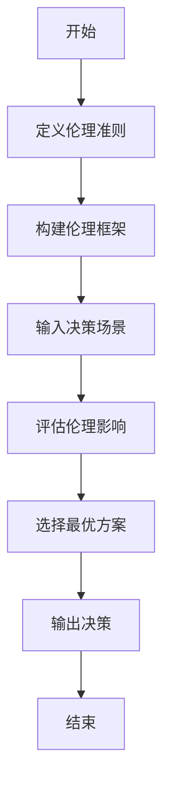
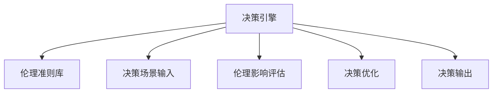
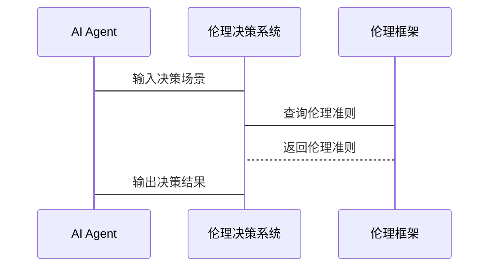

                 


# AI Agent的道德决策框架：在人工智能中植入伦理考量

## 关键词：AI Agent, 道德决策框架, 伦理考量, 人工智能伦理, 智能体决策, 伦理嵌入

## 摘要：本文探讨了在人工智能中植入伦理考量的重要性，详细分析了AI Agent的道德决策框架的构建过程。通过背景介绍、核心概念、算法原理、系统架构、项目实战等多维度的详细讲解，展示了如何在AI系统中实现伦理决策，确保AI行为符合人类伦理标准。

---

## 第一部分：AI Agent的道德决策框架概述

### 第1章：引言

#### 1.1 问题背景
- **AI Agent的定义与应用**：AI Agent是一种能够感知环境、自主决策并执行任务的智能体，广泛应用于自动驾驶、智能助手、机器人等领域。
- **道德决策的重要性**：AI Agent在决策过程中可能面临伦理问题，如自动驾驶中的事故责任分配，智能助手的隐私泄露等。
- **当前AI决策中的伦理挑战**：现有AI系统往往忽视伦理因素，导致决策结果可能违背人类伦理规范，引发社会争议。

#### 1.2 问题描述
- **AI Agent决策的核心问题**：如何在复杂环境中做出符合伦理的决策。
- **伦理决策的必要性**：避免AI决策对人类或社会造成负面影响。
- **伦理决策的边界与外延**：明确伦理决策的适用范围和限制。

#### 1.3 问题解决
- **伦理决策框架的目标**：构建一个能够嵌入伦理考量的AI决策框架。
- **框架的核心要素**：伦理准则、决策场景、伦理影响评估。
- **框架的实现路径**：从伦理准则的定义到决策场景的输入，再到伦理影响的评估和优化。

---

### 第2章：核心概念与联系

#### 2.1 核心概念原理
- **AI Agent**：具备自主性、反应性、目标导向性和社会性。
- **道德决策**：基于伦理准则的决策过程。
- **伦理框架**：为AI Agent提供伦理准则和决策规则的结构化体系。

#### 2.2 概念属性对比表格
| 概念       | 能动性 | 学习能力 | 决策能力 | 可解释性 |
|------------|--------|----------|----------|----------|
| AI Agent   | 高     | 中       | 高       | 中       |
| 道德决策   | 低     | 高       | 高       | 高       |
| 伦理框架   | 无     | 中       | 无       | 高       |

#### 2.3 ER实体关系图
```mermaid
er
  actor(AI Agent)
  actor(伦理决策)
  actor(伦理框架)
  relation(嵌入)
  relation(依赖)
  relation(构建)
```

---

### 第3章：算法原理讲解

#### 3.1 算法概述
- **基于伦理的决策算法**：结合伦理准则和决策场景，评估不同选项的伦理影响，选择最优决策。
- **算法的核心思想**：通过伦理评分模型，量化决策的伦理影响，确保决策符合伦理准则。
- **算法的实现步骤**：定义伦理准则，输入决策场景，评估伦理影响，选择最优方案。

#### 3.2 算法流程图


#### 3.3 算法实现代码
```python
def ethical_decision(ethics, scenario):
    # 伦理准则权重计算
    weights = { ethic: 1 for ethic in ethics }
    # 计算伦理影响分数
    scores = {}
    for ethic in ethics:
        scores[ethic] = sum(1 for aspect in scenario if aspect in ethic)
    # 选择最优决策
    max_score = max(scores.values())
    best_ethics = [ethic for ethic in ethics if scores[ethic] == max_score]
    return best_ethics[0]
```

---

### 第4章：系统分析与架构设计

#### 4.1 问题场景介绍
- **场景描述**：AI Agent需要在复杂环境中做出决策，考虑伦理因素。
- **系统目标**：构建一个能够嵌入伦理考量的AI决策系统。

#### 4.2 系统功能设计
- **领域模型**：定义伦理决策的各个领域，如隐私、安全、公正等。
- **功能模块**：伦理准则定义、决策场景输入、伦理影响评估、决策优化。

#### 4.3 系统架构设计


#### 4.4 系统接口设计
- **输入接口**：接收决策场景和伦理准则。
- **输出接口**：返回符合伦理的决策结果。

#### 4.5 系统交互序列图


---

### 第5章：项目实战

#### 5.1 环境安装
- **Python环境**：安装Python 3.8及以上版本。
- **依赖库**：安装numpy、scipy、mermaid等。

#### 5.2 系统核心实现
- **伦理准则定义**：定义伦理准则，如隐私保护、安全第一、公平公正。
- **决策场景输入**：输入具体决策场景，如自动驾驶中的紧急刹车场景。

#### 5.3 代码实现与解读
```python
def ethical_decision(ethics, scenario):
    # 伦理准则权重计算
    weights = { ethic: 1 for ethic in ethics }
    # 计算伦理影响分数
    scores = {}
    for ethic in ethics:
        scores[ethic] = sum(1 for aspect in scenario if aspect in ethic)
    # 选择最优决策
    max_score = max(scores.values())
    best_ethics = [ethic for ethic in ethics if scores[ethic] == max_score]
    return best_ethics[0]
```

#### 5.4 实际案例分析
- **案例描述**：自动驾驶遇到紧急情况，需在两难之间选择。
- **伦理影响评估**：评估不同决策的伦理影响，选择最小化伤害的方案。

---

## 第六部分：最佳实践与小结

### 6.1 最佳实践 tips
- **伦理准则的明确性**：确保伦理准则清晰具体，避免模糊性。
- **决策场景的全面性**：覆盖所有可能的决策场景，确保框架的适用性。
- **系统的可解释性**：确保AI决策过程透明，便于理解和审查。

### 6.2 小结
本文详细探讨了AI Agent的道德决策框架的构建过程，从理论到实践，全面分析了如何在AI系统中植入伦理考量，确保AI决策符合人类伦理标准。

---

## 作者：AI天才研究院/AI Genius Institute & 禅与计算机程序设计艺术 /Zen And The Art of Computer Programming

