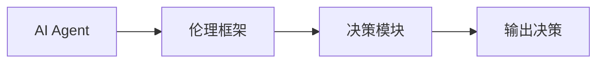
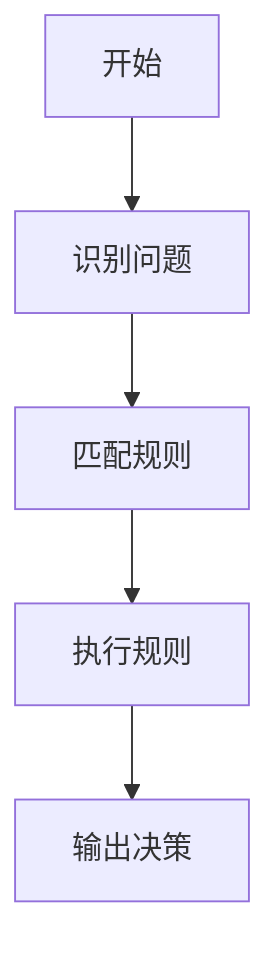
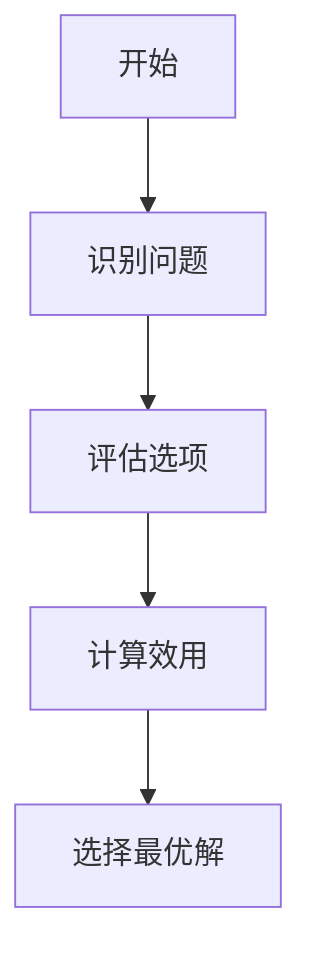
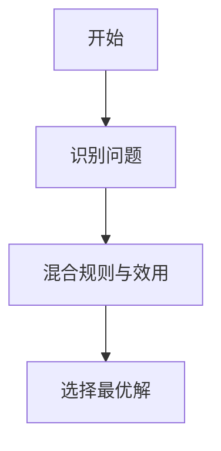
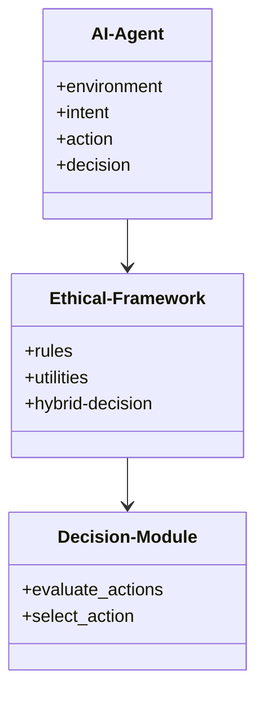
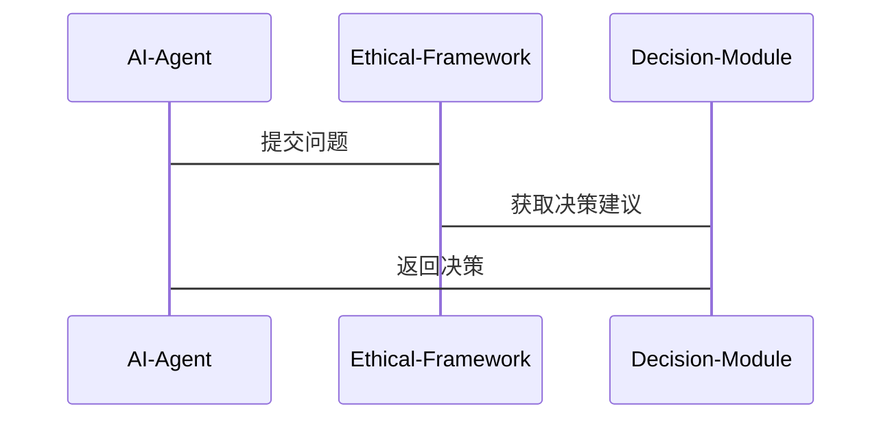

                 


# AI Agent的道德决策：在LLM中植入伦理框架

---

## 关键词：AI Agent, 道德决策, 伦理框架, LLM, 人工智能伦理

---

## 摘要：本文探讨了在AI Agent中实现道德决策的重要性，特别是在大型语言模型（LLM）中植入伦理框架的必要性。文章从伦理框架的原理、算法实现、数学模型、系统架构到项目实战，详细分析了如何确保AI Agent在决策过程中遵循伦理规范，避免伦理风险。

---

## 第1章：AI Agent的基本概念与道德决策的重要性

### 1.1 AI Agent的定义与核心特征

AI Agent（人工智能代理）是指能够感知环境、自主决策并执行任务的智能实体。其核心特征包括：

- **智能性**：能够理解和处理复杂信息，执行推理和学习。
- **自主性**：无需外部干预，自主完成任务。
- **反应性**：能够实时感知环境变化并做出反应。

AI Agent广泛应用于自动驾驶、智能助手、医疗诊断等领域。

### 1.2 道德决策的定义与重要性

道德决策是指在遵循伦理规范的前提下，做出最佳选择的过程。在AI Agent中，道德决策尤为重要，因为它们直接影响人类的福祉和信任。

### 1.3 为什么在LLM中植入伦理框架？

LLM在处理复杂任务时，可能会面临伦理困境。植入伦理框架可以确保决策符合社会价值观，避免潜在的伦理风险。

---

## 第2章：伦理框架的原理与特征

### 2.1 伦理框架的原理

伦理框架用于指导AI Agent的决策过程。主要分为三类：

- **基于规则的伦理框架**：通过预设规则进行判断。
- **基于效用的伦理框架**：追求最大效用。
- **混合型伦理框架**：结合规则和效用。

### 2.2 伦理框架的特征对比

| 特征       | 基于规则的伦理框架 | 基于效用的伦理框架 | 混合型伦理框架 |
|------------|---------------------|---------------------|----------------|
| 原理       | 遵守预设规则         | 追求最大效用         | 结合规则和效用 |
| 优点       | 简洁明确             | 灵活性高             | 综合性好         |
| 缺点       | 过于僵化             | 难以量化             | 复杂性高         |

### 2.3 伦理框架与AI Agent的交互关系



---

## 第3章：伦理框架的算法实现

### 3.1 基于规则的伦理决策算法



```python
def rule_based_decision(problem):
    for rule in rules:
        if rule.applies(problem):
            return rule.action(problem)
    return default_action
```

### 3.2 基于效用的伦理决策算法



```python
def utilitarian_decision(possible_actions):
    max_utility = -infinity
    best_action = None
    for action in possible_actions:
        utility = calculate_utility(action)
        if utility > max_utility:
            max_utility = utility
            best_action = action
    return best_action
```

### 3.3 混合型伦理决策算法



```python
def hybrid_decision(problem):
    filtered_actions = apply_rules(problem)
    if len(filtered_actions) > 0:
        return utilitarian_decision(filtered_actions)
    else:
        return default_action
```

---

## 第4章：伦理框架的数学模型与公式

### 4.1 基于规则的伦理评分模型

$$E = \sum_{i=1}^{n} w_i \cdot f_i$$

其中：
- $$E$$ 是伦理评分
- $$w_i$$ 是特征权重
- $$f_i$$ 是特征函数

### 4.2 基于效用的伦理评分模型

$$U = \sum_{i=1}^{m} a_i \cdot b_i$$

其中：
- $$U$$ 是效用评分
- $$a_i$$ 是行动的影响
- $$b_i$$ 是权重

---

## 第5章：系统分析与架构设计

### 5.1 系统架构设计



### 5.2 系统交互设计



---

## 第6章：项目实战

### 6.1 环境安装与配置

```bash
pip install transformers
pip install scikit-learn
```

### 6.2 核心代码实现

```python
from transformers import AutoTokenizer, AutoModelForCausalLM
import torch

model_name = "gpt2"
tokenizer = AutoTokenizer.from_pretrained(model_name)
model = AutoModelForCausalLM.from_pretrained(model_name)

def apply_ethical_framework(problem):
    # 假设伦理框架已定义
    ethical_frame = define_ethical_rules()
    filtered_actions = filter_actions(problem, ethical_frame)
    return select_best_action(filtered_actions)
```

### 6.3 案例分析与详细解读

以医疗AI Agent为例，展示如何在诊断中植入伦理框架，确保决策符合医疗伦理。

---

## 第7章：总结与展望

### 7.1 最佳实践 Tips

- 定期更新伦理框架以适应社会变化。
- 确保伦理框架的透明性和可解释性。
- 在开发过程中融入伦理审查机制。

### 7.2 小结

本文详细探讨了在AI Agent中植入伦理框架的必要性，从原理、算法、数学模型到系统设计和项目实战，为实现道德决策提供了全面指导。

### 7.3 注意事项

- 避免过度依赖单一伦理框架。
- 确保数据隐私和安全。
- 定期测试和验证伦理框架的有效性。

### 7.4 拓展阅读

- 推荐阅读《AI伦理学：原则与应用》。
- 关注学术期刊《人工智能与伦理》。

---

## 作者：AI天才研究院/AI Genius Institute & 禅与计算机程序设计艺术 /Zen And The Art of Computer Programming

---

通过本文的详细分析，读者能够深入了解如何在AI Agent中植入伦理框架，确保其决策过程符合道德规范，推动人工智能技术的健康发展。

