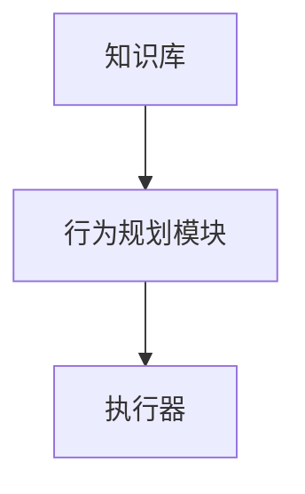
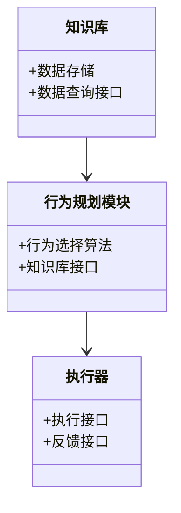
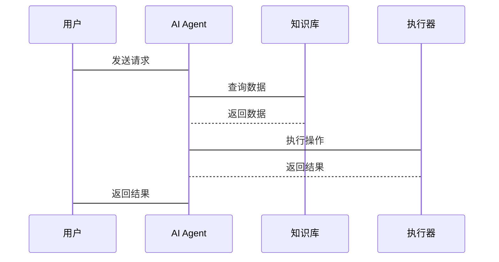

                 


# AI Agent的部署与扩展性考虑

> 关键词：AI Agent, 部署, 扩展性, 系统架构, 分布式计算, 多智能体协作, 云计算

> 摘要：AI Agent作为人工智能领域的重要组成部分，其部署和扩展性设计是实现高效、可靠、大规模应用的关键。本文从AI Agent的核心概念出发，详细探讨其部署策略和扩展性设计，结合实际案例，分析其在不同场景下的实现方法和优化技巧，为读者提供全面的技术指导。

---

# 第1章: AI Agent的背景与概念

## 1.1 AI Agent的基本概念

AI Agent（人工智能代理）是指能够感知环境、自主决策并执行任务的智能实体。与传统程序不同，AI Agent具备以下核心特征：

1. **主动性**：AI Agent能够主动采取行动，而不是仅仅被动响应输入。
2. **反应性**：能够根据环境变化实时调整行为。
3. **智能性**：具备问题解决、学习和推理能力。
4. **社交能力**：能够在多智能体环境中与其他实体协作或竞争。

AI Agent可以分为多种类型，常见的分类方式包括：

- **按功能划分**：任务型、服务型、监控型。
- **按智能水平划分**：反应式、基于模型、混合型。
- **按应用场景划分**：个人助手、智能家居、自动驾驶。

AI Agent的应用场景广泛，例如智能助手（如Siri）、自动化系统（如工业机器人）和多智能体协作（如分布式任务分配系统）。

---

## 1.2 AI Agent的核心概念

AI Agent的核心结构包括：

1. **知识库**：存储任务相关的知识和数据。
2. **行为规划模块**：负责制定行动策略。
3. **执行器**：将规划转化为具体行动。

AI Agent的决策机制通常包括以下步骤：

1. **状态感知**：通过传感器或数据源获取环境信息。
2. **行为选择**：基于当前状态和目标选择最优行为。
3. **执行反馈**：根据执行结果更新知识库和决策模型。

AI Agent的通信机制可以是单点通信、分布式通信或事件驱动通信。例如，在多智能体协作场景中，多个AI Agent需要通过分布式通信机制进行实时信息交换。

---

## 1.3 AI Agent的分类与应用场景

AI Agent的分类有助于理解其在不同场景下的应用。例如：

- **任务型AI Agent**：专注于完成特定任务，如自动邮件分类器。
- **服务型AI Agent**：提供持续服务，如智能客服系统。
- **监控型AI Agent**：实时监控环境并触发响应，如智能家居系统。

在多智能体协作场景中，AI Agent需要通过通信机制实现协同工作。例如，分布式任务分配系统中，多个AI Agent可以协作完成复杂任务。

---

## 1.4 本章小结

本章介绍了AI Agent的基本概念、核心特征、分类及其应用场景。AI Agent的智能性和社交能力使其在多个领域具有广泛的应用潜力。理解这些基本概念是后续部署和扩展性设计的基础。

---

# 第2章: AI Agent的核心概念与原理

## 2.1 AI Agent的组成与结构

AI Agent的结构通常包括以下模块：

1. **知识库**：存储任务相关的知识和数据。
2. **行为规划模块**：负责制定行动策略。
3. **执行器**：将规划转化为具体行动。

这些模块之间的关系可以通过Mermaid图表示：



## 2.2 AI Agent的决策机制

AI Agent的决策机制是其智能性的核心。决策过程通常包括以下几个步骤：

1. **状态感知**：通过传感器或数据源获取环境信息。
2. **行为选择**：基于当前状态和目标选择最优行为。
3. **执行反馈**：根据执行结果更新知识库和决策模型。

例如，一个智能助手在接收到用户的查询后，首先通过自然语言处理技术理解用户的意图，然后从知识库中检索相关信息，最后通过执行器（如网络请求）返回结果。

---

## 2.3 AI Agent的通信机制

AI Agent的通信机制可以是单点通信、分布式通信或事件驱动通信。例如：

- **单点通信**：适用于简单场景，如单个AI Agent与用户交互。
- **分布式通信**：适用于多智能体协作，如分布式任务分配系统。
- **事件驱动通信**：适用于实时响应场景，如游戏AI。

通信机制的选择取决于应用场景的需求。

---

## 2.4 AI Agent的扩展性设计

AI Agent的扩展性设计是实现大规模应用的关键。扩展性设计通常包括以下几个方面：

1. **模块化设计**：将AI Agent划分为独立的模块，便于扩展和维护。
2. **组件化设计**：将功能模块封装为可替换的组件，便于升级和优化。
3. **分布式设计**：通过分布式架构实现横向扩展，提高系统吞吐量。

例如，在分布式任务分配系统中，可以通过增加AI Agent的数量来提高系统的处理能力。

---

## 2.5 本章小结

本章详细介绍了AI Agent的核心概念与原理，包括其组成、决策机制和通信机制。同时，探讨了AI Agent的扩展性设计，为后续的部署和优化奠定了基础。

---

# 第3章: AI Agent的部署策略

## 3.1 私有化部署

### 3.1.1 环境搭建

私有化部署通常需要搭建本地环境，包括硬件和软件的配置。例如，部署一个简单的智能助手需要以下步骤：

1. 安装操作系统和开发工具。
2. 安装必要的依赖库（如Python、TensorFlow）。
3. 配置网络环境。

### 3.1.2 本地部署步骤

1. 创建项目目录并初始化。
2. 安装依赖库。
3. 编写代码并运行。

### 3.1.3 部署注意事项

- 硬件资源充足。
- 网络环境稳定。
- 权限配置正确。

---

## 3.2 公有云部署

### 3.2.1 选择云服务提供商

公有云部署可以选择阿里云、AWS或Azure等云服务提供商。选择时需要考虑成本、性能和功能支持。

### 3.2.2 部署流程

1. 创建云实例。
2. 安装必要的软件和依赖。
3. 配置应用环境。
4. 部署应用。

### 3.2.3 云资源管理

- 使用云服务提供商提供的管理工具。
- 定期监控资源使用情况。

---

## 3.3 混合部署

### 3.3.1 混合部署的优势

- 结合了私有化部署和公有云部署的优势。
- 灵活性高，可以根据需求动态调整资源。

### 3.3.2 混合部署的实现

1. 在本地部署核心模块。
2. 使用公有云部署扩展模块。

### 3.3.3 混合部署的挑战

- 跨云通信复杂。
- 资源管理难度大。

---

## 3.4 本章小结

本章详细介绍了AI Agent的部署策略，包括私有化部署、公有云部署和混合部署的实现方法和注意事项。选择合适的部署策略可以提高系统的可靠性和可扩展性。

---

# 第4章: AI Agent的扩展性设计

## 4.1 横向扩展

### 4.1.1 分布式计算

通过分布式计算可以实现横向扩展。例如，在分布式任务分配系统中，可以通过增加AI Agent的数量来提高系统的处理能力。

### 4.1.2 并行处理

并行处理可以通过多线程或异步编程实现。例如，在Python中可以使用`asyncio`库实现异步任务处理。

### 4.1.3 负载均衡

负载均衡可以通过使用负载均衡器（如Nginx）实现。例如，在公有云部署中，可以通过配置负载均衡器将请求分发到多个AI Agent实例。

---

## 4.2 纵向扩展

### 4.2.1 增加计算资源

通过增加计算资源可以提高单点处理能力。例如，使用更高性能的CPU或GPU。

### 4.2.2 优化算法性能

优化算法性能可以通过改进算法结构或使用更高效的算法实现。例如，使用强化学习代替随机决策。

### 4.2.3 提升单点处理能力

提升单点处理能力可以通过硬件升级或软件优化实现。例如，使用更快的存储设备或优化数据库查询。

---

## 4.3 功能扩展

### 4.3.1 新功能模块的添加

通过模块化设计可以方便地添加新功能模块。例如，添加自然语言处理功能。

### 4.3.2 功能模块的动态加载

动态加载功能模块可以通过插件化设计实现。例如，使用Python的`importlib`库实现动态加载。

### 4.3.3 功能模块的版本控制

功能模块的版本控制可以通过依赖管理工具实现。例如，使用Pip管理Python库的版本。

---

## 4.4 本章小结

本章详细介绍了AI Agent的扩展性设计，包括横向扩展、纵向扩展和功能扩展的实现方法。通过合理的扩展性设计可以实现系统的灵活扩展和高效运行。

---

# 第5章: AI Agent的系统架构设计

## 5.1 系统模块划分

系统模块划分可以通过Mermaid类图表示：



---

## 5.2 系统通信机制

系统通信机制可以通过Mermaid序列图表示：



---

## 5.3 系统架构图

系统架构图可以通过Mermaid架构图表示：


---

## 5.4 本章小结

本章详细介绍了AI Agent的系统架构设计，包括模块划分、通信机制和系统架构图。通过合理的系统架构设计可以实现高效的部署和扩展。

---

# 第6章: AI Agent的项目实战

## 6.1 环境安装

### 6.1.1 系统环境要求

- 操作系统：Linux、Windows或macOS。
- 开发工具：Python、Jupyter Notebook。
- 依赖库：TensorFlow、Keras、Pandas。

### 6.1.2 开发工具安装

安装Python和必要的依赖库：

```bash
python -m pip install --upgrade pip
pip install tensorflow pandas jupyter
```

### 6.1.3 依赖库安装

安装必要的库：

```bash
pip install numpy matplotlib scikit-learn
```

---

## 6.2 核心代码实现

### 6.2.1 知识库模块实现

```python
class KnowledgeBase:
    def __init__(self):
        self.data = {}

    def get(self, key):
        return self.data.get(key, None)

    def update(self, key, value):
        self.data[key] = value
```

### 6.2.2 行为规划模块实现

```python
class BehaviorPlanner:
    def __init__(self, knowledge_base):
        self.knowledge_base = knowledge_base

    def plan(self, state):
        # 示例行为选择算法
        if self.knowledge_base.get('priority') == 'high':
            return 'process_high_priority_task'
        else:
            return 'process_low_priority_task'
```

### 6.2.3 执行器模块实现

```python
class Executor:
    def __init__(self):
        pass

    def execute(self, action):
        print(f'执行动作：{action}')
```

---

## 6.3 项目实战案例分析

例如，一个简单的智能助手系统，可以通过以下步骤实现：

1. 初始化知识库模块。
2. 行为规划模块根据当前状态选择行动。
3. 执行器模块执行选定的行动。

---

## 6.4 本章小结

本章通过实际案例详细介绍了AI Agent的项目实战，包括环境配置、核心代码实现和案例分析。通过这些实践可以加深对AI Agent部署与扩展性设计的理解。

---

# 第7章: AI Agent的扩展性设计与优化

## 7.1 最佳实践 tips

- **模块化设计**：将功能模块化，便于扩展和维护。
- **分布式计算**：通过分布式架构实现横向扩展。
- **负载均衡**：合理分配任务，避免单点瓶颈。
- **动态加载**：通过插件化设计实现功能的动态扩展。

---

## 7.2 小结

AI Agent的部署与扩展性设计是实现高效、可靠、大规模应用的关键。通过合理的系统架构设计和扩展性优化，可以充分发挥AI Agent的潜力。

---

## 7.3 注意事项

- **资源分配**：合理分配计算资源，避免资源浪费。
- **安全性**：确保系统安全性，防止数据泄露。
- **可维护性**：保持代码的可维护性，便于后续优化和升级。

---

## 7.4 拓展阅读

- 《分布式系统设计与实现》
- 《人工智能系统开发实战》
- 《云计算与大数据技术》

---

# 作者

作者：AI天才研究院/AI Genius Institute & 禅与计算机程序设计艺术 /Zen And The Art of Computer Programming

