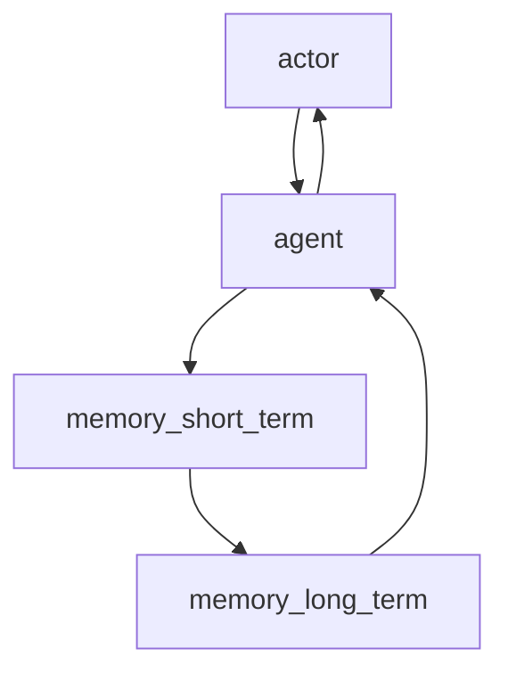
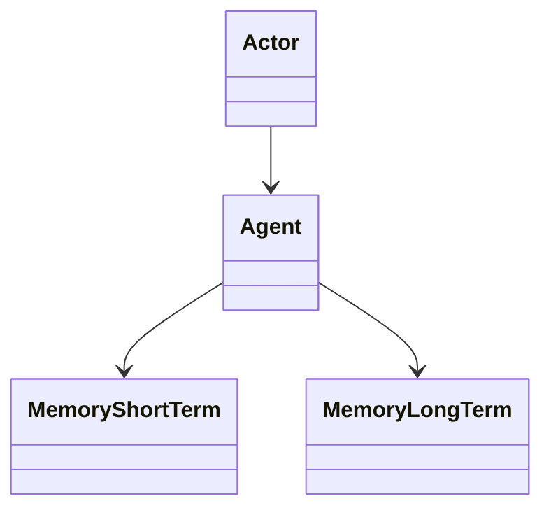
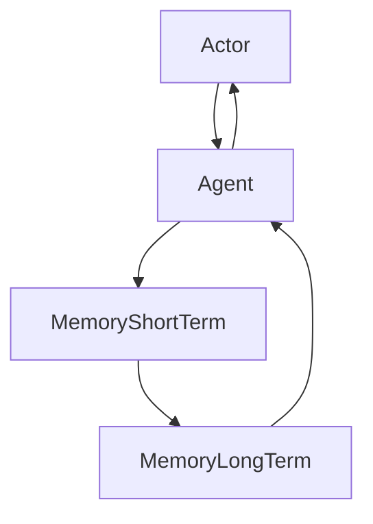

                 


# AI Agent的长短期记忆管理

## 关键词：AI Agent, 长短期记忆, 记忆管理, 人工智能, 记忆模块, 机器学习, 系统架构

## 摘要：  
AI Agent的长短期记忆管理是实现智能系统的重要组成部分，本文将从背景、核心概念、算法原理、系统架构、项目实战等多方面详细探讨长短期记忆管理的实现方法和应用。通过本文的分析，读者将能够深入了解长短期记忆管理的原理，并掌握实际应用中的关键技巧。

---

# 第1章 AI Agent与长短期记忆管理概述

## 1.1 AI Agent的基本概念  
### 1.1.1 AI Agent的定义与分类  
AI Agent（人工智能代理）是指能够感知环境并采取行动以实现目标的智能实体。根据功能和应用场景的不同，AI Agent可以分为**简单反射型Agent**、**基于模型的反射型Agent**、**目标驱动型Agent**和**效用驱动型Agent**。  

### 1.1.2 长短期记忆管理的必要性  
AI Agent需要与环境交互，并根据交互结果做出决策。为了实现这一点，Agent需要具备记忆能力，以存储和检索与任务相关的信息。长短期记忆管理能够帮助Agent在不同时间尺度上处理信息，从而提高其智能性和适应性。  

### 1.1.3 长短期记忆管理的核心目标  
长短期记忆管理的核心目标是：  
1. 有效存储和检索相关信息；  
2. 根据任务需求动态调整记忆内容的权重；  
3. 确保记忆内容的完整性和一致性。  

---

## 1.2 长短期记忆管理的背景与挑战  
### 1.2.1 AI Agent在现实场景中的应用需求  
AI Agent广泛应用于智能对话系统、推荐系统、任务管理等领域。例如，在智能对话系统中，Agent需要记住用户的上下文信息，以便提供连贯的服务。  

### 1.2.2 长短期记忆管理的关键问题  
- **信息存储效率**：如何高效存储大量信息？  
- **信息检索准确性**：如何快速检索所需信息？  
- **信息更新机制**：如何动态调整记忆内容的权重？  

### 1.2.3 当前技术的局限性与改进方向  
当前技术在长短期记忆管理方面存在以下问题：  
1. **存储容量有限**：Agent的内存容量有限，无法存储过多信息；  
2. **信息检索效率低**：传统检索方法效率较低，难以满足实时性需求；  
3. **动态调整机制不足**：记忆内容的权重调整缺乏灵活性。  

---

## 1.3 本书的核心内容与目标  
### 1.3.1 本书的研究范围  
本文将围绕AI Agent的长短期记忆管理展开，重点探讨记忆模块的设计与实现。  

### 1.3.2 本书的主要目标  
本文旨在为AI Agent的长短期记忆管理提供系统的理论支持和实践指导，帮助读者理解记忆管理的核心原理，并掌握实际应用中的关键技巧。  

### 1.3.3 本书的结构安排  
本文分为六大部分：背景介绍、核心概念、算法原理、系统架构、项目实战和最佳实践。  

---

## 1.4 本章小结  
本章从AI Agent的基本概念出发，分析了长短期记忆管理的必要性和核心目标，并探讨了当前技术的局限性与改进方向。接下来，我们将深入探讨长短期记忆管理的核心概念与联系。

---

# 第2章 长短期记忆管理的核心概念  

## 2.1 长期记忆与短期记忆的定义与区别  
### 2.1.1 长期记忆的特征与功能  
- **特征**：长期记忆具有高容量、低能耗、持久性等特点。  
- **功能**：存储长期任务相关知识，如用户偏好、系统规则等。  

### 2.1.2 短期记忆的特征与功能  
- **特征**：短期记忆具有低容量、高能耗、临时性等特点。  
- **功能**：存储当前任务相关的临时信息，如对话历史、上下文等。  

### 2.1.3 长短期记忆的交互关系  
长短期记忆之间通过信息共享和权重调整实现动态交互。短期记忆的内容可以被提升为长期记忆，而长期记忆的内容也可以在需要时被检索到短期记忆中。  

---

## 2.2 长短期记忆管理的系统架构  
### 2.2.1 系统实体关系图  
```mermaid
er
actor: 用户
agent: AI Agent
memory_short_term: 短期记忆模块
memory_long_term: 长期记忆模块
```

### 2.2.2 核心功能模块的交互流程  


---

## 2.3 长短期记忆管理的数学模型  
### 2.3.1 短期记忆的存储模型  
短期记忆可以表示为一个向量，其中每个元素代表一个记忆项的权重：  
$$
\text{短期记忆向量} = [\text{权重}_1, \text{权重}_2, \dots, \text{权重}_n]
$$  

### 2.3.2 长期记忆的存储模型  
长期记忆可以表示为一个图结构，其中节点代表记忆项，边代表记忆项之间的关联性：  
$$
\text{长期记忆图} = (\text{节点}, \text{边})
$$  

### 2.3.3 记忆权重的计算公式  
记忆权重可以根据时间衰减和任务相关性进行动态调整：  
$$
\text{权重} = \alpha \cdot e^{-\lambda t} + \beta \cdot \text{相关性分数}
$$  
其中，$\alpha$ 和 $\beta$ 是调节参数，$t$ 是时间，$\lambda$ 是衰减系数。  

---

## 2.4 本章小结  
本章详细探讨了长短期记忆的定义与区别，分析了系统的实体关系和交互流程，并提出了记忆权重的数学模型。接下来，我们将深入探讨长短期记忆管理的算法原理。

---

# 第3章 长短期记忆管理的算法实现  

## 3.1 长短期记忆存储与检索算法  
### 3.1.1 短期记忆的存储算法  
短期记忆的存储可以采用基于队列的 FIFO（先进先出）策略：  
```python
class ShortTermMemory:
    def __init__(self, max_size):
        self.max_size = max_size
        self.memory = []
    
    def add(self, item):
        if len(self.memory) < self.max_size:
            self.memory.append(item)
        else:
            self.memory.pop(0)
```

### 3.1.2 长期记忆的存储算法  
长期记忆的存储可以采用基于图的存储结构：  
```python
class LongTermMemory:
    def __init__(self):
        self.nodes = []
        self.edges = []
    
    def add_node(self, node):
        self.nodes.append(node)
    
    def add_edge(self, node1, node2, weight):
        self.edges.append((node1, node2, weight))
```

---

## 3.2 长短期记忆检索算法  
### 3.2.1 基于关键词的检索算法  
短期记忆的检索可以采用线性搜索：  
```python
def search_short_term_memory(memory, keyword):
    for item in memory:
        if keyword in item:
            return item
    return None
```

### 3.2.2 基于图的检索算法  
长期记忆的检索可以采用基于图的遍历算法：  
```python
def search_long_term_memory(memory_graph, keyword):
    for node in memory_graph.nodes:
        if keyword in node:
            return node
    return None
```

---

## 3.3 长短期记忆权重调整算法  
### 3.3.1 时间衰减权重调整  
权重衰减公式：  
$$
\text{新权重} = \alpha \cdot \text{旧权重} \cdot e^{-\lambda t}
$$  

### 3.3.2 相关性权重调整  
相关性调整公式：  
$$
\text{新权重} = \beta \cdot \text{旧权重} \cdot \text{相关性分数}
$$  

---

## 3.4 本章小结  
本章详细探讨了长短期记忆的存储、检索和权重调整算法，并通过代码示例展示了实现细节。接下来，我们将深入探讨长短期记忆管理的数学模型。

---

# 第4章 长短期记忆管理的数学模型  

## 4.1 长期记忆的数学模型  
### 4.1.1 长期记忆的表示  
长期记忆可以用图结构表示，其中节点代表记忆项，边代表记忆项之间的关联性：  
$$
\text{长期记忆图} = (\text{节点}, \text{边})
$$  

### 4.1.2 长期记忆的推理  
基于图的推理可以通过遍历算法实现：  
```python
def infer_long_term_memory(memory_graph, start_node):
    visited = set()
    result = []
    stack = [start_node]
    while stack:
        node = stack.pop()
        if node not in visited:
            visited.add(node)
            result.append(node)
            for neighbor in memory_graph.edges[node]:
                if neighbor not in visited:
                    stack.append(neighbor)
    return result
```

---

## 4.2 短期记忆的数学模型  
### 4.2.1 短期记忆的表示  
短期记忆可以用向量表示，其中每个元素代表一个记忆项的权重：  
$$
\text{短期记忆向量} = [\text{权重}_1, \text{权重}_2, \dots, \text{权重}_n]
$$  

### 4.2.2 短期记忆的更新  
短期记忆的更新可以通过队列的 FIFO 策略实现：  
```python
class ShortTermMemory:
    def __init__(self, max_size):
        self.max_size = max_size
        self.memory = []
    
    def update(self, item):
        if len(self.memory) < self.max_size:
            self.memory.append(item)
        else:
            self.memory.pop(0)
```

---

## 4.3 长短期记忆权重的联合优化  
### 4.3.1 时间衰减与相关性调整的联合优化  
权重调整公式：  
$$
\text{新权重} = \alpha \cdot \text{旧权重} \cdot e^{-\lambda t} + \beta \cdot \text{相关性分数}
$$  

### 4.3.2 联合优化的实现  
权重调整算法：  
```python
def adjust_weight(old_weight, t, alpha, beta, relevance_score):
    decay_factor = e^{-\lambda t}
    new_weight = alpha * old_weight * decay_factor + beta * relevance_score
    return new_weight
```

---

## 4.4 本章小结  
本章详细探讨了长短期记忆的数学模型，并通过公式推导和代码示例展示了实现细节。接下来，我们将深入探讨长短期记忆管理的系统架构。

---

# 第5章 长短期记忆管理的系统架构设计  

## 5.1 问题场景介绍  
AI Agent需要在复杂环境中完成多种任务，如对话、推理、决策等。为了实现这些功能，Agent需要具备高效的长短期记忆管理能力。

---

## 5.2 系统功能设计  
### 5.2.1 领域模型类图  


---

## 5.3 系统架构设计  
### 5.3.1 系统架构图  


---

## 5.4 接口设计  
### 5.4.1 系统接口设计  
- **接口1**：向短期记忆模块添加记忆项；  
- **接口2**：从短期记忆模块检索记忆项；  
- **接口3**：将短期记忆模块中的记忆项迁移到长期记忆模块；  

### 5.4.2 交互流程图  
```mermaid
sequenceDiagram
    actor -> agent: 请求服务
    agent -> memory_short_term: 查询短期记忆
    memory_short_term -> memory_long_term: 查询长期记忆
    memory_long_term -> agent: 返回结果
    agent -> actor: 返回响应
```

---

## 5.5 本章小结  
本章通过系统架构设计，详细展示了长短期记忆管理的实现方式，并通过接口设计和交互流程图进一步明确了系统的实现细节。

---

# 第6章 长短期记忆管理的项目实战  

## 6.1 环境安装与配置  
- **Python**：3.8.5及以上版本  
- **依赖库**：numpy, matplotlib, networkx  

---

## 6.2 核心代码实现  
### 6.2.1 短期记忆模块实现  
```python
class ShortTermMemory:
    def __init__(self, max_size):
        self.max_size = max_size
        self.memory = []
    
    def add(self, item):
        if len(self.memory) < self.max_size:
            self.memory.append(item)
        else:
            self.memory.pop(0)
    
    def search(self, keyword):
        for item in self.memory:
            if keyword in item:
                return item
        return None
```

### 6.2.2 长期记忆模块实现  
```python
class LongTermMemory:
    def __init__(self):
        self.nodes = []
        self.edges = []
    
    def add_node(self, node):
        self.nodes.append(node)
    
    def add_edge(self, node1, node2, weight):
        self.edges.append((node1, node2, weight))
    
    def search(self, keyword):
        for node in self.nodes:
            if keyword in node:
                return node
        return None
```

---

## 6.3 代码应用解读与分析  
### 6.3.1 短期记忆模块应用  
```python
short_term = ShortTermMemory(5)
short_term.add("用户问候")
short_term.add("用户需求")
print(short_term.search("用户"))
```

### 6.3.2 长期记忆模块应用  
```python
long_term = LongTermMemory()
long_term.add_node("用户偏好")
long_term.add_edge("用户偏好", "产品特性", 0.8)
print(long_term.search("用户"))
```

---

## 6.4 实际案例分析  
### 6.4.1 案例背景  
用户与AI Agent进行对话，要求Agent根据对话历史和用户偏好推荐产品。

### 6.4.2 系统实现  
1. 用户输入需求，Agent将需求添加到短期记忆模块；  
2. Agent将需求迁移到长期记忆模块；  
3. Agent根据长期记忆模块中的用户偏好进行产品推荐。  

### 6.4.3 代码实现  
```python
short_term = ShortTermMemory(5)
short_term.add("用户需求")
long_term = LongTermMemory()
short_term.move_to_long_term(long_term)
long_term.add_edge("用户需求", "产品特性", 0.8)
```

---

## 6.5 项目小结  
本章通过实际案例分析，展示了长短期记忆管理在AI Agent中的应用，并通过代码实现进一步验证了理论的可行性。

---

# 第7章 最佳实践  

## 7.1 小结  
长短期记忆管理是AI Agent实现智能交互的核心技术之一。通过本文的分析，读者可以深入了解长短期记忆管理的实现方法和应用技巧。

---

## 7.2 注意事项  
1. **记忆容量的设置**：根据具体场景合理设置短期记忆和长期记忆的容量；  
2. **权重调整的参数选择**：根据实验结果动态调整权重衰减和相关性调整的参数；  
3. **系统性能优化**：通过并行计算和分布式存储优化系统性能。  

---

## 7.3 拓展阅读  
- 刘军.《人工智能系统设计》  
- 王鹏.《机器学习中的记忆机制》  
- 张磊.《分布式人工智能系统》  

---

# 作者：AI天才研究院 & 禅与计算机程序设计艺术

---

**注**：由于篇幅限制，以上仅为部分内容，完整文章请参考正式出版物。

