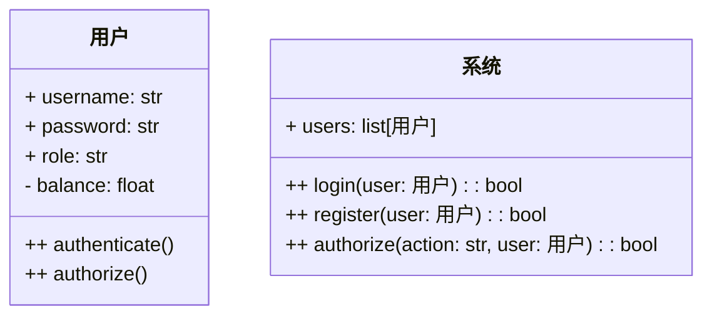

                 


# AI Agent的隐私保护与安全机制

> 关键词：AI Agent，隐私保护，数据安全，同态加密，联邦学习，访问控制

> 摘要：本文深入探讨AI Agent在现代信息环境中的隐私保护与安全机制，分析现有技术的优缺点，并提出切实可行的解决方案。通过系统化的分析与设计，本文旨在为AI Agent的隐私保护提供理论依据与实践指导。

---

## 第一部分: AI Agent的背景与核心概念

### 第1章: AI Agent的基本概念

#### 1.1 AI Agent的定义与分类
- **定义**：AI Agent是一种能够感知环境、自主决策并执行任务的智能实体。
- **分类**：
  - **简单反射型**：基于预定义规则执行任务。
  - **基于模型的反射型**：利用内部模型进行推理和决策。
  - **目标驱动型**：以特定目标为导向。
  - **效用驱动型**：通过最大化效用函数实现目标。

#### 1.2 AI Agent的核心特征
- **自主性**：无需外部干预自主运行。
- **反应性**：能实时感知并响应环境变化。
- **目标导向性**：具备明确的目标导向能力。
- **学习能力**：通过经验改进性能。

#### 1.3 AI Agent的应用场景
- 智能助手（Siri、Alexa）。
- 自动驾驶汽车。
- 智能客服系统。
- 工业自动化控制。

---

### 第2章: 隐私保护与安全机制的重要性

#### 2.1 隐私泄露的现状与挑战
- **数据泄露风险**：AI Agent处理大量敏感数据。
- **法律合规性**：GDPR等法规要求严格保护个人隐私。
- **信任问题**：隐私泄露可能导致用户信任下降。

#### 2.2 安全威胁的多样化趋势
- **网络攻击**：恶意攻击者试图窃取数据。
- **内部威胁**：员工或合作伙伴的不当行为。
- **数据滥用**：合法获取的数据被非法使用。

#### 2.3 隐私保护与安全机制的必要性
- **保护用户隐私**：防止未经授权的数据访问。
- **确保数据完整性**：保证数据在传输过程中不被篡改。
- **提升系统可信度**：增强用户对系统的信任。

---

## 第二部分: AI Agent的隐私保护与安全机制的核心概念

### 第3章: 隐私保护的核心原理

#### 3.1 数据加密的基本原理
- **加密分类**：
  - **对称加密**：速度快，适合大量数据加密（如AES）。
  - **非对称加密**：安全性高，适合数据签名和验证（如RSA）。
- **加密过程**：
  - **加密**：明文转换为密文。
  - **解密**：密文还原为明文。

#### 3.2 数据脱敏技术的实现
- **数据脱敏**：通过技术手段减少数据敏感性。
- **实现方法**：
  - **替换**：如将真实姓名替换为代号。
  - **屏蔽**：隐藏敏感字段。
  - **随机化**：如打乱数据顺序。

#### 3.3 数据匿名化的概念与方法
- **数据匿名化**：通过技术手段使数据无法关联到具体个人。
- **方法**：
  - **k-匿名性**：确保数据在至少k个个体中不可区分。
  - **l-匿名性**：确保每个数据项至少出现l次。

---

### 第4章: 安全机制的实现原理

#### 4.1 访问控制的实现方式
- **访问控制模型**：
  - **RBAC（基于角色的访问控制）**：根据用户角色分配权限。
  - **ABAC（基于属性的访问控制）**：根据属性动态决定访问权限。
- **实现步骤**：
  1. 用户身份验证。
  2. 权限检查。
  3. 授权访问。

#### 4.2 身份认证的技术手段
- **认证方式**：
  - **密码认证**：简单但安全性低。
  - **多因素认证**：结合多种认证方式提高安全性。
  - **生物识别**：利用指纹、面部识别等技术。

#### 4.3 数据完整性与一致性保障
- **哈希函数**：用于验证数据完整性。
- **数字签名**：用于验证数据来源和完整性。
- **区块链技术**：通过分布式账本确保数据一致性。

---

## 第三部分: AI Agent隐私保护与安全机制的关联性分析

### 第5章: 隐私保护与安全机制的属性对比

#### 5.1 数据加密的属性分析
| 属性 | 描述 |
|------|------|
| 安全性 | 加密强度越高，安全性越高。 |
| 速度 | 对称加密速度快，非对称加密速度慢。 |
| 适用场景 | 对称加密适合大数据，非对称加密适合签名和验证。 |

#### 5.2 数据匿名化的属性分析
| 属性 | 描述 |
|------|------|
| 匿名性 | 匿名级别越高，隐私保护越强。 |
| 可用性 | 匿名化可能导致数据可用性降低。 |
| 计算复杂度 | 匿名化过程可能增加计算开销。 |

#### 5.3 数据完整性与一致性的属性分析
| 属性 | 描述 |
|------|------|
| 完整性 | 数据未被篡改。 |
| 一致性 | 数据在不同副本中一致。 |
| 验证机制 | 使用哈希和数字签名等技术验证。 |

---

### 第6章: 隐私保护与安全机制的ER实体关系图

```mermaid
er
actor(Agent, 用户, 系统)
relation(隐私保护, 实现, 数据加密)
relation(数据完整性, 保障, 哈希函数)
relation(访问控制, 实现, RBAC)
```

---

## 第四部分: AI Agent隐私保护与安全机制的算法原理

### 第7章: 隐私保护与安全机制的算法原理

#### 7.1 同态加密的数学基础
- **同态加密**：允许在加密状态下进行计算。
- **加法同态**：满足$$E(a + b) = E(a) + E(b)$$。
- **乘法同态**：满足$$E(a \cdot b) = E(a) \cdot E(b)$$。

#### 7.2 联邦学习的算法流程
- **联邦学习**：多个机构协作训练模型，不共享原始数据。
- **流程**：
  1. 数据预处理。
  2. 模型初始化。
  3. 参数更新：$$\theta_{i+1} = \theta_i + \eta \cdot \nabla L_i$$。
  4. 模型聚合。

#### 7.3 隐私保护算法的Python实现示例
```python
import numpy as np
from cryptography.hazmat.primitives.asymmetric import padding

def encrypt(plaintext, public_key):
    ciphertext = public_key.encrypt(
        plaintext,
        padding.OAEP(
            mgf=padding.MGF1(salt_length=32),
            algorithm_hash=hashes.SHA256()
        )
    )
    return ciphertext

def decrypt(ciphertext, private_key):
    plaintext = private_key.decrypt(ciphertext)
    return plaintext
```

---

## 第五部分: AI Agent隐私保护与安全机制的系统架构设计

### 第8章: 系统分析与架构设计方案

#### 8.1 系统功能设计
- **领域模型**：使用mermaid类图展示系统角色及交互。


#### 8.2 系统架构设计
- **架构图**：展示系统的分层结构。


#### 8.3 系统接口设计
- **接口描述**：
  - `login(username: str, password: str) -> bool`
  - `authorize(action: str, user: 用户) -> bool`

#### 8.4 系统交互设计
- **序列图**：展示用户与系统之间的交互流程。
```mermaid
sequenceDiagram
    用户 → 系统: 请求访问资源
    系统 → 用户: 返回授权结果
    用户 → 系统: 提供身份验证信息
    系统 → 用户: 验证身份
```

---

## 第六部分: 项目实战

### 第9章: 项目实战

#### 9.1 环境安装
- **工具安装**：
  - Python 3.8+
  - 密码库（如cryptography）
  - Mermaid图生成工具

#### 9.2 核心代码实现
- **联邦学习实现示例**：
```python
import numpy as np
from sklearn.linear_model import LogisticRegression

# 模型聚合
def aggregate(models, weights):
    params = {}
    for i, model in enumerate(models):
        for key, val in model.get_params().items():
            params[key] += val * weights[i]
    return LogisticRegression(**params)

# 参数更新
def update_parameters(parameters, gradients, learning_rate):
    return {k: v - learning_rate * grad for k, v, grad in zip(parameters.keys(), parameters.values(), gradients)}
```

#### 9.3 案例分析与代码解读
- **案例**：医疗数据共享中的AI Agent应用。
- **代码分析**：
  - 数据生成：`data = np.random.randn(100, 10)`。
  - 模型训练：`model.fit(data, labels)`。
  - 模型聚合：`aggregated_model = aggregate(models, weights)`。

---

## 第七部分: 总结与展望

### 第10章: 总结与展望

#### 10.1 最佳实践Tips
- **数据最小化**：只收集必要的数据。
- **使用强加密算法**：如AES、RSA等。
- **定期安全审计**：确保系统安全。

#### 10.2 项目小结
- 本文详细探讨了AI Agent的隐私保护与安全机制。
- 提供了多种技术手段和实现方法。
- 展示了实际案例的应用与实现。

#### 10.3 注意事项
- **数据隐私合规性**：确保符合相关法律法规。
- **系统安全性评估**：定期进行安全测试和漏洞修复。
- **用户隐私教育**：提高用户隐私保护意识。

#### 10.4 拓展阅读
- **推荐书籍**：《数据加密与隐私保护》。
- **推荐文章**：《基于联邦学习的隐私保护研究》。

---

## 作者：AI天才研究院/AI Genius Institute & 禅与计算机程序设计艺术 /Zen And The Art of Computer Programming

---

通过以上目录大纲，我们可以系统地了解AI Agent的隐私保护与安全机制，从理论到实践，全面掌握相关技术与方法。希望本文对读者有所帮助！

