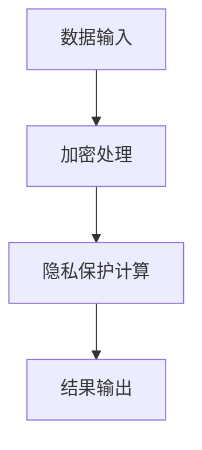
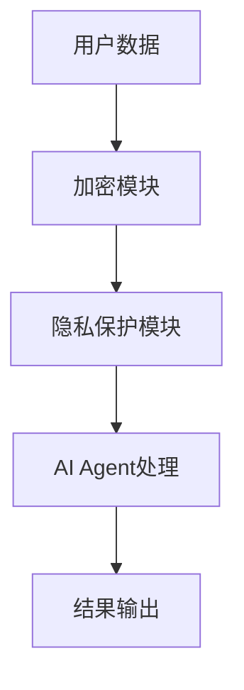
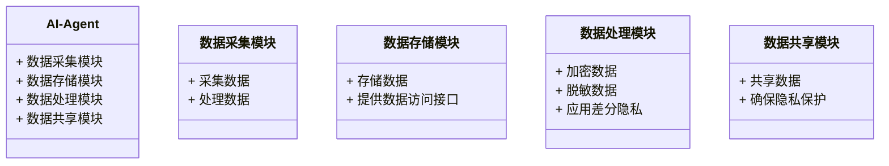

                 


# AI Agent的隐私保护措施：用户数据安全

> 关键词：AI Agent, 隐私保护, 数据安全, 加密算法, 差分隐私, 联邦学习, GDPR

> 摘要：随着人工智能技术的快速发展，AI Agent在各个领域的应用越来越广泛。然而，AI Agent的隐私保护问题也随之凸显，如何在AI Agent的设计和实现中确保用户数据的安全成为一个重要挑战。本文将从AI Agent的背景与概念出发，详细探讨隐私保护的核心技术与原理，系统架构与设计，法律与合规要求，以及实际项目中的隐私保护措施。通过理论分析与实际案例相结合，本文为读者提供一个全面的视角，帮助理解和实现AI Agent的隐私保护。

---

## 第一部分: AI Agent的隐私保护背景与概念

### 第1章: AI Agent与隐私保护概述

#### 1.1 AI Agent的基本概念

##### 1.1.1 AI Agent的定义与特点

AI Agent（人工智能代理）是一种能够感知环境、执行任务并做出决策的智能实体。它具备以下特点：

- **自主性**：能够在没有外部干预的情况下自主运作。
- **反应性**：能够感知环境并实时调整行为。
- **目标导向**：通过目标驱动来优化决策和行动。
- **学习能力**：能够通过数据学习和优化自身行为。

AI Agent广泛应用于自动驾驶、智能助手、推荐系统等领域。

##### 1.1.2 AI Agent的核心功能与应用场景

AI Agent的核心功能包括数据采集、处理、分析和决策。其应用场景包括：

- **自动驾驶**：实时感知环境并做出驾驶决策。
- **智能助手**：通过语音交互帮助用户完成任务。
- **推荐系统**：基于用户行为推荐个性化内容。
- **自动化系统**：在工业自动化中优化生产流程。

##### 1.1.3 AI Agent与用户隐私的关系

AI Agent在执行任务时需要收集和处理大量用户数据，这些数据可能包括用户的地理位置、行为习惯、偏好等。如何保护这些数据的隐私成为AI Agent设计中的重要挑战。

#### 1.2 隐私保护的重要性

##### 1.2.1 数据泄露的潜在风险

数据泄露可能导致严重的隐私问题，例如身份盗窃、欺诈等。AI Agent作为数据处理的核心，必须确保用户数据的安全。

##### 1.2.2 用户隐私权的法律保护

随着数据保护法规的不断完善，如欧盟的GDPR（通用数据保护条例）和美国的CCPA（加州消费者隐私法案），AI Agent的设计和运营必须符合这些法规要求，保护用户的隐私权。

##### 1.2.3 AI Agent对隐私保护的特殊要求

AI Agent通常需要处理敏感数据，并且可能在不同环境中运行。因此，AI Agent的隐私保护需要在设计阶段就进行考虑，确保数据在采集、存储、处理和共享过程中的安全性。

#### 1.3 本章小结

本章介绍了AI Agent的基本概念、核心功能及其应用场景，并强调了隐私保护的重要性。AI Agent的设计必须将隐私保护作为核心考量，以应对数据泄露的潜在风险，并符合相关法律法规。

---

## 第二部分: AI Agent隐私保护的核心技术与原理

### 第2章: 隐私保护的数学模型与算法原理

#### 2.1 隐私保护的数学模型

##### 2.1.1 数据加密的数学基础

数据加密是保护隐私的重要手段。常见的加密算法包括：

- **对称加密**：如AES，加密和解密使用相同的密钥。
- **非对称加密**：如RSA，加密和解密使用不同的公钥和私钥。

数据加密的数学模型可以表示为：

$$ \text{加密}：E(m, k) = c $$
$$ \text{解密}：D(c, k) = m $$

其中，\( m \) 是明文，\( c \) 是密文，\( k \) 是密钥。

##### 2.1.2 同态加密的原理与应用

同态加密是一种特殊的加密技术，允许在不 decrypt 的情况下对密文进行计算。其数学模型可以表示为：

$$ E(m) = c $$
$$ f(c) = E(f(m)) $$

同态加密在保护用户隐私的同时，支持数据的计算和分析，适用于云计算和联邦学习场景。

##### 2.1.3 差分隐私的数学模型

差分隐私是一种通过在数据中加入噪声来保护隐私的技术。其数学模型可以表示为：

$$ \text{发布机制}：P(y; f(x)) \geq \epsilon $$

其中，\( \epsilon \) 是隐私预算，控制噪声的大小。

#### 2.2 隐私保护的算法实现

##### 2.2.1 数据脱敏算法

数据脱敏是一种通过替换、屏蔽或删除敏感信息来保护隐私的技术。例如，将姓名中的某些字符替换为星号。

##### 2.2.2 基于加密的隐私保护算法

基于加密的隐私保护算法通过加密技术保护数据的隐私。例如，使用同态加密对数据进行加密后，在密文上进行计算，确保数据不被泄露。

##### 2.2.3 基于差分隐私的算法实现

基于差分隐私的算法通过在数据中加入噪声来保护隐私。例如，在发布统计结果时，对结果进行扰动处理。

#### 2.3 算法原理的Mermaid流程图



---

## 第三章: AI Agent的隐私保护技术实现

### 3.1 数据加密与解密过程

#### 3.1.1 加密算法的选择与实现

在AI Agent中，加密算法的选择需要考虑安全性、效率和应用场景。例如，在需要快速响应的任务中，选择对称加密算法更合适。

#### 3.1.2 解密过程的安全性保障

解密过程需要确保密钥的安全存储和传输，避免密钥泄露导致的隐私风险。

#### 3.1.3 加密过程中的性能优化

为了在加密过程中保持性能，可以采用硬件加速或优化加密算法的实现。

### 3.2 数据共享与隐私保护

#### 3.2.1 数据共享的隐私风险

数据共享可能导致数据泄露，尤其是在多方参与的场景中。

#### 3.2.2 基于联邦学习的隐私保护

联邦学习是一种在保护数据隐私的前提下，通过模型联合训练来提高模型性能的技术。其核心思想是将数据保留在本地，仅在模型参数上进行通信。

#### 3.2.3 多方安全计算的实现原理

多方安全计算是一种在多个参与方之间进行计算的技术，确保数据隐私的同时实现联合计算。

### 3.3 技术实现的Mermaid流程图



---

## 第四章: AI Agent隐私保护的系统架构与设计

### 4.1 系统功能模块划分

#### 4.1.1 数据采集模块

数据采集模块负责从用户或环境中采集数据，并进行初步处理。

#### 4.1.2 数据存储模块

数据存储模块负责存储加密后的数据，并提供数据访问接口。

#### 4.1.3 数据处理模块

数据处理模块负责对数据进行加密、脱敏或差分隐私处理。

#### 4.1.4 数据共享模块

数据共享模块负责在需要时，将处理后的数据进行共享，确保隐私保护。

### 4.2 系统架构的Mermaid类图



---

## 第五章: AI Agent隐私保护的法律与合规

### 5.1 隐私保护的法律框架

#### 5.1.1 GDPR

GDPR（通用数据保护条例）是欧盟的数据保护法规，要求企业采取措施保护用户数据的隐私。

#### 5.1.2 CCPA

CCPA（加州消费者隐私法案）是美国加州的隐私保护法规，要求企业向消费者公开数据收集和使用的情况。

### 5.2 AI Agent的合规要求

#### 5.2.1 数据最小化原则

数据最小化原则要求在数据收集和处理过程中，仅收集必要的数据。

#### 5.2.2 用户隐私权

用户有权访问、更正、删除其数据，并要求企业停止数据处理。

### 5.3 合规性检查清单

#### 5.3.1 数据处理记录

企业需要记录数据处理的详细情况，包括数据类型、处理方式和目的。

#### 5.3.2 数据保护措施

企业需要采取技术措施保护用户数据的隐私，如加密、脱敏等。

---

## 第六章: AI Agent隐私保护的项目实战

### 6.1 项目背景与目标

#### 6.1.1 项目背景

本项目旨在设计和实现一个具备隐私保护功能的AI Agent，确保用户数据的安全。

#### 6.1.2 项目目标

通过本项目，验证隐私保护技术在AI Agent中的应用，并确保符合相关法律法规。

### 6.2 项目环境与工具

#### 6.2.1 开发环境

使用Python编程语言，结合TensorFlow和PyTorch框架进行AI Agent的开发。

#### 6.2.2 工具选择

选择加密库（如Crypto）和差分隐私库（如PyDP）进行数据处理。

### 6.3 核心代码实现

#### 6.3.1 数据加密实现

```python
from cryptography.fernet import Fernet

# 生成密钥
key = Fernet.generate_key()
cipher = Fernet(key)

# 加密数据
encrypted_data = cipher.encrypt(b"用户敏感数据")
```

#### 6.3.2 差分隐私实现

```python
from pydp.abl import ABLMechanism

# 初始化差分隐私机制
mechanism = ABLMechanism(epsilon=1.0, sensitivity=1.0)

# 加入噪声
noisy_data = mechanism.add_noise(data)
```

### 6.4 项目测试与优化

#### 6.4.1 功能测试

测试AI Agent的隐私保护功能，确保数据加密和脱敏的正确性。

#### 6.4.2 性能优化

优化加密和解密过程，确保AI Agent的性能不受隐私保护措施的影响。

### 6.5 项目小结

通过本项目，我们成功实现了具备隐私保护功能的AI Agent，验证了隐私保护技术在实际应用中的可行性，并为后续研究提供了参考。

---

## 第七章: AI Agent隐私保护的未来展望

### 7.1 隐私保护技术的发展趋势

随着人工智能技术的不断进步，隐私保护技术也在不断发展。未来，可能会出现更先进的加密算法和隐私保护技术。

### 7.2 新兴技术对隐私保护的影响

新兴技术如联邦学习和多方安全计算为隐私保护提供了新的可能性，未来可能会有更多基于这些技术的应用。

### 7.3 隐私保护与数据利用的平衡

在保护用户隐私的同时，如何合理利用数据也是一个重要的挑战。未来，需要在隐私保护和数据利用之间找到更好的平衡点。

---

## 作者：AI天才研究院/AI Genius Institute & 禅与计算机程序设计艺术/Zen And The Art of Computer Programming

---

**这篇文章从AI Agent的背景与概念出发，详细探讨了隐私保护的核心技术与原理，系统架构与设计，法律与合规要求，以及实际项目中的隐私保护措施。通过理论分析与实际案例相结合，为读者提供了一个全面的视角，帮助理解和实现AI Agent的隐私保护。**

--- 

**如果你对AI Agent的隐私保护还有疑问或需要进一步探讨，欢迎留言讨论！**

