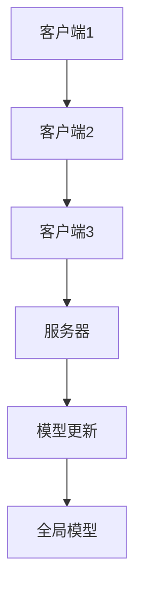
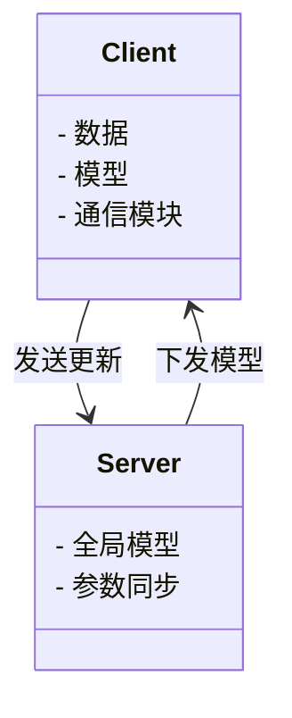
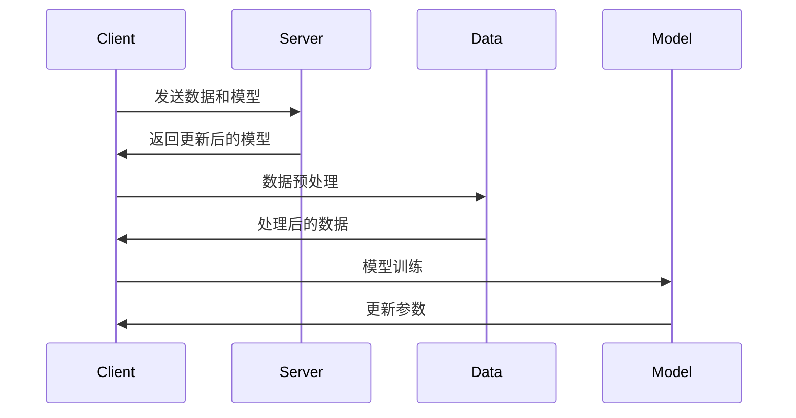

                 


# 第六章：联邦学习的算法实现

## 6.1 算法实现概述

### 6.1.1 联邦学习的分类
联邦学习主要分为三类：横向联邦学习、纵向联邦学习和联邦学习。每种类型适用于不同的数据分布场景。

### 6.1.2 算法实现的关键步骤
1. 数据预处理
2. 模型初始化
3. 联邦通信与参数同步
4. 模型训练与优化

## 6.2 横向联邦学习的算法实现

### 6.2.1 横向联邦学习的数学模型
$$\text{损失函数} = \sum_{i=1}^{n} \text{损失}(x_i, y_i, \theta)$$
其中，$\theta$ 是模型参数，$x_i$ 和 $y_i$ 是第i个样本的特征和标签。

### 6.2.2 横向联邦学习的实现代码
```python
import torch
from torch import nn

class FLModel(nn.Module):
    def __init__(self):
        super(FLModel, self).__init__()
        self.fc = nn.Linear(10, 1)  # 示例模型

    def forward(self, x):
        return self.fc(x)

# 初始化模型参数
model = FLModel()
optimizer = torch.optim.Adam(model.parameters(), lr=0.01)
```

## 6.3 纵向联邦学习的算法实现

### 6.3.1 纵向联邦学习的数学模型
$$\text{损失函数} = \sum_{j=1}^{m} \text{损失}(x_j, y_j, \theta)$$
其中，$j$ 表示不同的数据提供方。

### 6.3.2 纵向联邦学习的实现代码
```python
import torch
from torch import nn

class FLModel(nn.Module):
    def __init__(self):
        super(FLModel, self).__init__()
        self.fc1 = nn.Linear(5, 10)  # 第一方模型
        self.fc2 = nn.Linear(5, 10)  # 第二方模型
        self.fc3 = nn.Linear(20, 1)   # 组合后的模型

    def forward(self, x1, x2):
        out1 = self.fc1(x1)
        out2 = self.fc2(x2)
        combined = torch.cat([out1, out2], dim=1)
        return self.fc3(combined)

# 初始化模型参数
model = FLModel()
optimizer = torch.optim.Adam(model.parameters(), lr=0.01)
```

## 6.4 联邦学习的算法实现

### 6.4.1 联邦学习的数学模型
$$\text{损失函数} = \sum_{k=1}^{K} \text{损失}(x_k, y_k, \theta)$$
其中，$K$ 是参与方的数量。

### 6.4.2 联邦学习的实现代码
```python
import torch
from torch import nn
import numpy as np

class FLModel(nn.Module):
    def __init__(self):
        super(FLModel, self).__init__()
        self.fc = nn.Linear(10, 1)  # 示例模型

    def forward(self, x):
        return self.fc(x)

def fed_avg(models):
    # 联邦平均算法
    avg_model = FLModel()
    with torch.no_grad():
        for param in avg_model.parameters():
            param.data = torch.mean(torch.stack([model.state_dict()[param.name] for model in models], dim=0))
    return avg_model

# 初始化模型参数
model = FLModel()
optimizer = torch.optim.Adam(model.parameters(), lr=0.01)

# 联邦通信与参数同步
client_models = [model.copy() for model in ...]
avg_model = fed_avg(client_models)
# 同步到服务器端并更新全局模型
global_model.load_state_dict(avg_model.state_dict())
```

---

# 第七章：AI Agent的系统设计与架构

## 7.1 系统设计概述

### 7.1.1 系统模块划分
1. 数据预处理模块
2. 模型训练模块
3. 联邦通信模块
4. 隐私保护模块

### 7.1.2 系统功能设计
- 数据预处理：数据清洗、特征提取
- 模型训练：横向、纵向联邦学习
- 联邦通信：参数同步、模型更新
- 隐私保护：数据加密、访问控制

## 7.2 系统架构设计

### 7.2.1 整体架构


### 7.2.2 系统架构图


## 7.3 系统接口设计

### 7.3.1 接口描述
1. 数据接口：数据读取、数据预处理
2. 模型接口：模型初始化、模型训练
3. 通信接口：参数同步、模型更新
4. 隐私接口：数据加密、访问控制

### 7.3.2 接口实现
- 数据接口：使用Python的Pandas库进行数据处理
- 模型接口：使用PyTorch进行模型定义和训练
- 通信接口：使用HTTP或WebSocket进行数据传输
- 隐私接口：使用加密库进行数据加密

## 7.4 系统交互流程图



---

# 第八章：AI Agent的项目实战

## 8.1 项目环境安装

### 8.1.1 安装依赖
```bash
pip install torch pandas numpy matplotlib requests
```

### 8.1.2 环境配置
```bash
conda create -n fedlearn python=3.8 torch=1.9.0 pandas=1.3.0
conda activate fedlearn
```

## 8.2 系统核心实现

### 8.2.1 数据预处理代码
```python
import pandas as pd
import numpy as np

def preprocess_data(data_path):
    data = pd.read_csv(data_path)
    # 数据清洗
    data = data.dropna()
    # 特征提取
    features = data.iloc[:, :-1]
    labels = data.iloc[:, -1]
    return features, labels
```

### 8.2.2 模型训练代码
```python
import torch
from torch import nn

class SimpleModel(nn.Module):
    def __init__(self, input_dim):
        super(SimpleModel, self).__init__()
        self.fc = nn.Linear(input_dim, 1)

    def forward(self, x):
        return self.fc(x)

def train_model(model, optimizer, criterion, features, labels):
    for epoch in range(10):
        outputs = model(features)
        loss = criterion(outputs, labels)
        loss.backward()
        optimizer.step()
        optimizer.zero_grad()
```

### 8.2.3 联邦通信代码
```python
import requests

def send_model_update(server_url, model_weights):
    response = requests.post(server_url, json=model_weights)
    return response.status_code
```

## 8.3 案例分析与实现

### 8.3.1 数据集选择
使用MNIST数据集进行图像分类任务。

### 8.3.2 案例实现
```python
import torch
from torch.utils.data import DataLoader

# 加载数据
data = pd.read_csv('mnist.csv')
features, labels = preprocess_data('mnist.csv')

# 初始化模型
model = SimpleModel(features.shape[1])
optimizer = torch.optim.Adam(model.parameters(), lr=0.01)
criterion = nn.CrossEntropyLoss()

# 训练模型
train_model(model, optimizer, criterion, features, labels)

# 发送模型更新
send_model_update('http://localhost:8000/update', model.state_dict())
```

---

# 第九章：联邦学习的技术细节与挑战

## 9.1 算法优化

### 9.1.1 联邦学习的优化方法
1. 异步更新
2. 局部训练轮数调整
3. 动态联邦系数

### 9.1.2 优化代码实现
```python
def fed_avg(models, global_model):
    for param, client_param in zip(global_model.parameters(), models.parameters()):
        param.data = client_param.data * weight + param.data * (1 - weight)
```

## 9.2 安全性与鲁棒性

### 9.2.1 数据安全保护
- 使用同态加密
- 差分隐私

### 9.2.2 模型鲁棒性
- 对抗训练
- 鲁棒优化

## 9.3 计算资源分配

### 9.3.1 资源分配策略
1. 基于计算能力的分配
2. 基于数据量的分配
3. 基于模型复杂度的分配

### 9.3.2 资源分配代码
```python
def allocate_resources(clients, resources):
    # 示例分配策略
    for client in clients:
        if client.resources > resources:
            client.resources = resources
```

## 9.4 数据异构性处理

### 9.4.1 数据异构性问题
1. 数据分布不均
2. 数据格式差异
3. 数据量差异

### 9.4.2 解决方案
- 数据预处理标准化
- 模型适配不同数据格式
- 使用异构数据增强方法

---

# 第十章：总结与展望

## 10.1 总结

### 10.1.1 核心内容回顾
1. AI Agent在联邦学习中的作用
2. 隐私保护机制
3. 算法实现与系统设计
4. 项目实战与技术细节

### 10.1.2 成果与意义
通过AI Agent实现数据不出本地的协作训练，保护数据隐私，提升模型性能。

## 10.2 展望

### 10.2.1 未来研究方向
1. 更高效的联邦学习算法
2. 更强的隐私保护技术
3. 更广泛的应用场景

### 10.2.2 技术发展趋势
随着AI技术的发展，联邦学习将在更多领域得到应用，隐私保护技术将更加多样化。

---

# 作者：AI天才研究院 & 禅与计算机程序设计艺术

通过本文，我们详细探讨了AI Agent的隐私保护联邦学习，从理论到实践，全面分析了其核心概念、算法实现、系统设计、项目实战以及技术挑战。希望本文能为读者提供有价值的见解和指导。

---

**关键词：AI Agent, 隐私保护, 联邦学习, 数据协作, 分布式训练**

**摘要：**  
本文深入探讨了AI Agent在隐私保护联邦学习中的应用，通过数据不出本地的协作训练方式，实现了模型优化与数据隐私的双重目标。文章从理论基础到实际应用，系统地分析了联邦学习的核心概念、算法原理、系统架构，并通过项目实战展示了具体实现。同时，本文还探讨了当前技术面临的挑战与未来发展方向，为读者提供了全面的视角和深入的见解。

