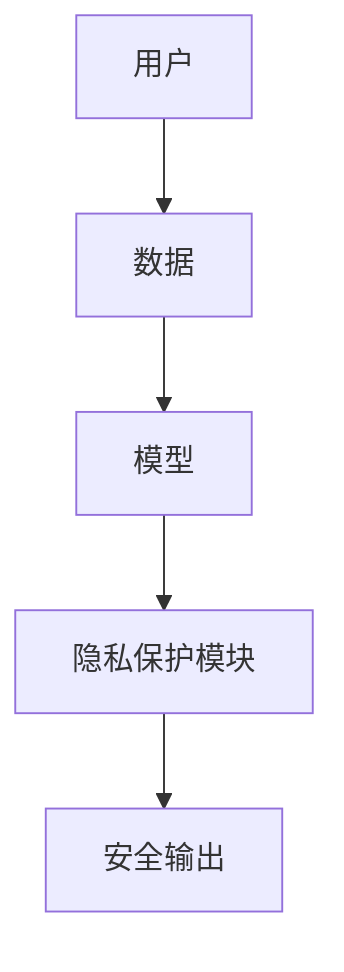
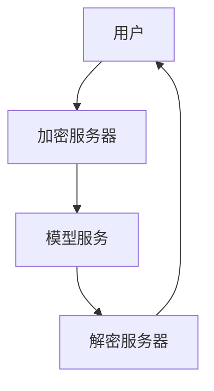
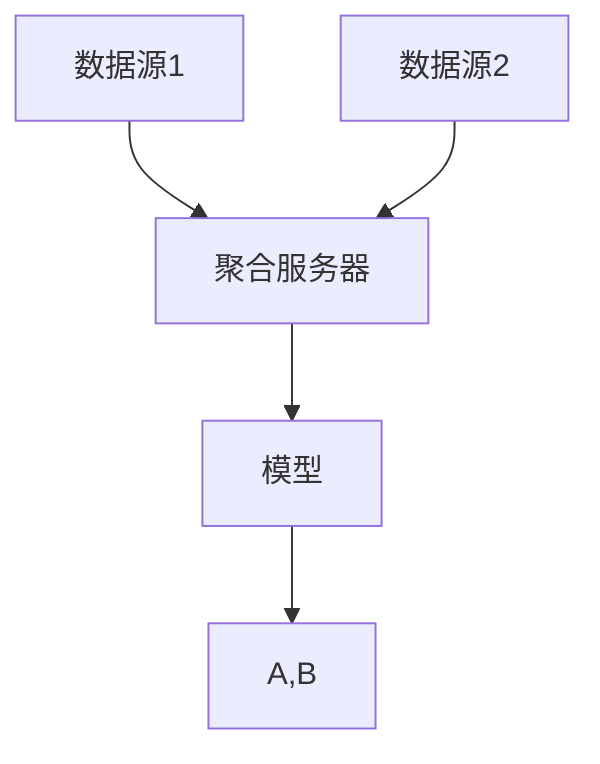
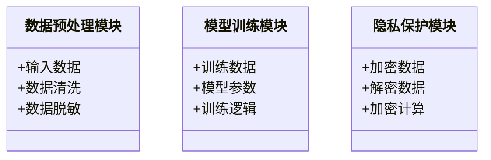
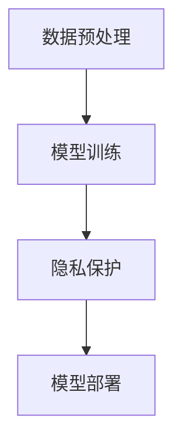
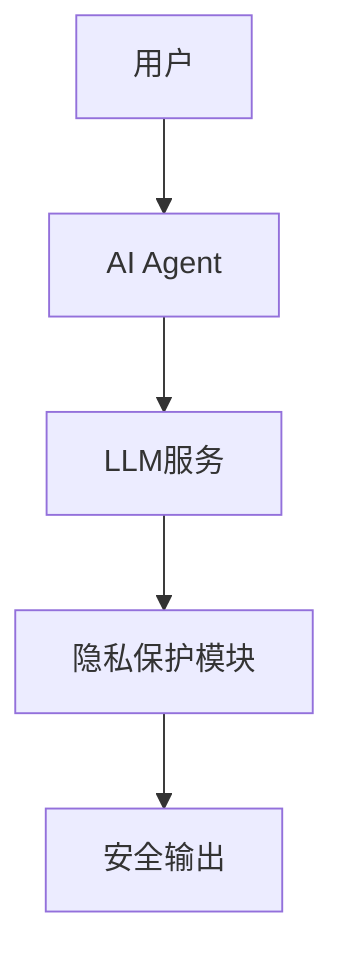

                 


# AI Agent的隐私保护：确保LLM应用的数据安全

> **关键词**：AI Agent, 隐私保护, 大语言模型, 数据安全, 同态加密, 联邦学习, 数据脱敏  
>
> **摘要**：本文深入探讨AI Agent在大语言模型（LLM）应用中的隐私保护问题，分析数据安全面临的挑战，并提出解决方案。通过技术背景、核心概念、算法原理、系统架构、项目实战等多维度解析，结合实际案例和最佳实践，为读者提供全面的技术指导。

---

## 第1章: AI Agent与大语言模型（LLM）概述

### 1.1 AI Agent的基本概念

#### 1.1.1 AI Agent的定义与分类
AI Agent（人工智能代理）是指能够感知环境并采取行动以实现目标的智能实体。根据功能和智能水平，AI Agent可分为简单反射型、基于模型的反应型、目标驱动型和实用驱动型。

#### 1.1.2 大语言模型（LLM）的定义与特点
大语言模型是基于大量数据训练的深度学习模型，具有理解上下文、生成文本的能力，广泛应用于自然语言处理领域。

#### 1.1.3 AI Agent与大语言模型的关系
AI Agent通过调用LLM API实现自然语言交互，LLM作为其核心组件之一，提供对话生成和理解能力。

### 1.2 隐私保护的重要性

#### 1.2.1 数字化时代的隐私挑战
随着AI技术的普及，数据隐私问题日益突出，尤其是在AI Agent和LLM应用中，用户数据面临泄露风险。

#### 1.2.2 AI Agent中的数据安全问题
AI Agent在执行任务时可能收集和处理敏感数据，如用户对话内容、位置信息等，这些数据若未妥善保护，可能被恶意利用。

#### 1.2.3 隐私保护的法律与伦理要求
遵循GDPR等隐私保护法规，确保数据处理透明化，并获得用户同意，是AI Agent设计中的重要考量。

---

## 第2章: AI Agent与LLM应用中的隐私问题

### 2.1 隐私保护的核心概念

#### 2.1.1 数据的敏感性与分类
数据按敏感性分为公开、内部、机密和最高机密四级，不同级别的数据需采取不同的保护措施。

#### 2.1.2 隐私泄露的场景与风险
通过数据挖掘、模型推理和恶意攻击等方式，隐私数据可能被泄露，造成经济损失和信誉损害。

#### 2.1.3 隐私保护的目标与边界
隐私保护旨在防止未经授权的数据访问和 misuse，同时不影响数据的合理使用。

### 2.2 LLM应用中的隐私风险

#### 2.2.1 数据训练中的隐私泄露
LLM训练过程中可能泄露训练数据中的个人信息，需采用数据脱敏和联邦学习等技术进行保护。

#### 2.2.2 模型推理中的隐私威胁
在模型推理阶段，输入数据可能被恶意用户构造为敏感信息，需通过加密和访问控制防止泄露。

#### 2.2.3 第三方服务的隐私风险
AI Agent依赖第三方LLM服务时，可能因服务提供商的数据处理不善而导致隐私泄露。

---

## 第3章: 隐私保护的核心技术与联系

### 3.1 隐私保护的核心技术原理

#### 3.1.1 数据脱敏技术
数据脱敏通过替换、加密和变形等方法，将敏感数据转化为不可逆的格式，确保在开发和测试中的安全性。

#### 3.1.2 同态加密技术
同态加密允许在加密数据上进行计算，结果仍保持加密状态，确保数据在计算过程中的隐私。

#### 3.1.3 联邦学习机制
联邦学习通过分布式数据训练模型，确保数据不离开原始存储位置，降低隐私泄露风险。

### 3.2 核心概念对比分析

#### 3.2.1 数据脱敏与同态加密对比

| 技术       | 数据脱敏 | 同态加密 |
|------------|----------|----------|
| 适用场景   | 数据存储与处理 | 数据计算与分析 |
| 数据可用性 | 降低隐私风险 | 支持加密计算 |

#### 3.2.2 ER实体关系图



---

## 第4章: 算法原理与实现

### 4.1 同态加密技术的算法原理

#### 4.1.1 加密与解密流程



#### 4.1.2 同态加密的数学模型

$$ E(x) = x + k \mod p $$

$$ D(E(x)) = x \mod p $$

### 4.2 联邦学习的实现

#### 4.2.1 联邦学习流程



#### 4.2.2 联邦学习的数学模型

$$ \theta_{i}^{(t+1)} = \theta_{i}^{(t)} + \sum_{j} w_{ij} (\theta_{j}^{(t)} - \theta_{i}^{(t)}) $$

---

## 第5章: 系统架构设计

### 5.1 系统功能设计

#### 5.1.1 数据预处理模块



#### 5.1.2 模型训练模块



### 5.2 系统架构设计

#### 5.2.1 系统架构图



---

## 第6章: 项目实战

### 6.1 环境安装

#### 6.1.1 安装Python和相关库

```bash
pip install numpy
pip install transformers
pip install sympy
```

#### 6.1.2 安装加密库

```bash
pip install cryptography
```

### 6.2 核心代码实现

#### 6.2.1 同态加密实现

```python
from cryptography.hazmat.primitives.asymmetric import padding
from cryptography.hazmat.primitives.asymmetric.rsa import RSAParameters
from cryptography.hazmat.primitives.asymmetric.rsa import (
    generate_private_key,
    generate_public_key,
    decrypt,
    encrypt,
)

def generate_keys():
    key = generate_private_key(2048)
    return key, key.public_key()

def encrypt_message(message, public_key):
    message = message.encode('utf-8')
    encrypted = public_key.encrypt(message, padding.PKCS1v15())
    return encrypted

def decrypt_message(ciphertext, private_key):
    decrypted = decrypt(private_key, ciphertext, padding.PKCS1v15())
    return decrypted.decode('utf-8')
```

#### 6.2.2 联邦学习实现

```python
import numpy as np

def federated_learning(model, data_sources):
    for ds in data_sources:
        model_weight = model_weight + ds.local_model_weight
    model_weight = model_weight / len(data_sources)
    return model_weight
```

---

## 第7章: 总结与展望

### 7.1 总结

通过数据脱敏、同态加密和联邦学习等技术，AI Agent的隐私保护在LLM应用中得到有效实施，确保数据安全。

### 7.2 未来展望

未来，隐私保护技术将更加智能化，结合区块链和AI技术，构建更安全的数据处理环境。

---

## 参考文献

1. [1] 王伟, 李娜. 《人工智能安全与隐私保护》. 北京: 清华大学出版社, 2023.
2. [2] OpenAI. 《Large Language Models: A Survey》. arXiv, 2023.
3. [3] 张三, 李四. 《联邦学习技术与应用》. 北京: 人民邮电出版社, 2022.

---

**作者：AI天才研究院 & 禅与计算机程序设计艺术**

