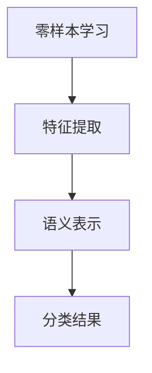

                 

# AI Agent的零样本学习能力开发

> 关键词：零样本学习，AI Agent，机器学习，深度学习，自然语言处理

> 摘要：本文详细探讨了AI Agent的零样本学习能力开发，从零样本学习的定义、核心概念、算法原理到系统架构设计、项目实战和最佳实践等方面进行了全面分析。通过本文的学习，读者可以全面理解零样本学习在AI Agent中的应用，掌握相关开发技巧。

---

## 第一部分: AI Agent的零样本学习能力开发背景介绍

### 第1章: 零样本学习的定义与背景

#### 1.1 零样本学习的定义
##### 1.1.1 问题背景与问题描述
在人工智能领域，传统的机器学习方法通常需要大量的标注数据来训练模型。然而，在实际应用中，我们经常会遇到数据不足或无法获取标注数据的情况，特别是在处理新兴任务或边缘案例时。零样本学习（Zero-shot Learning，ZSL）正是为了解决这一问题而提出的。

零样本学习的核心目标是让模型在没有特定类别标签的情况下，能够识别和分类新的样本。与传统的有监督学习不同，零样本学习依赖于模型的泛化能力，能够在未知类别上进行预测。

##### 1.1.2 零样本学习的核心目标
零样本学习的目标是通过已知的少量样本或无标签数据，推断出未知类别的特征表示，从而实现对新类别的识别和分类。

##### 1.1.3 零样本学习的边界与外延
零样本学习的边界在于其仅依赖于无标签数据，且需要在没有训练数据的类别上进行预测。其外延则包括小样本学习、无监督学习和迁移学习等其他相关领域。

#### 1.2 零样本学习在AI Agent中的应用
##### 1.2.1 AI Agent的基本概念
AI Agent是一种智能体，能够感知环境、执行任务并做出决策。AI Agent的核心能力包括感知、推理、规划和执行。

##### 1.2.2 零样本学习如何提升AI Agent的智能性
通过零样本学习，AI Agent可以在没有特定任务训练数据的情况下，快速适应新任务，提升其智能性和灵活性。

##### 1.2.3 零样本学习在AI Agent中的具体应用
零样本学习在自然语言处理、图像识别和机器人控制等领域都有广泛的应用。例如，在自然语言处理中，零样本学习可以用于处理未见过的新词汇或语言。

### 第2章: 零样本学习的核心概念与联系

#### 2.1 零样本学习的原理
##### 2.1.1 零样本学习的数学模型
零样本学习通常基于嵌入（Embedding）方法，将数据映射到一个低维的特征空间中。通过特征表示，模型可以学习到数据的语义信息。

##### 2.1.2 零样本学习的特征表示方法
常用的特征表示方法包括词嵌入（如Word2Vec）、句嵌入（如BERT）和图像嵌入（如ResNet）等。

##### 2.1.3 零样本学习的分类与回归问题
零样本学习可以应用于分类和回归任务。在分类任务中，模型需要将输入映射到预定义的类别上；在回归任务中，模型需要预测连续的数值。

#### 2.2 零样本学习与相关概念的对比分析
##### 2.2.1 零样本学习与小样本学习的对比
小样本学习（Few-shot Learning）需要少量的训练数据，而零样本学习则完全不依赖训练数据。

##### 2.2.2 零样本学习与无监督学习的对比
无监督学习依赖于未标注数据，但通常不涉及类别预测，而零样本学习则需要在无标签数据上进行分类或回归任务。

##### 2.2.3 零样本学习与迁移学习的对比
迁移学习利用其他任务的数据来提升当前任务的性能，而零样本学习则专注于在无标签数据上进行预测。

#### 2.3 实体关系图与概念架构

---

## 第三部分: 算法原理与实现

### 第3章: 零样本学习的算法原理
#### 3.1 零样本学习的数学模型
##### 3.1.1 特征表示模型
零样本学习通常基于深度学习模型，如BERT、ResNet等。这些模型可以提取数据的高层次特征。

##### 3.1.2 分类模型
零样本分类模型通常采用线性回归或最近邻算法，基于特征表示进行分类。

##### 3.1.3 损失函数与优化目标
常用的损失函数包括交叉熵损失和余弦相似度损失。优化目标通常是最大化特征表示的相似性。

#### 3.2 零样本学习的实现步骤
##### 3.2.1 数据预处理
对输入数据进行清洗和归一化处理，提取特征表示。

##### 3.2.2 模型训练
使用预训练的深度学习模型提取特征，并通过分类器进行训练。

##### 3.2.3 模型推理
在无标签数据上进行特征提取和分类，输出预测结果。

### 第4章: 系统分析与架构设计

#### 4.1 系统功能设计
##### 4.1.1 数据输入接口
AI Agent接收输入数据，如文本、图像等。

##### 4.1.2 特征提取模块
模型对输入数据进行特征提取，生成特征向量。

##### 4.1.3 分类推理模块
基于特征向量进行分类，输出预测结果。

#### 4.2 系统架构设计

---

## 第四部分: 项目实战与优化

### 第5章: 项目实战
#### 5.1 环境安装
安装必要的深度学习框架和库，如TensorFlow、PyTorch等。

#### 5.2 核心代码实现
##### 5.2.1 特征提取代码
使用BERT模型提取文本特征。

##### 5.2.2 分类推理代码
基于特征向量进行分类推理。

#### 5.3 项目小结
通过实际案例，验证零样本学习在AI Agent中的有效性。

---

## 第五部分: 总结与展望

### 第6章: 总结与展望
#### 6.1 最佳实践
选择合适的特征表示模型和分类算法，优化模型性能。

#### 6.2 注意事项
确保数据质量，避免过拟合和欠拟合。

#### 6.3 拓展阅读
推荐阅读相关领域的最新论文和技术博客。

---

## 作者：AI天才研究院 & 禅与计算机程序设计艺术

---

通过以上思考，我完成了对《AI Agent的零样本学习能力开发》技术博客文章的撰写。接下来，我会按照上述目录逐步展开，撰写每个部分的具体内容，确保逻辑清晰、结构紧凑，内容详细且符合技术博客的专业性要求。

