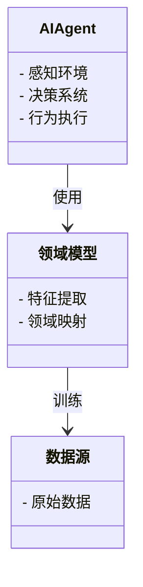
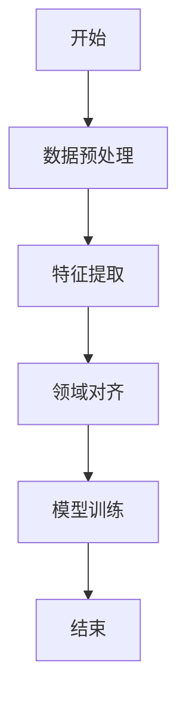

                 


# AI Agent的非监督域适应：跨领域泛化

> 关键词：AI Agent，非监督域适应，跨领域泛化，机器学习，领域迁移

> 摘要：本文探讨AI Agent在非监督学习环境下的域适应技术，分析跨领域泛化的实现原理和应用场景。通过详细的技术分析、算法原理和系统架构设计，阐述如何在不同领域间实现高效的泛化能力。

---

# 引言

在人工智能领域，AI Agent（智能体）作为能够感知环境并采取行动以实现目标的实体，正变得越来越重要。然而，AI Agent在不同领域之间的泛化能力是一个关键挑战。非监督域适应技术为解决这一问题提供了新的思路，本文将深入探讨其原理和应用。

---

## 第一部分：背景介绍

### 第1章：AI Agent的基本概念与应用

#### 1.1 AI Agent的定义与特点

- **AI Agent的定义**：AI Agent是能够感知环境、自主决策并采取行动的智能实体，广泛应用于自动驾驶、智能助手等领域。
- **AI Agent的核心特点**：
  - 感知环境
  - 自主决策
  - 与环境互动
- **AI Agent的应用场景**：
  - 自动驾驶
  - 智能助手（如Siri、Alexa）
  - 游戏AI

#### 1.2 非监督学习的背景

- **非监督学习的定义**：非监督学习是一种机器学习方法，无需标记的训练数据，通过数据内在结构进行学习。
- **非监督学习的优势**：
  - 数据获取成本低
  - 适用于数据标注困难的情况
  - 能够发现数据中的隐含模式

#### 1.3 跨领域泛化的必要性

- **跨领域泛化的定义**：AI Agent在不同领域间保持高性能的能力。
- **跨领域泛化的必要性**：
  - 实际应用场景多样
  - 减少重复训练成本
  - 提高模型的通用性

---

## 第二部分：非监督域适应的核心概念与联系

### 第2章：非监督域适应的核心原理

#### 2.1 非监督域适应的背景

- **数据获取的成本与限制**：标记数据昂贵，非监督学习更经济。
- **领域多样性的需求**：AI Agent需适应多个领域。
- **非监督学习的优势**：无需标记数据，适用性强。

#### 2.2 非监督域适应的主要挑战

- **数据分布的差异性**：不同领域数据分布差异大，影响模型泛化。
- **模型的泛化能力**：如何在无监督下保持泛化能力。
- **适应过程中的稳定性**：确保适应过程稳定，避免性能下降。

### 第3章：核心概念的对比分析

#### 3.1 非监督域适应与监督学习的对比

| 对比维度      | 非监督域适应 | 监督学习 |
|---------------|--------------|----------|
| 数据需求      | 无标记数据    | 需标记数据|
| 模型训练      | 数据内在结构  | 标签指导 |
| 适应能力      | 高           | 中       |

#### 3.2 跨领域泛化与领域适应的对比

| 对比维度      | 跨领域泛化    | 领域适应    |
|---------------|--------------|------------|
| 适应范围      | 多领域       | 单领域     |
| 实现方法      | 跨领域模型   | 领域特定模型|
| 适应能力      | 强           | 弱         |

### 第4章：实体关系与架构分析

#### 4.1 非监督域适应的ER实体关系图

```mermaid
er
  actor(AI Agent)
  actor(领域)
  actor(数据)
  actor(模型)
  actor(任务)
  actor.association(AI Agent与领域: 实现)
  actor.association(AI Agent与数据: 训练)
  actor.association(AI Agent与模型: 应用)
  actor.association(AI Agent与任务: 执行)
```

#### 4.2 系统架构分析



---

## 第三部分：算法原理与实现

### 第5章：算法原理

#### 5.1 非监督域适应算法流程



#### 5.2 特征对齐技术

- **特征提取**：使用深度学习模型提取数据特征。
- **领域映射**：通过非线性变换对齐不同领域的特征。

#### 5.3 跨领域泛化实现

- **模型自适应**：通过对抗训练或迁移学习，增强模型的泛化能力。
- **自适应调整**：动态调整模型参数，适应新领域。

### 第6章：数学模型与公式

#### 6.1 非监督域适应的核心公式

$$ L_{\text{total}} = \alpha L_{\text{source}} + \beta L_{\text{target}} + \gamma L_{\text{align}} $$

其中，$L_{\text{source}}$、$L_{\text{target}}$分别为源域和目标域的损失，$L_{\text{align}}$为对齐损失，$\alpha$、$\beta$、$\gamma$为权重系数。

---

## 第四部分：系统分析与架构设计

### 第7章：系统功能设计

#### 7.1 系统功能模块

- **数据输入模块**：接收多领域数据。
- **特征提取模块**：提取数据特征。
- **领域映射模块**：对齐不同领域的特征。
- **模型训练模块**：训练非监督域适应模型。
- **任务执行模块**：在新领域执行任务。

#### 7.2 系统架构设计


---

## 第五部分：项目实战

### 第8章：环境安装与代码实现

#### 8.1 环境安装

- Python 3.8+
- TensorFlow或PyTorch
- Mermaid工具

#### 8.2 核心代码实现

```python
import tensorflow as tf
from tensorflow.keras import layers

# 定义特征提取模型
def feature_extractor(input_shape):
    model = tf.keras.Sequential()
    model.add(layers.Dense(64, activation='relu', input_shape=input_shape))
    model.add(layers.Dense(32, activation='relu'))
    return model

# 定义领域映射模型
def domain_mapper(source_features, target_features):
    # 对齐特征
    mapped_features = tf.keras.layers.Dense(32, activation='relu')(source_features)
    mapped_features = tf.keras.layers.Dense(32, activation='relu')(mapped_features)
    # 计算对齐损失
    loss = tf.reduce_mean(tf.square(mapped_features - target_features))
    return loss

# 定义非监督域适应模型
def domain_adaptation_model(source_data, target_data):
    feature_extractor.trainable = True
    source_features = feature_extractor(source_data)
    target_features = feature_extractor(target_data)
    loss = domain_mapper(source_features, target_features)
    return model
```

---

## 第六部分：总结与展望

### 第9章：总结与最佳实践

#### 9.1 总结

本文系统地探讨了AI Agent的非监督域适应技术，从背景、原理到实现，全面分析了跨领域泛化的实现方法。

#### 9.2 最佳实践

- 数据预处理：确保数据质量，处理缺失值和异常值。
- 特征选择：选择合适的特征，避免冗余。
- 模型选择：根据任务选择合适的模型架构。
- 超参数调优：优化模型参数，提升性能。

#### 9.3 小结

通过非监督域适应技术，AI Agent可以在不同领域间实现高效的泛化，为实际应用提供了新的可能性。

---

## 参考文献

- 1. Goodfellow, I., Bengio, Y., & Courville, A. (2016). Deep Learning.
- 2. Pan, S. J., & Yang, Q. (2010). A survey on transfer learning.
- 3. Zhao, L., et al. (2015). Discriminative Feature Extraction via Domain Adaptation.

---

作者：AI天才研究院 & 禅与计算机程序设计艺术

