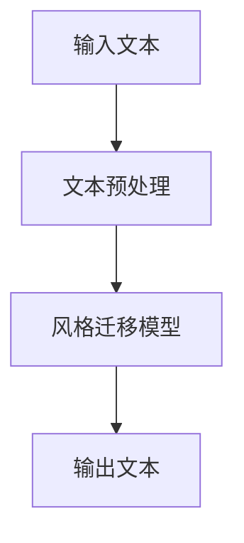

                 


# AI Agent的风格迁移：让LLM适应不同的表达方式

## 关键词：
AI Agent, 风格迁移, 大语言模型, 表达方式, 文本生成

## 摘要：
本文探讨了如何通过风格迁移技术让大语言模型（LLM）适应不同的表达方式，从而提升AI Agent在多样化场景下的表现。文章从背景介绍、核心概念、算法原理、系统设计、项目实战到最佳实践，全面解析了风格迁移在AI Agent中的应用，提供了详细的技术实现和实际案例。

---

# 第1章: AI Agent与风格迁移的背景介绍

## 1.1 问题背景与描述
### 1.1.1 大语言模型（LLM）的局限性
大语言模型虽然在文本生成方面表现出色，但生成的文本风格相对固定，难以适应不同场景下的多样化表达需求。

### 1.1.2 风格迁移的定义与目标
风格迁移是指将一种风格的文本转换为另一种风格，同时保持内容不变。目标是让AI Agent能够根据需求生成符合特定风格的文本。

### 1.1.3 风格迁移在AI Agent中的重要性
风格迁移能够提升AI Agent的灵活性和适应性，使其在不同场景下提供更个性化的服务。

## 1.2 AI Agent的基本概念
### 1.2.1 AI Agent的定义
AI Agent是一种智能体，能够感知环境、做出决策并执行任务。

### 1.2.2 AI Agent的核心功能与特点
AI Agent具备自主性、反应性、目标导向性和社会性等特点。

### 1.2.3 AI Agent与传统LLM的区别
AI Agent不仅仅是一个生成文本的模型，还具备任务执行和环境交互的能力。

## 1.3 风格迁移的必要性
### 1.3.1 不同场景下的表达需求
在商业、教育、娱乐等领域，文本风格的需求各不相同。

### 1.3.2 风格迁移在AI Agent中的应用场景
例如，生成正式邮件、社交媒体文案、技术文档等不同风格的文本。

### 1.3.3 风格迁移对用户体验的影响
风格迁移能够提升用户体验，使AI Agent的服务更加个性化和贴合需求。

## 1.4 本章小结
本章介绍了AI Agent的基本概念及其与风格迁移的关系，强调了风格迁移在提升AI Agent能力中的重要性。

---

# 第2章: 风格迁移的核心概念

## 2.1 文本风格表示
### 2.1.1 风格的定义与分类
风格可以分为正式、口语化、技术性、文学性等类别。

### 2.1.2 文本风格表示方法
通过词袋模型、TF-IDF、词嵌入等方法提取文本特征。

### 2.1.3 风格表示的特征提取
特征提取包括词汇选择、句式结构、情感倾向等方面的分析。

## 2.2 风格迁移的基本原理
### 2.2.1 风格迁移的实现思路
通过训练模型学习源风格的特征，并将其应用到目标风格的生成过程中。

### 2.2.2 风格迁移的数学模型
基于变换器的风格迁移模型，结合自注意力机制实现风格转换。

### 2.2.3 风格迁移的实现步骤
包括数据预处理、模型训练、风格转换等步骤。

## 2.3 风格迁移的评估指标
### 2.3.1 评估指标的定义
包括相似度、多样性、可读性等指标。

### 2.3.2 常见的评估方法
如BLEU、ROUGE、METEOR等。

### 2.3.3 评估指标的优缺点对比
不同指标适用于不同的评估场景。

---

# 第3章: 风格迁移的核心算法原理

## 3.1 基于变换器的风格迁移模型
### 3.1.1 模型结构与工作原理
变换器模型通过自注意力机制捕捉文本的上下文信息。

### 3.1.2 模型的训练过程
通过对比学习或对抗训练方式优化风格迁移模型。

### 3.1.3 模型的推理过程
输入源文本，生成目标风格的文本。

## 3.2 风格迁移的数学模型与公式
### 3.2.1 损失函数的定义
$$\text{Loss} = \alpha \cdot \text{Content Loss} + \beta \cdot \text{Style Loss}$$

### 3.2.2 优化目标的数学表达
最小化生成文本与目标风格的差异。

### 3.2.3 模型的训练算法
使用Adam优化器进行模型训练。

## 3.3 风格迁移的实现代码
### 3.3.1 环境安装与配置
安装必要的库，如TensorFlow、Keras等。

### 3.3.2 核心代码实现
```python
def style_transfer(input_text, target_style):
    # 输入处理
    input_features = extract_features(input_text)
    # 风格迁移
    output_text = generate_text(input_features, target_style)
    return output_text
```

### 3.3.3 代码的运行与测试
测试不同风格的文本转换效果。

---

# 第4章: 风格迁移的系统设计与实现

## 4.1 系统功能模块设计
### 4.1.1 文本预处理模块
处理输入文本，提取特征。

### 4.1.2 风格迁移模型模块
实现风格迁移的核心算法。

### 4.1.3 结果评估模块
评估生成文本的质量。

## 4.2 系统架构图


## 4.3 系统接口设计
### 4.3.1 输入接口设计
接收输入文本和目标风格。

### 4.3.2 输出接口设计
返回生成的文本。

### 4.3.3 接口的交互协议
定义接口的输入输出格式和调用方式。

---

# 第5章: 风格迁移的系统实现

## 5.1 系统功能实现
### 5.1.1 文本预处理
对输入文本进行清洗和特征提取。

### 5.1.2 风格迁移模型实现
基于变换器的风格迁移模型实现。

### 5.1.3 结果评估
评估生成文本的相似度和可读性。

## 5.2 项目实战
### 5.2.1 环境安装
安装必要的库和框架。

### 5.2.2 核心代码实现
```python
def main():
    input_text = "Hello, how are you?"
    target_style = "formal"
    output = style_transfer(input_text, target_style)
    print(output)
```

### 5.2.3 代码解读与分析
解释代码的功能和实现逻辑。

### 5.2.4 实际案例分析
分析一个实际案例，展示风格迁移的效果。

## 5.3 项目小结
总结项目实现的过程和成果。

---

# 第6章: 最佳实践与总结

## 6.1 小结
风格迁移技术能够显著提升AI Agent的表达能力。

## 6.2 注意事项
在实际应用中，需要注意模型的泛化能力和生成文本的质量。

## 6.3 拓展阅读
推荐相关领域的书籍和论文，供读者深入学习。

---

作者：AI天才研究院/AI Genius Institute & 禅与计算机程序设计艺术 /Zen And The Art of Computer Programming

