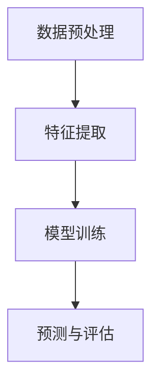
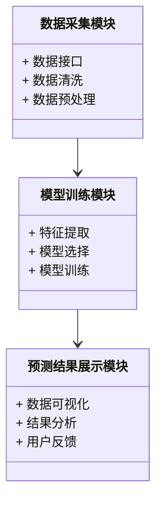
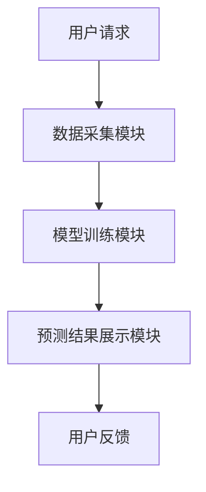
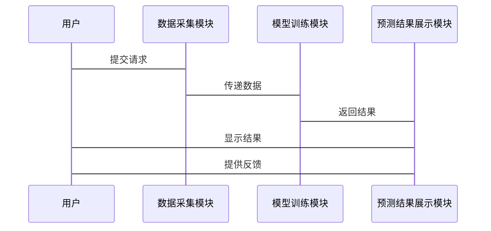

                 


# AI Agent辅助企业财务分析与预测

> 关键词：AI Agent，企业财务分析，财务预测，算法模型，系统架构设计

> 摘要：本文详细探讨了AI Agent在企业财务分析与预测中的应用，从基本概念、算法原理到系统架构设计，结合实际案例，全面解析了AI Agent如何提升企业财务预测的效率与准确性。

---

# 第1章: AI Agent与企业财务分析概述

## 1.1 AI Agent的基本概念

### 1.1.1 AI Agent的定义与特点

**AI Agent（人工智能代理）**是指能够感知环境、自主决策并执行任务的智能实体。它具备以下特点：

- **自主性**：能够在没有外部干预的情况下独立运作。
- **反应性**：能够实时感知环境并做出反应。
- **目标导向**：具备明确的目标，能够为实现目标而行动。
- **学习能力**：能够通过经验改进自身的性能。

### 1.1.2 AI Agent的核心原理

AI Agent的核心原理包括感知、决策和执行三个环节：

1. **感知**：通过传感器或数据接口获取外部环境的信息。
2. **决策**：基于获取的信息，利用算法进行分析和推理，制定行动计划。
3. **执行**：根据决策结果，通过执行器或接口完成任务。

### 1.1.3 企业财务分析的定义与目标

**企业财务分析**是通过对财务数据的整理、分析和评估，帮助企业管理者了解企业财务状况、经营成果和未来发展趋势的过程。其目标包括：

- 评估企业财务健康状况。
- 发现财务问题并提出改进建议。
- 预测未来财务趋势，支持决策制定。

## 1.2 AI Agent在企业财务分析中的应用背景

### 1.2.1 传统财务分析的局限性

传统财务分析主要依赖人工操作，存在以下局限性：

- **效率低下**：人工分析需要大量时间和精力。
- **主观性**：分析结果受到分析师经验的影响。
- **缺乏实时性**：无法实时获取和分析数据。

### 1.2.2 AI技术在财务领域的优势

AI技术的应用为财务分析带来了以下优势：

- **高效性**：AI能够快速处理大量数据，提高分析效率。
- **客观性**：AI分析基于数据，减少人为主观因素的影响。
- **实时性**：AI能够实时获取和分析数据，提供实时财务洞察。

### 1.2.3 AI Agent辅助财务分析的必要性

随着企业数据量的激增和业务复杂性的提升，传统的财务分析方法已无法满足需求。AI Agent通过自动化数据处理和智能分析，能够帮助企业更高效、准确地进行财务分析与预测。

## 1.3 本章小结

本章介绍了AI Agent的基本概念、核心原理以及在企业财务分析中的应用背景。通过对比传统财务分析与AI技术的优劣，强调了AI Agent在财务分析中的重要性。

---

# 第2章: AI Agent辅助财务预测的核心概念

## 2.1 财务预测的基本原理

### 2.1.1 财务预测的分类与方法

**财务预测**是根据历史数据和业务规则，预测企业未来的财务状况。常见的分类方法包括：

- **按时间范围**：短期预测、中期预测和长期预测。
- **按预测对象**：收入预测、成本预测、利润预测等。

### 2.1.2 财务预测的常用模型

- **线性回归模型**：适用于简单的线性关系预测。
- **时间序列分析**：适用于具有时间依赖性的数据预测。
- **决策树模型**：适用于复杂的非线性关系预测。

## 2.2 AI Agent在财务预测中的角色

### 2.2.1 数据采集与处理

AI Agent通过数据接口获取企业的财务数据，并进行清洗和预处理，确保数据的准确性和完整性。

### 2.2.2 模型训练与优化

AI Agent利用机器学习算法对数据进行建模，通过训练和优化提升模型的预测精度。

### 2.2.3 结果分析与反馈

AI Agent将预测结果反馈给企业，并根据实际结果调整模型参数，优化预测效果。

## 2.3 核心概念与联系

### 2.3.1 AI Agent的感知、决策与执行过程

AI Agent在财务预测中的工作流程可以分为三个阶段：

1. **感知**：获取财务数据。
2. **决策**：基于数据进行预测。
3. **执行**：输出预测结果并提供反馈。

### 2.3.2 财务预测的流程与AI Agent的结合

财务预测的流程包括数据准备、模型训练、结果分析和反馈优化。AI Agent在每个阶段都发挥着重要作用。

### 2.3.3 ER实体关系图架构

以下是企业财务预测系统的核心实体关系图：

```mermaid
erd
  actor: 用户
  system: 财务预测系统
  model: 预测模型
  data: 财务数据
  result: 预测结果
  actor --> system: 提交请求
  system --> model: 训练模型
  model --> data: 数据输入
  model --> result: 输出结果
  system --> actor: 反馈结果
```

## 2.4 本章小结

本章详细探讨了AI Agent在财务预测中的核心概念，包括财务预测的基本原理、AI Agent的角色以及各环节的联系。通过ER实体关系图，清晰展示了系统各部分的协作关系。

---

# 第3章: AI Agent辅助财务预测的算法原理

## 3.1 常见的财务预测算法

### 3.1.1 线性回归模型

**线性回归模型**用于预测变量与一个或多个预测变量之间的线性关系。

#### 单变量线性回归公式

$$ y = \beta_0 + \beta_1x + \epsilon $$

其中，$y$是目标变量，$x$是预测变量，$\beta_0$是截距，$\beta_1$是回归系数，$\epsilon$是误差项。

#### 多变量线性回归公式

$$ y = \beta_0 + \beta_1x_1 + \beta_2x_2 + \dots + \beta_nx_n + \epsilon $$

### 3.1.2 时间序列分析

**时间序列分析**用于预测具有时间依赖性的数据，常用模型包括ARIMA（自回归积分滑动平均模型）和LSTM（长短期记忆网络）。

#### ARIMA模型

ARIMA模型通过自回归和滑动平均的方式对时间序列数据进行建模。

#### LSTM网络

LSTM是一种基于循环神经网络的模型，能够有效捕捉时间序列中的长期依赖关系。

### 3.1.3 决策树与随机森林

**决策树**通过树状结构进行分类和回归预测，**随机森林**是一种基于决策树的集成学习方法，通过多棵决策树的组合提高预测准确性。

## 3.2 算法原理讲解

### 3.2.1 线性回归的数学模型

线性回归通过最小化预测值与实际值之间的平方差之和来求解回归系数。

$$ \text{损失函数} = \sum_{i=1}^{n} (y_i - (\beta_0 + \beta_1x_i))^2 $$

通过求解偏导数并令其为零，可以得到回归系数的最优解。

### 3.2.2 时间序列的ARIMA模型

ARIMA模型由三个参数组成：p（自回归阶数）、d（差分阶数）、q（滑动平均阶数）。其核心思想是通过差分将非平稳序列转化为平稳序列，再利用AR和MA模型进行预测。

### 3.2.3 决策树的分类与回归

决策树通过信息增益或基尼指数作为分裂标准，逐步构建分类或回归树。随机森林通过构建多棵决策树并对结果进行投票或取平均值来提高预测准确性。

## 3.3 算法流程图

以下是常见算法的流程图：



## 3.4 本章小结

本章详细讲解了常见财务预测算法的原理和数学模型，包括线性回归、时间序列分析和决策树模型。通过流程图展示了算法的整体流程，帮助读者更好地理解其应用场景。

---

# 第4章: 财务预测的数学模型与公式

## 4.1 线性回归模型

### 4.1.1 单变量线性回归

$$ y = \beta_0 + \beta_1x + \epsilon $$

### 4.1.2 多变量线性回归

$$ y = \beta_0 + \beta_1x_1 + \beta_2x_2 + \dots + \beta_nx_n + \epsilon $$

## 4.2 时间序列分析模型

### 4.2.1 ARIMA模型

ARIMA模型的数学表达式为：

$$ \phi(\text{B})X_t = \theta(\text{B})\epsilon_t $$

其中，$\phi(\text{B})$和$\theta(\text{B})$分别是自回归和滑动平均的多项式。

### 4.2.2 LSTM网络

LSTM通过三个门控机制（输入门、遗忘门和输出门）来捕捉时间序列中的长期依赖关系。

## 4.3 决策树模型

### 4.3.1 ID3算法

ID3算法基于信息增益进行特征选择，构建决策树。

### 4.3.2 C4.5算法

C4.5算法基于基尼指数进行特征选择，构建决策树。

## 4.4 算法比较与选择

### 4.4.1 算法优缺点对比

| 算法 | 优点 | 缺点 |
|------|------|------|
| 线性回归 | 简单高效 | 适用于线性关系 |
| 时间序列分析 | 适用于时间依赖数据 | 参数选择复杂 |
| 决策树 | 高准确性 | 易受噪声数据影响 |

### 4.4.2 根据场景选择算法

- **线性关系**：选择线性回归。
- **时间依赖性**：选择ARIMA或LSTM。
- **复杂关系**：选择决策树或随机森林。

## 4.5 本章小结

本章详细介绍了常见财务预测算法的数学模型与公式，帮助读者理解其工作原理，并根据实际场景选择合适的算法。

---

# 第5章: 系统分析与架构设计

## 5.1 问题场景介绍

### 5.1.1 企业财务预测的典型场景

企业财务预测的典型场景包括销售收入预测、成本预测、利润预测等。

### 5.1.2 AI Agent在系统中的角色

AI Agent在系统中负责数据采集、模型训练和预测结果输出。

## 5.2 系统功能设计

### 5.2.1 数据采集模块

数据采集模块负责从企业数据库中获取财务数据，并进行清洗和预处理。

### 5.2.2 模型训练模块

模型训练模块负责对数据进行建模和训练，选择合适的算法进行预测。

### 5.2.3 预测结果展示模块

预测结果展示模块将预测结果以可视化的方式呈现给用户，并提供反馈机制。

## 5.3 系统架构设计

以下是系统架构设计的类图：



## 5.4 系统接口设计

以下是系统接口设计的流程图：



## 5.5 系统交互设计

以下是系统交互设计的序列图：



## 5.6 本章小结

本章详细描述了企业财务预测系统的功能设计和架构设计，通过类图和流程图展示了系统各部分的协作关系。

---

# 第6章: 项目实战——销售收入预测

## 6.1 项目介绍

### 6.1.1 项目背景

本项目旨在利用AI Agent技术，对企业未来的销售收入进行预测。

### 6.1.2 项目目标

通过历史销售数据，训练一个预测模型，实现对企业未来销售收入的准确预测。

## 6.2 环境安装

### 6.2.1 安装Python环境

使用Anaconda安装Python 3.8及以上版本。

### 6.2.2 安装依赖库

安装numpy、pandas、scikit-learn和matplotlib。

```bash
pip install numpy pandas scikit-learn matplotlib
```

## 6.3 系统核心实现源代码

### 6.3.1 数据预处理

```python
import pandas as pd
import numpy as np

# 读取数据
data = pd.read_csv('sales.csv')

# 数据清洗
data.dropna(inplace=True)

# 数据预处理
data['date'] = pd.to_datetime(data['date'])
data.set_index('date', inplace=True)
```

### 6.3.2 特征工程

```python
from sklearn.preprocessing import MinMaxScaler

# 特征提取
features = data[['sales', 'costs', 'profit']]

# 数据标准化
scaler = MinMaxScaler()
features_scaled = scaler.fit_transform(features)
```

### 6.3.3 模型训练

```python
from sklearn.ensemble import RandomForestRegressor
from sklearn.model_selection import train_test_split

# 数据分割
X_train, X_test, y_train, y_test = train_test_split(features_scaled, data['sales'], test_size=0.2)

# 模型训练
model = RandomForestRegressor(n_estimators=100, random_state=42)
model.fit(X_train, y_train)
```

### 6.3.4 模型预测与评估

```python
# 模型预测
y_pred = model.predict(X_test)

# 模型评估
from sklearn.metrics import mean_absolute_error, mean_squared_error
print('MAE:', mean_absolute_error(y_test, y_pred))
print('MSE:', mean_squared_error(y_test, y_pred))
print('RMSE:', np.sqrt(mean_squared_error(y_test, y_pred)))
```

## 6.4 代码应用解读与分析

### 6.4.1 数据预处理

- **读取数据**：使用pandas读取CSV格式的销售数据。
- **数据清洗**：删除缺失值，确保数据完整性。
- **数据预处理**：将日期转换为时间格式，并设置为索引。

### 6.4.2 特征工程

- **特征提取**：选择与销售收入相关的特征变量。
- **数据标准化**：使用Min-Max标准化对数据进行归一化处理，便于模型训练。

### 6.4.3 模型训练

- **数据分割**：将数据分为训练集和测试集。
- **模型训练**：使用随机森林回归模型进行训练，设置100棵决策树，随机种子为42。

### 6.4.4 模型预测与评估

- **模型预测**：使用训练好的模型对测试集进行预测。
- **模型评估**：通过均绝对误差（MAE）、均平方误差（MSE）和均根平方误差（RMSE）评估模型性能。

## 6.5 实际案例分析和详细讲解剖析

通过销售收入预测的案例，展示了AI Agent在实际应用中的具体实现。通过数据预处理、特征工程、模型训练和评估，证明了随机森林回归模型在销售收入预测中的有效性。

## 6.6 项目小结

本章通过一个实际案例，详细讲解了AI Agent在销售收入预测中的应用。从环境安装、数据预处理到模型训练和评估，展示了完整的项目实现过程。

---

# 第7章: 最佳实践、小结、注意事项与拓展阅读

## 7.1 最佳实践

### 7.1.1 数据质量管理

- 确保数据的完整性、准确性和一致性。
- 及时更新和维护数据。

### 7.1.2 模型优化

- 选择合适的算法，避免过拟合和欠拟合。
- 通过交叉验证和网格搜索优化模型参数。

### 7.1.3 系统安全性

- 加强数据安全保护，防止数据泄露。
- 确保系统运行环境的安全性。

## 7.2 小结

本文详细探讨了AI Agent在企业财务分析与预测中的应用，从基本概念到算法原理，再到系统架构设计和项目实战，全面解析了AI Agent如何提升企业财务预测的效率与准确性。

## 7.3 注意事项

- **数据隐私**：确保数据的合法使用和隐私保护。
- **模型解释性**：选择解释性较强的模型，便于分析结果的解读。
- **系统稳定性**：确保系统的稳定运行，避免因故障导致数据丢失或预测结果错误。

## 7.4 拓展阅读

- **机器学习在财务领域的应用**：深入学习机器学习在财务领域的其他应用，如信用评分、风险评估等。
- **高级算法研究**：研究深度学习算法（如LSTM）在时间序列预测中的应用。
- **系统优化与部署**：学习如何将AI Agent系统部署到生产环境，实现自动化运行。

---

# 作者：AI天才研究院 & 禅与计算机程序设计艺术

---

以上是《AI Agent辅助企业财务分析与预测》的完整文章内容，涵盖了从基础概念到实际应用的各个方面，结合了理论与实践，帮助读者全面理解AI Agent在企业财务分析与预测中的应用。

