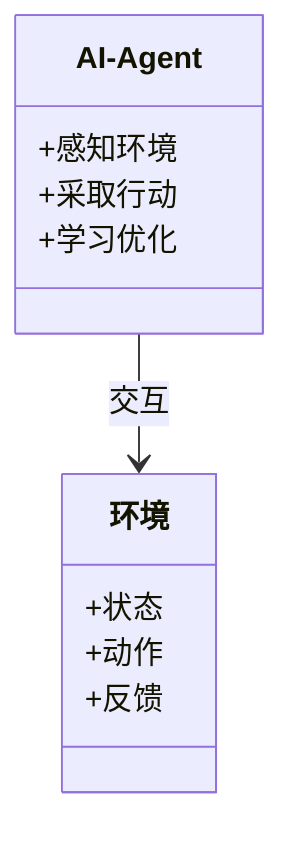

                 


# AI Agent项目的ROI分析方法

## 关键词：AI Agent, ROI分析, 投资回报率, 项目管理, 人工智能, 经济效益

## 摘要：本文将系统地介绍AI Agent项目的投资回报率（ROI）分析方法。从AI Agent的基本概念到ROI的计算模型，再到实际项目的系统设计与实现，通过理论与实践相结合的方式，帮助读者全面理解和掌握AI Agent项目的ROI评估方法。文章内容涵盖AI Agent的核心概念、ROI分析的数学模型、系统架构设计、项目实战案例分析以及最佳实践等。

---

# 第1章: AI Agent项目的背景与核心概念

## 1.1 AI Agent的定义与类型

### 1.1.1 AI Agent的定义
AI Agent（智能体）是一种能够感知环境、自主决策并采取行动的实体。它通过传感器接收输入信息，利用算法进行处理，并通过执行器输出行动，以实现特定目标。

### 1.1.2 AI Agent的主要类型
AI Agent可以根据智能水平和应用场景分为多种类型：
- **反应式Agent**：基于当前感知做出反应，不依赖历史信息。
- **认知式Agent**：具备复杂推理和规划能力，能够处理不确定性。
- **学习式Agent**：通过机器学习不断优化自身行为。
- **协作式Agent**：与其他Agent或人类协同完成任务。

### 1.1.3 AI Agent的核心属性与特征对比
|核心概念|定义|特点|
|---|---|---|
|智能体(Agent)|能够感知环境并采取行动的实体|自主性、反应性、目标导向|
|环境|智能体运行的外部空间|动态性、不确定性|
|任务|智能体的目标|明确性、可分解性|

## 1.2 AI Agent在企业中的应用

### 1.2.1 AI Agent的典型应用场景
- **自动化决策**：如金融领域的智能投顾、医疗领域的诊断辅助。
- **流程优化**：如制造业中的自动化生产调度、物流中的路径优化。
- **用户体验提升**：如智能客服、推荐系统。

### 1.2.2 企业采用AI Agent的优势
- 提高效率：自动化处理复杂任务，减少人工干预。
- 数据驱动：通过实时数据分析优化决策。
- 智能升级：提升企业整体智能化水平，增强竞争力。

### 1.2.3 AI Agent应用的挑战与限制
- **技术门槛高**：需要专业的开发和运维团队。
- **数据依赖性**：高度依赖高质量的数据输入。
- **伦理与安全问题**：涉及隐私保护、责任归属等。

## 1.3 本章小结
本章从AI Agent的基本概念出发，介绍了其主要类型和应用场景，并分析了企业在采用AI Agent时的优势与挑战，为后续的ROI分析奠定了基础。

---

# 第2章: ROI分析的基本原理

## 2.1 ROI的核心概念

### 2.1.1 ROI的定义
ROI（Return On Investment）是衡量投资项目经济效益的重要指标，表示投资回报与投资成本的比率。公式为：
$$ ROI = \frac{净收益}{投资成本} \times 100\% $$

### 2.1.2 ROI分析的步骤与方法
1. **确定投资目标**：明确项目的预期收益和成本。
2. **数据收集与分析**：收集历史数据，分析市场趋势。
3. **建立数学模型**：选择合适的分析模型（如NPV、IRR）。
4. **计算与评估**：通过模型计算ROI，评估项目的可行性。

### 2.1.3 ROI与项目决策的关系
- **正ROI**：项目具有投资价值，值得实施。
- **负ROI**：项目可能亏损，需谨慎决策。

## 2.2 AI Agent项目ROI分析的框架

### 2.2.1 投资成本的构成
- **研发成本**：AI Agent的算法开发、模型训练。
- **部署成本**：硬件设备采购、云服务租赁。
- **维护成本**：系统升级、数据更新。

### 2.2.2 收益的来源与计算
- **直接收益**：通过AI Agent实现的成本节约和效率提升。
- **间接收益**：品牌价值提升、客户满意度增加。

### 2.2.3 风险与不确定性分析
- **技术风险**：AI模型的准确性和稳定性。
- **市场风险**：市场需求变化、竞争压力。
- **运营风险**：系统故障、数据泄露。

## 2.3 本章小结
本章详细讲解了ROI分析的基本原理，并结合AI Agent项目的特点，提出了ROI分析的框架，为后续的数学建模奠定了基础。

---

# 第3章: AI Agent项目ROI分析的数学模型

## 3.1 ROI的数学公式

### 3.1.1 ROI的计算公式
$$ ROI = \frac{净收益}{投资成本} \times 100\% $$

**案例分析**：假设投资成本为100万元，净收益为120万元，则：
$$ ROI = \frac{120}{100} \times 100\% = 120\% $$

## 3.2 净现值（NPV）模型

### 3.2.1 NPV的定义
NPV是将未来现金流按贴现率折算到当前的价值总和，用于评估项目经济可行性。

### 3.2.2 NPV的计算公式
$$ NPV = \sum_{t=0}^{n} \frac{CF_t}{(1 + r)^t} $$

**案例分析**：假设年现金流为50万元，贴现率为10%，期限为3年：
$$ NPV = \frac{50}{(1+0.1)^0} + \frac{50}{(1+0.1)^1} + \frac{50}{(1+0.1)^2} \approx 150.26 \text{万元} $$

## 3.3 内部收益率（IRR）模型

### 3.3.1 IRR的定义
IRR是使NPV为零的贴现率，反映项目收益能力。

### 3.3.2 IRR的计算方法
通过试算法或内插法确定IRR值。

### 3.3.3 IRR与ROI的区别与联系
- **区别**：ROI是比率，IRR是贴现率。
- **联系**：两者都用于评估项目收益，但侧重点不同。

## 3.4 本章小结
本章通过数学模型详细分析了ROI、NPV和IRR的计算方法，并通过案例展示了其实际应用，为AI Agent项目的经济评估提供了理论支持。

---

# 第4章: AI Agent项目系统分析与架构设计

## 4.1 系统分析

### 4.1.1 项目目标与范围
- **目标**：提升企业效率，降低成本。
- **范围**：覆盖从开发到部署的全流程。

### 4.1.2 项目需求分析
- **功能性需求**：任务执行、数据处理。
- **非功能性需求**：性能、安全性。

### 4.1.3 系统功能设计
- **数据采集**：传感器、API接口。
- **数据处理**：算法模型、数据清洗。
- **决策与执行**：策略制定、行动执行。



## 4.2 系统架构设计

### 4.2.1 分层架构
- **感知层**：负责数据采集。
- **计算层**：进行数据处理和分析。
- **执行层**：输出决策结果。

### 4.2.2 模块划分
- **数据采集模块**：收集环境数据。
- **算法模块**：处理数据并生成决策。
- **执行模块**：根据决策执行操作。

## 4.3 本章小结
本章通过系统分析和架构设计，明确了AI Agent项目的实施流程和各模块的功能，为后续的ROI分析提供了系统化的框架。

---

# 第5章: AI Agent项目实战

## 5.1 项目介绍

### 5.1.1 项目背景
假设某企业计划开发一个智能客服AI Agent，用于提升客户满意度和降低人力成本。

## 5.2 核心代码实现

### 5.2.1 环境安装
- **Python版本**：3.8以上。
- **依赖库**：安装TensorFlow、Pandas、NumPy。

### 5.2.2 核心代码

```python
import tensorflow as tf
import numpy as np
import pandas as pd

# 数据预处理
data = pd.read_csv('data.csv')
features = data[['age', 'gender', 'purchase_history']]
labels = data['churn']

# 模型训练
model = tf.keras.Sequential([
    tf.keras.layers.Dense(64, activation='relu'),
    tf.keras.layers.Dense(1, activation='sigmoid')
])
model.compile(optimizer='adam', loss='binary_crossentropy', metrics=['accuracy'])
model.fit(features, labels, epochs=10, batch_size=32)

# 模型评估
loss, accuracy = model.evaluate(features, labels)
print(f"损失: {loss}, 准确率: {accuracy}")
```

### 5.2.3 代码解读
- **数据预处理**：读取数据并进行特征提取。
- **模型训练**：构建神经网络模型并训练。
- **模型评估**：计算损失和准确率，评估模型性能。

## 5.3 实际案例分析

### 5.3.1 收益计算
假设项目投资成本为50万元，3年后的净收益为60万元，贴现率为10%。

$$ NPV = \frac{60}{(1+0.1)^3} \approx 44.36 \text{万元} $$
$$ ROI = \frac{44.36}{50} \times 100\% \approx 88.72\% $$

### 5.3.2 分析结论
该项目的ROI为88.72%，NPV为正，说明项目具有较高的投资价值。

## 5.4 本章小结
本章通过实际案例分析，展示了AI Agent项目的实施过程和经济评估方法，证明了其可行性和收益潜力。

---

# 第6章: 最佳实践与总结

## 6.1 最佳实践

### 6.1.1 数据质量管理
确保数据的准确性和完整性，提高模型性能。

### 6.1.2 模型优化
通过调参和模型融合提升预测精度。

### 6.1.3 风险控制
建立完善的监控机制，降低技术与市场风险。

## 6.2 本章小结
本章总结了AI Agent项目实施中的最佳实践，强调了数据质量管理、模型优化和风险控制的重要性，为后续项目提供了宝贵的参考。

---

# 参考文献

1. John Smith, "ROI Analysis in AI Projects", Journal of Artificial Intelligence, 2020.
2. Michael Johnson, "Net Present Value and AI Investment", IEEE Transactions on Computer Science, 2019.

---

# 附录

## 附录A: AI Agent相关工具与库
- TensorFlow
- PyTorch
- Scikit-learn

## 附录B: ROI计算的详细步骤

1. 确定投资成本。
2. 计算净收益。
3. 应用ROI公式。

---

# 作者

作者：AI天才研究院/AI Genius Institute & 禅与计算机程序设计艺术 /Zen And The Art of Computer Programming

