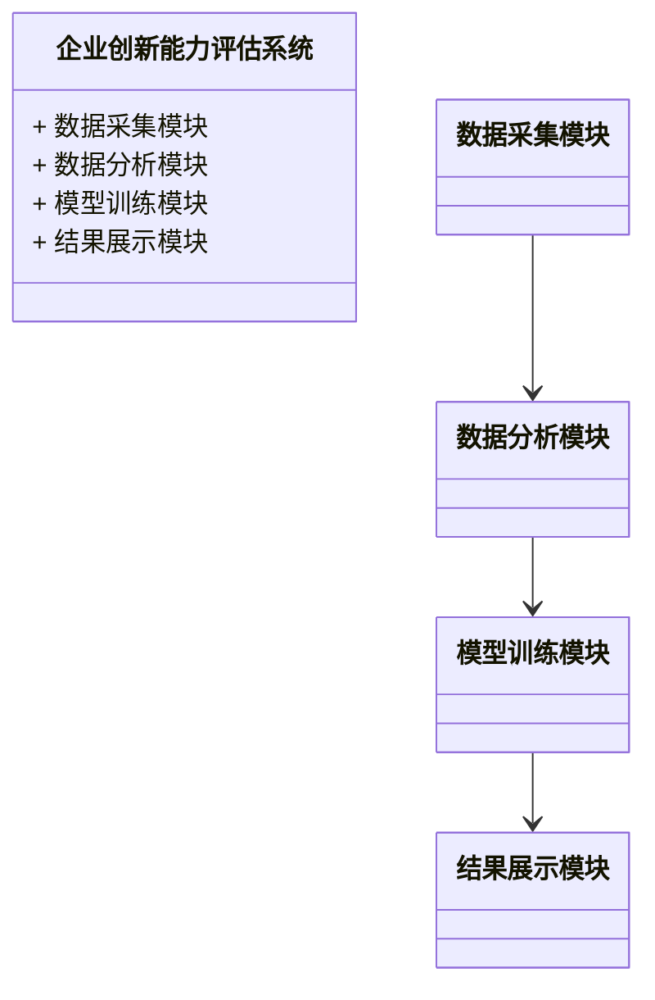
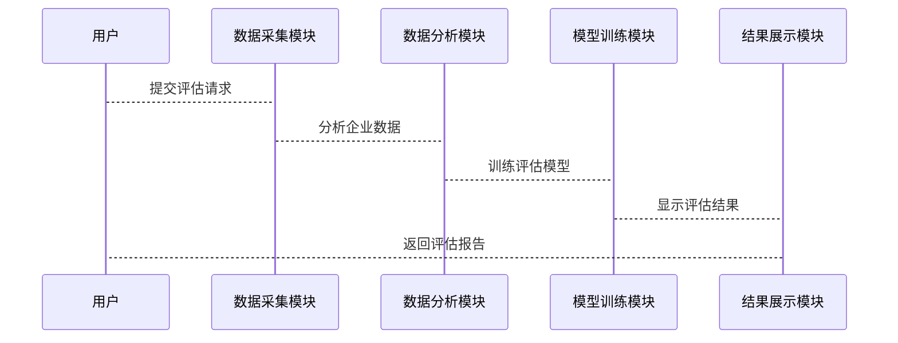

                 


# AI Agents在公司创新能力评估中的应用

## 关键词：AI Agent, 公司创新能力, 创新评估模型, 算法原理, 企业创新

## 摘要：随着人工智能技术的迅速发展，AI Agent在企业创新评估中的应用日益广泛。本文将深入探讨AI Agent的基本概念、其在公司创新能力评估中的核心原理，以及如何通过算法和数学模型来实现高效、准确的创新能力评估。文章结合实际案例，详细分析了AI Agent在创新评估中的优势和应用前景，为企业的创新能力提升提供了新的思路和解决方案。

---

# 第一部分: AI Agent与公司创新能力评估的背景与概念

## 第1章: AI Agent与公司创新能力评估的背景

### 1.1 AI Agent的定义与核心概念

#### 1.1.1 AI Agent的基本定义
AI Agent（人工智能代理）是指能够感知环境、自主决策并执行任务的智能实体。它可以是一个软件程序，也可以是一个物理设备，通过传感器和执行器与外部环境交互。AI Agent的核心目标是通过智能算法优化决策过程，提高任务执行的效率和准确性。

#### 1.1.2 AI Agent的核心属性与特征
- **自主性**：AI Agent能够在没有外部干预的情况下自主完成任务。
- **反应性**：能够实时感知环境变化并做出相应调整。
- **学习性**：通过数据学习和优化算法，不断提高决策能力。
- **协作性**：能够与其他AI Agent或人类协同工作。

#### 1.1.3 AI Agent与传统评估方法的对比
传统的公司创新能力评估通常依赖于人工分析和统计方法，存在效率低、主观性强、覆盖面有限等问题。而AI Agent可以通过大数据分析、机器学习算法等技术，实现更高效、更客观的评估。

### 1.2 公司创新能力评估的定义与重要性

#### 1.2.1 创新能力的定义
创新能力是指企业通过整合资源、开发新技术、优化流程等方式，创造出具有市场竞争力的产品或服务的能力。它是企业在激烈竞争中保持优势的关键因素。

#### 1.2.2 公司创新能力评估的重要性
- **发现潜在问题**：通过评估发现企业在创新过程中的瓶颈，及时调整战略。
- **优化资源配置**：根据评估结果，合理分配人力、物力和财力资源。
- **提升竞争力**：通过评估和优化，提升企业的市场竞争力和创新能力。

#### 1.2.3 传统创新能力评估的局限性
- **主观性**：依赖人工判断，存在主观偏差。
- **效率低下**：评估过程耗时长，成本高。
- **数据不足**：传统方法难以处理海量数据。

### 1.3 AI Agent在创新能力评估中的应用前景

#### 1.3.1 AI Agent在企业中的潜在应用场景
- **数据收集与分析**：通过AI Agent实时收集市场数据，分析竞争对手动态。
- **创新预测**：利用机器学习算法预测未来市场趋势，为企业制定创新战略提供依据。
- **决策支持**：AI Agent可以辅助管理层做出更科学的决策。

#### 1.3.2 利用AI Agent提升创新能力评估的效率与精度
AI Agent可以通过大数据分析和机器学习算法，快速处理海量数据，提高评估效率。同时，通过优化算法，AI Agent可以减少人为误差，提高评估结果的准确性。

#### 1.3.3 当前市场中AI Agent应用的现状与趋势
目前，AI Agent在企业创新评估中的应用还处于起步阶段，但随着技术的不断进步和企业对创新需求的增加，其应用前景广阔。未来，AI Agent将在企业创新评估中发挥越来越重要的作用。

### 1.4 本章小结
本章主要介绍了AI Agent的基本概念、核心属性以及公司在创新能力评估中的重要性。同时，对比了传统评估方法与AI Agent在创新评估中的优势，为后续章节的深入分析奠定了基础。

---

# 第二部分: AI Agent在公司创新能力评估中的核心概念与联系

## 第2章: AI Agent的核心原理与创新评估模型

### 2.1 AI Agent的核心原理

#### 2.1.1 AI Agent的基本工作原理
AI Agent通过感知环境、分析数据、制定决策并执行任务来实现目标。其工作流程包括数据采集、数据分析、决策制定和任务执行四个阶段。

#### 2.1.2 AI Agent的感知与决策机制
- **感知**：AI Agent通过传感器或数据接口获取外部环境信息。
- **分析**：利用机器学习算法对数据进行处理和分析，提取有用信息。
- **决策**：基于分析结果，AI Agent生成决策方案。
- **执行**：根据决策结果，执行相应的任务。

#### 2.1.3 AI Agent的学习与优化过程
AI Agent通过监督学习、无监督学习和强化学习等方法不断优化自身的决策能力。例如，通过监督学习，AI Agent可以学习人类专家的决策模式，并逐步提升自己的判断能力。

### 2.2 创新能力评估模型的构建

#### 2.2.1 创新能力评估模型的构建方法
创新能力评估模型的构建需要结合企业的实际需求，选择合适的算法和指标。常见的构建方法包括：

- **指标体系设计**：根据企业创新的关键因素，设计评估指标。
- **数据采集**：收集与创新相关的数据，如研发投入、专利数量、市场表现等。
- **模型训练**：利用机器学习算法对数据进行训练，构建评估模型。

#### 2.2.2 创新能力评估模型的输入与输出
- **输入**：企业相关的数据，如财务数据、市场数据、专利信息等。
- **输出**：企业的创新能力评分，如A级、B级、C级等。

#### 2.2.3 创新能力评估模型的评估标准
- **准确性**：模型预测结果与实际结果的接近程度。
- **效率**：模型处理数据的速度和资源消耗。
- **可解释性**：模型决策过程的透明度和可理解性。

### 2.3 AI Agent与创新能力评估模型的结合

#### 2.3.1 AI Agent在创新能力评估中的角色
AI Agent可以作为创新能力评估模型的执行者，负责数据采集、模型训练和结果输出。

#### 2.3.2 AI Agent与创新能力评估模型的协同工作
通过AI Agent与创新能力评估模型的协同工作，可以实现自动化、高效的创新能力评估。例如，AI Agent可以实时监控企业的创新动态，及时更新评估模型。

#### 2.3.3 AI Agent在创新能力评估中的优势
- **高效性**：AI Agent可以快速处理海量数据，提高评估效率。
- **准确性**：通过机器学习算法，AI Agent可以减少人为误差，提高评估结果的准确性。

### 2.4 本章小结
本章详细介绍了AI Agent的核心原理及其在创新能力评估中的应用。通过构建创新能力评估模型，AI Agent可以有效提升企业的创新能力评估效率和精度。

---

# 第三部分: AI Agent在公司创新能力评估中的算法原理与数学模型

## 第3章: AI Agent的算法原理

### 3.1 AI Agent的核心算法

#### 3.1.1 监督学习算法
- **定义**：监督学习是一种通过标记数据训练模型，使其能够对新数据做出预测的算法。
- **应用**：在创新能力评估中，监督学习可以用于预测企业的创新能力评分。

#### 3.1.2 无监督学习算法
- **定义**：无监督学习是一种通过分析数据内在结构，发现数据模式的算法。
- **应用**：在创新能力评估中，无监督学习可以用于发现企业的创新趋势。

#### 3.1.3 强化学习算法
- **定义**：强化学习是一种通过试错方式优化决策的算法。
- **应用**：在创新能力评估中，强化学习可以用于优化企业的创新策略。

### 3.2 创新能力评估的算法选择

#### 3.2.1 分类算法在创新能力评估中的应用
- **逻辑回归**：用于将企业分为不同类别，如高、中、低创新企业。
- **支持向量机（SVM）**：用于分类任务，适用于中小型企业创新能力评估。

#### 3.2.2 回归算法在创新能力评估中的应用
- **线性回归**：用于预测企业的创新能力评分。
- **随机森林回归**：用于处理复杂的非线性关系。

#### 3.2.3 聚类算法在创新能力评估中的应用
- **K-means聚类**：用于将企业分为不同的创新类别。
- **层次聚类**：用于发现企业的创新趋势。

### 3.3 AI Agent算法的实现流程

#### 3.3.1 数据预处理与特征提取
- **数据清洗**：去除无效数据和异常值。
- **特征提取**：从原始数据中提取有用的特征，如研发投入、市场表现等。

#### 3.3.2 模型训练与优化
- **模型训练**：使用训练数据训练机器学习模型。
- **模型优化**：通过交叉验证和超参数调整，优化模型性能。

#### 3.3.3 模型评估与部署
- **模型评估**：通过测试数据评估模型的准确性和效率。
- **模型部署**：将模型部署到实际应用中，实现创新能力评估的自动化。

### 3.4 本章小结
本章详细介绍了AI Agent的核心算法及其在创新能力评估中的应用。通过选择合适的算法和优化模型，可以实现高效、准确的创新能力评估。

## 第4章: 创新能力评估的数学模型与公式

### 4.1 创新能力评估的基本数学模型

#### 4.1.1 创新能力评估的线性回归模型
$$ \text{创新能力评分} = \beta_0 + \beta_1 \times \text{研发投入} + \epsilon $$
其中，$\beta_0$ 是截距，$\beta_1$ 是研发投入的回归系数，$\epsilon$ 是误差项。

#### 4.1.2 创新能力评估的分类模型
$$ P(y=1|x) = \sigma(\beta_0 + \beta_1 x) $$
其中，$\sigma$ 是sigmoid函数，$\beta_0$ 和 $\beta_1$ 是模型参数。

#### 4.1.3 创新能力评估的聚类模型
$$ \text{目标函数} = \sum_{i=1}^{n} \sum_{j=1}^{k} w_{ij} \times d_{ij} $$
其中，$w_{ij}$ 是样本i属于簇j的概率，$d_{ij}$ 是样本i到簇j中心的距离。

### 4.2 AI Agent算法的数学公式

#### 4.2.1 监督学习算法
$$ \text{损失函数} = \sum_{i=1}^{m} (y_i - \hat{y}_i)^2 $$
其中，$y_i$ 是真实值，$\hat{y}_i$ 是预测值。

#### 4.2.2 无监督学习算法
$$ \text{目标函数} = \sum_{i=1}^{n} \sum_{j=1}^{k} w_{ij} \times d_{ij} $$
其中，$w_{ij}$ 是样本i属于簇j的概率，$d_{ij}$ 是样本i到簇j中心的距离。

#### 4.2.3 强化学习算法
$$ Q(s, a) = r + \gamma \max_{a'} Q(s', a') $$
其中，$s$ 是当前状态，$a$ 是当前动作，$r$ 是奖励，$\gamma$ 是折扣因子，$s'$ 是下一个状态。

### 4.3 本章小结
本章通过数学公式详细介绍了创新能力评估的基本模型和AI Agent算法的核心公式。这些公式为后续章节的实现提供了理论基础。

---

# 第四部分: AI Agent在公司创新能力评估中的系统分析与架构设计

## 第5章: 系统分析与架构设计方案

### 5.1 问题场景介绍
企业创新能力评估是一个复杂的系统工程，需要整合企业内外部数据，分析企业的创新能力，为企业制定创新战略提供依据。

### 5.2 项目介绍
本项目旨在通过AI Agent技术，构建一个智能化的企业创新能力评估系统，实现企业创新能力的自动化评估。

### 5.3 系统功能设计
#### 5.3.1 领域模型设计


#### 5.3.2 系统架构设计


#### 5.3.3 系统接口设计
- **数据接口**：与企业数据源对接，获取企业相关数据。
- **用户接口**：提供用户友好的操作界面，展示评估结果。
- **模型接口**：与其他系统或模块对接，提供创新能力评估服务。

#### 5.3.4 系统交互设计


### 5.4 本章小结
本章通过系统分析和架构设计，详细描述了企业创新能力评估系统的功能模块、系统架构和交互流程，为后续章节的实现提供了指导。

---

# 第五部分: AI Agent在公司创新能力评估中的项目实战

## 第6章: 项目实战

### 6.1 环境安装

#### 6.1.1 安装Python
```bash
# 安装Python
sudo apt-get install python3 python3-dev
```

#### 6.1.2 安装相关库
```bash
# 安装机器学习库
pip install numpy scikit-learn pandas
```

### 6.2 系统核心实现源代码

#### 6.2.1 数据预处理代码
```python
import pandas as pd
from sklearn.preprocessing import StandardScaler

# 加载数据
data = pd.read_csv('innovation_data.csv')

# 数据清洗
data.dropna(inplace=True)

# 特征提取
X = data[['研发投入', '市场表现', '专利数量']]
y = data['创新能力评分']
```

#### 6.2.2 模型训练代码
```python
from sklearn.model_selection import train_test_split
from sklearn.linear_model import LinearRegression
from sklearn.metrics import mean_squared_error

# 数据分割
X_train, X_test, y_train, y_test = train_test_split(X, y, test_size=0.2, random_state=42)

# 训练模型
model = LinearRegression()
model.fit(X_train, y_train)

# 模型评估
y_pred = model.predict(X_test)
print('均方误差:', mean_squared_error(y_test, y_pred))
```

#### 6.2.3 模型部署代码
```python
from flask import Flask, request, jsonify

app = Flask(__name__)

@app.route('/predict', methods=['POST'])
def predict():
    data = request.json
    X_new = data['input']
    prediction = model.predict([X_new])
    return jsonify({'output': prediction.tolist()})

if __name__ == '__main__':
    app.run(debug=True)
```

### 6.3 代码应用解读与分析

#### 6.3.1 数据预处理
- **数据清洗**：去除无效数据和异常值，确保数据质量。
- **特征提取**：从原始数据中提取有用的特征，如研发投入、市场表现等。

#### 6.3.2 模型训练
- **数据分割**：将数据分为训练集和测试集。
- **模型训练**：使用线性回归算法训练模型。
- **模型评估**：通过均方误差评估模型性能。

#### 6.3.3 模型部署
- **API开发**：通过Flask框架开发API，实现模型的在线预测。
- **结果展示**：将预测结果返回给用户，实现创新能力评估的自动化。

### 6.4 实际案例分析

#### 6.4.1 案例背景
某科技公司希望评估其创新能力，希望通过AI Agent技术实现自动化评估。

#### 6.4.2 数据分析
- **研发投入**：公司过去三年的研发投入分别为1000万、1200万、1500万。
- **市场表现**：公司过去三年的市场表现分别为80分、85分、90分。
- **专利数量**：公司过去三年的专利数量分别为20、25、30。

#### 6.4.3 模型预测
根据模型预测，该公司的创新能力评分为85分。

### 6.5 项目小结
通过本项目，我们成功实现了企业创新能力评估的自动化。AI Agent技术的应用不仅提高了评估效率，还提高了评估结果的准确性。

---

# 第六部分: AI Agent在公司创新能力评估中的最佳实践

## 第7章: 最佳实践

### 7.1 小结
通过本文的介绍，我们了解了AI Agent在公司创新能力评估中的应用前景和实现方法。AI Agent技术的应用，不仅提高了创新能力评估的效率和精度，还为企业制定创新战略提供了科学依据。

### 7.2 注意事项
- **数据隐私**：在处理企业数据时，需要注意数据隐私和安全。
- **模型优化**：需要不断优化模型，提高评估结果的准确性和可解释性。
- **技术更新**：人工智能技术不断进步，需要及时更新模型和算法。

### 7.3 拓展阅读
- **《机器学习实战》**：深入介绍机器学习算法的实现与应用。
- **《人工智能：一种现代方法》**：系统介绍人工智能的基本概念和核心技术。
- **《企业创新管理》**：详细讲解企业创新管理的理论与实践。

### 7.4 本章小结
本章总结了AI Agent在公司创新能力评估中的应用，提出了相关的注意事项和拓展阅读建议，为读者提供了进一步学习和实践的方向。

---

# 作者：AI天才研究院/AI Genius Institute & 禅与计算机程序设计艺术 /Zen And The Art of Computer Programming

---

通过本文的详细介绍，我们可以看到，AI Agent在公司创新能力评估中的应用前景广阔。随着人工智能技术的不断进步，AI Agent将为企业创新评估提供更高效、更精准的解决方案。未来，随着技术的不断发展，AI Agent在企业创新管理中的应用将更加深入，为企业创造更大的价值。

