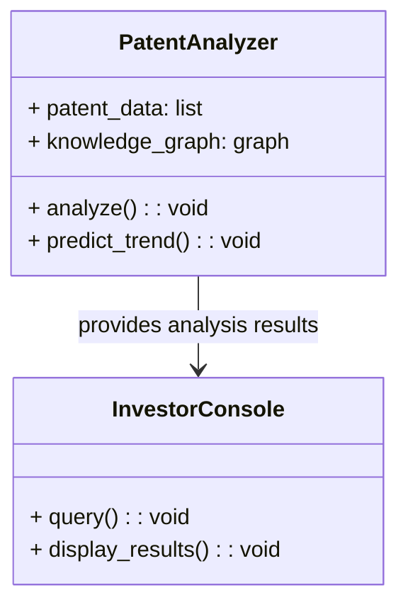
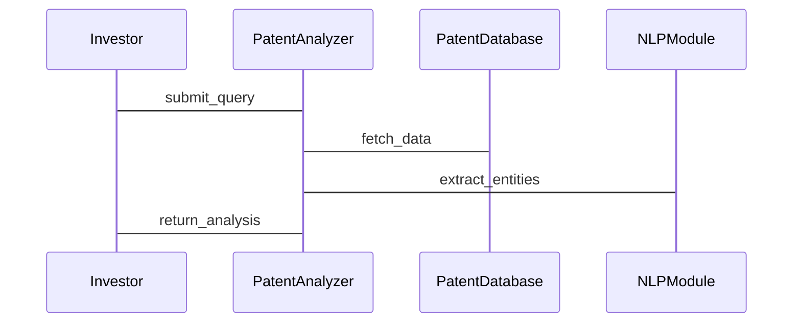

                 


# AI agents辅助价值投资者进行专利分析

## 关键词：AI agents，价值投资者，专利分析，技术分析，机器学习

## 摘要：  
本文探讨了AI agents如何辅助价值投资者进行专利分析。通过结合AI技术与专利分析，价值投资者能够更高效地识别技术趋势、评估企业创新能力和竞争优势。文章从背景、原理、算法、系统设计到实战案例，详细阐述了AI agents在专利分析中的应用，帮助读者理解如何利用AI技术提升投资决策的科学性和准确性。

---

# 第1章：AI agents与价值投资概述

## 1.1 AI agents的基本概念

### 1.1.1 AI agents的定义与分类
AI agents（人工智能代理）是指能够感知环境、执行任务并做出决策的智能实体。根据功能和复杂度，AI agents可以分为简单反应式代理、基于模型的反应式代理、基于目标的代理和基于效用的代理。这些代理广泛应用于自动化决策、数据分析和推荐系统等领域。

### 1.1.2 价值投资的核心理念
价值投资是一种投资策略，强调以低于内在价值的价格购买优质资产。核心在于识别具有持续竞争优势和良好治理的企业，通过深入分析企业基本面和市场趋势，找到被市场低估的投资机会。

### 1.1.3 AI agents在价值投资中的应用潜力
AI agents可以通过处理海量数据、识别模式和预测趋势，辅助投资者在专利分析、市场研究和风险评估等方面做出更明智的决策。AI代理能够实时监控市场动态，自动筛选潜在投资目标，并提供数据支持的决策建议。

---

## 1.2 专利分析的背景与意义

### 1.2.1 专利的基本概念与分类
专利是保护发明创造的法律工具，分为发明专利、实用新型专利和外观设计专利。专利分析包括技术领域、专利申请人、专利引用网络等方面，用于评估企业的创新能力和技术布局。

### 1.2.2 专利分析在企业战略中的作用
专利分析帮助企业识别技术趋势、评估竞争对手的技术储备，并制定研发策略。对于投资者而言，专利分析是评估企业创新能力和市场竞争力的重要依据。

### 1.2.3 价值投资者如何利用专利分析
价值投资者通过专利分析识别企业的技术优势和创新潜力，评估其市场地位和竞争优势。专利数据能够揭示企业的技术布局、研发投入和未来发展方向，为投资决策提供支持。

---

## 1.3 AI agents与专利分析的结合

### 1.3.1 传统专利分析的局限性
传统专利分析依赖人工筛选和解读，耗时且效率低下。随着技术数据的爆炸式增长，传统方法难以满足快速、精准的需求。

### 1.3.2 AI agents在专利分析中的优势
AI agents能够快速处理海量专利数据，识别潜在的技术趋势和市场机会。通过自然语言处理和机器学习技术，AI代理可以提取专利中的关键信息，构建知识图谱，辅助投资者做出更精准的决策。

### 1.3.3 价值投资者的需求与AI agents的结合
价值投资者需要高效、准确的专利分析工具来评估企业的创新能力和市场竞争力。AI agents能够满足这一需求，通过自动化处理和智能分析，帮助投资者快速获取有价值的信息。

---

## 第2章：AI agents与专利分析的核心概念

## 2.1 AI agents的核心原理

### 2.1.1 知识表示与推理
知识表示是将专利数据结构化的过程，通常采用知识图谱的形式。推理则是基于知识图谱进行逻辑推理，识别隐含关系和趋势。

### 2.1.2 自然语言处理在专利分析中的应用
自然语言处理技术用于从专利文本中提取关键词、主题和情感倾向，帮助投资者理解技术领域和市场动态。

### 2.1.3 信息抽取与知识图谱构建
信息抽取是从专利文本中提取实体、关系和事件的过程，构建的知识图谱能够直观展示技术布局和竞争关系。

---

## 2.2 专利分析的关键技术

### 2.2.1 专利数据的结构化处理
将专利文本转换为结构化数据，便于后续分析和处理。常用的技术包括分词、实体识别和信息抽取。

### 2.2.2 专利分类与检索算法
基于专利分类号和关键词的检索算法，帮助投资者快速定位相关技术领域的专利。

### 2.2.3 专利趋势分析与预测
通过时间序列分析和机器学习算法，预测技术领域的专利申请趋势，识别新兴技术和市场机会。

---

## 2.3 AI agents与专利分析的结合

### 2.3.1 AI agents在专利数据处理中的作用
AI agents能够自动化处理专利数据，提取关键信息并生成分析报告，帮助投资者快速获取有价值的信息。

### 2.3.2 专利分析中的模式识别与预测
通过模式识别和预测算法，AI agents能够识别技术趋势和市场动态，为投资者提供前瞻性的决策支持。

### 2.3.3 价值投资者如何利用AI agents进行决策
投资者可以利用AI代理生成的专利分析报告，评估企业的创新能力和市场竞争力，识别潜在投资机会。

---

## 第3章：AI agents辅助专利分析的算法原理

## 3.1 信息抽取算法

### 3.1.1 基于规则的信息抽取
通过预定义的规则从专利文本中提取特定信息，适用于已知模式的提取任务。

### 3.1.2 基于深度学习的信息抽取
利用神经网络模型（如BERT）进行上下文感知的信息抽取，适用于复杂语义场景的处理。

### 3.1.3 信息抽取的评价指标
常用的评价指标包括准确率、召回率和F1值，用于评估信息抽取的效果。

---

## 3.2 时间序列预测算法

### 3.2.1 线性回归与ARIMA
线性回归适用于简单的趋势预测，而ARIMA模型能够捕捉复杂的时间序列变化。

### 3.2.2 LSTM网络
长短期记忆网络（LSTM）能够有效处理时间依赖性强的序列数据，适用于专利申请趋势的预测。

### 3.2.3 时间序列预测的数学模型
线性回归模型：
$$ y = \beta_0 + \beta_1x + \epsilon $$
ARIMA模型：
$$ (1 - B)^d (1 - \theta B)S_t = (1 - \phi B)\epsilon_t $$
LSTM网络结构：
$$ f_t = \sigma(W_f \cdot [h_{t-1}, x_t]) $$
$$ i_t = \sigma(W_i \cdot [h_{t-1}, x_t]) $$
$$ o_t = \sigma(W_o \cdot [h_{t-1}, x_t]) $$
$$ h_t = f_t \cdot c_t + i_t \cdot \tilde{c}_t $$
$$ c_t = g(c_{t-1}, x_t) $$

---

## 3.3 算法实现与案例分析

### 3.3.1 信息抽取的实现
使用Python的spaCy库进行专利文本的分词和实体识别：
```python
import spacy
nlp = spacy.load("en_core_web_sm")
doc = nlp("This patent is about machine learning.")
for token in doc:
    print(token.text, token.pos_, token.dep_)
```

### 3.3.2 时间序列预测的实现
使用Python的statsmodels库进行ARIMA模型的训练与预测：
```python
from statsmodels.tsa.arima_model import ARIMA
import pandas as pd
data = pd.read_csv('patent_counts.csv')
model = ARIMA(data['count'], order=(1, 0, 1))
model_fit = model.fit()
forecast = model_fit.forecast(steps=5)
print(forecast)
```

---

## 4章：系统分析与架构设计

## 4.1 系统功能设计

### 4.1.1 领域模型
通过mermaid类图展示系统功能模块之间的关系：


### 4.1.2 系统架构设计
使用分层架构设计，包括数据层、逻辑层和表现层：


### 4.1.3 系统接口设计
定义系统接口，包括数据输入、分析请求和结果输出：


---

## 4.2 项目实战

### 4.2.1 环境安装
安装必要的Python库，如spaCy、statsmodels、networkx等。

### 4.2.2 核心代码实现
实现专利分析的核心功能，包括数据处理、信息抽取和预测模型训练：
```python
import networkx as nx
from sklearn.metrics.pairwise import cosine_similarity

# 示例代码：构建专利知识图谱
graph = nx.Graph()
graph.add_edge("patent1", "patent2", weight=0.8)
graph.add_edge("patent2", "patent3", weight=0.7)
print(nx.info(graph))
```

### 4.2.3 代码应用解读与分析
详细解释代码的功能和应用场景，展示如何利用代码实现专利分析和预测。

---

## 4.3 总结与展望

### 4.3.1 总结
本文详细探讨了AI agents辅助价值投资者进行专利分析的背景、原理、算法和系统设计。通过结合AI技术与专利分析，投资者能够更高效地识别技术趋势和市场机会。

### 4.3.2 展望
未来，随着AI技术的不断发展，专利分析将更加智能化和自动化。投资者可以利用更强大的AI代理，实时监控市场动态，做出更精准的投资决策。

### 4.3.3 最佳实践 tips
- 确保专利数据的准确性和完整性。
- 定期更新AI模型，适应技术发展的新趋势。
- 结合多维度分析，提高决策的全面性和准确性。

---

## 作者信息

作者：AI天才研究院/AI Genius Institute & 禅与计算机程序设计艺术 /Zen And The Art of Computer Programming

