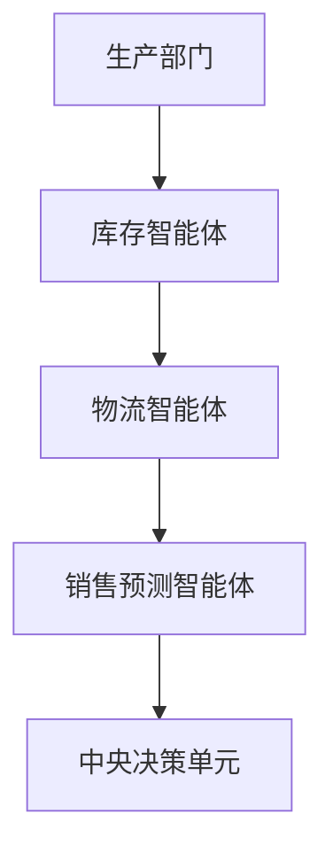
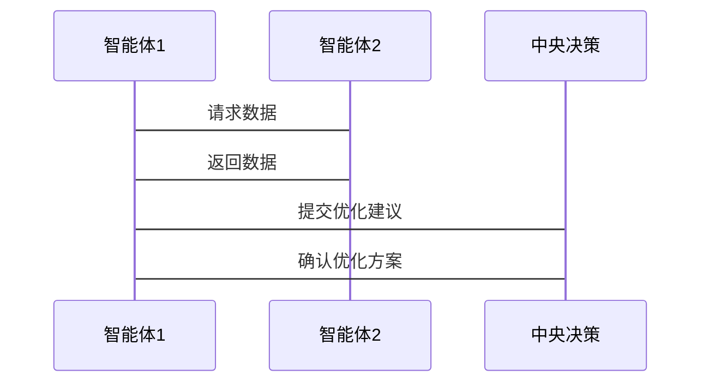

                 


# AI优化的约翰·伯格成本控制策略：多智能体协作

> 关键词：AI优化、成本控制、多智能体协作、约翰·伯格策略、强化学习、系统架构

> 摘要：本文探讨了如何通过AI技术，特别是多智能体协作的方法，优化约翰·伯格的成本控制策略。文章从背景介绍、理论基础、算法原理、系统架构到项目实战，全面分析了AI在成本控制中的应用，并通过实际案例展示了如何利用多智能体协作实现更高效的资源分配和成本优化。

---

## 第一部分: 背景介绍

### 第1章: 成本控制的挑战与AI优化的机遇

#### 1.1 问题背景
现代商业环境中，成本控制是企业生存和发展的关键因素。然而，传统成本控制方法往往依赖于人工决策，存在效率低、实时性差、难以应对复杂场景等问题。随着AI技术的快速发展，尤其是强化学习和多智能体协作技术的成熟，为成本控制提供了新的解决方案。

#### 1.2 问题描述
成本控制的核心目标是通过优化资源配置、减少浪费、提高效率来降低企业的运营成本。然而，传统方法在面对复杂多变的市场环境时，往往显得力不从心。例如，供应链中的库存管理、生产调度、物流优化等问题，由于涉及多个部门和外部合作伙伴，难以实现全局优化。

#### 1.3 问题解决
通过AI技术，特别是多智能体协作，可以实现对复杂系统的实时监控和优化。每个智能体负责特定的任务或子问题，通过协同合作实现全局最优。这种方法不仅提高了决策的效率，还能应对动态变化的市场环境。

---

## 第二部分: 约翰·伯格成本控制策略的理论基础

### 第2章: 约翰·伯格策略的核心思想

#### 2.1 约翰·伯格策略的基本原理
约翰·伯格成本控制策略是一种基于边际成本分析的方法，强调通过精确计算每个决策的成本影响，来优化资源分配。这种方法的核心在于将成本控制与企业战略目标紧密结合，避免局部优化带来的整体损失。

#### 2.2 约翰·伯格模型的数学表达
约翰·伯格模型可以通过以下公式表示：

$$ C = \sum_{i=1}^{n} c_i x_i $$

其中，$C$ 是总成本，$c_i$ 是第 $i$ 项的单位成本，$x_i$ 是第 $i$ 项的资源投入量。通过优化 $x_i$，可以实现总成本的最小化。

#### 2.3 约翰·伯格策略与AI优化的结合
AI技术可以增强约翰·伯格策略的计算能力，通过机器学习模型预测成本变化趋势，并利用强化学习算法优化决策过程。例如，在供应链管理中，AI可以实时调整库存水平，以应对需求波动。

---

## 第三部分: 多智能体协作的成本优化方法

### 第3章: 多智能体协作的基本概念

#### 3.1 多智能体协作的定义与特点
多智能体协作是指多个智能体通过通信和协调，共同完成复杂任务的过程。与单体智能系统相比，多智能体协作具有以下特点：
- 分布式决策：每个智能体独立决策，但通过通信共享信息。
- 协作优化：通过协同合作实现全局最优。
- 动态适应：能够实时响应环境变化。

#### 3.2 多智能体协作与传统单体智能的对比
| 对比维度 | 单体智能 | 多智能体协作 |
|----------|----------|--------------|
| 决策中心化 | 单一决策中心 | 分布式决策 |
| 可扩展性 | 较低 | 较高 |
| 灵活性 | 较低 | 较高 |

#### 3.3 多智能体协作的成本优化机制
通过多智能体协作，可以将复杂任务分解为多个子任务，每个智能体负责一部分，最终通过协同实现整体优化。例如，在生产调度中，每个智能体可以负责不同的生产线，通过协调实现资源的最佳分配。

---

## 第四部分: AI优化的成本控制策略

### 第4章: 强化学习在成本控制中的应用

#### 4.1 强化学习的基本原理
强化学习是一种通过试错过程优化决策的算法。智能体通过与环境交互，学习最优策略。在成本控制中，强化学习可以用于动态调整资源分配。

#### 4.2 多智能体协作算法
多智能体协作算法的核心在于实现智能体之间的有效通信和协调。常用的算法包括：
- 马尔可夫链：用于建模智能体之间的状态转移。
- 近端策略优化（PPO）：用于多智能体协作中的策略优化。

#### 4.3 实际应用案例
以供应链管理为例，通过多智能体协作，可以优化库存、生产和物流环节。每个智能体负责不同的环节，通过实时通信实现整体优化。

---

## 第五部分: 系统架构与实现

### 第5章: 系统架构设计

#### 5.1 系统功能设计
系统功能包括：
- 数据采集：收集生产、库存、销售等数据。
- 智能体协作：通过多智能体实现资源优化。
- 决策支持：提供优化建议和实时监控。

#### 5.2 系统架构图


#### 5.3 接口设计与交互图


---

## 第六部分: 项目实战

### 第6章: 项目实现与案例分析

#### 6.1 环境安装
需要安装以下工具：
- Python 3.x
- TensorFlow
- Gym库
- Mermaid工具

#### 6.2 核心代码实现
```python
import gym
from gym import spaces
from gym.utils import seeding
import numpy as np

class CostControlEnv(gym.Env):
    def __init__(self):
        self.state = 0
        self.action_space = spaces.Discrete(3)
        self.observation_space = spaces.Box(low=0, high=100, shape=(1,))
    
    def step(self, action):
        # 状态更新
        self.state += action
        reward = -abs(self.state - 50)
        return np.array([self.state]), reward, False, {}
    
    def reset(self):
        self.state = 0
        return np.array([0])
```

#### 6.3 代码解读与优化
上述代码定义了一个成本控制环境，通过强化学习优化资源分配。智能体通过尝试不同的动作（action），调整状态（state），以实现成本最小化。

#### 6.4 案例分析
以生产调度为例，智能体通过学习，能够在动态变化的生产需求下，实现最优的资源分配，显著降低运营成本。

---

## 第七部分: 总结与展望

### 第7章: 总结与最佳实践

#### 7.1 最佳实践
- 数据质量是关键：确保数据的准确性和实时性。
- 系统设计要简洁：避免过度复杂化。
- 持续优化：定期更新模型，适应环境变化。

#### 7.2 小结
通过AI优化的约翰·伯格成本控制策略，结合多智能体协作，企业能够实现更高效的资源管理，显著降低运营成本。

#### 7.3 注意事项
- 避免过度依赖AI：保持人工决策的灵活性。
- 确保数据安全：防止数据泄露。
- 定期维护系统：及时修复潜在问题。

#### 7.4 拓展阅读
- 强化学习经典论文：《Deep Reinforcement Learning for Autonomous Systems》
- 多智能体协作研究：《Multi-Agent Reinforcement Learning: A Survey）

---

作者：AI天才研究院/AI Genius Institute & 禅与计算机程序设计艺术 /Zen And The Art of Computer Programming

