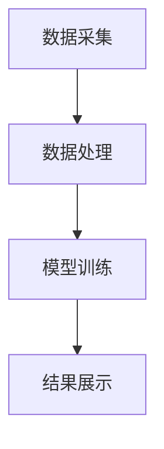

                 


# AI助力巴菲特式护城河分析：多维度评估竞争优势

> 关键词：AI技术，巴菲特护城河，竞争优势评估，商业分析，多维度模型

> 摘要：本文探讨了如何利用人工智能技术，从多维度对企业竞争优势进行评估，构建巴菲特式的护城河分析模型。通过分析企业市场地位、竞争壁垒、财务状况等多维度数据，结合AI算法，帮助企业识别核心竞争优势，制定投资策略。

---

# 第一部分: 护城河分析的背景与核心概念

## 第1章: 护城河分析的背景与意义

### 1.1 投资中的护城河概念

#### 1.1.1 护城河的定义与特征

护城河是巴菲特投资理论中的核心概念，指企业在长期竞争中能够保持竞争优势的结构性特征。护城河的宽度决定了企业的防御能力，宽度越宽，竞争优势越持久。

#### 1.1.2 护城河的分类

护城河主要分为五种类型：
1. **成本优势**：企业通过规模效应或独特的生产流程降低成本。
2. **品牌优势**：强大的品牌认知度使企业能够溢价定价。
3. **网络效应**：用户数量增加会增强产品的价值，如社交媒体平台。
4. **专利和技术优势**：拥有独家技术或专利权。
5. **运营效率**：高效的运营模式使企业能够快速响应市场需求。

#### 1.1.3 护城河分析的局限性

传统的护城河分析主要依赖定性判断，存在主观性强、难以量化等问题，尤其是在面对复杂市场环境时，分析结果可能不够准确。

---

### 1.2 AI技术在商业分析中的应用

#### 1.2.1 AI技术的核心优势

AI技术能够处理海量数据，发现数据中的隐藏规律，帮助投资者更精准地识别护城河。

#### 1.2.2 AI在护城河分析中的应用

通过自然语言处理（NLP）分析企业财报和新闻，利用机器学习模型预测企业竞争优势的变化趋势。

#### 1.2.3 技术融合的潜力

AI技术能够将护城河分析从定性评估转向定量分析，结合多维度数据，构建更全面的竞争优势评估模型。

---

## 第2章: 多维度护城河评估模型的构建

### 2.1 多维度模型的构建逻辑

#### 2.1.1 维度划分

从市场地位、竞争壁垒、财务状况、创新能力和客户忠诚度五个维度进行分析。

#### 2.1.2 各维度的特征

- **市场地位**：市场份额、市场进入壁垒。
- **竞争壁垒**：技术专利、品牌影响力。
- **财务状况**：盈利能力、现金流。
- **创新能力**：研发投入、新产品推出频率。
- **客户忠诚度**：客户满意度、复购率。

#### 2.1.3 综合评估公式

$$ \text{综合竞争优势} = \sum_{i=1}^{5} w_i \cdot s_i $$

其中，$w_i$ 是第i个维度的权重，$s_i$ 是第i个维度的评分。

---

### 2.2 数据来源与预处理

#### 2.2.1 数据来源

- 企业财报数据
- 行业研究报告
- 媒体新闻
- 专利数据库
- 用户评价

#### 2.2.2 数据清洗

- 处理缺失值
- 标准化数据
- 去除异常值

---

## 第3章: AI驱动的护城河评估算法

### 3.1 基于机器学习的护城河分析

#### 3.1.1 算法选择

使用随机森林或支持向量机（SVM）进行分类或回归分析。

#### 3.1.2 特征工程

将多维度数据转换为模型可识别的特征向量。

#### 3.1.3 模型训练

通过训练数据优化模型参数，提升预测精度。

---

## 第4章: 系统架构与实现

### 4.1 系统设计

#### 4.1.1 系统模块划分

- 数据采集模块
- 数据处理模块
- 模型训练模块
- 结果展示模块

#### 4.1.2 系统流程图



---

## 第5章: 项目实战

### 5.1 环境安装

安装Python、TensorFlow、Pandas等工具。

### 5.2 数据处理代码

```python
import pandas as pd
import numpy as np

# 读取数据
df = pd.read_csv('data.csv')

# 数据清洗
df.dropna(inplace=True)
df['score'] = df['score'].astype(float)
```

### 5.3 模型实现

```python
from sklearn.ensemble import RandomForestRegressor

model = RandomForestRegressor(n_estimators=100)
model.fit(X_train, y_train)
```

### 5.4 结果分析

通过模型预测企业竞争优势评分，生成可视化报告。

---

## 第6章: 总结与展望

### 6.1 小结

本文介绍了如何利用AI技术构建多维度护城河分析模型，为企业竞争优势评估提供新思路。

### 6.2 注意事项

数据质量和模型调优对分析结果影响重大，需谨慎处理。

### 6.3 拓展阅读

建议深入学习机器学习和商业分析相关知识，探索更多应用场景。

---

作者：AI天才研究院 & 禅与计算机程序设计艺术

