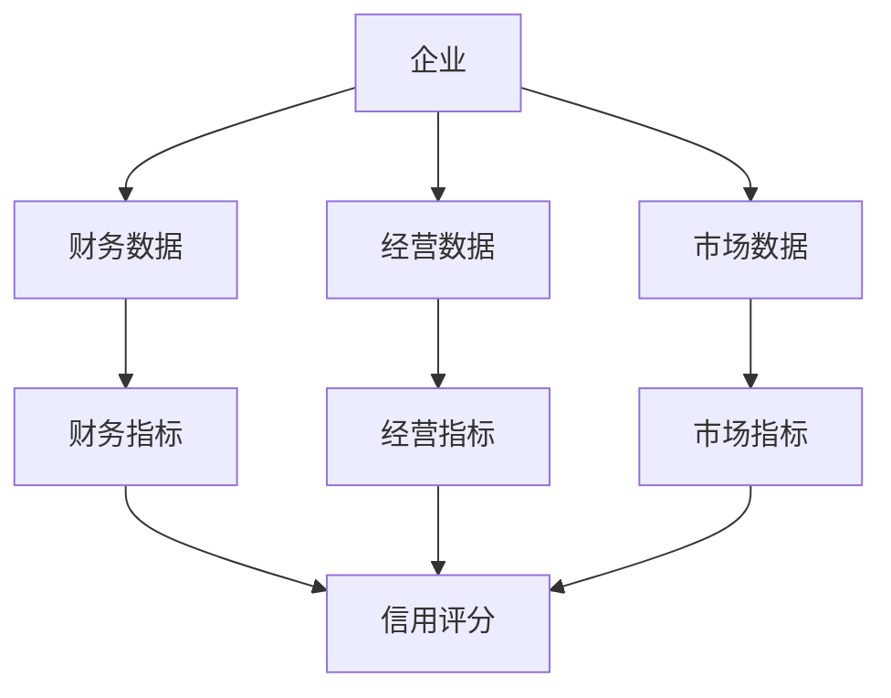
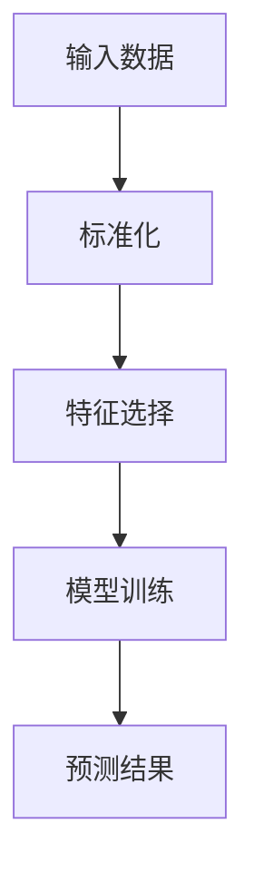
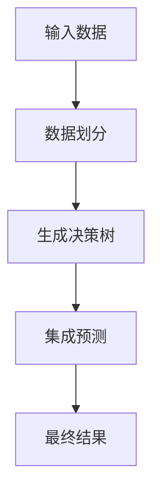
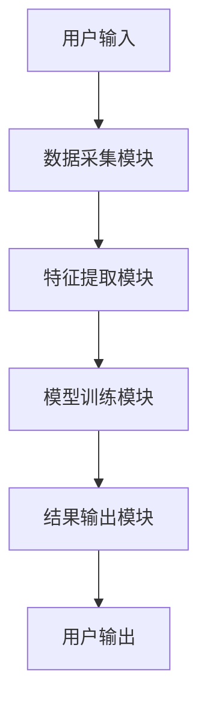
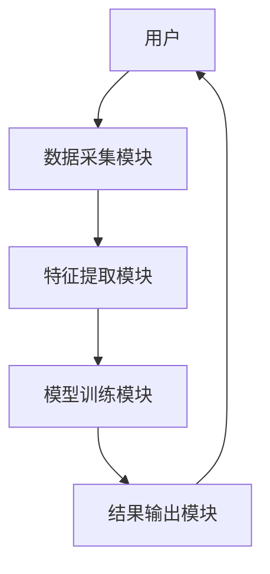

                 


# AI在企业信用评级中的应用与挑战

## 关键词：AI，企业信用评级，机器学习，深度学习，信用风险

## 摘要：本文详细探讨了人工智能在企业信用评级中的应用与挑战。从企业信用评级的基本概念出发，分析了AI技术如何通过数据处理、模型优化和自动化流程提升信用评级的效率与准确性。文章重点介绍了常用AI算法的原理、流程图及数学公式，并通过系统架构设计和项目实战案例，展示了AI在企业信用评级中的实际应用。最后，本文总结了AI技术在信用评级中的优势与局限，并提出了未来的发展方向。

---

## 第一部分: AI在企业信用评级中的应用与挑战概述

### 第1章: 企业信用评级的基本概念

#### 1.1 企业信用评级的定义与作用
企业信用评级是对企业在一定时期内的财务状况、经营能力和偿债能力进行综合评估，并给出信用等级的过程。信用评级的结果直接影响企业的融资成本、市场信任度和投资决策。

#### 1.2 AI技术的基本概念与特点
人工智能（AI）是指计算机系统模拟人类智能的能力，包括学习、推理、自我改进等。AI的核心技术包括机器学习、深度学习、自然语言处理等。AI的特点是数据驱动、自动化和高效率。

#### 1.3 企业信用评级的背景与意义
随着经济全球化和金融市场的复杂化，企业信用评级的重要性日益凸显。传统的信用评级方法依赖人工审核，存在效率低、主观性强等问题。AI技术的应用为企业信用评级提供了新的解决方案，能够显著提高评级的准确性和效率。

---

### 第2章: AI在企业信用评级中的应用背景

#### 2.1 传统企业信用评级的局限性
- **数据量不足**：传统方法通常依赖少量的财务数据，难以全面反映企业的信用状况。
- **模型复杂性**：传统模型可能过于简单，难以捕捉复杂的信用风险。
- **效率低下**：人工审核耗时长，且容易受到主观因素的影响。

#### 2.2 AI技术对企业信用评级的推动作用
- **数据处理能力提升**：AI能够处理大量非结构化数据，如文本、图像等，丰富了信用评级的维度。
- **模型优化与预测精度提高**：机器学习算法能够发现数据中的复杂模式，提高预测准确性。
- **自动化与智能化**：AI能够实现信用评级的自动化，减少人工干预，提高效率。

---

### 第3章: AI在企业信用评级中的核心概念与联系

#### 3.1 企业信用评级的核心要素
- **财务指标**：如资产负债率、利润率等。
- **经营能力**：如市场份额、管理团队稳定性等。
- **市场风险**：如行业波动、宏观经济环境等。

#### 3.2 AI技术在信用评级中的应用流程
1. **数据采集与预处理**：收集企业的财务数据、市场数据等，并进行清洗和标准化。
2. **特征提取与选择**：从数据中提取关键特征，去除冗余信息。
3. **模型训练与优化**：使用机器学习算法训练模型，并进行参数调优。
4. **结果输出与解释**：生成信用评级结果，并提供可解释性的分析。

#### 3.3 核心概念的ER实体关系图



---

## 第二部分: AI在企业信用评级中的算法原理

### 第4章: 常用算法原理与流程图

#### 4.1 逻辑回归算法
- **算法原理**：逻辑回归是一种用于分类的统计方法，适用于二分类问题。
- **模型公式**：
  $$ P(y=1|x) = \frac{1}{1 + e^{-\beta x}} $$
- **流程图**：



#### 4.2 随机森林算法
- **算法原理**：随机森林是一种基于决策树的集成学习方法，通过组合多个决策树的结果来提高准确性。
- **流程图**：



---

## 第三部分: 企业信用评级系统的架构设计

### 第5章: 系统架构设计与实现

#### 5.1 问题场景介绍
企业信用评级系统需要处理大量的数据，包括财务数据、市场数据等，并利用AI算法生成信用评分。

#### 5.2 系统功能设计
- **数据采集模块**：负责数据的收集与预处理。
- **特征提取模块**：提取关键特征并进行降维。
- **模型训练模块**：训练机器学习模型并进行优化。
- **结果输出模块**：生成信用评分并提供解释。

#### 5.3 系统架构设计



#### 5.4 系统接口设计
- **输入接口**：接收企业的各项数据。
- **输出接口**：返回信用评分及解释。

#### 5.5 系统交互设计



---

## 第四部分: 项目实战

### 第6章: 项目实战与案例分析

#### 6.1 环境安装
- 安装Python、机器学习库（如scikit-learn、xgboost）等。

#### 6.2 核心代码实现

```python
import pandas as pd
from sklearn.model_selection import train_test_split
from sklearn.linear_model import LogisticRegression
from sklearn.metrics import accuracy_score

# 数据加载与预处理
df = pd.read_csv('企业数据.csv')
X = df.drop('信用评分', axis=1)
y = df['信用评分']

# 数据划分
X_train, X_test, y_train, y_test = train_test_split(X, y, test_size=0.2)

# 模型训练
model = LogisticRegression()
model.fit(X_train, y_train)

# 模型预测
y_pred = model.predict(X_test)

# 模型评估
print("准确率：", accuracy_score(y_test, y_pred))
```

#### 6.3 案例分析
以某企业为例，通过上述代码实现信用评分的预测，并分析结果的准确性。

---

## 第五部分: 最佳实践与总结

### 第7章: AI在企业信用评级中的最佳实践

#### 7.1 小结
AI技术在企业信用评级中的应用显著提高了评级的效率和准确性。然而，AI模型的可解释性和数据隐私等问题仍需进一步解决。

#### 7.2 注意事项
- 数据隐私保护：避免数据泄露风险。
- 模型解释性：确保模型结果可解释。
- 模型更新：定期更新模型以应对数据变化。

#### 7.3 未来展望
- 更多数据源的整合：如社交媒体数据、供应链数据等。
- 更复杂的模型应用：如深度学习模型的应用。
- 自动化与智能化：实现信用评级的完全自动化。

#### 7.4 拓展阅读
推荐阅读《机器学习实战》、《深度学习》等书籍，深入了解AI技术的更多应用。

---

## 作者：AI天才研究院/AI Genius Institute & 禅与计算机程序设计艺术 /Zen And The Art of Computer Programming

