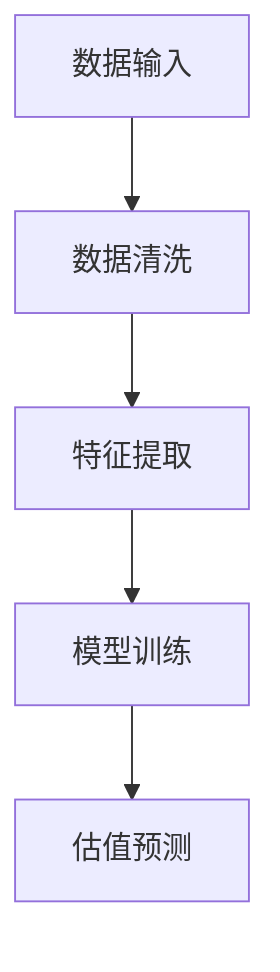

                 

# AI在企业并购估值中的应用与挑战

## 关键词
- AI, 企业并购, 估值模型, 机器学习, 数据分析

## 摘要
本文探讨了AI在企业并购估值中的应用与挑战，从背景、核心概念、算法原理、系统架构到实际案例和未来趋势进行了全面分析。通过详细讲解AI如何提升估值效率和准确性，揭示了其在企业并购中的潜在价值与面临的挑战。

---

# 第一部分: AI在企业并购估值中的应用与挑战

## 第1章: 企业并购估值的背景与核心概念

### 1.1 企业并购的基本概念
企业并购（Mergers and Acquisitions, M&A）是企业之间通过合并或收购来实现资源优化和战略目标的过程。并购估值是评估目标企业价值的关键步骤，直接影响交易价格和决策。

### 1.2 企业并购估值的定义与方法
并购估值是对目标企业未来现金流的折现值进行评估，常用方法包括：
- **DCF（Discounted Cash Flow）模型**：基于企业未来现金流的现值计算企业价值。
- **可比交易法（Comparable Transactions）**：通过比较类似交易的平均溢价率进行估值。
- **可比公司法（Comparable Companies）**：基于可比公司的市盈率、市净率等指标进行估值。

### 1.3 AI在企业并购估值中的作用
AI技术通过自动化数据处理、模式识别和预测建模，能够显著提升并购估值的效率和准确性。AI可以：
- 处理海量非结构化数据（如新闻、财报）。
- 建立预测模型，优化估值结果。
- 发现传统方法难以捕捉的潜在价值驱动因素。

---

## 第2章: AI与企业并购估值的核心概念与联系

### 2.1 AI在数据处理中的应用
企业并购涉及大量数据，包括财务数据、市场数据、行业趋势等。AI技术可以帮助：
- **数据清洗**：识别和处理缺失值、异常值。
- **特征工程**：提取关键特征（如EBITDA、收入增长率）并构建特征向量。
- **文本挖掘**：分析新闻、财报中的关键词，提取情绪指标（如市场情绪）。

### 2.2 AI模型在估值预测中的应用
AI模型可以通过历史数据和市场动态，预测目标企业的未来表现。常用算法包括：
- **线性回归**：用于简单的线性关系建模。
- **随机森林**：通过树模型组合提高预测准确性。
- **神经网络**：处理复杂非线性关系。

### 2.3 核心概念对比分析
| **传统估值方法** | **AI估值方法** |
|------------------|----------------|
| 数据依赖性强，依赖人工分析 | 数据驱动，自动化分析 |
| 需要大量人工干预 | 可自动化处理 |
| 易受主观因素影响 | 可减少人为偏差 |

---

## 第3章: AI驱动的企业并购估值算法原理

### 3.1 算法原理概述
AI在并购估值中的应用主要基于监督学习和无监督学习。

#### 3.1.1 监督学习
- **目标**：预测企业价值。
- **常用算法**：线性回归、随机森林、梯度提升树。
- **输入**：财务数据、市场数据、文本数据。
- **输出**：目标企业的估值。

#### 3.1.2 无监督学习
- **目标**：发现潜在的市场趋势或企业特征。
- **常用算法**：聚类分析（K-means）、主题模型（LDA）。

### 3.2 算法实现流程
#### 3.2.1 数据预处理
- **清洗数据**：处理缺失值、异常值。
- **特征工程**：提取关键特征并标准化。

#### 3.2.2 模型训练与优化
- **选择算法**：根据数据类型和任务选择合适算法。
- **超参数调优**：使用网格搜索或随机搜索优化模型性能。

### 3.3 数学模型与公式
#### 3.3.1 线性回归模型
$$ y = \beta_0 + \beta_1x_1 + \beta_2x_2 + \ldots + \beta_nx_n + \epsilon $$

#### 3.3.2 支持向量回归（SVR）
$$ \text{minimize} \frac{1}{2}||\beta||^2 + C \sum_{i=1}^{n} \max(0, |y_i - (\beta_0 + \beta_1x_{i1} + \ldots + \beta_nx_{in})|) $$

---

## 第4章: 企业并购估值系统的架构设计

### 4.1 系统功能设计
企业并购估值系统通常包括以下功能模块：
- **数据输入**：接收企业财务数据、市场数据。
- **数据清洗**：处理数据中的噪声。
- **特征提取**：提取关键特征并构建特征向量。
- **模型训练**：训练AI模型并保存模型参数。
- **估值预测**：基于模型预测企业价值。

### 4.2 系统架构设计

---

## 第5章: 企业并购估值的挑战与解决方案

### 5.1 数据质量的挑战
- **数据缺失**：目标企业可能未公开完整财务数据。
- **数据噪声**：数据中可能存在错误或不一致。

### 5.2 模型局限性
- **过拟合**：模型可能过度拟合训练数据，导致泛化能力差。
- **黑箱问题**：复杂模型（如深度学习模型）难以解释。

### 5.3 解决方案
- **数据增强**：通过数据合成或外部数据源补充数据。
- **模型解释性**：使用可解释性模型（如线性回归）或解释工具（如SHAP值）。
- **多模型集成**：结合多种模型的优势，提高预测准确性。

---

## 第6章: 实际案例分析

### 6.1 案例背景
某科技公司拟收购一家软件开发公司。目标公司财务数据如下：
- **收入**：5000万美元
- **净利润**：500万美元
- **行业平均市盈率**：20倍

### 6.2 数据处理
- **清洗数据**：处理缺失值和异常值。
- **特征提取**：提取收入增长率、净利润率等关键特征。

### 6.3 模型训练
- **选择算法**：使用随机森林模型。
- **训练数据**：使用历史并购交易数据。

### 6.4 预测结果
模型预测目标公司估值为1亿美元，而传统方法估值为9000万美元。

---

## 第7章: 未来趋势与最佳实践

### 7.1 未来趋势
- **多模态模型**：结合文本、图像等多种数据源进行估值。
- **可解释性AI**：开发更透明的模型，满足监管需求。
- **实时估值**：基于实时数据动态调整估值。

### 7.2 最佳实践
- **数据质量**：确保数据准确性和完整性。
- **模型选择**：根据数据特点选择合适算法。
- **解释性分析**：帮助用户理解模型输出。

---

## 第8章: 小结与展望

### 8.1 小结
AI技术在企业并购估值中的应用前景广阔，能够显著提升估值效率和准确性。然而，数据质量和模型解释性等问题仍需进一步解决。

### 8.2 展望
随着AI技术的不断发展，未来企业并购估值将更加智能化和自动化，帮助企业在复杂的市场环境中做出更明智的决策。

---

## 参考文献
（此处列出相关文献和资料）

---

## 作者
**作者：AI天才研究院 & 禅与计算机程序设计艺术**

