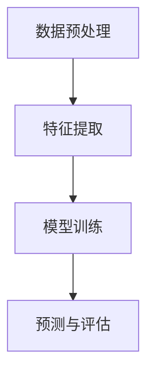
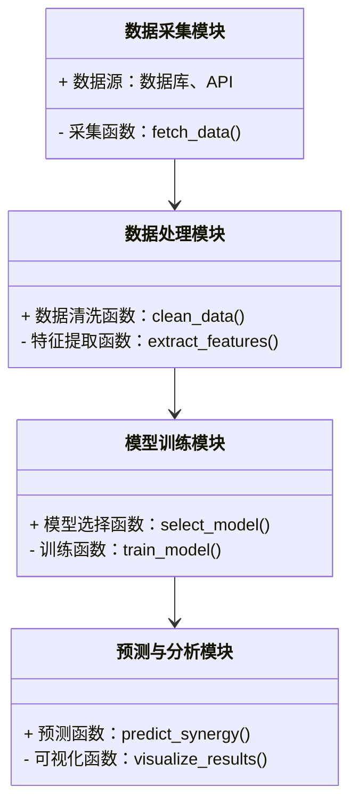

                 


# AI在企业并购协同效应预测中的应用与挑战

> 关键词：企业并购、协同效应、人工智能、机器学习、预测模型

> 摘要：企业并购中的协同效应预测是企业战略决策中的重要环节，传统方法存在诸多局限性。本文系统介绍了AI技术在协同效应预测中的应用，从数据收集、模型构建到系统实现，详细阐述了AI如何提升预测的准确性和效率。同时，本文分析了当前应用中的挑战，并提出了未来的研究方向和最佳实践建议。

---

## 第1章：企业并购与协同效应概述

### 1.1 企业并购的基本概念
企业并购是指企业之间通过购买、合并等方式，将两个或多个独立的企业结合成一个企业的过程。并购通常分为横向并购、纵向并购和混合并购三种类型，目的是为了实现资源优化配置、扩大市场份额或提升竞争力。

协同效应是企业并购的核心价值所在，它指的是并购后企业整体价值超过两家独立企业价值之和的现象。协同效应主要体现在财务、战略和管理三个方面：

- **财务协同效应**：通过成本节约、收入增加等方式提升整体盈利能力。
- **战略协同效应**：通过整合战略资源、优化业务布局提升市场竞争力。
- **管理协同效应**：通过整合管理团队、优化组织结构提升管理效率。

### 1.2 AI在企业并购中的应用背景
传统的企业并购协同效应预测方法依赖于财务数据和专家经验，存在以下问题：

- 数据维度有限：传统方法主要依赖财务数据，难以全面捕捉企业间的潜在协同效应。
- 预测准确性低：专家经验主观性强，难以量化和验证。
- 计算复杂度高：复杂的企业关系和市场环境导致预测模型难以构建。

AI技术的引入为协同效应预测提供了新的解决方案。通过机器学习算法，企业可以利用海量数据，发现传统方法难以捕捉的模式和关系，从而提高预测的准确性和效率。AI的优势主要体现在以下方面：

- 数据处理能力强：能够处理结构化和非结构化数据，提取更多维度的特征。
- 模型可解释性高：通过算法分析，可以明确各因素对协同效应的影响程度。
- 预测速度快：AI算法能够快速处理大量数据，提高预测效率。

### 1.3 本章小结
本章介绍了企业并购的基本概念和协同效应的分类，分析了传统预测方法的局限性，并阐述了AI技术在协同效应预测中的应用背景和优势。

---

## 第2章：协同效应预测的核心概念

### 2.1 协同效应的构成要素
协同效应的构成要素可以从财务、战略和管理三个维度进行分析：

1. **财务协同效应**：通过整合企业资源，降低运营成本，提升收入水平。例如，通过共享供应链和采购渠道降低成本。
2. **战略协同效应**：通过优化业务布局，提升市场竞争力。例如，通过并购进入新的市场领域。
3. **管理协同效应**：通过整合管理团队和组织结构，提升管理效率。例如，通过整合研发团队提升创新能力。

### 2.2 协同效应预测的关键指标
协同效应预测的关键指标可以从财务和非财务两个维度进行分析：

- **财务指标**：包括成本节约率、收入增长率、利润率提升等。
- **非财务指标**：包括品牌价值提升、组织文化融合度、员工满意度等。

### 2.3 协同效应预测的边界与外延
协同效应预测的边界是指预测的范围和条件，例如并购双方的行业相似性、地理位置等因素都会影响协同效应的实现。协同效应的外延则是指其影响范围，例如对整个产业链的影响、对市场竞争格局的影响等。

### 2.4 本章小结
本章详细分析了协同效应的构成要素和关键指标，并讨论了预测的边界和外延，为后续AI技术的应用奠定了基础。

---

## 第3章：AI技术在协同效应预测中的应用

### 3.1 数据收集与预处理
协同效应预测的数据来源主要包括企业财务数据、市场数据和文本数据。数据预处理包括数据清洗、特征提取和标准化。

#### 数据来源
- 企业财务数据：包括收入、利润、成本等。
- 市场数据：包括行业趋势、竞争状况等。
- 文本数据：包括企业公告、新闻报道等。

#### 数据预处理
- 数据清洗：去除重复数据、处理缺失值。
- 特征提取：从文本数据中提取关键词、从财务数据中提取关键指标。
- 数据标准化：将数据转换为统一的格式，便于模型训练。

### 3.2 协同效应预测的AI模型选择
根据预测目标和数据类型，可以选择不同的AI模型。常用的模型包括线性回归、随机森林和神经网络。

#### 线性回归
线性回归适用于线性关系的预测，模型简单易懂，但可能无法捕捉复杂的非线性关系。

公式：
$$ y = \beta_0 + \beta_1x_1 + \beta_2x_2 + \dots + \beta_nx_n $$

#### 随机森林
随机森林是一种基于决策树的集成算法，具有高准确性和强抗过拟合能力。

#### 神经网络
神经网络适用于复杂的非线性关系，但模型较为复杂，需要大量数据支持。

### 3.3 协同效应预测的算法实现
以下是使用随机森林算法进行协同效应预测的实现流程：

#### 算法流程图


#### Python代码实现
```python
from sklearn.ensemble import RandomForestRegressor
from sklearn.metrics import mean_squared_error

# 数据预处理
X = df.drop('协同效应', axis=1)
y = df['协同效应']

# 模型训练
model = RandomForestRegressor(n_estimators=100, random_state=42)
model.fit(X, y)

# 预测与评估
y_pred = model.predict(X)
print(mean_squared_error(y, y_pred))
```

### 3.4 本章小结
本章详细介绍了AI技术在协同效应预测中的应用，从数据预处理到模型选择，再到算法实现，为后续系统架构设计奠定了基础。

---

## 第4章：协同效应预测的系统架构与实现

### 4.1 系统功能设计
协同效应预测系统主要包括以下功能模块：

1. **数据采集模块**：从数据库或外部数据源获取企业并购相关数据。
2. **数据处理模块**：对数据进行清洗、特征提取和标准化。
3. **模型训练模块**：选择合适的AI模型进行训练。
4. **预测与分析模块**：输出预测结果并进行可视化分析。

#### 系统功能模块


### 4.2 系统架构设计
协同效应预测系统的架构设计采用分层结构，包括数据层、服务层和表现层。

#### 系统架构图
```mermaid
rectangle 数据层 {
    数据库：存储企业并购数据
    API接口：连接外部数据源
}
rectangle 服务层 {
    数据处理服务：负责数据清洗和特征提取
    模型训练服务：负责模型训练和预测
}
rectangle 表现层 {
    用户界面：展示预测结果和可视化分析
}
数据层 --> 服务层
服务层 --> 表现层
```

### 4.3 本章小结
本章从系统架构的角度，详细设计了协同效应预测系统的功能模块和服务架构，为实际应用提供了参考。

---

## 第5章：系统实现与项目实战

### 5.1 项目实战：协同效应预测系统实现

#### 环境安装
需要安装以下Python库：
- `pandas`：数据处理
- `scikit-learn`：机器学习算法
- `matplotlib`：数据可视化

#### 数据准备
使用企业并购数据集，数据集包括以下字段：
- 企业A收入
- 企业B收入
- 企业A利润
- 企业B利润
- 并购类型（横向、纵向、混合）

#### 模型训练
使用随机森林算法训练模型，代码如下：

```python
import pandas as pd
from sklearn.ensemble import RandomForestRegressor
from sklearn.metrics import mean_squared_error

# 数据加载
df = pd.read_csv('并购数据.csv')

# 特征选择
X = df[['企业A收入', '企业B收入', '企业A利润', '企业B利润', '并购类型']]
y = df['协同效应']

# 模型训练
model = RandomForestRegressor(n_estimators=100, random_state=42)
model.fit(X, y)

# 预测与评估
y_pred = model.predict(X)
print(mean_squared_error(y, y_pred))
```

#### 预测分析
通过模型预测结果，可以分析不同并购类型对协同效应的影响。例如，横向并购可能带来更高的收入协同效应，而纵向并购可能带来更高的成本节约。

### 5.2 本章小结
本章通过实际案例，详细展示了协同效应预测系统的实现过程，包括环境安装、数据准备、模型训练和预测分析。

---

## 第6章：总结与展望

### 6.1 总结
本文系统介绍了AI技术在企业并购协同效应预测中的应用，从数据处理到模型选择，再到系统实现，全面阐述了AI技术的优势和实现方法。通过实际案例，展示了AI技术在提升预测准确性和效率方面的巨大潜力。

### 6.2 展望
尽管AI技术在协同效应预测中取得了显著成果，但仍面临以下挑战：

- **数据质量问题**：数据的准确性和完整性直接影响预测结果。
- **模型解释性**：复杂的模型可能导致预测结果难以解释。
- **动态变化**：企业并购后的协同效应可能受到外部环境变化的影响。

未来的研究方向包括：

- 结合自然语言处理技术，进一步提升文本数据的分析能力。
- 研究更复杂的深度学习模型，如Transformer和图神经网络，以捕捉更多的潜在关系。
- 开发动态预测模型，实时跟踪协同效应的变化。

### 6.3 最佳实践
- 数据准备阶段，应尽量收集多维度的数据，包括财务、市场和文本数据。
- 模型选择阶段，应根据数据特性和预测目标选择合适的算法。
- 模型评估阶段，应结合准确率和解释性进行综合评估。

### 6.4 本章小结
本文总结了AI技术在协同效应预测中的应用成果，并展望了未来的研究方向和最佳实践。

---

## 作者：AI天才研究院 & 禅与计算机程序设计艺术

作者简介：我们是专注于人工智能与计算机程序设计的研究机构，致力于为企业提供创新的技术解决方案和深度技术洞察。

