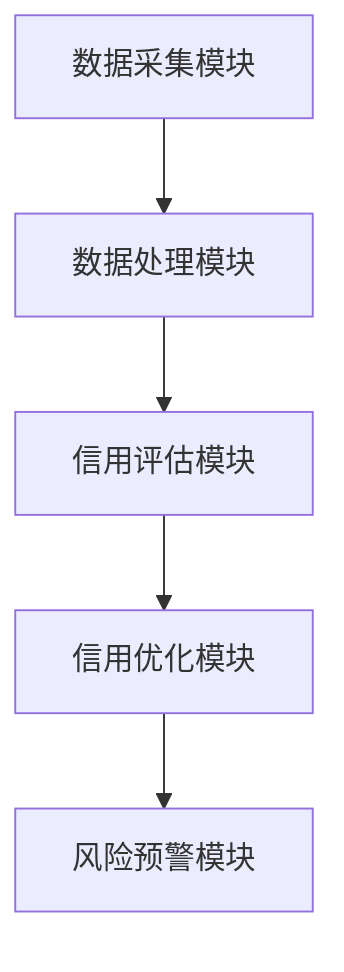

                 


# AI在供应链金融信用网络优化中的深度应用

> 关键词：供应链金融，信用网络，人工智能，图神经网络，强化学习

> 摘要：本文深入探讨了人工智能技术在供应链金融信用网络优化中的应用，结合具体算法原理和数学模型，详细讲解了如何利用AI技术解决供应链金融中的信用评估和风险控制问题，优化供应链信用网络结构，提升供应链整体效率和安全性。

---

# 第1章: 供应链金融与信用网络概述

## 1.1 供应链金融的基本概念

### 1.1.1 供应链金融的定义与特点

供应链金融（Supply Chain Finance, SCF）是指通过整合供应链上的企业（供应商、制造商、分销商、零售商等）的资源和信息，优化资金流动，降低整体供应链成本，提高供应链效率的一种金融模式。其特点包括：

- **整体性**：关注整个供应链的协同运作，而非单一企业。
- **协作性**：供应链上下游企业之间需要高度协作。
- **动态性**：供应链金融需要根据市场变化动态调整。

### 1.1.2 供应链金融的核心参与方

- **核心企业**：供应链中的主导企业，通常是制造商或大型零售商。
- **供应商**：为供应链提供原材料或中间产品的上游企业。
- **分销商/零售商**：负责产品分销和零售的下游企业。
- **金融机构**：包括银行、供应链金融服务提供商等，为供应链上的企业提供融资支持。
- **技术平台**：利用区块链、大数据、人工智能等技术提供供应链金融服务支持。

### 1.1.3 供应链金融的业务流程

1. **需求分析**：核心企业分析供应链中的资金需求。
2. **信用评估**：金融机构对供应链上的企业进行信用评估。
3. **融资支持**：为符合条件的企业提供融资支持。
4. **资金流动**：资金在供应链上下游企业间流动。
5. **监控与管理**：监控资金使用情况，确保资金安全。

## 1.2 信用网络在供应链金融中的作用

### 1.2.1 信用网络的基本概念

信用网络是指供应链中企业之间基于信任和信用关系形成的网络结构。在供应链金融中，信用网络是连接上下游企业的重要桥梁，决定了资金流动的顺畅程度。

### 1.2.2 信用网络的构建与优化目标

- **构建目标**：通过分析供应链中企业的信用关系，构建一个高效的信用网络。
- **优化目标**：提高信用评估的准确性，降低信用风险，提升供应链的整体资金流动性。

### 1.2.3 信用网络在供应链金融中的价值

- **降低风险**：通过优化信用网络，降低供应链中的信用风险。
- **提高效率**：优化信用网络可以减少交易成本，提高资金流动效率。
- **增强协作**：信用网络优化有助于加强供应链上下游企业的协作。

## 1.3 AI在供应链金融中的应用前景

### 1.3.1 供应链金融中的痛点与挑战

- **信用评估难度大**：传统信用评估方法依赖于企业财务数据，难以全面反映企业的信用状况。
- **信息孤岛问题**：供应链中的信息分散在不同企业，难以整合。
- **风险控制难度高**：供应链涉及多个企业，风险来源复杂。

### 1.3.2 AI技术如何解决供应链金融问题

- **数据驱动的信用评估**：利用AI技术，可以从海量数据中提取有用信息，进行更精准的信用评估。
- **实时监控与预警**：通过AI技术，可以实时监控供应链中的资金流动和信用风险，及时发出预警。
- **动态优化**：AI技术可以根据市场变化和企业信用状况的变化，动态调整信用网络结构。

### 1.3.3 AI在信用网络优化中的潜在价值

- **提高信用评估的准确性**：通过AI技术，可以利用机器学习模型，提高信用评估的准确性。
- **降低信用风险**：通过AI技术，可以识别潜在风险，提前采取措施，降低信用风险。
- **优化供应链效率**：通过优化信用网络结构，可以提高供应链的整体效率。

## 1.4 本章小结

本章介绍了供应链金融的基本概念、信用网络在供应链金融中的作用，以及AI技术在供应链金融中的应用前景。通过AI技术，可以解决供应链金融中的痛点与挑战，优化信用网络结构，提高供应链的整体效率和安全性。

---

# 第2章: 供应链信用网络优化的核心概念与AI技术原理

## 2.1 供应链信用网络的结构与优化目标

### 2.1.1 供应链信用网络的构成要素

- **节点**：供应链中的企业，包括供应商、制造商、分销商、零售商等。
- **边**：企业之间的信用关系，表示企业之间的信任和协作程度。

### 2.1.2 信用网络的节点与关系分析

- **节点属性**：包括企业的规模、信用评级、历史交易记录等。
- **边属性**：包括信用关系的强度、信任度等。

### 2.1.3 信用网络的拓扑特征

- **度数**：节点的度数表示其在信用网络中的重要程度。
- **中心性**：节点的中心性表示其在信用网络中的影响力。
- **社区结构**：信用网络中可能存在多个社区，每个社区代表一组高度协作的企业。

## 2.2 供应链信用网络优化的目标

### 2.2.1 提高信用评估的准确性

通过优化信用网络结构，提高对企业的信用评估准确性。

### 2.2.2 降低信用风险

通过优化信用网络结构，降低供应链中的信用风险。

### 2.2.3 提高供应链的资金流动性

通过优化信用网络结构，提高供应链中资金的流动性，降低企业融资成本。

## 2.3 AI技术在信用网络优化中的核心原理

### 2.3.1 数据挖掘与特征提取

- **数据来源**：包括企业财务数据、交易数据、市场数据等。
- **特征提取**：通过数据挖掘技术，提取对企业信用评估有影响的关键特征。

### 2.3.2 信用风险评估与预测

- **机器学习模型**：包括支持向量机（SVM）、随机森林（Random Forest）、神经网络等。
- **风险预测**：通过机器学习模型，预测企业信用风险。

### 2.3.3 网络结构优化与动态调整

- **网络优化**：通过图算法，优化信用网络的结构，提高信用评估的准确性。
- **动态调整**：根据市场变化和企业信用状况的变化，动态调整信用网络结构。

## 2.4 本章小结

本章介绍了供应链信用网络的结构与优化目标，以及AI技术在信用网络优化中的核心原理。通过AI技术，可以提高信用评估的准确性，降低信用风险，优化供应链的资金流动性。

---

# 第3章: AI技术在信用网络优化中的算法原理与数学模型

## 3.1 信用网络优化的数学模型

### 3.1.1 信用网络优化的数学建模

- **节点表示**：使用图论中的节点表示法，表示供应链中的企业。
- **边表示**：使用图论中的边表示法，表示企业之间的信用关系。
- **权重表示**：使用权重表示法，表示企业之间的信用关系强度。

### 3.1.2 信用评估的数学模型

- **线性回归模型**：用于预测企业的信用评分。
- **逻辑回归模型**：用于分类企业的信用风险等级。
- **神经网络模型**：用于复杂的信用评估任务。

### 3.1.3 信用风险的数学表达

- **概率论**：用于计算企业的违约概率。
- **统计学**：用于分析企业的信用数据，识别信用风险。

## 3.2 基于图神经网络的信用评估模型

### 3.2.1 图神经网络的基本原理

- **图结构**：图神经网络可以处理图结构数据，适合处理信用网络中的企业关系。
- **节点表示**：通过图神经网络，可以将信用网络中的节点（企业）表示为低维向量。
- **边表示**：通过图神经网络，可以将信用网络中的边（企业关系）表示为低维向量。

### 3.2.2 图注意力机制的实现

- **注意力机制**：通过注意力机制，图神经网络可以关注信用网络中的重要节点和边。
- **图注意力网络（GAT）**：一种基于注意力机制的图神经网络，可以用于信用评估。

### 3.2.3 基于GAT的信用评估模型

- **模型结构**：包括输入层、注意力层、聚合层、输出层。
- **训练方法**：使用监督学习方法，训练模型进行信用评估。

## 3.3 基于强化学习的信用网络优化算法

### 3.3.1 强化学习的基本原理

- **状态空间**：包括信用网络的当前状态。
- **动作空间**：包括可以采取的动作，如调整信用关系、优化信用评估模型。
- **奖励函数**：根据信用网络优化的目标，定义奖励函数。

### 3.3.2 状态空间与动作空间的定义

- **状态表示**：信用网络的状态可以用图结构表示。
- **动作表示**：优化信用网络的动作可以用图操作表示。

### 3.3.3 基于强化学习的信用网络优化策略

- **策略网络**：通过强化学习，训练策略网络，优化信用网络结构。
- **探索与利用**：在优化过程中，策略网络需要在探索新动作和利用已知动作之间进行平衡。

## 3.4 本章小结

本章介绍了信用网络优化的数学模型，以及基于图神经网络和强化学习的信用评估和优化算法。通过这些算法，可以实现对信用网络的优化，提高信用评估的准确性，降低信用风险。

---

# 第4章: 信用网络优化的算法实现

## 4.1 基于图神经网络的信用评估算法实现

### 4.1.1 数据预处理与特征提取

- **数据清洗**：处理缺失值、异常值等。
- **特征提取**：从信用网络中提取关键特征，如节点度数、边权重等。

### 4.1.2 图注意力机制的实现代码

```python
import tensorflow as tf
from tensorflow.keras import layers

class GraphAttentionLayer(layers.Layer):
    def __init__(self, input_dim, output_dim):
        super(GraphAttentionLayer, self).__init__()
        self.W_q = layers.Dense(input_dim, activation='softmax')
        self.W_k = layers.Dense(input_dim, activation='softmax')
        self.W_v = layers.Dense(input_dim, activation='softmax')
        self.W_out = layers.Dense(output_dim)

    def call(self, inputs):
        # Query, Key, Value = inputs
        q = self.W_q(inputs)
        k = self.W_k(inputs)
        v = self.W_v(inputs)
        attention = tf.matmul(q, tf.transpose(k, [0, 2, 1]))
        attention = tf.nn.softmax(attention)
        output = tf.matmul(attention, v)
        output = self.W_out(output)
        return output
```

### 4.1.3 模型训练与评估

- **训练数据**：使用历史信用数据进行训练。
- **评估指标**：包括准确率、召回率、F1分数等。

## 4.2 基于强化学习的信用网络优化算法实现

### 4.2.1 状态空间与动作空间的定义

- **状态表示**：信用网络的状态可以用图结构表示。
- **动作表示**：优化信用网络的动作可以用图操作表示。

### 4.2.2 基于强化学习的信用网络优化策略

- **策略网络**：通过强化学习，训练策略网络，优化信用网络结构。
- **探索与利用**：在优化过程中，策略网络需要在探索新动作和利用已知动作之间进行平衡。

## 4.3 本章小结

本章详细讲解了基于图神经网络和强化学习的信用评估和优化算法的实现。通过具体的代码和算法流程图，读者可以清晰地理解这些算法的工作原理和实现步骤。

---

# 第5章: 供应链信用网络优化的系统架构与项目实战

## 5.1 系统架构设计

### 5.1.1 系统功能设计

- **数据采集模块**：负责采集供应链中的企业数据。
- **信用评估模块**：负责对供应链中的企业进行信用评估。
- **信用优化模块**：负责优化信用网络结构。
- **风险预警模块**：负责实时监控信用网络中的风险。

### 5.1.2 系统架构图



### 5.1.3 系统接口设计

- **数据接口**：与供应链中的企业数据源对接。
- **用户接口**：供用户查看信用评估结果和优化建议。
- **预警接口**：实时预警信用网络中的风险。

## 5.2 项目实战

### 5.2.1 环境配置

- **编程语言**：Python 3.8+
- **深度学习框架**：TensorFlow 2.0+
- **依赖库**：包括Keras、PyTorch、networkx等。

### 5.2.2 系统核心实现源代码

```python
import tensorflow as tf
from tensorflow.keras import layers

class GCN(layers.Layer):
    def __init__(self, input_dim, output_dim):
        super(GCN, self).__init__()
        self.W = layers.Dense(input_dim, activation='relu')
        self.A = layers.Dense(input_dim, activation='softmax')

    def call(self, inputs):
        # 输入：(batch_size, num_nodes, input_dim)
        # 输出：(batch_size, num_nodes, output_dim)
        X, A = inputs
        X = self.W(X)
        A = self.A(A)
        output = tf.matmul(A, X)
        return output
```

### 5.2.3 代码应用解读与分析

- **数据预处理**：对信用网络数据进行清洗和特征提取。
- **模型训练**：使用训练数据训练信用评估模型。
- **模型优化**：通过强化学习优化信用网络结构。

## 5.3 实际案例分析

### 5.3.1 案例背景

- **行业**：制造业供应链。
- **数据来源**：某制造业供应链中的企业信用数据。

### 5.3.2 案例分析

- **信用评估**：使用图神经网络模型对供应链中的企业进行信用评估。
- **信用优化**：通过强化学习优化信用网络结构，降低信用风险。

## 5.4 项目小结

本章通过系统架构设计和项目实战，详细讲解了如何利用AI技术优化供应链信用网络。通过具体的案例分析，读者可以更好地理解AI技术在供应链金融中的实际应用。

---

# 作者：AI天才研究院/AI Genius Institute & 禅与计算机程序设计艺术 /Zen And The Art of Computer Programming

