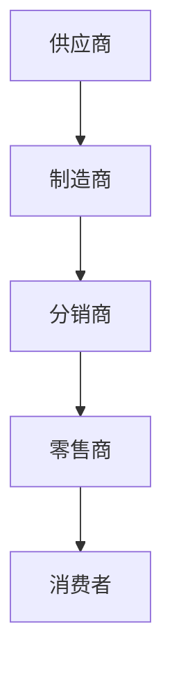
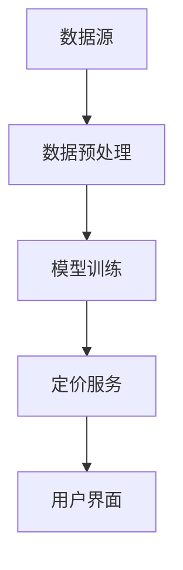

                 


# AI在供应链金融动态定价中的深度应用

> 关键词：供应链金融、动态定价、人工智能、机器学习、深度学习

> 摘要：供应链金融是现代金融体系中的重要组成部分，而动态定价作为供应链管理中的关键环节，其准确性直接影响企业的利润和风险控制。随着人工智能技术的快速发展，AI在供应链金融动态定价中的应用日益广泛。本文将从供应链金融的基本概念出发，深入探讨动态定价的原理、AI技术的应用场景，详细分析机器学习和深度学习算法在动态定价中的具体应用，最后结合实际案例展示AI技术在供应链金融动态定价中的优势和效果。

---

## 第一部分: 供应链金融与动态定价概述

### 第1章: 供应链金融与动态定价概述

#### 1.1 供应链金融的基本概念
供应链金融是指通过整合供应链上的供应商、制造商、分销商、零售商和消费者等多方资源，利用金融工具优化供应链的资金流、物流和信息流，降低整体成本，提高效率的金融活动。

#### 1.2 动态定价的定义与特点
动态定价是指根据市场环境、供需关系、成本变化等因素，实时调整产品或服务价格的定价策略。其核心特点包括实时性、数据驱动性和精准性。

#### 1.3 AI在供应链金融中的应用前景
AI技术能够通过大数据分析和机器学习算法，帮助企业在供应链金融中实现更精准的定价、更高效的决策和更优化的风险控制。

---

## 第二部分: 供应链金融动态定价的核心概念与联系

### 第2章: 供应链金融动态定价模型

#### 2.1 动态定价模型的原理
动态定价模型通过收集和分析市场数据、历史交易数据、供需关系等信息，利用算法预测价格变化趋势，并生成最优定价策略。

#### 2.2 供应链金融中的关键实体关系
以下是供应链金融中的关键实体关系图：


#### 2.3 动态定价模型与传统定价模型的对比
| 对比维度 | 传统定价模型 | 动态定价模型 |
|----------|--------------|--------------|
| 数据来源 | 静态数据     | 动态数据     |
| 响应速度 | 低           | 高           |
| 精准度   | 一般         | 高           |

---

## 第三部分: AI在供应链金融动态定价中的算法原理

### 第3章: AI算法在动态定价中的应用

#### 3.1 机器学习在动态定价中的应用
机器学习通过训练模型，利用历史数据预测价格变化趋势。例如，线性回归模型可以用于简单的价格趋势预测，而随机森林模型则适合处理复杂的非线性关系。

#### 3.2 深度学习在动态定价中的应用
深度学习通过构建神经网络模型，能够捕捉数据中的复杂特征和模式。例如，LSTM（长短期记忆网络）可以用于时间序列分析，帮助预测未来的价格走势。

---

## 第四部分: 供应链金融动态定价系统的架构与实现

### 第4章: 系统架构与实现

#### 4.1 系统功能设计
系统功能模块包括数据采集、模型训练、定价服务和结果展示。

#### 4.2 系统架构设计
以下是系统架构图：


---

## 第五部分: 项目实战与案例分析

### 第5章: 项目实战

#### 5.1 环境配置
需要安装Python 3.8及以上版本，以及以下库：pandas、numpy、scikit-learn、keras、tensorflow。

#### 5.2 核心代码实现
以下是动态定价模型的核心代码：
```python
import pandas as pd
from sklearn.linear_model import LinearRegression
from sklearn.metrics import mean_squared_error

# 数据预处理
data = pd.read_csv('pricing_data.csv')
X = data[['demand', 'cost', 'market_trend']]
y = data['price']

# 模型训练
model = LinearRegression()
model.fit(X, y)

# 模型预测
predictions = model.predict(X)
print('均方误差:', mean_squared_error(y, predictions))
```

---

## 第六部分: 总结与展望

### 第6章: 总结与展望

#### 6.1 总结
本文详细探讨了AI在供应链金融动态定价中的应用，从理论到实践，展示了如何利用机器学习和深度学习技术优化定价策略。

#### 6.2 展望
未来，随着AI技术的进一步发展，动态定价模型将更加智能化和个性化，为企业在供应链金融中的竞争力提供更强大的支持。

---

作者：AI天才研究院/AI Genius Institute & 禅与计算机程序设计艺术/Zen And The Art of Computer Programming

---

**这篇文章通过详细分析供应链金融动态定价的核心概念、AI算法的应用原理、系统架构设计以及实际项目案例，全面展示了AI技术在供应链金融中的深度应用。**

