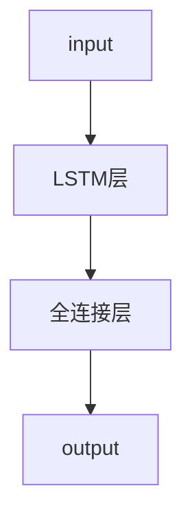

                 


# AI在供应链金融风险预警中的深度应用

## 关键词：供应链金融，人工智能，风险预警，机器学习，深度学习

## 摘要：  
供应链金融作为现代企业运营中的重要环节，其风险管理直接影响企业的稳健发展。随着人工智能技术的飞速发展，AI在供应链金融领域的应用日益广泛，特别是在风险预警方面展现出巨大潜力。本文将深入探讨AI技术如何在供应链金融风险预警中发挥作用，结合具体案例分析，详细阐述相关算法原理和系统架构设计。通过本文的阅读，读者将能够全面理解AI在供应链金融风险预警中的深度应用及其实际价值。

---

## 第1章：供应链金融的基本概念与AI的应用前景

### 1.1 供应链金融的定义与特点  
供应链金融是指通过整合供应链上下游企业之间的资金流、信息流和物流，为核心企业提供融资支持的一种金融服务模式。其特点包括：  
- **协同性**：整合供应链上下游资源，实现协同管理。  
- **嵌入性**：金融服务嵌入到供应链的实际业务流程中。  
- **动态性**：根据供应链的实际运营情况，实时调整融资策略。  

供应链金融的核心目标是降低中小企业的融资门槛，优化资金流动效率，同时降低整个供应链体系的风险。

### 1.2 AI在供应链金融中的应用背景  
供应链金融的传统模式依赖于人工审核和经验判断，存在效率低、风险高、成本高等问题。AI技术的引入，尤其是机器学习和深度学习算法的应用，为供应链金融的风险管理提供了新的解决方案。  
- **数据驱动**：通过大数据分析，AI能够从海量数据中提取有价值的信息，帮助识别潜在风险。  
- **实时监控**：AI系统可以实时监控供应链中的资金流动和交易数据，快速发现异常情况。  
- **自动化决策**：AI能够基于历史数据和实时信息，自动做出融资决策或风险预警。  

### 1.3 供应链金融风险预警的必要性  
供应链金融涉及多个参与方，包括供应商、制造商、分销商和零售商等。由于信息不对称和信任问题，供应链中的风险（如违约风险、流动性风险）难以有效管理。  
- **信用风险**：供应商或客户可能因经营状况恶化而无法履行合同义务。  
- **流动性风险**：资金链断裂可能导致供应链中断。  
- **操作风险**：人为操作失误或欺诈行为可能引发财务损失。  

通过AI技术，企业可以建立智能化的风险预警系统，提前发现并应对潜在风险，从而降低供应链金融的整体风险敞口。

### 1.4 本章小结  
本章介绍了供应链金融的基本概念及其在AI技术驱动下的应用前景，强调了AI在供应链金融风险预警中的重要性。下一章将深入探讨AI技术在供应链金融中的核心概念，包括风险预警的核心要素、关键算法及其系统架构。

---

## 第2章：AI技术在供应链金融中的核心概念

### 2.1 供应链金融风险预警的核心要素  
供应链金融风险预警系统需要关注以下几个核心要素：  
- **参与方的信用评估**：通过机器学习模型评估供应链上下游企业的信用状况。  
- **资金流动分析**：监控资金在供应链中的流动情况，识别异常的资金流动模式。  
- **交易数据特征**：分析交易数据中的异常行为，如交易频率、金额和时间的突变。  

#### 表2-1：供应链金融风险类型对比表  

| 风险类型       | 描述                                                                 | 可能引发的问题                     |
|----------------|----------------------------------------------------------------------|------------------------------------|
| 信用风险       | 供应链参与方因信用问题无法履行合同义务                             | 资金链断裂，供应链中断             |
| 流动性风险     | 企业资金流动性不足，难以应对突发的资金需求                         | 供应链中断，企业经营困难           |
| 操作风险       | 人为操作失误或欺诈行为导致的财务损失                               | 资金流失，企业声誉受损             |
| 市场风险       | 市场波动导致供应链上下游企业的经营状况恶化                           | 资金需求增加，企业难以获得融资     |

### 2.2 AI在供应链金融中的关键算法  
AI技术在供应链金融中的应用主要依赖以下几种算法：  
- **机器学习**：用于信用评估和风险评分。  
- **深度学习**：用于复杂的数据特征提取和非线性关系建模。  
- **自然语言处理（NLP）**：用于分析企业财务报告和新闻舆情。  

#### 图2-1：供应链金融实体关系图  

```mermaid
graph LR
    A[供应商] --> B[制造商]
    B --> C[分销商]
    C --> D[零售商]
    E[银行] --> A, B, C, D
```

### 2.3 供应链金融风险预警的系统架构  
供应链金融风险预警系统的架构设计需要考虑系统的模块化、可扩展性和灵活性。  

#### 图2-2：系统架构设计  


### 2.4 本章小结  
本章详细介绍了供应链金融风险预警的核心要素、关键算法及其系统架构，为后续章节的算法原理和系统实现奠定了基础。

---

## 第3章：供应链金融风险预警的算法原理

### 3.1 机器学习在供应链风险预警中的应用  
机器学习算法在供应链金融风险预警中的应用主要体现在信用评估和风险评分方面。  

#### 图3-1：机器学习模型流程图  

```mermaid
graph TD
    start --> data_cleaning[数据清洗]
    data_cleaning --> feature_engineering[特征工程]
    feature_engineering --> model_training[模型训练]
    model_training --> model_prediction[模型预测]
    model_prediction --> end
```

#### 代码示例：基于逻辑回归的信用评分模型  

```python
import pandas as pd
from sklearn.model_selection import train_test_split
from sklearn.linear_model import LogisticRegression

# 数据加载与预处理
data = pd.read_csv('supply_chain_data.csv')
X = data.drop('default_flag', axis=1)
y = data['default_flag']

# 数据分割
X_train, X_test, y_train, y_test = train_test_split(X, y, test_size=0.2, random_state=42)

# 模型训练
model = LogisticRegression()
model.fit(X_train, y_train)

# 模型预测
y_pred = model.predict(X_test)
print("模型准确率：", model.score(X_test, y_test))
```

### 3.2 深度学习在供应链风险预警中的应用  
深度学习算法（如神经网络、LSTM）在处理复杂数据特征和时间序列数据方面具有显著优势。  

#### 图3-2：LSTM模型结构图  



#### 代码示例：基于LSTM的时间序列预测  

```python
from keras.models import Sequential
from keras.layers import LSTM, Dense

# 数据准备
X_train = X_train.reshape(X_train.shape[0], X_train.shape[1], 1)
X_test = X_test.reshape(X_test.shape[0], X_test.shape[1], 1)

# 模型构建
model = Sequential()
model.add(LSTM(50, return_sequences=True, input_shape=(timesteps, features)))
model.add(LSTM(50, return_sequences=False))
model.add(Dense(1))

# 模型训练
model.compile(loss='mean_squared_error', optimizer='adam')
model.fit(X_train, y_train, epochs=10, batch_size=32)
```

### 3.3 算法对比与选择  
不同的算法在供应链金融风险预警中的表现取决于数据特征和业务需求。逻辑回归适合小规模数据，而深度学习算法适合处理大规模和复杂数据。  

#### 表3-1：算法对比表  

| 算法类型   | 优点                     | 缺点                       |
|------------|--------------------------|----------------------------|
| 逻辑回归   | 计算简单，易于解释         | 非线性关系表现较差           |
| 支持向量机 | 高维数据表现好             | 参数敏感性高                 |
| 随机森林   | 抗过拟合能力强             | 解释性较弱                   |
| LSTM       | 时间序列数据表现优异       | 计算资源消耗大               |

### 3.4 本章小结  
本章详细讲解了机器学习和深度学习算法在供应链金融风险预警中的应用，通过对比分析，帮助读者选择适合具体场景的算法。

---

## 第4章：供应链金融风险预警的系统架构设计

### 4.1 系统功能模块设计  
供应链金融风险预警系统主要包括以下几个功能模块：  
- **数据采集模块**：从供应链各参与方收集数据。  
- **数据预处理模块**：清洗和标准化数据。  
- **风险评估模块**：基于机器学习模型进行风险评分。  
- **风险预警模块**：根据评估结果生成预警信息。  

#### 图4-1：系统功能模块划分  


### 4.2 系统架构设计  
供应链金融风险预警系统的架构设计可以采用微服务架构，确保系统的可扩展性和灵活性。  

#### 图4-2：系统架构设计  

```mermaid
graph LR
    API Gateway --> Service1[数据采集服务]
    API Gateway --> Service2[数据处理服务]
    API Gateway --> Service3[风险评估服务]
    API Gateway --> Service4[预警通知服务]
```

### 4.3 系统接口设计  
系统接口设计需要考虑数据输入、模型调用和预警通知的流程。  

#### 图4-3：系统交互流程图  

```mermaid
graph TD
    start --> data_collection[数据采集]
    data_collection --> data_processing[数据处理]
    data_processing --> model_prediction[模型预测]
    model_prediction --> warning_notification[预警通知]
    warning_notification --> end
```

### 4.4 本章小结  
本章详细描述了供应链金融风险预警系统的功能模块、架构设计和交互流程，为后续的系统实现提供了清晰的指导。

---

## 第5章：项目实战——供应链金融风险预警系统开发

### 5.1 环境安装与配置  
- **Python版本**：推荐使用Python 3.8及以上版本。  
- **依赖库安装**：`pandas`, `numpy`, `scikit-learn`, `keras`, `tensorflow`。  

#### 代码示例：环境配置  

```bash
pip install pandas numpy scikit-learn keras tensorflow
```

### 5.2 核心代码实现  
- **数据预处理**：清洗和特征工程。  
- **模型训练**：基于逻辑回归或LSTM构建风险预警模型。  
- **预警规则设定**：根据模型输出结果设定预警阈值。  

#### 代码示例：核心代码实现  

```python
import pandas as pd
from sklearn.model_selection import train_test_split
from sklearn.metrics import accuracy_score

# 数据加载与预处理
data = pd.read_csv('supply_chain.csv')
X = data.drop('risk_flag', axis=1)
y = data['risk_flag']

# 数据分割
X_train, X_test, y_train, y_test = train_test_split(X, y, test_size=0.2, random_state=42)

# 模型训练与评估
model = LogisticRegression()
model.fit(X_train, y_train)
y_pred = model.predict(X_test)
print("模型准确率：", accuracy_score(y_test, y_pred))
```

### 5.3 案例分析  
通过一个实际案例，展示系统在供应链金融风险预警中的应用效果。例如，某制造企业通过AI系统提前发现供应商的信用风险，避免了潜在的财务损失。  

### 5.4 项目总结  
本项目通过AI技术实现了供应链金融风险预警系统的开发，验证了AI在供应链金融中的应用价值。  

---

## 第6章：总结与展望

### 6.1 本章总结  
本文详细探讨了AI技术在供应链金融风险预警中的应用，从算法原理到系统架构设计，再到项目实战，全面展示了AI在供应链金融中的深度应用。  

### 6.2 未来展望  
随着AI技术的不断发展，供应链金融风险预警系统将更加智能化和自动化。未来的研究方向包括：  
- 更加复杂的深度学习模型（如Transformer）的应用。  
- 多模态数据（如文本、图像）的融合分析。  
- 区块链技术与AI的结合，进一步提升供应链金融的安全性和透明度。  

---

## 作者：AI天才研究院/AI Genius Institute & 禅与计算机程序设计艺术 /Zen And The Art of Computer Programming

---

以上是《AI在供应链金融风险预警中的深度应用》的完整目录和内容概览。

