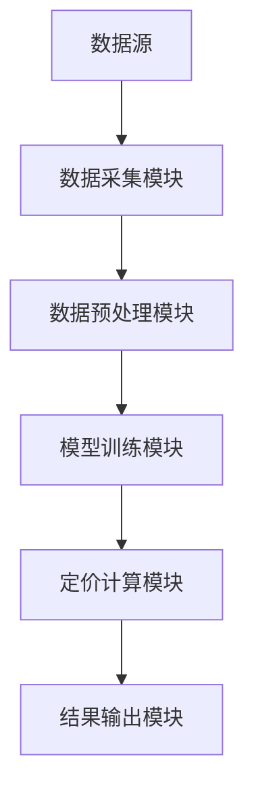
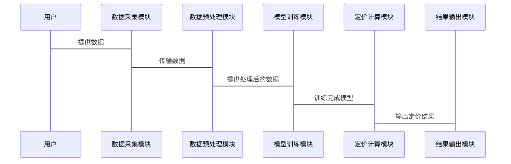

                 


# AI在保险产品创新与风险定价中的深度应用

> **关键词**：人工智能、保险产品创新、风险定价、机器学习、深度学习

> **摘要**：本文深入探讨了人工智能技术在保险产品创新与风险定价中的应用，分析了传统保险模式的局限性，详细讲解了基于机器学习和自然语言处理的保险产品设计方法，以及深度学习在风险定价中的数学模型和算法实现。通过实际案例分析，展示了AI技术如何推动保险行业的数字化转型，并提供了系统架构设计与项目实战的详细指南。

---

# 第1章: 保险行业的数字化转型与AI的兴起

## 1.1 保险行业的现状与挑战

### 1.1.1 保险行业的传统模式与痛点

保险行业作为金融体系的重要组成部分，传统的业务模式依赖于精算模型和人工审核，存在以下痛点：

- **效率低下**：传统保险产品的设计和审批流程繁琐，耗时较长。
- **精准度不足**：基于经验的定价模型难以捕捉复杂的风险因素。
- **客户体验差**：传统服务模式难以满足个性化需求，客户体验不佳。

### 1.1.2 数字化转型的必要性

随着互联网和移动应用的普及，保险行业的数字化转型已成为必然趋势。数字化转型可以提高业务效率、降低成本，并为客户提供更好的服务体验。

### 1.1.3 AI技术在保险行业的应用前景

AI技术的快速发展为保险行业带来了新的机遇，尤其是在产品创新和风险定价方面。通过机器学习和深度学习，保险公司可以更精准地识别风险、设计产品，并优化定价策略。

---

## 1.2 AI技术的核心概念与保险行业的结合

### 1.2.1 AI技术的基本原理

人工智能（AI）是模拟人类智能的技术，主要包括以下关键组成部分：

- **机器学习**：通过数据训练模型，使其能够从数据中学习并做出预测。
- **自然语言处理（NLP）**：理解和生成人类语言，广泛应用于保险条款生成和客户服务。
- **深度学习**：基于人工神经网络的机器学习方法，能够处理复杂的数据模式。

### 1.2.2 AI在保险产品设计中的应用

AI技术可以用于保险产品的个性化设计和条款生成。例如，通过自然语言处理技术，可以根据客户需求自动生成定制化的保险条款。

### 1.2.3 AI在风险定价中的作用

AI可以通过分析大量的历史数据和实时信息，帮助保险公司更准确地评估风险并制定合理的定价策略。

---

## 1.3 保险科技的发展与AI的深度融合

### 1.3.1 保险科技的定义与特点

保险科技（InsurTech）是指利用新技术（如人工智能、区块链、大数据等）来改善或创新保险业务模式。

### 1.3.2 AI技术在保险科技中的应用

AI技术在保险科技中的应用主要体现在产品创新、客户服务和风险管理等方面。

### 1.3.3 保险科技与传统保险模式的对比

保险科技通过数字化和智能化的方式，显著提高了保险业务的效率和客户体验。与传统模式相比，保险科技更加注重数据驱动和技术创新。

---

## 1.4 本章小结

本章介绍了保险行业的现状与挑战，探讨了AI技术的基本原理及其在保险行业的应用前景，最后分析了保险科技的发展趋势。

---

# 第2章: AI在保险产品创新中的应用

## 2.1 保险产品的传统设计与AI的创新模式

### 2.1.1 保险产品的传统设计流程

传统保险产品的设计流程通常包括需求分析、精算模型设计、条款生成和产品审批等步骤，耗时较长且灵活性不足。

### 2.1.2 AI在保险产品设计中的创新模式

AI技术可以通过数据驱动的方式，快速生成和优化保险产品设计。例如，利用机器学习算法分析市场需求，自动生成个性化的产品方案。

### 2.1.3 AI驱动的产品个性化定制

通过AI技术，保险公司可以根据客户的特定需求，定制个性化的产品条款和服务内容。

---

## 2.2 基于AI的保险产品设计技术

### 2.2.1 机器学习在保险产品设计中的应用

机器学习算法可以帮助保险公司分析市场数据，识别潜在客户需求，并生成相应的保险产品。

### 2.2.2 自然语言处理在保险条款生成中的应用

NLP技术可以用于自动生成保险条款，优化条款内容，并提高条款的可读性。

### 2.2.3 图灵测试在保险产品设计中的应用

图灵测试可以用于评估AI生成的产品设计是否符合人类专家的水平。

---

## 2.3 AI在保险产品创新中的案例分析

### 2.3.1 健康保险产品的创新设计

通过AI技术分析客户的健康数据，设计个性化的健康保险产品。

### 2.3.2 财产保险产品的创新设计

利用AI技术优化保险条款，降低理赔风险。

### 2.3.3 人寿保险产品的创新设计

通过AI技术预测客户需求，设计更符合客户生命周期的产品。

---

## 2.4 本章小结

本章详细探讨了AI技术在保险产品创新中的应用，介绍了基于机器学习和NLP的保险产品设计方法，并通过案例分析展示了AI在不同保险产品中的创新应用。

---

# 第3章: AI在风险定价中的核心作用

## 3.1 风险定价的传统方法与AI的结合

### 3.1.1 风险定价的传统方法

传统风险定价方法主要依赖精算模型和经验数据，存在灵活性不足的问题。

### 3.1.2 AI技术在风险定价中的应用

AI技术可以通过分析大量的数据，提高风险定价的准确性和效率。

### 3.1.3 AI在风险定价中的优势

AI技术能够实时分析动态数据，捕捉传统方法难以识别的风险因素。

---

## 3.2 基于机器学习的保险定价模型

### 3.2.1 机器学习在保险定价中的应用

机器学习模型可以通过训练数据，预测客户的风险等级，并生成个性化的定价策略。

### 3.2.2 深度学习在保险定价中的应用

深度学习模型可以处理复杂的非结构化数据，进一步提高风险定价的准确性。

---

## 3.3 AI在风险定价中的具体实现

### 3.3.1 数据预处理

数据预处理是AI定价模型的第一步，包括数据清洗、特征提取和数据增强。

### 3.3.2 模型训练

通过训练数据，模型可以学习到风险定价的规律，并生成定价策略。

### 3.3.3 模型优化

通过调参和优化算法，提高模型的预测准确性和计算效率。

---

## 3.4 本章小结

本章探讨了AI技术在风险定价中的应用，介绍了基于机器学习和深度学习的定价模型，并详细讲解了模型的具体实现步骤。

---

# 第4章: 系统架构设计与AI技术的实现

## 4.1 系统架构设计

### 4.1.1 系统功能模块划分

系统功能模块包括数据采集、模型训练、定价计算和结果输出等部分。

### 4.1.2 系统架构图



### 4.1.3 系统交互流程



---

## 4.2 项目实战: AI驱动的保险定价系统

### 4.2.1 项目环境配置

```python
# 安装所需的Python库
pip install numpy
pip install pandas
pip install scikit-learn
pip install tensorflow
```

### 4.2.2 核心代码实现

```python
import numpy as np
import pandas as pd
from sklearn.model import LinearRegression
import tensorflow as tf

# 数据预处理
data = pd.read_csv('insurance_data.csv')
X = data[['age', 'sex', 'bmi', 'children', 'smoker', 'region']]
y = data['charges']

# 模型训练
model = LinearRegression()
model.fit(X, y)

# 深度学习模型
model_deep = tf.keras.Sequential([
    tf.keras.layers.Dense(64, activation='relu'),
    tf.keras.layers.Dense(1, activation='linear')
])
model_deep.compile(optimizer='adam', loss='mean_squared_error')
model_deep.fit(X, y, epochs=100, batch_size=32)
```

---

## 4.3 本章小结

本章详细讲解了AI驱动的保险定价系统的系统架构设计，并通过实际案例展示了项目的具体实现过程。

---

# 第5章: 数学模型与算法原理

## 5.1 机器学习模型的数学基础

### 5.1.1 线性回归模型

$$ y = \beta_0 + \beta_1 x + \epsilon $$

### 5.1.2 逻辑回归模型

$$ P(Y=1|X) = \frac{e^{\beta_0 + \beta_1 x}}{1 + e^{\beta_0 + \beta_1 x}} $$

---

## 5.2 深度学习模型的数学原理

### 5.2.1 多层感知机（MLP）

$$ a^{(l+1)} = \sigma(w^{(l)} a^{(l)} + b^{(l)}) $$

### 5.2.2 注意力机制

$$ \text{Attention}(Q, K, V) = \text{softmax}\left(\frac{QK^T}{\sqrt{d_k}}\right)V $$

---

## 5.3 算法实现与优化

### 5.3.1 梯度下降算法

$$ \theta := \theta - \eta \frac{\partial L}{\partial \theta} $$

### 5.3.2 参数调优

通过交叉验证和网格搜索优化模型参数，提高模型的性能。

---

## 5.4 本章小结

本章深入讲解了机器学习和深度学习模型的数学原理，并通过具体公式展示了算法的实现过程。

---

# 第6章: 最佳实践与未来展望

## 6.1 最佳实践

### 6.1.1 数据质量的重要性

确保数据的准确性和完整性，是AI模型性能的基础。

### 6.1.2 模型解释性

在保险领域，模型的解释性非常重要，需要确保客户能够理解定价的依据。

### 6.1.3 持续优化

定期更新模型，以应对市场变化和客户需求的变化。

---

## 6.2 未来展望

随着AI技术的不断发展，保险行业的数字化转型将更加深入。未来的保险产品将更加个性化和智能化，风险定价也将更加精准和动态。

---

## 6.3 小结与注意事项

在应用AI技术时，需要注意数据隐私和合规性问题，确保模型的透明性和可解释性。

---

## 6.4 拓展阅读

推荐书籍：
- 《机器学习实战》
- 《深度学习入门：基于Python和Keras》
- 《保险科技：人工智能与保险行业的融合》

---

# 附录: 术语表与参考文献

## 附录A: 术语表

- **AI**：人工智能
- **ML**：机器学习
- **NLP**：自然语言处理
- **DL**：深度学习
- **InsurTech**：保险科技

## 附录B: 参考文献

- 张某某. 《人工智能在保险行业的应用》. 北京: 某某出版社, 2023.
- 李某某. 《深度学习入门》. 北京: 某某出版社, 2022.

---

# 作者：AI天才研究院 & 禅与计算机程序设计艺术

---

**本文完**

