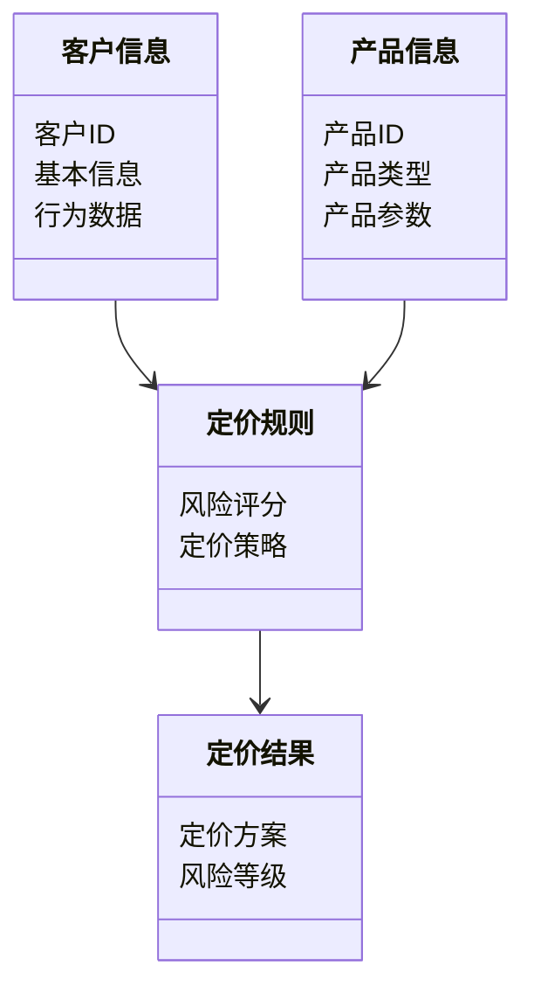
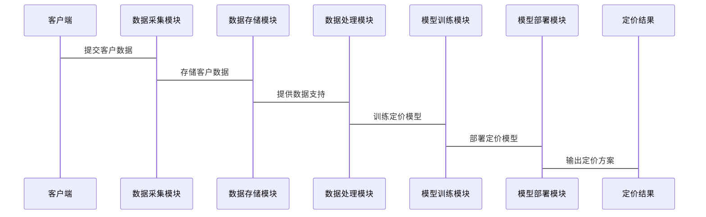

                 


# AI在保险定价个性化中的创新应用

## 关键词：人工智能, 保险定价, 个性化定价, 机器学习, 风险评估

## 摘要：随着人工智能技术的飞速发展，保险行业的传统定价模式正面临前所未有的挑战和变革。本文深入探讨了AI在保险定价个性化中的创新应用，分析了机器学习算法在保险定价中的核心作用，并通过实际案例展示了如何利用AI技术实现精准、高效的个性化定价策略。文章从AI技术的背景、核心概念、算法原理、系统架构到项目实战，全面解析了AI在保险定价中的应用，为保险行业数字化转型提供了新的思路和实践指南。

---

# 第一部分：AI与保险行业的融合

## 第1章：AI与保险行业的融合

### 1.1 AI技术的发展与保险行业的变革

#### 1.1.1 AI技术的演进历程
人工智能（AI）技术经历了从早期的规则引擎到现在的深度学习模型的演进。近年来，随着计算能力的提升和数据量的爆发式增长，AI技术在各个行业的应用取得了显著进展。特别是在保险行业，AI技术的应用正在改变传统的业务模式和服务方式。

#### 1.1.2 保险行业的数字化转型
保险行业正面临着数字化转型的浪潮。传统保险业务流程依赖人工操作，效率低下且成本高昂。通过AI技术，保险公司可以实现从客户获取、风险评估到理赔服务的全流程自动化，从而提升效率、降低成本并改善客户体验。

#### 1.1.3 AI在保险行业中的应用场景
AI技术在保险行业的应用广泛，包括智能客服、精准营销、风险评估、理赔自动化等。本文重点关注AI在保险定价中的应用，特别是个性化定价的创新实践。

---

### 1.2 保险定价的挑战与创新需求

#### 1.2.1 传统保险定价模式的局限性
传统的保险定价模式主要基于历史数据和经验判断，存在以下问题：
- 数据维度有限，难以覆盖客户的个性化需求。
- 定价策略缺乏灵活性，难以适应市场变化。
- 人工干预较多，导致定价效率低下。

#### 1.2.2 个性化定价的市场需求
随着消费者对个性化服务的需求不断增加，传统保险产品难以满足客户的多样化需求。个性化定价能够根据客户的实际情况提供差异化的产品和服务，从而提高客户满意度和市场竞争力。

#### 1.2.3 AI技术在保险定价中的潜力
AI技术能够通过大数据分析和机器学习算法，从海量数据中提取有价值的特征，构建精准的定价模型。这不仅能够提高定价的准确性，还能实现个性化定价，满足客户的多样化需求。

---

### 1.3 个性化保险定价的核心要素

#### 1.3.1 客户特征分析
个性化定价的基础是客户特征分析。通过收集和分析客户的 demographic（人口统计信息）、 behavioral（行为数据）、 transactional（交易数据）和 contextual（上下文数据）等信息，可以更好地理解客户的需求和风险。

#### 1.3.2 风险评估模型
风险评估模型是个性化定价的核心。通过机器学习算法，可以构建基于客户特征的评分模型，评估客户的风险等级，并据此制定个性化的定价策略。

#### 1.3.3 个性化定价策略
个性化定价策略是根据客户特征和风险评估结果，动态调整保险产品的价格和保障范围。通过AI技术，保险公司可以实现从静态定价到动态定价的转变，从而提高定价的精准性和灵活性。

---

## 第2章：AI驱动的保险定价模型

### 2.1 机器学习在保险定价中的应用

#### 2.1.1 监督学习在保险定价中的应用
监督学习是机器学习的重要分支，广泛应用于保险定价。例如，使用线性回归模型预测保险产品的价格，或者使用随机森林模型预测客户的风险等级。

#### 2.1.2 无监督学习在保险定价中的应用
无监督学习适用于数据量大且标签缺失的情况。例如，使用聚类算法将客户分为不同的群体，从而制定差异化的定价策略。

#### 2.1.3 强化学习在保险定价中的应用
强化学习通过模拟和优化决策过程，应用于动态定价和风险控制。例如，使用强化学习算法实时调整保险产品的价格，以应对市场变化。

---

### 2.2 保险定价的核心算法与模型

#### 2.2.1 线性回归模型
线性回归是一种简单而有效的回归模型，适用于线性关系的预测。其基本公式为：
$$ y = \beta_0 + \beta_1x_1 + \beta_2x_2 + \dots + \beta_nx_n $$

#### 2.2.2 决策树模型
决策树是一种基于树状结构的分类和回归模型。通过递归地划分数据，构建决策树的结构，从而实现客户风险评估和定价预测。

#### 2.2.3 随机森林模型
随机森林是一种基于决策树的集成学习算法。通过构建多棵决策树并进行投票或平均，提高模型的准确性和稳定性。

#### 2.2.4 梯度提升模型
梯度提升是一种基于树的集成学习算法，通过迭代地优化损失函数，构建强分类器。其代表算法包括XGBoost和LightGBM。

#### 2.2.5 神经网络模型
神经网络是一种模拟人脑神经网络的深度学习模型。通过多层神经元的组合，可以捕捉复杂的非线性关系，适用于高维数据的特征提取和定价预测。

---

### 2.3 基于AI的保险定价模型构建

#### 2.3.1 数据特征的选择与工程
数据特征的选择是构建定价模型的关键步骤。需要根据业务需求和数据特点，选择合适的特征，并进行数据清洗和特征变换。

#### 2.3.2 模型训练与优化
通过交叉验证和网格搜索等方法，选择最优的模型参数和超参数，优化模型的性能。

#### 2.3.3 模型评估与验证
使用训练数据和验证数据，评估模型的性能，包括准确率、召回率、F1分数等指标。

---

## 第3章：保险定价AI模型的算法原理

### 3.1 线性回归模型

#### 3.1.1 线性回归的基本原理
线性回归通过最小化预测值与实际值之间的平方差之和，找到最佳的回归系数。其数学公式为：
$$ \hat{y} = \beta_0 + \beta_1x_1 + \beta_2x_2 + \dots + \beta_nx_n $$

#### 3.1.2 普通最小二乘法的数学推导
普通最小二乘法通过求解正规方程，找到最优的回归系数。其正规方程为：
$$ (X^T X)^{-1} X^T y $$

---

### 3.2 决策树算法

#### 3.2.1 ID3算法的信息增益计算
ID3算法基于信息增益选择最优特征进行分裂。信息增益的计算公式为：
$$ \text{信息增益}(D, A) = H(D) - H(D|A) $$

#### 3.2.2 C4.5算法的分箱原理
C4.5算法通过将连续特征离散化为区间，构建决策树的结构。

#### 3.2.3 随机森林的集成学习原理
随机森林通过构建多棵决策树，并行地进行特征选择和数据采样，从而提高模型的泛化能力。

---

### 3.3 神经网络模型

#### 3.3.1 多层感知机（MLP）的结构
多层感知机由输入层、隐藏层和输出层组成，通过非线性激活函数捕捉数据的复杂关系。

#### 3.3.2 深度学习的前向传播过程
深度学习的前向传播过程通过多层神经元的组合，将输入数据映射到输出结果。

#### 3.3.3 梯度下降的优化方法
梯度下降是一种常用的优化算法，通过计算损失函数的梯度，更新模型参数，降低损失函数的值。

---

## 第4章：系统分析与架构设计方案

### 4.1 问题场景介绍
个性化保险定价系统需要实现从客户数据采集、特征提取、模型训练到定价输出的全流程自动化。

---

### 4.2 项目介绍

#### 4.2.1 项目背景
随着市场竞争的加剧，保险公司需要通过个性化定价策略，提高客户满意度和市场竞争力。

#### 4.2.2 项目目标
构建一个基于AI的个性化保险定价系统，实现精准定价和动态调整。

---

### 4.3 系统功能设计

#### 4.3.1 领域模型设计
领域模型包括客户信息、产品信息、定价规则和定价结果四个核心模块。



---

### 4.4 系统架构设计


---

### 4.5 系统接口设计

#### 4.5.1 API接口设计
通过RESTful API接口，实现系统的功能模块之间的通信。

#### 4.5.2 接口文档
详细描述API接口的请求参数、响应格式和错误处理机制。

---

### 4.6 系统交互设计



---

## 第5章：项目实战

### 5.1 环境搭建

#### 5.1.1 安装Python
安装Python 3.8及以上版本，并安装必要的库，如scikit-learn、xgboost、keras等。

#### 5.1.2 数据集准备
获取保险定价相关的数据集，包括客户信息、产品信息和历史定价数据。

---

### 5.2 系统核心实现

#### 5.2.1 数据预处理
对数据进行清洗、特征提取和归一化处理。

#### 5.2.2 特征工程
选择合适的特征，并进行特征组合和特征选择。

#### 5.2.3 模型训练
使用训练数据训练机器学习模型，并进行模型调优。

#### 5.2.4 模型评估
通过验证数据评估模型的性能，并进行模型优化。

---

### 5.3 代码实现

#### 5.3.1 数据预处理代码
```python
import pandas as pd
from sklearn.impute import SimpleImputer
from sklearn.preprocessing import StandardScaler

# 读取数据
data = pd.read_csv('insurance.csv')

# 数据清洗
data.dropna(inplace=True)

# 特征提取
features = data[['age', 'gender', 'region', 'coverage', 'claims']]
target = data['price']

# 特征工程
from sklearn.compose import ColumnTransformer
from sklearn.preprocessing import OneHotEncoder, StandardScaler

preprocessor = ColumnTransformer(
    transformers=[
        ('num', StandardScaler(), ['age']),
        ('cat', OneHotEncoder(), ['gender', 'region', 'coverage', 'claims'])
    ]
)

features_processed = preprocessor.fit_transform(features)
```

#### 5.3.2 模型训练代码
```python
from sklearn.ensemble import RandomForestRegressor
from sklearn.metrics import mean_squared_error

# 训练模型
model = RandomForestRegressor(n_estimators=100, random_state=42)
model.fit(features_processed, target)

# 模型预测
predictions = model.predict(features_processed)

# 模型评估
mse = mean_squared_error(target, predictions)
print(f'Mean Squared Error: {mse}')
```

---

### 5.4 实际案例分析

#### 5.4.1 案例背景
以车险定价为例，分析如何通过AI技术实现个性化定价。

#### 5.4.2 数据分析
收集车险客户的特征数据，包括年龄、驾驶记录、车辆类型等。

#### 5.4.3 模型构建
使用随机森林模型进行客户风险评估和定价预测。

#### 5.4.4 结果展示
通过可视化工具展示模型的定价结果和误差分析。

---

### 5.5 项目小结

通过本项目实战，我们成功构建了一个基于AI的个性化保险定价系统，验证了AI技术在保险定价中的巨大潜力。

---

## 第6章：最佳实践与注意事项

### 6.1 最佳实践

#### 6.1.1 数据质量的重要性
确保数据的完整性和准确性，是构建高质量AI模型的前提条件。

#### 6.1.2 模型解释性
选择具有解释性的模型，便于业务人员理解和应用。

#### 6.1.3 模型更新与维护
定期更新模型，确保其适应市场变化和客户需求。

---

### 6.2 小结

本文系统地介绍了AI在保险定价个性化中的创新应用，从理论到实践，全面解析了AI技术在保险定价中的核心作用。

---

### 6.3 注意事项

#### 6.3.1 数据隐私与安全
在处理客户数据时，必须遵守相关法律法规，保护客户隐私。

#### 6.3.2 模型的可解释性
复杂的模型可能导致业务人员难以理解和信任，因此需要注重模型的可解释性。

#### 6.3.3 技术与业务的结合
AI技术的应用必须与业务需求紧密结合，才能真正发挥其价值。

---

### 6.4 拓展阅读

#### 6.4.1 推荐书籍
- 《机器学习实战》
- 《深度学习入门：基于Python的理论与实现》

#### 6.4.2 推荐博客
- [Towards Data Science](https://towardsdatascience.com/)
- [Kaggle](https://www.kaggle.com/)

---

## 第7章：附录

### 7.1 数据集链接
提供保险定价相关数据集的下载链接。

### 7.2 工具包安装指南
详细说明如何安装和配置所需的Python库。

---

## 作者信息

作者：AI天才研究院/AI Genius Institute & 禅与计算机程序设计艺术/Zen And The Art of Computer Programming

---

通过本文的详细分析和实践，读者可以全面了解AI在保险定价个性化中的创新应用，并能够实际操作，构建自己的个性化保险定价系统。

