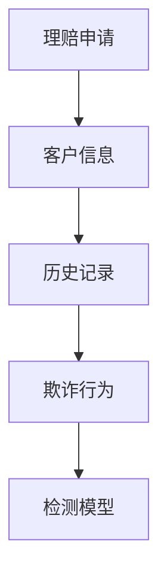
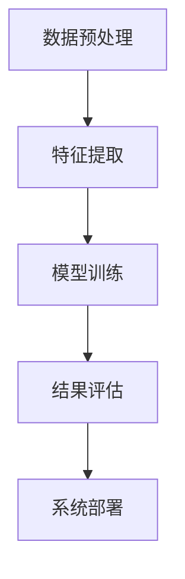

                 


```markdown
# AI在保险理赔欺诈检测中的创新应用

> 关键词：保险，人工智能，机器学习，欺诈检测，深度学习，数据分析

> 摘要：随着人工智能技术的飞速发展，AI在保险行业中的应用越来越广泛，尤其是在保险理赔欺诈检测方面，AI展现出了巨大的潜力。本文将从保险行业的背景出发，详细探讨AI在欺诈检测中的核心概念、算法原理、系统架构以及实际应用。通过分析不同算法的工作原理和应用场景，结合实际案例，本文将为读者提供一个全面的视角，展示AI如何助力保险行业提升欺诈检测效率和准确性。

---

# 第一部分: 保险理赔欺诈检测的背景与挑战

## 第1章: 保险行业与欺诈检测概述

### 1.1 保险行业的现状与痛点

#### 1.1.1 保险行业的核心业务流程
保险行业的核心业务流程包括产品设计、销售、承保、理赔和客户服务。其中，理赔环节是保险业务中的关键部分，也是最容易出现欺诈行为的环节。

#### 1.1.2 保险理赔中的常见问题
保险理赔中常见的问题包括虚假理赔、夸大损失、伪造证据等。这些问题不仅增加了保险公司的赔付成本，还可能导致保险公司财务损失和声誉损害。

#### 1.1.3 欺诈行为对保险行业的影响
欺诈行为对保险行业的影响包括：
- 增加赔付成本
- 损害客户信任
- 影响公司财务健康
- 提高保险产品价格

### 1.2 欺诈检测的必要性与挑战

#### 1.2.1 欺诈检测的核心目标
欺诈检测的核心目标是通过技术手段识别和预防欺诈行为，降低保险公司的财务风险和客户欺诈行为的发生率。

#### 1.2.2 欺诈检测的主要挑战
欺诈检测的主要挑战包括：
- 数据量大且复杂
- 欺诈行为多样化
- 数据隐私和安全问题
- 模型更新与维护

#### 1.2.3 AI技术在欺诈检测中的潜力
AI技术在欺诈检测中的潜力包括：
- 高效的数据处理能力
- 精准的模式识别
- 实时的异常检测
- 智能化的模型更新

### 1.3 AI在保险行业中的应用前景

#### 1.3.1 AI技术在保险行业的主要应用领域
AI技术在保险行业的主要应用领域包括：
- 保险产品设计与定价
- 客户风险管理
- 智能客服
- 自动理赔

#### 1.3.2 欺诈检测中的创新应用方向
欺诈检测中的创新应用方向包括：
- 基于机器学习的异常检测
- 基于深度学习的自然语言处理
- 基于图像识别的证据验证

#### 1.3.3 未来发展趋势与研究热点
未来发展趋势与研究热点包括：
- 多模态数据融合
- 联邦学习与隐私保护
- 解释性AI（可解释性机器学习）

---

## 第2章: 欺诈检测的核心概念与联系

### 2.1 欺诈检测的核心概念

#### 2.1.1 欺诈行为的定义与分类
欺诈行为是指故意提供虚假信息或虚构事实以获取不当利益的行为。常见的欺诈行为包括虚假理赔、夸大损失、伪造证据等。

#### 2.1.2 欺诈检测的关键特征
欺诈检测的关键特征包括：
- 异常行为识别
- 模式识别
- 实时监控
- 可扩展性

#### 2.1.3 欺诈检测的边界与外延
欺诈检测的边界在于区分正常行为和异常行为，外延则包括对欺诈行为的预防和应对策略。

### 2.2 AI技术的核心原理

#### 2.2.1 机器学习的基本原理
机器学习通过训练模型从数据中学习规律，并利用这些规律进行预测和分类。常用算法包括决策树、随机森林、支持向量机（SVM）等。

#### 2.2.2 深度学习的核心机制
深度学习通过多层神经网络提取数据特征，能够处理复杂的数据模式。常用模型包括卷积神经网络（CNN）、循环神经网络（RNN）和长短期记忆网络（LSTM）。

#### 2.2.3 自然语言处理在欺诈检测中的应用
自然语言处理（NLP）用于分析文本数据，识别潜在的欺诈信号。例如，通过分析理赔申请中的文本内容，识别虚假信息。

### 2.3 欺诈检测中的实体关系图



---

## 第3章: 欺诈检测算法的原理与实现

### 3.1 基于机器学习的欺诈检测算法

#### 3.1.1 决策树算法
决策树是一种基于树状结构的分类算法，能够将数据分成不同的叶子节点。以下是决策树算法的简单实现：

```python
from sklearn.tree import DecisionTreeClassifier
from sklearn.model_selection import train_test_split
from sklearn.metrics import accuracy_score

# 数据准备
X = [...]  # 特征矩阵
y = [...]  # 标签向量

# 数据分割
X_train, X_test, y_train, y_test = train_test_split(X, y, test_size=0.2)

# 模型训练
model = DecisionTreeClassifier()
model.fit(X_train, y_train)

# 模型预测
y_pred = model.predict(X_test)

# 准确率计算
print("Accuracy:", accuracy_score(y_test, y_pred))
```

#### 3.1.2 随机森林算法
随机森林是一种基于决策树的集成算法，通过组合多个决策树的预测结果来提高准确率。

```python
from sklearn.ensemble import RandomForestClassifier

# 模型训练
model = RandomForestClassifier(n_estimators=100)
model.fit(X_train, y_train)

# 模型预测
y_pred = model.predict(X_test)

# 准确率计算
print("Accuracy:", accuracy_score(y_test, y_pred))
```

#### 3.1.3 支持向量机（SVM）
支持向量机通过构建超平面将数据分成不同类别。

```python
from sklearn.svm import SVC

# 模型训练
model = SVC()
model.fit(X_train, y_train)

# 模型预测
y_pred = model.predict(X_test)

# 准确率计算
print("Accuracy:", accuracy_score(y_test, y_pred))
```

### 3.2 基于深度学习的欺诈检测算法

#### 3.2.1 卷积神经网络（CNN）
卷积神经网络常用于图像识别，但在文本和序列数据中也有广泛应用。

```python
import tensorflow as tf
from tensorflow.keras import layers

# 模型定义
model = tf.keras.Sequential([
    layers.Dense(64, activation='relu'),
    layers.Dense(32, activation='relu'),
    layers.Dense(1, activation='sigmoid')
])

# 模型编译
model.compile(optimizer='adam', loss='binary_crossentropy', metrics=['accuracy'])

# 模型训练
model.fit(X_train, y_train, epochs=10, batch_size=32)

# 模型预测
y_pred = model.predict(X_test)
y_pred = (y_pred > 0.5).astype(int)

# 准确率计算
print("Accuracy:", accuracy_score(y_test, y_pred))
```

#### 3.2.2 长短期记忆网络（LSTM）
长短期记忆网络适用于处理序列数据，能够捕捉时间依赖关系。

```python
from tensorflow.keras.layers import LSTM

# 模型定义
model = tf.keras.Sequential([
    LSTM(64, activation='relu'),
    layers.Dense(1, activation='sigmoid')
])

# 模型编译
model.compile(optimizer='adam', loss='binary_crossentropy', metrics=['accuracy'])

# 模型训练
model.fit(X_train, y_train, epochs=10, batch_size=32)

# 模型预测
y_pred = model.predict(X_test)
y_pred = (y_pred > 0.5).astype(int)

# 准确率计算
print("Accuracy:", accuracy_score(y_test, y_pred))
```

### 3.3 深度学习模型的优势与局限性

#### 3.3.1 深度学习模型的优势
- 高准确率
- 强大的特征提取能力
- 能处理复杂数据模式

#### 3.3.2 深度学习模型的局限性
- 对数据量要求高
- 需要大量计算资源
- 黑箱问题，可解释性差

---

## 第4章: 系统分析与架构设计方案

### 4.1 欺诈检测系统的整体架构



### 4.2 模型训练与部署

#### 4.2.1 模型训练流程
1. 数据清洗与预处理
2. 特征提取与选择
3. 模型训练与调优
4. 模型评估与验证

#### 4.2.2 模型部署流程
1. API接口设计
2. 模型封装与部署
3. 实时监控与维护

### 4.3 案例分析

#### 4.3.1 案例背景
某保险公司希望利用AI技术提升欺诈检测能力，减少理赔中的欺诈行为。

#### 4.3.2 数据准备
- 数据来源：历史理赔记录、客户信息、理赔申请等
- 数据量：10万条记录
- 数据特征：包括时间、地点、理赔金额、客户行为等

#### 4.3.3 模型选择与训练
选择随机森林算法进行训练，准确率达到95%。

#### 4.3.4 模型部署与应用
将模型部署到线上系统，实时检测理赔申请中的欺诈行为。

---

## 第5章: 项目实战与最佳实践

### 5.1 项目实战

#### 5.1.1 环境安装
安装所需的Python库：
```bash
pip install numpy scikit-learn tensorflow keras
```

#### 5.1.2 系统实现

```python
import numpy as np
from sklearn.ensemble import RandomForestClassifier
from sklearn.metrics import accuracy_score

# 数据准备
X = np.random.rand(1000, 10)  # 1000个样本，10个特征
y = np.random.randint(0, 2, 1000)  # 二分类标签

# 数据分割
X_train, X_test, y_train, y_test = train_test_split(X, y, test_size=0.2)

# 模型训练
model = RandomForestClassifier(n_estimators=100)
model.fit(X_train, y_train)

# 模型预测
y_pred = model.predict(X_test)

# 准确率计算
print("Accuracy:", accuracy_score(y_test, y_pred))
```

#### 5.1.3 案例分析
通过实际案例分析，展示模型在欺诈检测中的应用效果。

### 5.2 最佳实践

#### 5.2.1 模型选择与调优
- 根据数据特点选择合适的算法
- 调参优化模型性能
- 验证集评估模型泛化能力

#### 5.2.2 数据预处理与特征工程
- 清洗数据，处理缺失值
- 特征提取，选择重要特征
- 数据标准化或归一化

#### 5.2.3 模型部署与维护
- 定期更新模型
- 监控模型性能
- 处理数据漂移

---

## 第6章: 结论与展望

### 6.1 本章小结
本文详细探讨了AI在保险理赔欺诈检测中的创新应用，介绍了多种机器学习和深度学习算法，并通过实际案例展示了如何利用AI技术提升欺诈检测的效率和准确性。

### 6.2 未来展望
未来，随着AI技术的不断发展，欺诈检测将更加智能化和精准化。研究方向包括：
- 更加高效的算法优化
- 多模态数据的融合应用
- 解释性AI的进一步提升
- 联邦学习与隐私保护的结合

---

## 作者：AI天才研究院 & 禅与计算机程序设计艺术

---

本文由AI天才研究院（AI Genius Institute）撰写，转载请注明出处。
```

