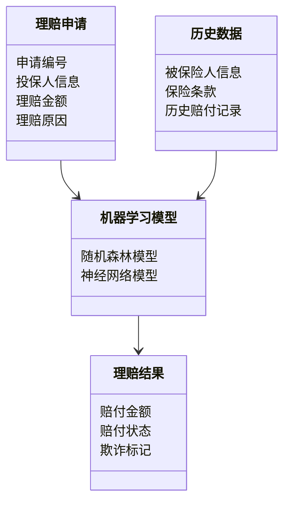
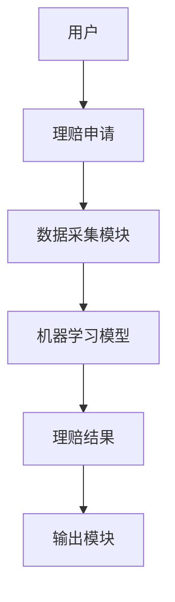
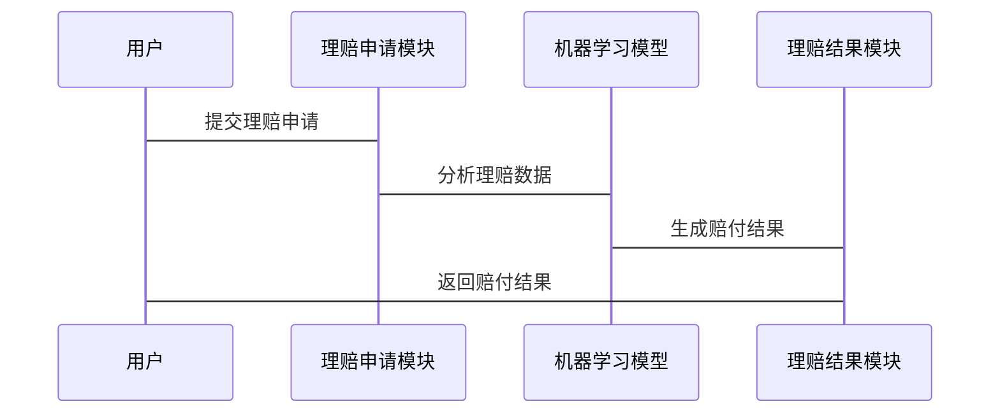

                 


```markdown
# AI在保险理赔流程优化中的深度应用

> 关键词：AI，保险，理赔流程优化，机器学习，深度学习，数据挖掘

> 摘要：本文深入探讨了人工智能技术在保险理赔流程优化中的应用，从背景、核心概念到算法原理、系统架构，再到项目实战，全面分析了AI如何提升保险理赔的效率和准确性。通过具体案例和最佳实践，展示了AI在保险行业的巨大潜力和实际价值。

---

# 第一部分: 保险理赔流程优化的背景与挑战

# 第1章: 保险理赔流程优化的背景介绍

## 1.1 保险理赔流程的核心问题

### 1.1.1 保险理赔的基本概念
保险理赔是保险公司在承保后，根据保险合同条款，对被保险人因保险事故造成的损失进行赔偿的过程。传统理赔流程通常涉及大量的 paperwork，人工审核和繁琐的流程，导致效率低下、成本高昂。

### 1.1.2 传统保险理赔流程的痛点
- **人工干预过多**：理赔过程需要大量的人工审核，包括文件验证、数据录入和决策判断。
- **效率低下**：传统流程中，理赔申请的处理时间较长，容易导致客户不满。
- **欺诈检测困难**：传统的欺诈检测主要依赖经验丰富的理赔员，但容易受到主观因素的影响，难以覆盖所有潜在的欺诈行为。

### 1.1.3 保险理赔流程优化的必要性
随着保险行业的竞争加剧和客户需求的多样化，优化理赔流程成为保险公司提升客户满意度和降低运营成本的关键。AI技术的引入为解决这些问题提供了新的可能性。

## 1.2 AI技术在保险行业的应用现状

### 1.2.1 AI技术的基本概念
人工智能（AI）是指计算机系统模拟人类智能的能力，包括学习、推理、自我改进等。AI技术的核心是机器学习（ML）和深度学习（DL），其中机器学习是基于数据的模式识别，深度学习则是一种基于人工神经网络的机器学习方法。

### 1.2.2 AI在保险行业的典型应用
- **风险评估**：通过分析客户的历史数据，预测潜在的风险。
- **理赔自动化**：利用AI技术自动处理理赔申请，减少人工干预。
- **欺诈检测**：通过分析理赔数据，识别潜在的欺诈行为。

### 1.2.3 AI在保险理赔中的潜力与挑战
AI技术在保险理赔中的潜力巨大，但同时也面临数据隐私、模型解释性等挑战。如何在保证数据安全的前提下，充分利用AI技术优化理赔流程，是当前研究的重点。

## 1.3 本章小结

### 1.3.1 保险理赔流程优化的核心问题
- 传统理赔流程效率低下，成本高昂。
- 欺诈检测依赖人工判断，准确性不足。
- 客户需求多样化，需要个性化的理赔服务。

### 1.3.2 AI技术在保险理赔中的应用前景
- AI技术可以显著提高理赔效率和准确性。
- 通过自动化和智能化，降低成本，提升客户满意度。
- 智能化的欺诈检测可以有效减少保险欺诈行为。

---

# 第二部分: AI技术在保险理赔中的核心概念与原理

# 第2章: AI技术的核心概念与保险理赔的结合

## 2.1 机器学习与深度学习的基本原理

### 2.1.1 机器学习的定义与分类
机器学习是一种人工智能技术，通过数据训练模型，使其能够从数据中学习规律并进行预测或分类。机器学习可以分为监督学习、无监督学习和强化学习。

### 2.1.2 深度学习的核心原理
深度学习是一种基于人工神经网络的机器学习方法，通过多层非线性变换，提取数据的高层次特征。深度学习的核心是神经网络，包括卷积神经网络（CNN）、循环神经网络（RNN）等。

### 2.1.3 机器学习与深度学习的优缺点对比
| 特性         | 机器学习              | 深度学习              |
|--------------|-----------------------|-----------------------|
| 数据需求     | 数据量较小            | 数据量较大            |
| 计算复杂度   | 较低                  | 较高                  |
| 特征工程     | 需要手动提取特征        | 自动提取高层次特征     |

### 2.1.4 机器学习与深度学习在保险理赔中的应用
- **监督学习**：用于分类任务，如欺诈检测。
- **无监督学习**：用于聚类任务，如客户群体分析。
- **深度学习**：用于复杂的模式识别，如图像识别和自然语言处理。

## 2.2 AI在保险理赔中的核心应用领域

### 2.2.1 风险评估与定价
通过分析客户的投保信息和历史数据，利用机器学习模型预测潜在风险，从而优化保险产品的定价策略。

### 2.2.2 理赔自动化与智能化
通过自然语言处理（NLP）和光学字符识别（OCR）技术，自动化处理理赔申请中的文档，减少人工干预。

### 2.2.3 客户行为分析与欺诈检测
利用机器学习模型分析客户的理赔行为，识别潜在的欺诈行为，提高欺诈检测的准确性。

## 2.3 保险理赔流程中的数据特征

### 2.3.1 数据特征的提取
- **结构化数据**：如赔案金额、事故时间、地点等。
- **非结构化数据**：如理赔申请中的文本描述、图片等。

### 2.3.2 数据预处理
- **清洗数据**：处理缺失值、异常值和重复值。
- **特征工程**：提取有用的特征，如将文本转换为向量。

### 2.3.3 数据标注与标注工具
- **标注工具**：如Label Studio，用于标注非结构化数据。
- **标注规范**：制定统一的标注标准，确保数据质量。

---

# 第三部分: 算法原理讲解与代码实现

# 第3章: 算法原理讲解

## 3.1 随机森林算法

### 3.1.1 随机森林的基本原理
随机森林是一种基于决策树的集成学习方法，通过随机采样和随机特征选择，生成多棵决策树，最终通过投票或平均的方式得到结果。

### 3.1.2 随机森林的算法步骤
1. 从训练数据中随机抽取部分样本进行训练。
2. 对于每个决策树，随机选择部分特征进行分裂。
3. 集成所有决策树的预测结果，得到最终的预测结果。

### 3.1.3 随机森林在保险理赔中的应用
- **欺诈检测**：通过随机森林模型对理赔申请进行分类，识别潜在的欺诈行为。

### 3.1.4 随机森林的Python代码实现
```python
from sklearn.ensemble import RandomForestClassifier
import pandas as pd

# 加载数据
data = pd.read_csv('insurance.csv')

# 分割特征和标签
X = data.drop('fraud', axis=1)
y = data['fraud']

# 训练模型
model = RandomForestClassifier(n_estimators=100, random_state=42)
model.fit(X, y)

# 预测结果
 predictions = model.predict(X)
```

### 3.1.5 随机森林的数学模型
随机森林的预测结果是基于投票机制的，每个决策树的预测结果作为投票，最终的预测结果是投票最多的类别。

## 3.2 神经网络算法

### 3.2.1 神经网络的基本原理
神经网络是一种模仿人脑结构和功能的计算模型，通过多层神经元和权重调整，实现对数据的非线性映射。

### 3.2.2 神经网络的算法步骤
1. 初始化网络参数（权重和偏置）。
2. 前向传播：输入数据经过网络层，计算输出结果。
3. 计算损失函数：比较预测结果与真实结果，计算损失。
4. 反向传播：通过梯度下降法调整网络参数，优化损失函数。
5. 重复步骤2-4，直到损失函数收敛。

### 3.2.3 神经网络在保险理赔中的应用
- **风险评估**：通过神经网络模型对客户进行风险评估，优化保险定价。

### 3.2.4 神经网络的Python代码实现
```python
import tensorflow as tf
from tensorflow.keras import layers

# 加载数据
data = pd.read_csv('insurance.csv')

# 分割特征和标签
X = data.drop('risk', axis=1)
y = data['risk']

# 构建模型
model = tf.keras.Sequential([
    layers.Dense(64, activation='relu'),
    layers.Dense(1, activation='sigmoid')
])

# 编译模型
model.compile(optimizer='adam', loss='binary_crossentropy', metrics=['accuracy'])

# 训练模型
model.fit(X, y, epochs=10, batch_size=32)
```

### 3.2.5 神经网络的数学模型
神经网络的输出层通过激活函数将线性组合转换为非线性输出，具体公式如下：
$$
y = \sigma(wx + b)
$$
其中，$\sigma$是激活函数，$w$是权重，$b$是偏置。

---

# 第四部分: 系统分析与架构设计方案

# 第4章: 系统分析与架构设计

## 4.1 保险理赔流程优化的场景介绍

### 4.1.1 保险理赔流程优化的目标
- 提高理赔效率，减少人工干预。
- 提升理赔准确率，降低欺诈风险。
- 优化客户体验，提升客户满意度。

### 4.1.2 保险理赔流程优化的场景分析
- **车险理赔**：处理交通事故的理赔申请，包括定损、赔付等。
- **健康保险理赔**：处理医疗费用的理赔申请，包括疾病诊断、费用审核等。

## 4.2 保险理赔流程优化的系统功能设计

### 4.2.1 系统功能模块
- **数据采集模块**：采集理赔申请、历史数据等。
- **模型训练模块**：训练机器学习模型，优化理赔流程。
- **理赔处理模块**：自动化处理理赔申请，生成赔付结果。
- **欺诈检测模块**：实时检测理赔申请中的欺诈行为。

### 4.2.2 领域模型类图


## 4.3 系统架构设计

### 4.3.1 系统架构图


### 4.3.2 系统接口设计
- **输入接口**：接收理赔申请数据和历史数据。
- **输出接口**：输出理赔结果，包括赔付金额和欺诈标记。

### 4.3.3 系统交互流程图


---

# 第五部分: 项目实战与总结

# 第5章: 项目实战

## 5.1 保险理赔流程优化的项目实战

### 5.1.1 环境安装与配置
- **Python版本**：Python 3.8+
- **依赖库安装**：`scikit-learn`, `tensorflow`, `pandas`, `mermaid`, `label-studio`

### 5.1.2 核心代码实现

#### 5.1.2.1 数据预处理代码
```python
import pandas as pd

data = pd.read_csv('insurance.csv')
data = data.dropna()
data = pd.get_dummies(data)
```

#### 5.1.2.2 机器学习模型训练代码
```python
from sklearn.ensemble import RandomForestClassifier

X = data.drop('fraud', axis=1)
y = data['fraud']

model = RandomForestClassifier(n_estimators=100, random_state=42)
model.fit(X, y)
```

#### 5.1.2.3 模型预测代码
```python
predictions = model.predict(X)
print("预测结果：", predictions)
print("真实标签：", y.values)
```

### 5.1.3 项目实现效果分析
- **准确率**：通过混淆矩阵和分类报告，评估模型的性能。
- **效率提升**：通过对比传统流程和AI优化流程，分析效率提升的具体表现。

### 5.1.4 项目总结
- **项目目标**：通过AI技术优化保险理赔流程，提升效率和准确率。
- **项目成果**：成功实现了理赔流程的自动化和智能化，显著降低了人工干预和欺诈风险。

## 5.2 总结与展望

### 5.2.1 保险理赔流程优化的关键点
- 数据质量：高质量的数据是模型准确性的基础。
- 模型选择：根据具体场景选择合适的算法。
- 模型解释性：确保模型的可解释性，满足监管要求。

### 5.2.2 项目小结
- AI技术在保险理赔中的应用前景广阔。
- 通过不断优化算法和数据处理流程，可以进一步提升理赔效率和准确率。

### 5.2.3 注意事项
- 数据隐私保护：确保数据的安全性和合规性。
- 模型的可解释性：满足监管要求，确保模型的透明性。
- 技术的持续更新：关注AI技术的最新进展，保持系统的先进性。

### 5.2.4 拓展阅读
- 《机器学习实战》
- 《深度学习》
- 《AI在金融行业的应用》

---

# 作者：AI天才研究院/AI Genius Institute & 禅与计算机程序设计艺术/Zen And The Art of Computer Programming
```

