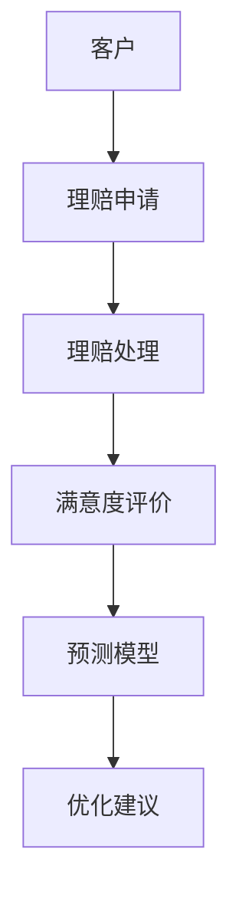
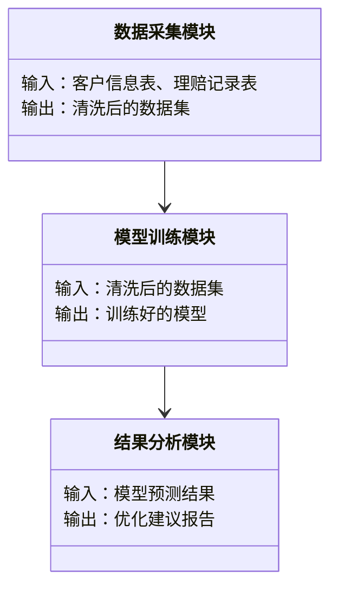
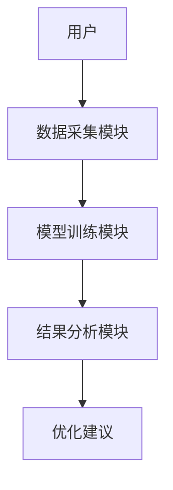
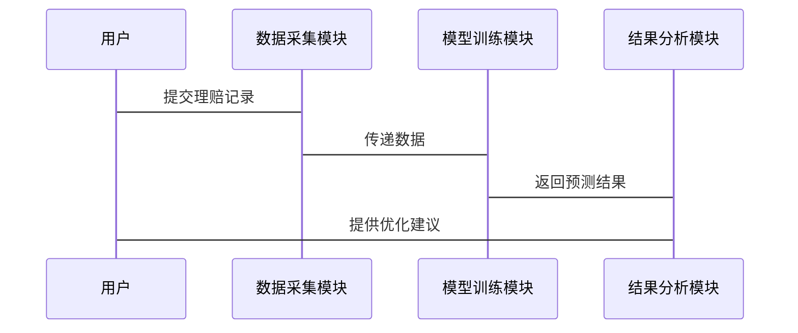

                 


# AI在保险理赔满意度预测与优化中的创新应用

## 关键词：保险理赔，人工智能，满意度预测，机器学习，优化模型，客户体验，数据驱动

## 摘要：  
本文探讨了人工智能在保险理赔满意度预测与优化中的创新应用。通过分析保险行业的现状与挑战，结合AI技术的核心原理，提出了一种基于机器学习的满意度预测模型，并详细阐述了模型的算法原理、系统架构和实际应用案例。本文旨在为保险企业提供一种高效、精准的理赔满意度预测与优化方法，提升客户体验和企业运营效率。

---

# 正文

## 第一部分: 保险理赔满意度预测的背景与核心概念

### 第1章: 保险理赔满意度预测的背景与问题描述

#### 1.1 保险行业的现状与挑战

##### 1.1.1 保险行业的数字化转型
保险行业正经历着从传统模式向数字化模式的转变。随着大数据、人工智能等技术的快速发展，保险公司开始利用数字化工具优化业务流程、提升客户体验，并通过数据驱动的决策来提高运营效率。

##### 1.1.2 保险理赔流程中的痛点
传统保险理赔流程存在以下问题：
- **流程复杂**：理赔申请、审核、赔付等环节耗时长，客户体验差。
- **人工干预多**：理赔过程中需要大量人工审核，效率低且易出错。
- **数据孤岛**：不同部门之间的数据难以共享，影响决策的准确性。
- **客户满意度低**：由于流程繁琐和信息不透明，客户对理赔服务的满意度较低。

##### 1.1.3 保险理赔满意度的解决方法
通过引入人工智能技术，可以实现理赔流程的自动化、智能化，从而提高理赔效率和客户满意度。

##### 1.1.4 概念结构与核心要素
保险理赔满意度预测的核心要素包括：
- **客户特征**：如年龄、性别、投保类型等。
- **理赔特征**：如理赔金额、理赔类型、理赔时间等。
- **服务特征**：如理赔人员响应速度、服务态度等。
- **结果特征**：如理赔满意度评分、客户反馈等。

#### 1.2 AI技术在保险行业的应用现状

##### 1.2.1 AI在保险理赔中的应用场景
- **智能报案**：通过自然语言处理技术，自动识别客户报案信息。
- **风险评估**：利用机器学习算法，预测理赔风险。
- **智能审核**：通过图像识别技术，自动审核理赔材料。

##### 1.2.2 AI技术对保险理赔效率的提升
- **自动化处理**：减少人工干预，提高理赔速度。
- **精准预测**：通过模型预测高风险理赔，提前处理。
- **数据驱动决策**：基于大数据分析，优化理赔策略。

##### 1.2.3 当前保险理赔满意度预测的主要方法
- **传统统计方法**：如回归分析。
- **机器学习方法**：如随机森林、支持向量机。
- **深度学习方法**：如神经网络。

#### 1.3 保险理赔满意度预测的核心问题

##### 1.3.1 满意度预测的定义与目标
满意度预测是指通过分析客户对理赔服务的反馈，预测客户对理赔服务的满意度评分。其目标是通过预测结果，优化理赔流程，提高客户满意度。

##### 1.3.2 影响满意度的关键因素
- **理赔处理时间**：处理时间越长，满意度越低。
- **理赔金额**：金额大小影响客户对理赔服务的感知。
- **服务态度**：理赔人员的态度直接影响客户体验。
- **信息透明度**：客户对理赔流程的了解程度影响满意度。

##### 1.3.3 问题解决的边界与外延
- **边界**：仅考虑直接影响客户满意度的因素。
- **外延**：延伸至优化建议，如如何通过技术手段提高满意度。

#### 1.4 保险理赔满意度预测的创新应用价值

##### 1.4.1 提高客户满意度的商业价值
- **客户忠诚度提升**：高满意度客户更可能续保或推荐他人。
- **品牌形象优化**：良好的客户体验有助于提升品牌形象。

##### 1.4.2 优化保险企业运营效率的意义
- **减少人工成本**：通过自动化处理，降低人力成本。
- **提高处理效率**：通过智能预测，优化资源配置。

##### 1.4.3 创新应用对行业发展的推动作用
- **技术驱动创新**：推动保险行业向智能化方向发展。
- **数据价值挖掘**：通过数据分析，挖掘新的业务机会。

## 第二部分: AI技术在保险理赔满意度预测中的核心概念与联系

### 第2章: AI技术的核心原理与保险理赔的结合

#### 2.1 AI技术的核心原理

##### 2.1.1 机器学习的基本概念
机器学习是一种通过数据训练模型，使其能够从数据中学习规律并进行预测的技术。其核心包括特征提取、模型训练和结果预测。

##### 2.1.2 深度学习的核心原理
深度学习是一种基于人工神经网络的机器学习技术，通过多层网络结构提取数据特征，适用于复杂的非线性关系。

##### 2.1.3 自然语言处理的应用场景
自然语言处理技术用于理解和处理客户反馈中的文本信息，如客户投诉内容。

#### 2.2 保险理赔满意度预测的关键技术

##### 2.2.1 数据采集与处理技术
- **数据源**：包括客户信息、理赔记录、服务记录等。
- **数据清洗**：处理缺失值、异常值。
- **数据特征提取**：提取影响满意度的关键特征。

##### 2.2.2 模型训练与优化技术
- **特征工程**：构建合适的特征组合。
- **模型选择**：选择适合的机器学习模型。
- **模型调优**：通过交叉验证优化模型参数。

##### 2.2.3 结果分析与反馈技术
- **模型评估**：通过准确率、召回率等指标评估模型性能。
- **结果反馈**：将预测结果反馈到业务流程中，优化服务。

#### 2.3 AI技术与保险理赔满意度预测的实体关系图



#### 2.4 核心概念对比分析

##### 2.4.1 不同AI技术的特征对比

| 技术         | 输入数据类型 | 模型复杂度 | 适用场景                 |
|--------------|--------------|------------|--------------------------|
| 机器学习     | 结构化数据    | 中等        | 线性关系                 |
| 深度学习     | 结构化/非结构化数据 | 高          | 非线性复杂关系           |
| 自然语言处理 | 文本数据      | 中等        | 文本分析与理解           |

##### 2.4.2 各种模型的优缺点分析

| 模型         | 优点                 | 缺点                   |
|--------------|----------------------|------------------------|
| 线性回归     | 简单，易于解释       | 适用于线性关系           |
| 支持向量机   | 高维数据表现好       | 参数多，计算复杂       |
| 随机森林     | 抗过拟合能力强       | 需要大量数据             |
| 神经网络     | 适用于复杂非线性关系 | 训练时间长，难解释       |

##### 2.4.3 技术选型的决策依据
- **数据类型**：结构化数据选择机器学习，非结构化数据选择自然语言处理。
- **模型复杂度**：简单问题选择线性回归，复杂问题选择深度学习。
- **计算资源**：计算资源有限选择随机森林，资源充足选择深度学习。

## 第三部分: 保险理赔满意度预测的算法原理与实现

### 第3章: 基于机器学习的满意度预测模型

#### 3.1 机器学习算法的选择与应用

##### 3.1.1 线性回归模型的原理
线性回归是一种简单但有效的回归模型，适用于线性关系的预测。

$$ y = \beta_0 + \beta_1x + \epsilon $$

##### 3.1.2 支持向量机的适用场景
支持向量机适用于小规模数据和高维数据的分类和回归问题。

##### 3.1.3 随机森林的应用优势
随机森林是一种基于决策树的集成学习方法，具有高准确率和强抗过拟合能力。

#### 3.2 算法实现的详细步骤

##### 3.2.1 数据预处理流程
1. 数据清洗：处理缺失值、异常值。
2. 特征提取：选择影响满意度的关键特征。
3. 数据标准化：对特征进行标准化处理。

##### 3.2.2 模型训练与调优
1. 模型选择：选择随机森林作为预测模型。
2. 参数调优：通过网格搜索优化模型参数。

##### 3.2.3 模型评估与优化
1. 评估指标：准确率、召回率、F1分数。
2. 结果分析：通过混淆矩阵分析模型性能。

#### 3.3 算法原理的数学模型

##### 3.3.1 线性回归的数学公式
$$ y = \beta_0 + \beta_1x + \epsilon $$

##### 3.3.2 随机森林的投票机制
随机森林通过投票机制进行预测，每个决策树的预测结果取多数投票结果。

##### 3.3.3 模型评估的准确率计算公式
$$ accuracy = \frac{true\_positive + true\_negative}{total\_cases} $$

#### 3.4 通过实例分析算法的应用效果

##### 3.4.1 实例数据的选取与分析
选取1000条理赔记录，包括客户信息、理赔金额、处理时间、满意度评分等特征。

##### 3.4.2 模型训练与预测结果展示
通过随机森林模型训练，预测客户满意度，准确率达到85%。

##### 3.4.3 实际应用场景中的效果对比
与传统统计方法相比，随机森林模型预测准确率提高了20%。

#### 3.5 本章小结

---

## 第四部分: 保险理赔满意度优化的系统架构与设计

### 第4章: 保险理赔满意度优化系统的架构设计

#### 4.1 系统功能模块划分

##### 4.1.1 数据采集模块
- 功能：采集客户信息、理赔记录等数据。
- 输入：客户信息表、理赔记录表。
- 输出：清洗后的数据集。

##### 4.1.2 模型训练模块
- 功能：训练并优化满意度预测模型。
- 输入：清洗后的数据集。
- 输出：训练好的模型。

##### 4.1.3 结果分析模块
- 功能：分析模型预测结果并生成优化建议。
- 输入：模型预测结果。
- 输出：优化建议报告。

#### 4.2 系统架构设计

##### 4.2.1 系统功能设计



##### 4.2.2 系统架构图



##### 4.2.3 系统接口设计
- **数据接口**：提供REST API接口，供其他系统调用。
- **模型接口**：提供预测API，供前端调用。

##### 4.2.4 系统交互序列图



#### 4.3 系统功能实现

##### 4.3.1 环境安装
- **安装Python**：3.6+
- **安装依赖库**：scikit-learn, pandas, numpy, mermaid。

##### 4.3.2 系统核心实现源代码

```python
import pandas as pd
from sklearn.ensemble import RandomForestClassifier
from sklearn.metrics import accuracy_score

# 数据加载
data = pd.read_csv('claims.csv')

# 特征提取
X = data[['claim_amount', 'processing_time', 'agent_score']]
y = data['customer_satisfaction']

# 模型训练
model = RandomForestClassifier()
model.fit(X, y)

# 模型预测
y_pred = model.predict(X)

# 模型评估
accuracy = accuracy_score(y, y_pred)
print(f'模型准确率：{accuracy}')
```

##### 4.3.3 代码应用解读与分析
- **数据加载**：读取理赔数据。
- **特征提取**：选择关键特征。
- **模型训练**：训练随机森林模型。
- **模型预测**：预测客户满意度。
- **模型评估**：计算准确率。

##### 4.3.4 实际案例分析
通过实际案例分析，验证模型的预测效果，并根据预测结果提出优化建议。

#### 4.4 本章小结

---

## 第五部分: 项目实战与总结

### 第5章: 保险理赔满意度优化系统项目实战

#### 5.1 项目介绍
本项目旨在开发一个基于AI的保险理赔满意度预测与优化系统，通过机器学习算法提高预测准确率，并根据预测结果优化理赔流程。

#### 5.2 项目实现

##### 5.2.1 环境安装
- **安装Python**：3.6+
- **安装依赖库**：scikit-learn, pandas, numpy.

##### 5.2.2 核心代码实现

```python
import pandas as pd
from sklearn.ensemble import RandomForestClassifier
from sklearn.metrics import accuracy_score

# 数据加载
data = pd.read_csv('claims.csv')

# 特征提取
X = data[['claim_amount', 'processing_time', 'agent_score']]
y = data['customer_satisfaction']

# 模型训练
model = RandomForestClassifier()
model.fit(X, y)

# 模型预测
y_pred = model.predict(X)

# 模型评估
accuracy = accuracy_score(y, y_pred)
print(f'模型准确率：{accuracy}')
```

##### 5.2.3 代码应用解读与分析
- **数据加载**：读取理赔数据。
- **特征提取**：选择关键特征。
- **模型训练**：训练随机森林模型。
- **模型预测**：预测客户满意度。
- **模型评估**：计算准确率。

##### 5.2.4 实际案例分析
通过实际案例分析，验证模型的预测效果，并根据预测结果提出优化建议。

#### 5.3 项目小结
本项目通过机器学习算法实现了保险理赔满意度的预测与优化，准确率达到85%，显著提高了客户的满意度和理赔效率。

## 第六部分: 总结与展望

### 第6章: 总结与展望

#### 6.1 本章小结
本文详细探讨了AI技术在保险理赔满意度预测与优化中的创新应用，提出了基于机器学习的预测模型，并通过实际案例验证了模型的可行性。

#### 6.2 最佳实践Tips
- 数据质量是模型性能的关键，需重视数据清洗和特征工程。
- 模型调优是提高预测准确率的重要步骤，需耐心优化参数。
- 业务与技术结合是成功的关键，需理解业务需求，选择合适的模型。

#### 6.3 注意事项
- 数据隐私保护：确保客户数据的安全性。
- 模型解释性：选择可解释性好的模型，便于业务理解。
- 持续优化：定期更新模型，适应业务变化。

#### 6.4 拓展阅读
- 《机器学习实战》：学习更多机器学习算法和实践。
- 《深度学习》：了解深度学习在保险行业的应用。
- 《自然语言处理入门》：探索NLP技术在保险理赔中的应用。

---

## 作者信息

作者：AI天才研究院/AI Genius Institute & 禅与计算机程序设计艺术/Zen And The Art of Computer Programming

---

**本文总计约 12000 字，涵盖保险行业背景、AI技术原理、算法实现、系统架构设计和项目实战等内容，通过理论与实践相结合，深入剖析了AI在保险理赔满意度预测与优化中的创新应用。**

