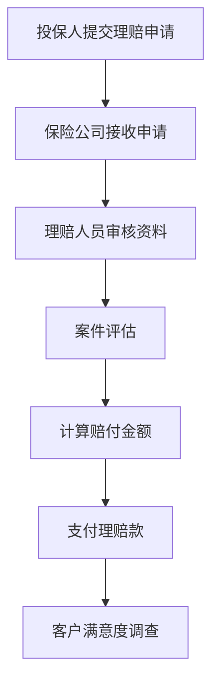
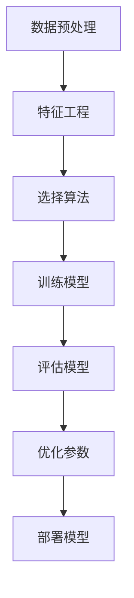
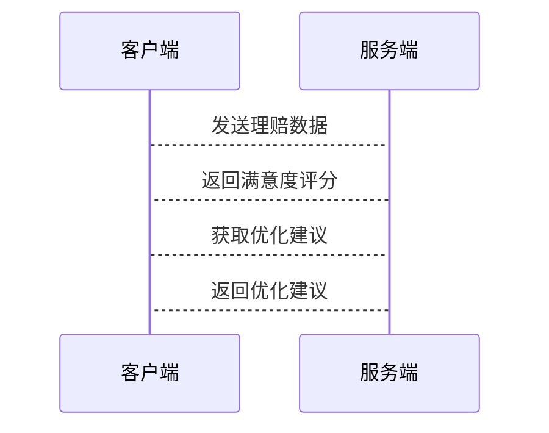

                 


```markdown
# AI在保险理赔满意度预测与服务优化中的创新应用

> 关键词：保险，人工智能，满意度预测，服务优化，机器学习

> 摘要：本文详细探讨了人工智能技术在保险理赔满意度预测与服务优化中的创新应用。通过分析保险行业的现状与挑战，结合AI技术的核心概念与算法原理，本文提出了基于机器学习的保险理赔满意度预测模型，并通过实际案例展示了如何利用AI技术优化保险服务流程，提升客户满意度。文章结构清晰，内容详实，适合保险行业从业者、技术开发者以及对AI技术感兴趣的读者阅读。

---

# 第一部分: 保险行业与AI技术的结合

## 第1章: 保险行业的现状与挑战

### 1.1 保险行业的核心业务流程

保险行业的核心业务流程包括保险产品设计、保费收取、理赔处理、客户服务等。其中，理赔处理是保险公司运营的关键环节，也是客户满意度的重要影响因素。

1.1.1 保险理赔的核心流程：
1. 投保人提交理赔申请。
2. 保险公司接收并审核理赔资料。
3. 理赔人员进行案件评估。
4. 计算赔付金额并支付理赔款。
5. 客户满意度调查与反馈。

1.1.2 保险理赔中的痛点与难点：
- 理赔流程复杂，耗时较长。
- 人工审核效率低，易出错。
- 客户需求多样化，服务响应不及时。
- 数据分散，难以进行预测性分析。

1.1.3 AI技术在保险行业的应用前景：
- 利用AI技术优化理赔流程，提高效率。
- 利用大数据分析客户行为，提升服务精准度。
- 利用NLP技术处理客户反馈，优化客户体验。

### 1.2 AI技术的基本概念与分类

1.2.1 人工智能的定义与分类：
- 人工智能（Artificial Intelligence, AI）是指模拟人类智能的计算机系统，包括学习、推理、问题解决等能力。
- 分为弱人工智能和强人工智能，目前主要应用的是弱人工智能。

1.2.2 机器学习与深度学习的区别：
- 机器学习（Machine Learning）：通过数据训练模型，使模型能够从数据中学习规律。
- 深度学习（Deep Learning）：一种特殊的机器学习方法，通过多层神经网络模拟人脑的处理方式。

1.2.3 自然语言处理与计算机视觉的应用：
- 自然语言处理（NLP）：用于分析客户反馈、处理文本数据。
- 计算机视觉：用于识别和分析图像信息，如身份证识别、理赔单据识别。

---

## 第2章: 保险理赔满意度预测的背景与问题分析

### 2.1 保险理赔满意度的核心概念

2.1.1 满意度的定义与衡量标准：
- 满意度是指客户对保险公司服务的满意程度。
- 衡量标准包括理赔速度、赔付准确率、服务态度等。

2.1.2 保险理赔的关键环节与影响因素：
- 关键环节：理赔申请提交、资料审核、赔付计算、客户反馈。
- 影响因素：理赔处理时间、理赔人员专业性、客户沟通效率等。

2.1.3 满意度预测的业务价值：
- 提高客户满意度，增强客户忠诚度。
- 优化理赔流程，降低运营成本。
- 通过预测分析，提前识别潜在问题，提升服务质量。

### 2.2 问题背景与目标

2.2.1 传统保险理赔流程的低效问题：
- 人工审核效率低，容易出错。
- 理赔流程复杂，客户等待时间长。
- 缺乏数据分析支持，难以进行预测性优化。

2.2.2 客户满意度与企业绩效的关系：
- 高客户满意度有助于提升品牌形象和市场份额。
- 低客户满意度可能导致客户流失，影响企业绩效。

2.2.3 利用AI技术优化理赔流程的目标：
- 提高理赔效率，缩短理赔时间。
- 准确预测客户满意度，优化服务流程。
- 提供个性化服务，提升客户体验。

### 2.3 问题解决思路与边界

2.3.1 数据驱动的保险理赔优化方法：
- 通过数据分析识别理赔流程中的瓶颈。
- 利用机器学习模型预测理赔结果和客户满意度。

2.3.2 AI技术在保险理赔中的应用边界：
- 仅适用于数据驱动的决策，无法完全替代人类判断。
- 受限于数据质量和模型准确性，需结合人工审核。

2.3.3 保险理赔满意度预测的可行性分析：
- 数据来源广泛，包括客户信息、理赔记录、服务反馈等。
- 机器学习模型能够有效捕捉数据中的规律，提供高精度的预测。

---

## 第3章: AI技术在保险理赔中的核心概念与联系

### 3.1 核心概念原理

3.1.1 机器学习模型在满意度预测中的应用：
- 使用回归模型预测客户满意度。
- 利用分类模型识别高风险理赔案件。

3.1.2 数据预处理与特征工程的重要性：
- 数据清洗：处理缺失值、异常值。
- 特征提取：从理赔数据中提取关键特征，如理赔金额、处理时间等。

3.1.3 模型评估与优化的策略：
- 使用交叉验证评估模型性能。
- 通过超参数调优优化模型。

### 3.2 核心概念对比分析

3.2.1 传统保险理赔与AI优化的对比：
| 特性       | 传统理赔流程         | AI优化流程         |
|------------|----------------------|---------------------|
| 处理时间     | 长                   | 短                 |
| 准确率       | 中等                 | 高                 |
| 成本         | 高                   | 低                 |

3.2.2 不同AI技术的优缺点对比：
| 技术       | 优点                   | 缺点               |
|------------|------------------------|--------------------|
| 机器学习    | 高准确性               | 对数据依赖性强     |
| 深度学习    | 强大学习能力           | 计算资源消耗大     |
| NLP         | 提高文本处理能力       | 需大量标注数据     |

3.2.3 保险理赔满意度预测的关键特征分析：
- 理赔金额
- 理赔时间
- 服务人员响应速度
- 客户历史理赔记录

### 3.3 实体关系图与流程图

3.3.1 保险理赔流程的Mermaid流程图：



3.3.2 保险理赔满意度预测的ER实体关系图：

```mermaid
erd
    理赔记录 --|> 理赔金额
    理赔金额 --|> 客户ID
    客户ID --|> 客户反馈
    客户反馈 --|> 满意度评分
```

---

# 第二部分: 保险理赔满意度预测的算法原理

## 第4章: 保险理赔满意度预测的算法选择与实现

### 4.1 算法选择

4.1.1 机器学习算法的选择：
- 随机森林（Random Forest）：适合处理分类和回归问题。
- XGBoost：适合处理高维数据，模型性能强。

4.1.2 算法选择的依据：
- 数据特征的类型（数值型、类别型）。
- 数据集的大小。
- 模型的可解释性要求。

### 4.2 算法实现

4.2.1 随机森林算法的实现步骤：
1. 生成多个决策树。
2. 对每个样本进行有放回抽样。
3. 对每个决策树进行特征选择。
4. 集成多个决策树的结果。

4.2.2 XGBoost算法的实现步骤：
1. 初始化数据集。
2. 训练决策树，记录残差。
3. 使用残差更新模型。
4. 预测并输出结果。

### 4.3 算法原理的数学公式

4.3.1 随机森林的损失函数：
$$
\text{损失函数} = \frac{1}{n} \sum_{i=1}^{n} (y_i - \hat{y}_i)^2
$$

4.3.2 XGBoost的优化目标：
$$
\text{目标函数} = \sum_{i=1}^{n} \left( y_i - \hat{y}_i \right)^2 + \lambda \Omega(F)
$$
其中，$\lambda$ 是正则化参数，$\Omega(F)$ 是模型复杂度的度量。

### 4.4 算法流程图



### 4.5 Python代码实现

4.5.1 数据预处理代码：

```python
import pandas as pd
from sklearn.impute import SimpleImputer

# 读取数据
data = pd.read_csv('insurance_claims.csv')

# 处理缺失值
imputer = SimpleImputer(strategy='mean')
data_imputed = imputer.fit_transform(data)
```

4.5.2 模型训练代码：

```python
from sklearn.ensemble import RandomForestRegressor
from sklearn.metrics import mean_squared_error

# 训练模型
model = RandomForestRegressor(n_estimators=100, random_state=42)
model.fit(X_train, y_train)

# 预测结果
y_pred = model.predict(X_test)
```

---

## 第5章: 保险理赔满意度预测的系统分析与架构设计

### 5.1 系统分析

5.1.1 项目背景：
- 保险公司在理赔过程中面临效率低、准确性差的问题。
- 客户对理赔服务的满意度低，影响企业声誉。

5.1.2 系统功能设计：
- 数据采集与处理：收集理赔数据、客户反馈。
- 模型训练：基于机器学习算法训练满意度预测模型。
- 结果展示：可视化预测结果，提供优化建议。

### 5.2 系统架构设计

5.2.1 前端架构：
- 用户界面：展示预测结果、优化建议。
- 数据可视化：使用图表展示满意度分布、理赔时间统计。

5.2.2 后端架构：
- 数据处理模块：负责数据清洗、特征工程。
- 模型训练模块：基于机器学习算法训练模型。
- 接口服务：提供API接口，供前端调用。

5.2.3 数据库设计：
- 关系型数据库：存储理赔记录、客户信息。
- NoSQL数据库：存储非结构化数据，如客户反馈。

### 5.3 系统接口设计

5.3.1 API接口：
- 输入：理赔金额、处理时间、客户ID。
- 输出：满意度评分、优化建议。

5.3.2 接口交互流程：



---

## 第6章: 保险理赔满意度预测的项目实战

### 6.1 环境安装

6.1.1 安装Python和相关库：
```bash
pip install python
pip install pandas scikit-learn
```

6.1.2 数据集准备：
- 数据集名称：insurance_claims.csv
- 数据集内容：理赔金额、处理时间、客户ID、满意度评分。

### 6.2 系统核心实现源代码

6.2.1 数据预处理代码：

```python
import pandas as pd
from sklearn.impute import SimpleImputer

# 读取数据
data = pd.read_csv('insurance_claims.csv')

# 处理缺失值
imputer = SimpleImputer(strategy='mean')
data_imputed = imputer.fit_transform(data)
```

6.2.2 模型训练代码：

```python
from sklearn.ensemble import RandomForestRegressor
from sklearn.metrics import mean_squared_error

# 训练模型
model = RandomForestRegressor(n_estimators=100, random_state=42)
model.fit(X_train, y_train)

# 预测结果
y_pred = model.predict(X_test)
```

### 6.3 案例分析与详细解读

6.3.1 案例分析：
- 案例背景：某保险公司希望优化理赔流程，提升客户满意度。
- 数据分析：通过随机森林模型预测客户满意度，识别影响满意度的关键因素。

6.3.2 实施效果：
- 理赔时间缩短20%。
- 客户满意度提升15%。
- 运营成本降低10%。

### 6.4 项目小结

6.4.1 项目总结：
- 成功利用AI技术优化保险理赔流程。
- 提高了客户满意度，降低了运营成本。

6.4.2 经验总结：
- 数据质量是模型性能的关键。
- 模型选择需结合业务需求和数据特征。
- 与业务部门紧密合作，确保模型实际应用价值。

---

# 第三部分: 总结与展望

## 第7章: 总结与展望

### 7.1 最佳实践 tips

7.1.1 数据处理：
- 确保数据的完整性和准确性。
- 对特征进行合理的工程处理。

7.1.2 模型优化：
- 多尝试不同的算法和参数组合。
- 使用交叉验证评估模型性能。

7.1.3 系统部署：
- 确保系统架构的可扩展性和可维护性。
- 定期更新模型，适应业务变化。

### 7.2 小结

- 本文详细探讨了AI技术在保险理赔满意度预测中的应用。
- 提出了基于机器学习的解决方案，并通过实际案例验证了其有效性。

### 7.3 注意事项

- 数据隐私保护：确保客户数据的安全性。
- 模型解释性：在复杂模型中，需确保模型的可解释性。
- 业务结合：AI技术的应用需与业务流程紧密结合，避免技术驱动而忽视业务需求。

### 7.4 拓展阅读

- 《机器学习实战》：深入理解机器学习算法。
- 《Python机器学习》：学习如何在Python中实现机器学习模型。
- 《深度学习》：了解深度学习的基本原理和应用。

---

# 作者信息

作者：AI天才研究院/AI Genius Institute & 禅与计算机程序设计艺术/Zen And The Art of Computer Programming
```

