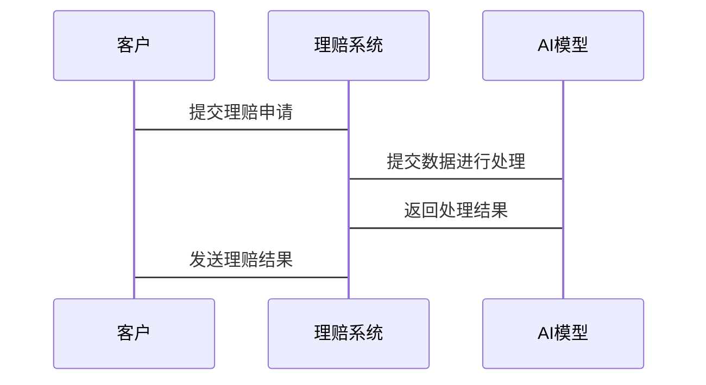

                 


# AI在保险理赔自动化中的创新应用

## 关键词：人工智能、保险理赔、自动化、机器学习、计算机视觉、自然语言处理

## 摘要：本文探讨了人工智能在保险理赔自动化中的创新应用，分析了传统保险理赔的痛点与挑战，详细讲解了机器学习、自然语言处理和计算机视觉等技术在保险理赔中的具体应用，展示了基于这些技术的保险理赔自动化系统的整体架构与实现。通过实际案例分析和系统设计，本文为保险行业的自动化理赔提供了深刻的见解与实践指导。

---

## 第一部分：保险行业与AI技术的背景概述

### 第1章：保险行业的现状与挑战

#### 1.1 保险行业的基本概念
保险是一种风险管理工具，通过分散风险来保护个人或企业的财务安全。保险行业主要分为寿险和非寿险两大类，其中非寿险包括财产保险、责任保险和信用保险等。传统保险业务流程复杂，涉及承保、理赔、客户服务等多个环节，且依赖大量人工操作。

#### 1.2 保险理赔的流程与问题
保险理赔是保险业务中的核心环节，传统理赔流程通常包括以下几个步骤：
1. **理赔申请**：客户提交理赔申请及相关材料。
2. **资料审核**：人工审核理赔申请的完整性和真实性。
3. **风险评估**：根据历史数据和经验进行风险评估。
4. **理赔决策**：基于审核结果做出理赔决定。
5. **赔付处理**：完成赔付金额的计算和支付。

传统理赔过程中存在以下主要问题：
- **效率低下**：人工审核耗时长，容易出错。
- **成本高昂**：需要大量人力和时间，增加了企业成本。
- **准确性不足**：人为因素可能导致审核错误。
- **客户体验差**：繁琐的流程和漫长的等待时间影响客户满意度。

#### 1.3 AI技术的发展与应用潜力
人工智能（AI）技术近年来取得了显著进展，尤其在机器学习、自然语言处理（NLP）和计算机视觉等领域。这些技术为保险行业的自动化理赔带来了巨大潜力：
- **机器学习**：可以用于风险评估、欺诈检测和理赔预测。
- **自然语言处理**：能够自动解析复杂的保险合同和理赔文档。
- **计算机视觉**：可以识别和处理图像数据，如车辆损坏照片。

通过引入AI技术，保险企业可以显著提高理赔效率、降低成本，并改善客户体验。

---

## 第二部分：AI在保险理赔中的核心技术与方法

### 第2章：AI技术的核心概念与原理

#### 2.1 机器学习
机器学习是一种通过数据训练模型来预测或分类的技术。在保险理赔中，机器学习可以用于以下场景：
- **风险评估**：基于历史数据预测理赔概率。
- **欺诈检测**：识别可能存在欺诈行为的理赔申请。
- **理赔分类**：将理赔案件自动分类以优化处理流程。

##### 机器学习算法选择与流程
常用的机器学习算法包括决策树、随机森林和梯度提升树（如XGBoost）。以下是机器学习在保险理赔中的基本流程：
1. **数据预处理**：清洗数据，处理缺失值和异常值。
2. **特征工程**：提取对模型有用的特征。
3. **模型训练**：选择合适的算法训练模型。
4. **模型评估**：通过交叉验证评估模型性能。
5. **模型部署**：将模型集成到现有的系统中。

##### 示例代码
```python
# 示例代码：使用随机森林进行理赔分类
from sklearn.ensemble import RandomForestClassifier
from sklearn.model_selection import train_test_split
from sklearn.metrics import accuracy_score

# 数据加载与预处理
data = ...  # 加载数据
X = data.drop('label', axis=1)
y = data['label']

# 划分训练集和测试集
X_train, X_test, y_train, y_test = train_test_split(X, y, test_size=0.2)

# 训练随机森林模型
model = RandomForestClassifier(n_estimators=100)
model.fit(X_train, y_train)

# 模型预测与评估
y_pred = model.predict(X_test)
print("准确率:", accuracy_score(y_test, y_pred))
```

#### 2.2 自然语言处理（NLP）
NLP技术可以用于处理和解析非结构化文本数据，如保险合同、理赔说明等。在保险理赔中，NLP可以用于：
- **合同解析**：自动提取合同中的关键信息。
- **理赔说明理解**：理解客户提供的理赔说明，生成标准化的理赔信息。

##### 基于NLP的保险合同解析流程
1. **文本清洗**：去除无关字符，分词处理。
2. **信息抽取**：使用命名实体识别（NER）提取关键信息。
3. **语义理解**：使用如BERT等模型进行语义分析。

##### 示例代码
```python
# 示例代码：使用spaCy进行合同信息抽取
import spacy
nlp = spacy.load("en_core_web_sm")

# 加载合同文本
text = "The policy covers damage to the vehicle caused by accidents."

# 文本处理
doc = nlp(text)

# 提取实体
for ent in doc.ents:
    print(f"实体：{ent.text}, 类型：{ent.label_}")
```

#### 2.3 计算机视觉
计算机视觉技术可以用于处理图像数据，如车辆损坏的照片。在保险理赔中，计算机视觉可以用于：
- **图像识别**：自动识别损坏部位和程度。
- **文档识别**：识别和提取理赔单据中的信息。

##### 基于CNN的图像分类流程
1. **图像预处理**：调整大小、归一化等。
2. **特征提取**：使用卷积神经网络（CNN）提取图像特征。
3. **分类预测**：对损坏程度进行分类。

##### 示例代码
```python
# 示例代码：使用CNN进行图像分类
import tensorflow as tf
from tensorflow.keras import layers

# 加载预训练模型
base_model = tf.keras.applications.MobileNetV2(weights='imagenet', include_top=False)

# 添加自定义头
model = tf.keras.Sequential([
    base_model,
    layers.Flatten(),
    layers.Dense(256, activation='relu'),
    layers.Dense(2, activation='sigmoid')
])

model.summary()
```

### 第3章：保险理赔自动化的核心技术

#### 3.1 数据采集与预处理
在保险理赔自动化系统中，数据是关键。数据来源包括：
- **结构化数据**：如理赔申请表、历史理赔记录。
- **非结构化数据**：如保险合同、照片、视频。

##### 数据清洗与特征工程
1. **数据清洗**：处理缺失值、异常值和重复数据。
2. **特征工程**：提取对模型有用的特征，如时间特征、地点特征等。

#### 3.2 模型训练与优化
在训练模型时，需要考虑以下因素：
- **模型选择**：选择适合任务的算法。
- **超参数调优**：通过网格搜索或随机搜索优化模型性能。
- **模型评估**：使用交叉验证评估模型的泛化能力。

#### 3.3 系统集成与部署
将训练好的模型集成到现有的系统中，确保系统的稳定性和高效性。可以通过API接口的方式将模型部署到生产环境中。

---

## 第三部分：保险理赔自动化的系统架构与实现

### 第4章：保险理赔自动化系统的整体架构

#### 4.1 系统功能模块划分
一个典型的保险理赔自动化系统可以划分为以下几个模块：
- **理赔申请接收模块**：接收客户的理赔申请。
- **信息处理模块**：解析和处理理赔信息。
- **决策支持模块**：基于AI模型进行决策。
- **结果输出模块**：生成并发送理赔结果。

#### 4.2 系统架构设计
系统架构设计需要考虑高可用性和可扩展性。以下是基于微服务架构的设计：


#### 4.3 系统接口与交互设计
系统接口设计需要明确接口的功能、输入输出格式和调用方式。以下是一个简单的交互流程图：



### 第5章：系统功能实现与代码解析

#### 5.1 环境搭建与工具安装
- **开发环境**：建议使用Python 3.8及以上版本。
- **开发工具**：推荐使用PyCharm或VS Code。
- **依赖库**：安装必要的库，如TensorFlow、Keras、spaCy、scikit-learn等。

#### 5.2 核心功能实现
- **理赔申请接收模块**：接收客户提交的理赔申请，并将其存储在数据库中。
- **信息处理模块**：解析理赔申请中的文本和图像数据，提取关键信息。
- **决策支持模块**：基于机器学习模型进行风险评估和欺诈检测。
- **结果输出模块**：生成理赔结果并通知客户。

##### 示例代码：理赔申请处理
```python
# 示例代码：理赔申请处理
from flask import Flask, request
import sqlite3

app = Flask(__name__)

@app.route('/submit_claim', methods=['POST'])
def submit_claim():
    data = request.json
    conn = sqlite3.connect('claims.db')
    cursor = conn.cursor()
    cursor.execute('''
        INSERT INTO claims 
        (policy_number, claim_amount, claim_type)
        VALUES (?, ?, ?)
    ''', (data['policyNumber'], data['claimAmount'], data['claimType']))
    conn.commit()
    conn.close()
    return '理赔申请已提交！'
```

---

## 第四部分：项目实战与案例分析

### 第6章：车险理赔自动化处理项目

#### 6.1 项目背景与目标
车险理赔是保险行业中最常见的理赔类型之一。本项目旨在通过AI技术实现车险理赔的自动化处理，包括事故报告解析、车辆损坏识别和理赔金额计算。

#### 6.2 环境安装与数据准备
- **环境安装**：安装Python、TensorFlow、Keras、OpenCV等工具。
- **数据准备**：收集车险理赔相关的数据，包括事故报告、车辆损坏照片等。

#### 6.3 核心代码实现
- **事故报告解析**：使用NLP技术解析事故报告。
- **车辆损坏识别**：使用计算机视觉技术识别损坏部位。

##### 示例代码：车辆损坏识别
```python
# 示例代码：使用OpenCV进行车辆损坏识别
import cv2
import numpy as np

# 加载图像
image = cv2.imread('car_damage.jpg')
gray = cv2.cvtColor(image, cv2.COLOR_BGR2GRAY)

# 使用Canny边缘检测
edges = cv2.Canny(gray, 50, 150)

# 显示图像
cv2.imshow('Original Image', image)
cv2.imshow('Edges', edges)
cv2.waitKey(0)
cv2.destroyAllWindows()
```

#### 6.4 案例分析与结果展示
通过实际案例分析，展示AI技术在车险理赔中的应用效果。例如，系统能够自动识别车辆的损坏程度，并生成相应的理赔金额。

---

## 第五部分：最佳实践与未来展望

### 第7章：AI在保险理赔中的最佳实践

#### 7.1 小结
本文详细介绍了AI技术在保险理赔自动化中的创新应用，包括机器学习、NLP和计算机视觉等技术的应用，以及系统的整体架构和实现。

#### 7.2 注意事项
- 数据隐私和安全问题需要高度重视。
- 模型的可解释性是实际应用中的一个重要考量因素。
- 系统的稳定性和可靠性是确保理赔自动化顺利进行的关键。

#### 7.3 未来展望
随着AI技术的不断发展，保险理赔自动化将更加智能化和高效化。未来可能会出现以下趋势：
- **更强大的AI模型**：如大语言模型（LLM）的应用。
- **多模态数据处理**：结合文本、图像等多种数据源进行理赔决策。
- **实时理赔处理**：通过边缘计算实现实时理赔处理。

---

## 作者：AI天才研究院/AI Genius Institute & 禅与计算机程序设计艺术 /Zen And The Art of Computer Programming

---

以上是《AI在保险理赔自动化中的创新应用》的技术博客文章的完整大纲和内容。本文详细探讨了AI技术在保险理赔中的应用，结合实际案例和系统设计，为保险行业的自动化理赔提供了深刻的见解与实践指导。

