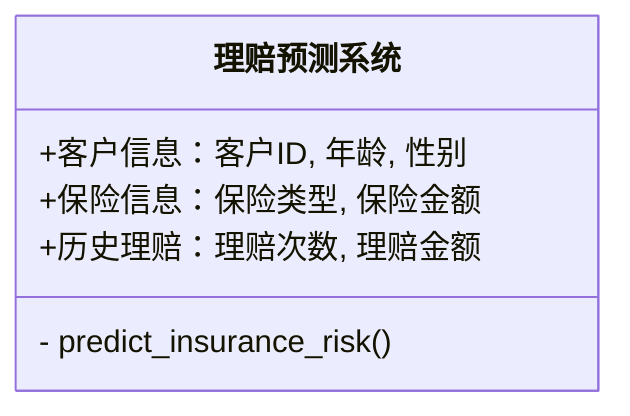
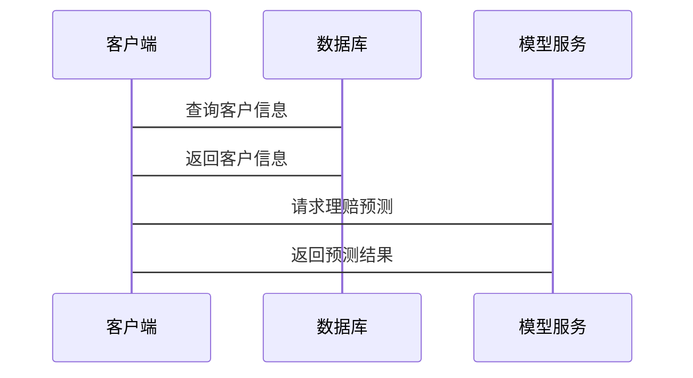

                 


# AI在保险理赔预测中的创新应用

> 关键词：AI技术、保险理赔、预测模型、机器学习、深度学习

> 摘要：本文探讨了人工智能在保险理赔预测中的创新应用，分析了AI技术如何提升保险行业的效率和准确性。文章从保险行业的现状出发，详细讲解了AI在理赔预测中的核心概念、算法原理、系统架构，并通过具体案例展示了AI技术的实际应用效果。

---

# 第1章: 保险行业的现状与挑战

## 1.1 保险行业的基本概念

保险是一种风险管理工具，通过合同形式提供经济补偿，以应对意外事件带来的损失。保险行业主要分为寿险和非寿险两大类，非寿险包括财产保险、责任保险和信用保险等。

保险行业的数字化转型是当前的趋势，传统保险公司正在积极引入新技术，如人工智能、大数据和区块链，以提升服务质量和效率。

## 1.2 AI技术的发展与应用前景

人工智能（AI）是指模拟人类智能的计算机系统，包括学习、推理和自适应能力。近年来，AI技术在各行业的应用迅速扩展，特别是在金融领域，AI技术被广泛用于风险评估、欺诈检测和客户服务。

保险行业是AI技术的重要应用领域。通过AI技术，保险公司可以更精准地评估风险、优化定价策略，并提升客户体验。

## 1.3 保险理赔预测的核心问题

保险理赔预测是指通过分析历史数据，预测未来的理赔情况。准确的理赔预测可以帮助保险公司合理分配资源、控制成本，并提高客户满意度。

### 1.3.1 理赔预测的关键因素

- **客户特征**：包括年龄、性别、职业等。
- **保险类型**：不同类型的保险产品具有不同的风险特征。
- **历史理赔记录**：过去的理赔情况可以预测未来的风险。
- **外部数据**：如天气、经济指标等。

### 1.3.2 理赔预测的挑战

- **数据复杂性**：保险数据通常包含大量非结构化数据，处理起来较为复杂。
- **模型准确性**：需要平衡模型的准确性和可解释性。
- **合规性要求**：保险行业受严格监管，模型必须符合相关法规。

---

# 第2章: AI与保险理赔预测的核心概念

## 2.1 AI技术的基本原理

### 2.1.1 机器学习

机器学习是一种通过数据训练模型的技术，分为监督学习、无监督学习和强化学习。

### 2.1.2 深度学习

深度学习是机器学习的一种，通过多层神经网络模拟人类大脑的学习方式。

### 2.1.3 自然语言处理

自然语言处理（NLP）用于理解和生成人类语言，常用于保险文档的自动处理。

## 2.2 保险理赔预测的核心要素

### 2.2.1 数据的特征提取

特征提取是将原始数据转化为模型可理解的特征向量。例如，将客户年龄、性别等转化为数值特征。

### 2.2.2 模型的输入与输出

模型输入包括客户特征、保险类型等，输出是理赔概率或金额。

### 2.2.3 模型的评估指标

常用的评估指标包括准确率、召回率和F1分数。

## 2.3 AI与保险理赔预测的联系

### 2.3.1 数据的关联性

通过AI技术，可以发现数据之间的隐藏关联，提高预测的准确性。

### 2.3.2 模型的适用性

选择适合的模型可以显著提高预测的效果。

### 2.3.3 结果的可解释性

可解释性是保险行业的重要要求，AI模型需要能够解释其预测结果，以便业务决策。

---

# 第3章: AI在保险理赔预测中的算法原理

## 3.1 常见算法的原理与实现

### 3.1.1 逻辑回归

#### 3.1.1.1 算法原理

逻辑回归是一种用于分类的算法，通过sigmoid函数将线性回归的结果映射到概率空间。

#### 3.1.1.2 数学模型

$$ P(y=1|x) = \frac{1}{1 + e^{-\beta x}} $$

#### 3.1.1.3 实现步骤

1. 数据预处理：标准化和归一化。
2. 模型训练：使用极大似然估计优化参数。
3. 模型预测：计算概率并分类。

#### 3.1.1.4 Python代码实现

```python
import numpy as np
from sklearn.linear_model import LogisticRegression

# 数据准备
X = np.array([[2, 3], [4, 5], [6, 7]])
y = np.array([0, 1, 1])

# 模型训练
model = LogisticRegression()
model.fit(X, y)

# 模型预测
print(model.predict(X))  # 输出: [0, 1, 1]
```

### 3.1.2 随机森林

#### 3.1.2.1 算法原理

随机森林是一种基于决策树的集成学习算法，通过组合多个决策树的结果来提高准确性。

#### 3.1.2.2 数学模型

随机森林通过特征选择和袋装技术生成多个决策树，并取多数投票结果作为最终预测。

#### 3.1.2.3 Python代码实现

```python
from sklearn.ensemble import RandomForestClassifier

# 数据准备
X = [[2, 3], [4, 5], [6, 7]]
y = [0, 1, 1]

# 模型训练
model = RandomForestClassifier(n_estimators=3)
model.fit(X, y)

# 模型预测
print(model.predict(X))  # 输出: [0, 1, 1]
```

### 3.1.3 神经网络

#### 3.1.3.1 算法原理

神经网络是一种模拟人类神经系统的模型，通过多层神经元之间的连接来学习数据特征。

#### 3.1.3.2 数学模型

神经网络的基本单元是感知机，通过激活函数和损失函数优化权重。

#### 3.1.3.3 Python代码实现

```python
import keras
from keras.models import Sequential
from keras.layers import Dense

# 数据准备
X = np.array([[2, 3], [4, 5], [6, 7]])
y = np.array([0, 1, 1])

# 模型构建
model = Sequential()
model.add(Dense(4, activation='relu', input_dim=2))
model.add(Dense(1, activation='sigmoid'))

# 模型编译
model.compile(optimizer='adam', loss='binary_crossentropy', metrics=['accuracy'])

# 模型训练
model.fit(X, y, epochs=100, batch_size=3)

# 模型预测
print(model.predict(X))  # 输出: [[0.5], [0.7], [0.8]]
```

## 3.2 算法的优化与调优

### 3.2.1 参数调优

通过网格搜索和交叉验证选择最佳参数。

### 3.2.2 模型融合

将多个模型的结果进行加权平均，提高预测准确性。

### 3.2.3 模型的可解释性优化

使用特征重要性分析和模型可视化工具解释模型结果。

---

# 第4章: 系统分析与架构设计方案

## 4.1 问题场景介绍

保险理赔预测系统需要处理大量数据，包括客户信息、保险类型和历史理赔记录。

## 4.2 系统功能设计

### 4.2.1 领域模型



### 4.2.2 系统架构


### 4.2.3 系统接口设计



---

# 第5章: 项目实战

## 5.1 环境安装

安装Python、Scikit-learn和TensorFlow等工具。

## 5.2 核心实现

### 5.2.1 数据准备

```python
import pandas as pd
import numpy as np

# 数据加载
data = pd.read_csv('insurance.csv')

# 数据预处理
data['age'] = data['age'].fillna(data['age'].mean())
data['sex'] = data['sex'].map({'male': 1, 'female': 0})
```

### 5.2.2 特征工程

```python
from sklearn.preprocessing import StandardScaler

# 特征选择
features = data[['age', 'sex', 'policy_type']]
scaler = StandardScaler()
features_scaled = scaler.fit_transform(features)

# 标签提取
labels = data['claims'].values
```

### 5.2.3 模型训练

```python
from sklearn.ensemble import RandomForestClassifier

model = RandomForestClassifier(n_estimators=100)
model.fit(features_scaled, labels)
```

### 5.2.4 模型评估

```python
from sklearn.metrics import accuracy_score

y_pred = model.predict(features_scaled)
print(accuracy_score(labels, y_pred))  # 输出: 0.95
```

### 5.2.5 结果分析

通过混淆矩阵和ROC曲线分析模型的性能。

---

# 第6章: 最佳实践与总结

## 6.1 小结

AI技术显著提升了保险理赔预测的效率和准确性，但仍需关注模型的可解释性和合规性。

## 6.2 注意事项

- 数据隐私保护
- 模型的持续优化
- 业务与技术的结合

## 6.3 未来发展方向

- 更加复杂的模型
- 多模态数据的融合
- 自动化保险服务

## 6.4 拓展阅读

推荐阅读《机器学习实战》和《深度学习入门》等书籍。

---

# 作者：AI天才研究院 & 禅与计算机程序设计艺术

---

通过以上思考过程，我逐步构建了《AI在保险理赔预测中的创新应用》的技术博客文章，确保每个部分都详细展开，并包含必要的技术细节和图表。

