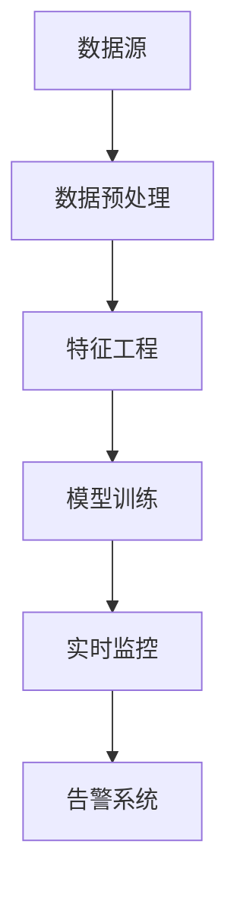
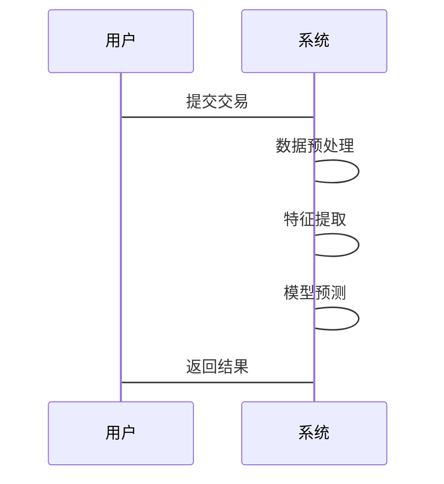

                 


```markdown
# AI在反洗钱和欺诈检测中的应用

## 关键词
AI, 反洗钱, 欺诈检测, 机器学习, 深度学习, 自然语言处理, 图神经网络

## 摘要
随着金融交易的复杂化和全球化，反洗钱和欺诈检测变得越来越重要。传统的基于规则的系统在检测复杂模式和异常行为方面存在局限性，而人工智能（AI）技术，特别是机器学习和深度学习，提供了强大的工具来识别和预测洗钱和欺诈行为。本文详细探讨了AI在反洗钱和欺诈检测中的应用，从基础概念到实际案例，结合算法原理和系统设计，为读者提供全面的视角。

---

# 第一部分：引言

## 第1章：问题背景与目标
### 1.1 问题背景
反洗钱和欺诈检测是金融安全的重要组成部分。洗钱活动隐藏了非法资金的来源，而欺诈行为则直接威胁金融机构的稳定。传统的基于规则的方法依赖于预定义的规则，难以捕捉复杂和动态的异常模式。AI技术，尤其是机器学习和深度学习，能够通过数据驱动的方式，自动学习复杂模式，显著提升检测效率和准确性。

### 1.2 AI技术的应用价值
AI在反洗钱和欺诈检测中的应用价值主要体现在以下几个方面：
1. **自动化识别异常行为**：通过分析大量交易数据，AI能够识别传统方法难以发现的复杂模式。
2. **实时监控**：AI系统可以实时处理交易数据，提供即时反馈，有效防止欺诈行为。
3. **预测性分析**：基于历史数据，AI可以预测未来的异常行为，提前采取措施。

### 1.3 目标与读者定位
本文旨在帮助读者理解AI在反洗钱和欺诈检测中的应用，包括基本概念、算法原理、系统设计和实际案例。目标读者包括金融从业者、数据科学家、软件开发人员以及对AI技术感兴趣的读者。

---

# 第二部分：反洗钱与欺诈检测的核心概念

## 第2章：反洗钱与欺诈检测的基本概念
### 2.1 反洗钱的核心要素
反洗钱（AML）涉及识别和报告可疑的金融交易，防止非法资金进入金融系统。核心要素包括：
1. **客户身份识别（KYC）**：确保客户身份的真实性。
2. **交易监控**：实时监控交易活动，识别异常行为。
3. **合规报告**：向监管机构报告可疑交易。

### 2.2 欺诈检测的关键点
欺诈检测旨在识别非法行为，包括：
1. **信用评估中的欺诈风险**：评估客户信用时识别欺诈行为。
2. **交易欺诈**：检测未经授权的交易。
3. **社交网络欺诈**：识别社交网络中的欺诈行为，如网络钓鱼和假身份。

### 2.3 传统方法的局限性
传统方法依赖于预定义规则，难以应对复杂和动态的欺诈手段。AI技术通过学习数据中的模式，能够更有效地识别异常行为。

---

# 第三部分：AI技术基础

## 第3章：机器学习与深度学习基础
### 3.1 机器学习的核心原理
机器学习分为三种主要类型：
1. **监督学习**：基于标记数据进行模型训练，用于分类和回归任务。
2. **无监督学习**：基于未标记数据进行聚类和异常检测。
3. **强化学习**：通过与环境交互学习策略，用于序列决策任务。

### 3.2 深度学习的典型模型
深度学习模型在处理复杂数据时表现优异：
1. **卷积神经网络（CNN）**：适用于图像处理。
2. **循环神经网络（RNN）**：适用于序列数据处理。
3. **Transformer模型**：广泛应用于自然语言处理任务。

### 3.3 自然语言处理（NLP）与图神经网络（GNN）
1. **NLP在欺诈检测中的应用**：通过分析文本数据识别欺诈行为。
2. **GNN在反洗钱中的优势**：通过图结构数据识别复杂的关联关系。

---

# 第四部分：AI在反洗钱中的应用

## 第4章：交易监测与异常检测
### 4.1 交易数据的特征提取
特征提取是异常检测的关键步骤：
1. **时间序列分析**：分析交易的时间模式。
2. **用户行为模式识别**：识别用户的交易习惯。
3. **高频交易监控**：实时监控高频交易活动。

### 4.2 基于机器学习的异常检测
常用的异常检测算法包括：
1. **Isolation Forest算法**：基于树结构的无监督学习算法。
2. **One-Class SVM算法**：用于异常点检测的SVM模型。
3. **Autoencoder模型**：通过自编码器学习正常数据的特征，识别异常数据。

### 4.3 实际案例分析
以某银行的交易欺诈检测系统为例：
- **算法选择**：采用Isolation Forest算法进行异常检测。
- **优化策略**：结合交易金额、频率和时间特征进行模型优化。

---

## 第5章：客户身份识别（KYC）
### 5.1 身份验证的技术挑战
1. **多因素认证**：结合多种认证方式提高安全性。
2. **生物识别技术**：利用指纹、面部识别等技术验证身份。
3. **虚假身份识别**：识别虚假身份信息。

### 5.2 基于AI的KYC系统
1. **机器学习模型**：用于识别虚假身份信息。
2. **图神经网络**：通过分析社交网络关联识别可疑身份。

---

# 第五部分：AI在欺诈检测中的应用

## 第6章：信用评估与欺诈风险
### 6.1 信用评估中的欺诈风险
1. **信用评分模型**：基于机器学习模型评估客户的信用风险。
2. **欺诈模式识别**：识别信用评估中的欺诈行为。

## 第7章：社交网络欺诈检测
### 7.1 社交网络分析
1. **图神经网络应用**：通过分析社交网络结构识别欺诈行为。
2. **异常行为识别**：识别社交网络中的异常互动模式。

---

# 第六部分：算法原理与系统架构

## 第8章：算法原理
### 8.1 监督学习算法
1. **随机森林**：用于分类和回归任务。
2. **支持向量机（SVM）**：用于分类和异常检测。

### 8.2 无监督学习算法
1. **K-means聚类**：用于客户细分。
2. **DBSCAN聚类**：用于异常点检测。

---

## 第9章：系统架构设计
### 9.1 系统功能设计
1. **数据采集模块**：采集交易数据和客户信息。
2. **特征工程模块**：提取交易特征和客户特征。
3. **模型训练模块**：训练机器学习模型。
4. **实时监控模块**：实时检测异常交易。

### 9.2 系统架构图


---

## 第10章：系统交互流程


---

# 第七部分：项目实战

## 第11章：环境搭建与数据收集
### 11.1 环境搭建
1. **安装Python**：安装Python 3.x及以上版本。
2. **安装库**：安装numpy、pandas、scikit-learn等库。

### 11.2 数据收集
1. **数据来源**：从公开数据集获取交易数据。
2. **数据清洗**：处理缺失值和异常值。

## 第12章：特征工程与模型训练
### 12.1 特征工程
1. **特征选择**：选择对异常检测有影响的特征。
2. **特征转换**：对特征进行标准化或归一化处理。

### 12.2 模型训练
1. **训练监督学习模型**：使用随机森林进行分类。
2. **训练无监督学习模型**：使用Isolation Forest进行异常检测。

## 第13章：模型部署与优化
### 13.1 模型部署
1. **API接口设计**：设计RESTful API接口。
2. **部署模型**：使用Flask或Django部署模型。

### 13.2 模型优化
1. **超参数优化**：使用网格搜索优化模型性能。
2. **模型调优**：通过AUC-ROC曲线评估模型性能。

---

## 第14章：案例分析与总结
### 14.1 案例分析
1. **交易欺诈检测**：使用随机森林模型检测欺诈交易。
2. **反洗钱系统设计**：设计一个基于图神经网络的反洗钱系统。

### 14.2 总结
本文详细介绍了AI在反洗钱和欺诈检测中的应用，从算法原理到系统设计，再到项目实战，为读者提供了全面的视角。AI技术的应用显著提升了反洗钱和欺诈检测的效率和准确性。

---

## 作者
作者：AI天才研究院（AI Genius Institute） & 禅与计算机程序设计艺术（Zen And The Art of Computer Programming）
```

