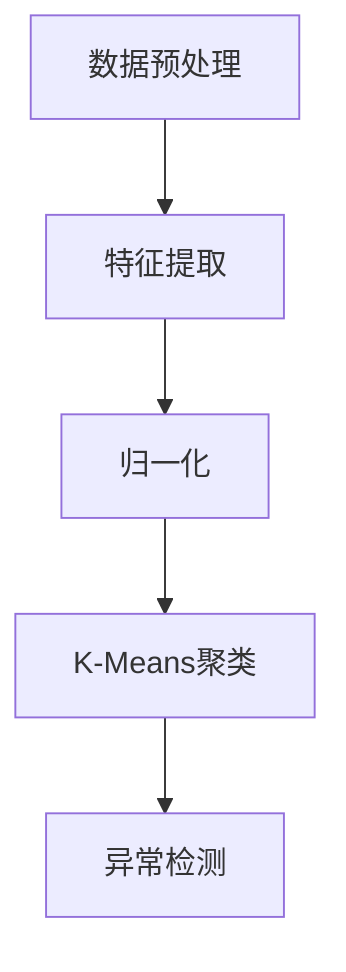
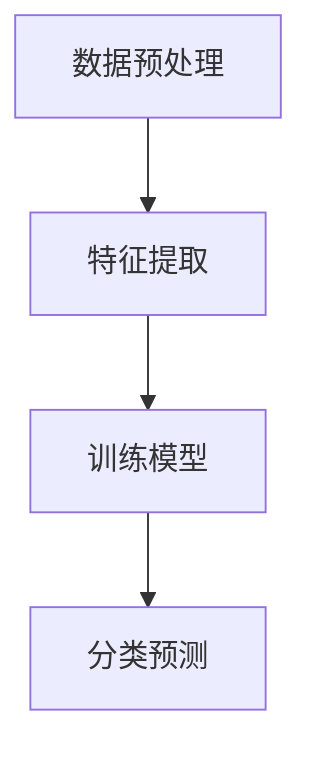
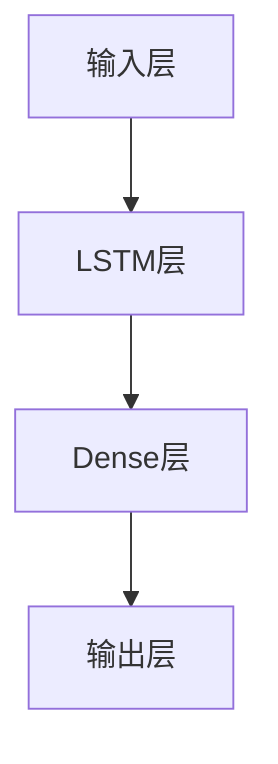
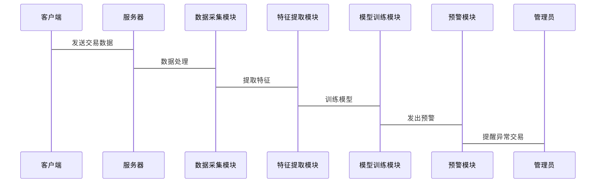

                 


# AI在反洗钱模式进化检测与预警中的深度应用研究

> **关键词**: AI, 反洗钱, 模式进化检测, 金融安全, 机器学习

> **摘要**: 本文深入探讨了人工智能技术在反洗钱模式进化检测与预警中的应用。从反洗钱的基本概念、AI技术的应用背景，到具体的算法实现和系统架构设计，系统性地分析了AI如何提升反洗钱检测的效率和准确性。通过实际案例分析，本文展示了如何利用AI技术构建高效的反洗钱预警系统。

---

## 第一部分: AI与反洗钱模式进化检测的背景与概念

### 第1章: 反洗钱与AI技术的概述

#### 1.1 反洗钱的基本概念
反洗钱（Anti-Money Laundering, AML）是指识别、防止和打击非法资金流动的过程。洗钱行为通常涉及将非法所得合法化，以掩盖资金来源。反洗钱的核心目标是通过技术手段识别异常交易，防止洗钱活动的发生。

- **问题背景**: 洗钱活动猖獗，传统的人工审查方式效率低下，难以应对海量交易数据。
- **问题描述**: 反洗钱需要实时检测异常交易，但传统的基于规则的方法难以适应洗钱模式的不断进化。
- **解决思路**: 引入AI技术，通过机器学习算法自动识别异常模式。
- **边界与外延**: 反洗钱的边界是合法与非法交易的区分，外延包括打击恐怖融资、逃税等违法行为。

#### 1.2 AI技术在金融领域的应用背景
AI技术在金融领域的应用日益广泛，尤其是在风险控制和欺诈检测方面。AI能够通过大数据分析和模式识别，帮助金融机构提高交易安全。

- **AI技术的基本概念**: 包括机器学习、深度学习、自然语言处理等。
- **AI在金融安全中的应用前景**: AI能够处理复杂的数据模式，适用于实时交易监控和风险评估。
- **反洗钱领域对AI技术的需求**: 需要高效的算法来应对洗钱模式的多样化和复杂化。

#### 1.3 AI在反洗钱模式进化检测中的作用
AI技术能够通过不断学习新的洗钱模式，动态调整检测策略，从而提高反洗钱的效率和准确性。

- **模式进化检测的定义与意义**: 模式进化检测是指识别洗钱行为中模式的变化，及时调整检测算法。
- **AI如何提升反洗钱检测的效率**: 通过机器学习算法，AI能够快速识别异常交易模式。
- **模式进化检测与传统反洗钱方法的对比**: 传统方法基于固定规则，而AI方法能够动态适应变化。

### 第2章: 反洗钱模式进化检测的核心概念与联系

#### 2.1 反洗钱模式进化检测的原理
模式进化检测的原理是通过分析交易数据的变化，识别洗钱行为的新模式。

- **模式检测的基本原理**: 基于数据特征的相似性度量，识别异常模式。
- **模式进化的动态特征**: 包括交易频率、金额、参与者行为模式的变化。
- **AI算法在模式进化检测中的应用**: 使用聚类、分类等算法，识别异常交易模式。

#### 2.2 核心概念的属性特征对比
以下是核心概念的属性特征对比：

| 概念       | 数据特征 | 模式特征 | 时间序列特征 |
|------------|----------|----------|--------------|
| 合法交易   | 金额稳定 | 模式固定 | 时间序列平稳 |
| 非法交易   | 金额波动 | 模式变化 | 时间序列突变 |

#### 2.3 实体关系图与流程图

```mermaid
erDiagram
    customer[CUSTOMER] {
        id INT
        name VARCHAR
        account_no VARCHAR
    }
    transaction[TRANSACTION] {
        id INT
        amount DECIMAL
        time TIMESTAMP
        customer_id INT
    }
    rule[ANTI_MONEY_LAUERING_RULE] {
        rule_id INT
        condition TEXT
        threshold DECIMAL
    }
    customer --> transaction : 发起交易
    transaction --> rule : 符合规则
```

---

## 第二部分: AI算法在反洗钱模式进化检测中的原理与实现

### 第3章: 常见AI算法在反洗钱中的应用

#### 3.1 聚类算法
聚类算法通过将交易数据分成不同的簇，识别异常簇。

- **K-Means算法在反洗钱中的应用**: 将交易数据分成合法和非法簇。
- **算法流程图**:



- **代码实现**:

```python
from sklearn.cluster import KMeans

# 数据预处理
data = [...]  # 特征向量

# 聚类
kmeans = KMeans(n_clusters=2)
clusters = kmeans.fit_predict(data)

# 异常检测
anomalies = clusters == 1
```

#### 3.2 分类算法
分类算法通过训练模型，识别交易是否为非法。

- **随机森林分类器**: 适用于高维数据。
- **算法流程图**:



- **代码实现**:

```python
from sklearn.ensemble import RandomForestClassifier

# 数据预处理
data = [...]  # 特征向量
label = [...]  # 标签

# 训练模型
model = RandomForestClassifier().fit(data, label)

# 分类预测
prediction = model.predict(new_data)
```

#### 3.3 深度学习算法
深度学习通过神经网络，自动提取交易特征。

- **LSTM网络**: 适用于时间序列数据。
- **模型结构**:



- **代码实现**:

```python
import tensorflow as tf
from tensorflow.keras import layers

model = tf.keras.Sequential([
    layers.LSTM(64, input_shape=(timesteps, features)),
    layers.Dense(1, activation='sigmoid')
])
model.compile(loss='binary_crossentropy', optimizer='adam', metrics=['accuracy'])
```

---

### 第4章: 系统架构设计

#### 4.1 问题场景介绍
反洗钱系统需要实时处理大量的交易数据，及时发现异常交易。

#### 4.2 系统功能设计
- **数据采集模块**: 收集交易数据。
- **特征提取模块**: 提取交易特征。
- **模型训练模块**: 训练AI模型。
- **预警模块**: 发出预警信号。

#### 4.3 系统架构图


#### 4.4 接口设计
- **API接口**: 提供RESTful API，供前端调用。
- **数据接口**: 与数据库交互。

#### 4.5 交互流程图



---

## 第五部分: 项目实战与总结

### 第5章: 项目实战

#### 5.1 环境安装
- 安装Python和必要的库：
  ```bash
  pip install numpy scikit-learn tensorflow
  ```

#### 5.2 核心实现代码

```python
import numpy as np
from sklearn.cluster import KMeans
from sklearn.ensemble import RandomForestClassifier

# 数据预处理
def preprocess(data):
    # 数据清洗和归一化
    pass

# 聚类算法
def kmeans_clustering(data):
    kmeans = KMeans(n_clusters=2)
    clusters = kmeans.fit_predict(data)
    return clusters

# 分类算法
def random_forest_classifier(features, labels):
    model = RandomForestClassifier()
    model.fit(features, labels)
    return model

# 深度学习模型
def lstm_model(input_shape):
    model = tf.keras.Sequential([
        layers.LSTM(64, input_shape=input_shape),
        layers.Dense(1, activation='sigmoid')
    ])
    model.compile(loss='binary_crossentropy', optimizer='adam', metrics=['accuracy'])
    return model
```

#### 5.3 案例分析
- 数据来源：银行交易数据。
- 数据特征：金额、时间、交易频率等。
- 预警结果：识别出异常交易。

#### 5.4 小结
通过AI技术，反洗钱系统的效率和准确性得到了显著提升。AI能够实时检测异常交易，动态调整检测策略。

---

## 第六部分: 总结与最佳实践

### 6.1 总结
AI技术在反洗钱模式进化检测中的应用前景广阔。通过机器学习算法，AI能够实时检测异常交易，动态调整检测策略，显著提升反洗钱的效率和准确性。

### 6.2 最佳实践 tips
- 数据预处理是关键，确保数据质量。
- 选择合适的算法，根据数据特性进行调整。
- 定期更新模型，适应洗钱模式的变化。

### 6.3 注意事项
- 数据隐私保护是重点，需遵守相关法律法规。
- 系统需具备高可用性，确保实时监控。

### 6.4 拓展阅读
- 《机器学习实战》
- 《深度学习入门》
- 《反洗钱实务》

---

**作者：AI天才研究院/AI Genius Institute & 禅与计算机程序设计艺术 /Zen And The Art of Computer Programming**

