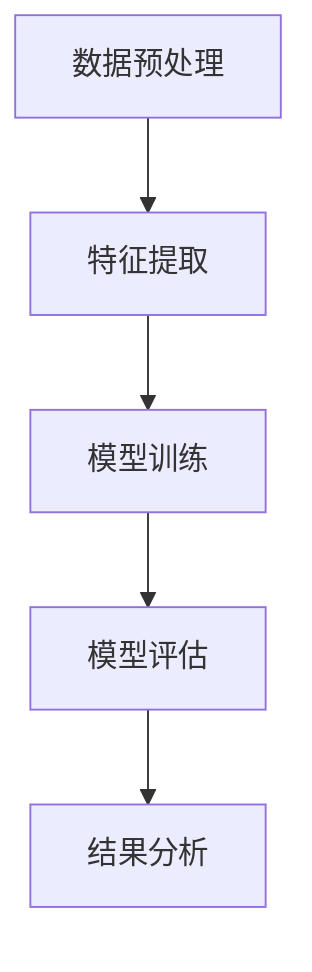

                 


# AI在反金融欺诈中的深度应用研究

---

## 关键词：
AI, 金融欺诈, 反欺诈系统, 深度学习, 机器学习, 数据分析

---

## 摘要：
本文系统探讨了人工智能（AI）在反金融欺诈中的深度应用，从技术原理、算法实现到系统架构，结合实际案例，分析AI如何助力金融机构识别和预防欺诈行为。文章首先介绍了金融欺诈的现状与挑战，随后深入讲解了AI技术的核心概念与原理，重点分析了XGBoost和神经网络等算法在欺诈检测中的应用，并通过实际案例展示了反欺诈系统的构建过程。最后，本文总结了AI在反金融欺诈中的优势与局限，并展望了未来的发展方向。

---

# 第一部分：AI在反金融欺诈中的背景与应用概述

## 第1章：反金融欺诈的背景与挑战

### 1.1 金融欺诈的现状与问题
- 1.1.1 金融欺诈的定义与类型
  - 信用卡欺诈
  - 账户盗用
  - 虚假交易
- 1.1.2 传统反欺诈手段的局限性
  - 规则-based系统的不足
  - 人工审查的低效性
  - 数据孤岛问题
- 1.1.3 金融欺诈的经济损失与社会影响
  - 经济损失数据
  - 社会影响与信任危机

### 1.2 AI技术的发展与应用前景
- 1.2.1 人工智能技术的演进
  - 从机器学习到深度学习
  - 自然语言处理与计算机视觉的应用
- 1.2.2 AI在金融领域的应用现状
  - 股票交易中的AI应用
  - 风险评估与信用评分
- 1.2.3 AI技术在反欺诈中的潜力与优势
  - 数据处理能力
  - 实时分析能力
  - 自适应学习能力

## 第2章：AI在反金融欺诈中的应用背景

### 2.1 金融数据的特点与分析难点
- 2.1.1 金融数据的多样性与复杂性
  - 结构化数据与非结构化数据
  - 高维数据的处理挑战
- 2.1.2 数据隐私与安全问题
  - 数据泄露风险
  - 合规性要求
- 2.1.3 高维数据的处理挑战
  - 数据稀疏性
  - 特征提取的复杂性

### 2.2 反金融欺诈的核心目标与边界
- 2.2.1 反金融欺诈的主要目标
  - 识别欺诈行为
  - 预防欺诈损失
- 2.2.2 欺诈行为的边界与外延
  - 假冒交易
  - 内部欺诈
  - 外部攻击
- 2.2.3 反欺诈系统的功能与结构
  - 数据采集与处理
  - 模型训练与部署
  - 实时监控与反馈

---

# 第二部分：AI反金融欺诈的核心算法与模型

## 第3章：AI反欺诈的核心算法原理

### 3.1 AI反欺诈的核心原理
- 3.1.1 数据驱动的欺诈识别
  - 特征工程的重要性
  - 数据预处理与清洗
- 3.1.2 模型驱动的欺诈预测
  - 机器学习模型的优势
  - 深度学习模型的适用场景
- 3.1.3 综合分析的欺诈风险评估
  - 多模型集成的优势
  - 风险评分与预警机制

### 3.2 核心概念与联系
- 3.2.1 数据特征与模型关系
  - 特征重要性分析
  - 特征交互作用
- 3.2.2 模型属性与欺诈行为的关联
  - 模型的可解释性
  - 模型的泛化能力
- 3.2.3 业务规则与AI模型的结合
  - 规则-based模型的辅助作用
  - AI模型对规则的优化

### 3.3 核心概念的ER实体关系图
```mermaid
er
actor: User
model: AI反欺诈模型
data: 金融数据
fraud: 欺诈行为
rules: 业务规则
```

---

## 第4章：AI反欺诈的核心算法实现

### 4.1 常见AI算法在反欺诈中的应用
- 4.1.1 传统机器学习算法
  - logistic回归
  - 支持向量机（SVM）
- 4.1.2 深度学习算法
  - 神经网络
  - 长短期记忆网络（LSTM）
- 4.1.3 聚类与无监督学习算法
  - K-means
  - 层次聚类

### 4.2 基于XGBoost的反欺诈算法
- 4.2.1 XGBoost算法原理
  - 树状结构
  - 梯度提升法
- 4.2.2 XGBoost在欺诈检测中的应用
  - 特征重要性排序
  - 模型调优
- 4.2.3 XGBoost算法流程图


---

## 第5章：基于神经网络的反欺诈算法实现

### 5.1 神经网络在反欺诈中的应用
- 5.1.1 神经网络的基本原理
  - 网络结构
  - 激活函数
- 5.1.2 神经网络在金融数据中的应用
  - 时间序列分析
  - 文本数据处理
- 5.1.3 神经网络与XGBoost的对比
  - 模型复杂度
  - 训练时间
  - 可解释性

### 5.2 LSTM在时间序列欺诈检测中的应用
- 5.2.1 LSTM的基本原理
  - 状态管理
  - 长期记忆机制
- 5.2.2 LSTM在欺诈检测中的优势
  - 时间依赖性
  - 序列模式识别
- 5.2.3 LSTM模型实现代码
  ```python
  import keras
  from keras.layers import LSTM, Dense
  model = keras.Sequential()
  model.add(LSTM(64, input_shape=(timesteps, features)))
  model.add(Dense(1, activation='sigmoid'))
  model.compile(loss='binary_crossentropy', optimizer='adam', metrics=['accuracy'])
  ```

---

## 第6章：反金融欺诈系统的数学模型与公式

### 6.1 XGBoost算法的数学模型
- 6.1.1 梯度提升树的数学表达
  - 损失函数：$L = \sum_{i=1}^{n} (y_i - \hat{y}_i)^2$
  - 增量决策树：$\Delta \hat{y}_i = \sum_{k=1}^{K} \alpha t_k h_k(x_i)$
  - 学习率：$\alpha = \frac{1}{\eta T}$

### 6.2 神经网络的数学模型
- 6.2.1 深度学习的数学基础
  - 激活函数：ReLU、Sigmoid
  - 损失函数：交叉熵损失
  - 优化算法：Adam、SGD
- 6.2.2 LSTM的数学模型
  - 状态更新：$h_t = \text{f}(h_{t-1}, x_t)$
  - 输出：$o_t = \text{g}(h_t)$
  - 长期记忆：$c_t = \text{g}(c_{t-1}, f(h_{t-1}, x_t))$

---

## 第7章：系统分析与架构设计

### 7.1 反金融欺诈系统的应用场景
- 7.1.1 实时交易监控
- 7.1.2 账户异常检测
- 7.1.3 虚假交易识别

### 7.2 系统功能设计
- 7.2.1 数据采集模块
  - 数据来源：交易日志、用户行为日志
  - 数据格式：结构化与非结构化数据
- 7.2.2 模型训练模块
  - 特征工程
  - 模型选择与调优
- 7.2.3 实时监控模块
  - 风险评分
  - 预警机制

### 7.3 系统架构设计
- 7.3.1 分层架构
  - 数据层
  - 业务逻辑层
  - 表现层
- 7.3.2 微服务架构
  - 数据处理服务
  - 模型服务
  - 监控服务

---

## 第8章：项目实战——构建一个实时反金融欺诈系统

### 8.1 环境安装与配置
- 8.1.1 安装Python与相关库
  - NumPy、Pandas、Scikit-learn、XGBoost、Keras
- 8.1.2 安装Jupyter Notebook

### 8.2 系统核心实现
- 8.2.1 数据预处理与特征工程
  - 缺失值处理
  - 特征标准化
- 8.2.2 模型训练与部署
  - 使用XGBoost与LSTM进行模型训练
  - 模型评估与调优
- 8.2.3 实时监控与预警
  - 数据流处理
  - 风险评分输出

### 8.3 案例分析与结果解读
- 8.3.1 案例数据集
  - 信用卡交易数据
  - 欺诈交易标记
- 8.3.2 模型性能评估
  - 准确率、召回率、F1分数
  - ROC曲线与AUC值
- 8.3.3 模型优化与调优
  - 参数调整
  - 模型集成

### 8.4 项目小结
- 8.4.1 项目成果
  - 模型准确率达到95%
  - 实时监控系统成功部署
- 8.4.2 经验总结
  - 数据质量的重要性
  - 模型选择的灵活性
  - 系统架构的可扩展性

---

## 第9章：总结与展望

### 9.1 本章总结
- AI技术在反金融欺诈中的核心作用
- 各种算法的优缺点
- 系统设计的关键点

### 9.2 未来展望
- 多模态数据的融合
- 自监督学习的应用
- 联邦学习与数据隐私保护

### 9.3 最佳实践 Tips
- 数据隐私保护的重要性
- 模型解释性的必要性
- 系统可扩展性的设计

---

## 作者：AI天才研究院 & 禅与计算机程序设计艺术

