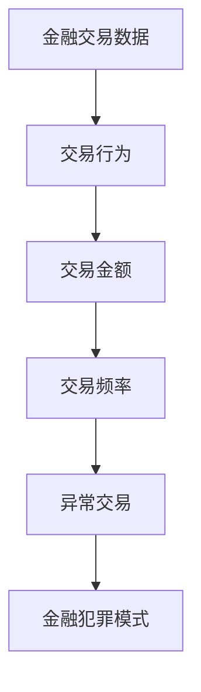
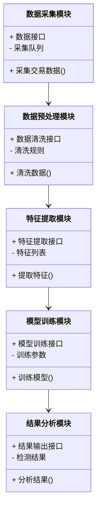
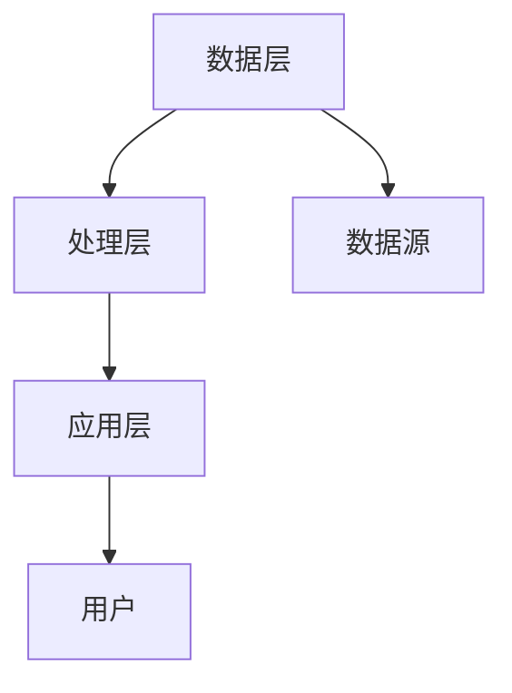
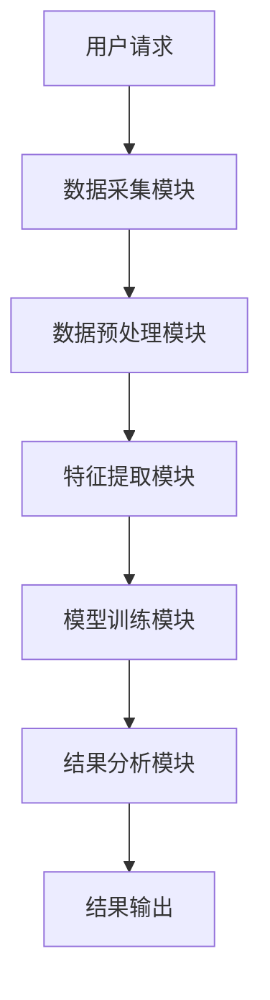
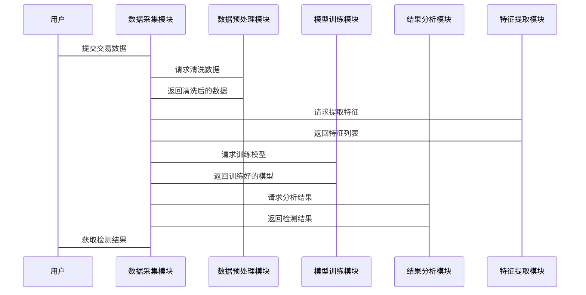

                 


# AI在反金融犯罪模式识别中的深度应用研究

## 关键词：AI技术、金融犯罪、模式识别、深度学习、机器学习

## 摘要：  
本文深入探讨了人工智能技术在反金融犯罪模式识别中的应用，从问题背景到算法原理，再到系统架构设计和项目实战，全面分析了AI技术在金融犯罪检测中的优势和实现方法。文章详细介绍了聚类、分类和神经网络等算法在金融犯罪模式识别中的具体应用，并通过实际案例展示了系统的实现过程和效果。最后，本文总结了反金融犯罪模式识别的最佳实践和未来研究方向。

---

## 第一部分: AI在反金融犯罪模式识别中的背景与核心概念

### 第1章: 问题背景与目标

#### 1.1 问题背景
金融犯罪是一种严重的社会问题，包括洗钱、欺诈交易、内幕交易等行为，这些行为不仅损害了个人和企业的利益，还威胁到金融系统的稳定。传统的反金融犯罪手段依赖人工审查和简单的规则匹配，存在效率低、漏检率高、应对复杂模式能力不足等问题。AI技术的兴起为解决这些问题提供了新的可能性。

AI技术在模式识别中的应用可以显著提升金融犯罪检测的准确性和效率。通过分析大量的金融交易数据，AI能够发现隐藏在正常交易中的异常模式，从而帮助识别潜在的金融犯罪行为。

#### 1.2 问题描述与目标
反金融犯罪模式识别的核心问题是如何从海量的金融交易数据中识别出异常的模式，并对这些模式进行分类，以便及时采取措施。AI技术的应用目标包括提高检测的准确率、降低误报率、实现实时监控以及减少对人工干预的依赖。

本研究的范围主要集中在利用AI技术对金融交易数据进行模式识别，重点解决欺诈检测和异常交易识别等问题。研究的边界包括不涉及具体的法律判决和执法行动，仅关注模式识别阶段的技术实现。

---

### 第2章: 核心概念与联系

#### 2.1 核心概念原理
模式识别是通过计算机技术对数据进行分析和处理，以识别出特定的模式或特征。在反金融犯罪中，模式识别主要用于检测异常交易行为，如欺诈、洗钱等。AI技术，特别是机器学习和深度学习，通过从数据中学习特征，能够更准确地识别这些异常模式。

AI技术在模式识别中的应用包括特征提取、分类和聚类等任务。与传统的统计分析方法相比，AI技术能够处理更复杂的数据类型和更高的维度，同时具有更强的自适应能力。

在反金融犯罪中，模式识别的特点包括数据量大、模式多样、实时性要求高等。这些特点使得AI技术成为解决这些问题的理想选择。

#### 2.2 核心概念属性对比

| 对比维度         | 模式识别       | 传统统计分析   |
|------------------|---------------|----------------|
| 数据处理能力     | 高            | 中             |
| 分析深度         | 深            | 浅             |
| 适用场景         | 异常检测       | 趋势分析       |

AI算法与传统算法在性能上的对比如下：

| 对比维度         | AI算法       | 传统算法       |
|------------------|--------------|----------------|
| 检测准确率       | 高            | 中             |
| 计算效率         | 中            | 高             |
| 适应性           | 强            | 弱             |

金融犯罪模式的特征分析如下：
- **交易金额异常波动**：某些交易金额突然增加或减少，可能表明洗钱行为。
- **交易频率异常增加**：短时间内频繁交易可能涉嫌欺诈。
- **交易时间集中**：异常交易可能集中在特定时间段，如深夜或周末。

#### 2.3 实体关系图


---

## 第二部分: AI算法原理与数学模型

### 第3章: 算法原理

#### 3.1 聚类算法
**K-Means算法原理**：  
K-Means是一种无监督学习算法，用于将数据分成K个簇。其目标是最小化簇内数据点的方差。算法步骤包括初始化质心、计算每个数据点的簇归属、更新质心，直到收敛。

**DBSCAN算法的适用性**：  
DBSCAN是一种基于密度的聚类算法，适用于处理金融数据中的异常簇。它通过密度可达性来定义簇，能够发现任意形状的簇。

**聚类在异常交易检测中的应用**：  
聚类算法可以帮助识别交易行为中的异常簇，如某些交易行为突然集中在一个簇中，可能表明欺诈行为。

#### 3.2 分类算法
**支持向量机(SVM)原理**：  
SVM是一种监督学习算法，用于分类和回归。其核心思想是通过找到一个超平面，将数据点分为两类。在非线性可分的情况下，使用核函数将数据映射到高维空间。

**随机森林的特征选择能力**：  
随机森林是一种基于决策树的集成学习算法，具有强大的特征选择能力。在反金融犯罪中，随机森林可以用于识别重要的交易特征，如交易金额、时间间隔等。

**分类算法在欺诈检测中的应用**：  
通过训练SVM和随机森林模型，可以对交易进行分类，识别欺诈交易。模型的性能可以通过准确率、召回率和F1分数来评估。

#### 3.3 神经网络算法
**卷积神经网络(CNN)在图像识别中的应用**：  
虽然主要应用于图像识别，但CNN也可以用于处理金融数据中的图像信息，如支票上的签名识别。

**循环神经网络(RNN)在时间序列分析中的应用**：  
RNN适用于处理时间序列数据，如交易时间序列分析，能够识别异常的时间模式。

**深度学习模型的训练流程**：  
深度学习模型的训练流程包括数据预处理、模型设计、训练和评估。训练过程中需要调整学习率、批量大小等超参数，以优化模型性能。

---

## 第三部分: 系统架构设计

### 第4章: 系统架构与实现

#### 4.1 问题场景介绍
以银行交易监控系统为例，系统需要实时监控交易数据，识别异常交易行为。系统的目标是提高检测的准确率和效率，减少误报和漏报。

#### 4.2 系统功能设计
系统功能模块包括：
- 数据采集：从银行系统获取交易数据。
- 数据预处理：清洗数据，处理缺失值和异常值。
- 特征提取：提取交易金额、时间间隔等特征。
- 模型训练：使用聚类、分类和神经网络算法训练模型。
- 结果分析：输出检测结果，包括异常交易的详细信息。

领域模型类图如下：


#### 4.3 系统架构设计
系统架构包括数据层、处理层和应用层。数据层负责存储和提供交易数据，处理层负责数据处理和模型训练，应用层负责结果展示和用户交互。

系统架构图如下：


#### 4.4 系统接口设计
系统接口包括数据采集接口、模型训练接口和结果输出接口。接口交互流程图如下：


#### 4.5 系统交互设计
系统交互序列图如下：


---

## 第四部分: 项目实战

### 第5章: 项目实战与实现

#### 5.1 环境安装
开发环境包括Python 3.8及以上版本、TensorFlow 2.0及以上版本、Scikit-learn 0.23及以上版本、Jupyter Notebook。安装步骤如下：
```bash
pip install python>=3.8
pip install tensorflow>=2.0
pip install scikit-learn>=0.23
pip install jupyter
```

#### 5.2 核心代码实现
以下是系统的核心代码实现：

**数据预处理代码：**
```python
import pandas as pd
import numpy as np

# 加载数据
data = pd.read_csv('transaction_data.csv')

# 清洗数据
data.dropna(inplace=True)
data = data[~data.duplicated()]
```

**特征提取代码：**
```python
from sklearn.preprocessing import StandardScaler

# 提取特征
features = data[['amount', 'time_interval', 'transaction_count']]
scaler = StandardScaler()
features_scaled = scaler.fit_transform(features)
```

**模型训练代码（K-Means）：**
```python
from sklearn.cluster import KMeans

# 训练K-Means模型
kmeans = KMeans(n_clusters=3, random_state=42)
kmeans.fit(features_scaled)

# 预测簇
clusters = kmeans.predict(features_scaled)
```

**模型训练代码（SVM）：**
```python
from sklearn.svm import SVC

# 训练SVM模型
svm = SVC(kernel='rbf', gamma='auto')
svm.fit(features_scaled, labels)

# 预测类别
predicted = svm.predict(features_scaled)
```

**结果分析代码：**
```python
from sklearn.metrics import classification_report

# 评估模型性能
print(classification_report(labels, predicted))
```

---

## 第五部分: 总结与展望

### 第6章: 总结与展望

#### 6.1 最佳实践
- 在反金融犯罪模式识别中，建议结合多种算法，如聚类和分类，以提高检测的准确率。
- 数据预处理是关键步骤，需要仔细清洗和标准化数据。
- 模型的选择和调优对性能影响较大，建议进行多次实验和优化。

#### 6.2 小结
本文详细探讨了AI技术在反金融犯罪模式识别中的应用，从算法原理到系统实现，全面分析了技术细节和实际案例。AI技术的引入显著提升了金融犯罪检测的效率和准确性。

#### 6.3 注意事项
- 数据隐私保护是系统设计中的重要考虑因素，需要遵守相关法律法规。
- 模型的可解释性是实际应用中的重要需求，建议选择具有可解释性的算法，如随机森林。
- 系统的实时性要求较高，需要优化算法和架构设计，以提高处理速度。

#### 6.4 拓展阅读
- 推荐阅读《机器学习实战》和《深度学习入门：基于Python的CNN、RNN、GAN等技术入门与实践》。
- 参考论文《利用深度学习检测金融欺诈》和《基于时间序列分析的异常交易检测》。

---

## 附录

### 附录A: AI算法原理
- 附录A.1：聚类算法详细说明
- 附录A.2：分类算法详细说明
- 附录A.3：神经网络算法详细说明

### 附录B: 系统架构设计图
- 附录B.1：领域模型类图
- 附录B.2：系统架构图
- 附录B.3：接口交互流程图
- 附录B.4：系统交互序列图

### 附录C: 项目源代码
完整的项目源代码，按模块分类，每个模块附有详细的注释和说明。

---

## 作者信息

作者：AI天才研究院/AI Genius Institute & 禅与计算机程序设计艺术/Zen And The Art of Computer Programming

---

通过以上思考和组织，我可以系统地撰写出一篇结构清晰、内容详实的技术博客文章，全面展示AI在反金融犯罪模式识别中的深度应用研究。

