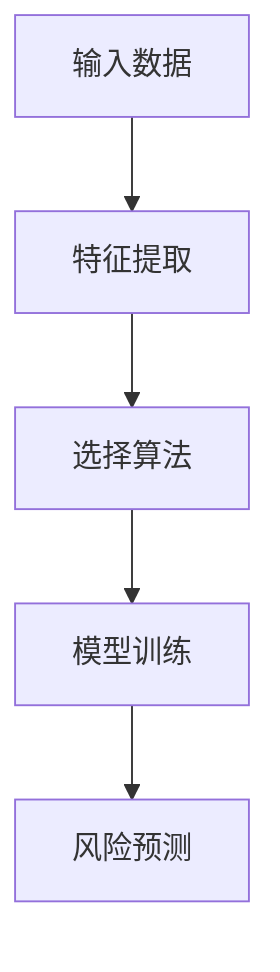
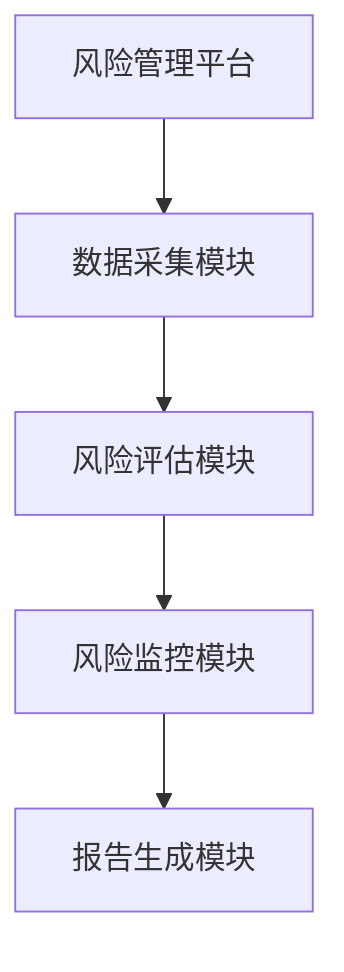
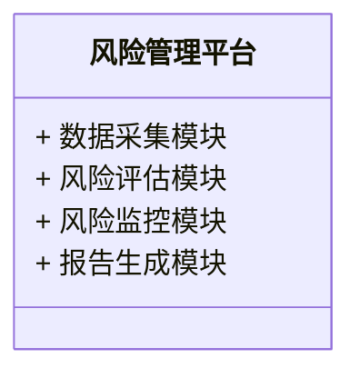
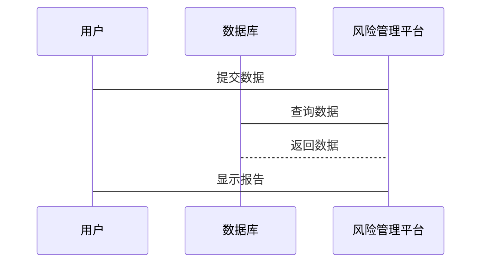

                 


# AI在商业银行风险管理中的应用

> 关键词：AI，风险管理，商业银行，机器学习，深度学习，自然语言处理

> 摘要：本文探讨了人工智能技术在商业银行风险管理中的应用，分析了AI技术如何帮助银行提高风险预测的准确性和效率。文章从AI技术的核心概念入手，详细讲解了AI在信用评估、市场风险预测等场景中的应用，结合实际案例，分析了AI算法的数学模型和系统架构设计。最后，总结了AI在风险管理中的优势，并展望了未来的发展方向。

---

## 第1章: AI与风险管理的背景介绍

### 1.1 风险管理的核心概念

#### 1.1.1 风险管理的定义与目标
风险管理是指识别、评估和应对各种风险的过程，旨在降低潜在损失，确保业务的稳定运行。在商业银行中，风险管理的核心目标是通过科学的方法和工具，预测和控制可能的风险，从而保护银行的资产安全和声誉。

#### 1.1.2 银行风险管理的关键要素
银行风险管理的关键要素包括以下几个方面：
1. **风险识别**：识别可能影响银行运营的各种风险因素。
2. **风险评估**：评估这些风险对银行的具体影响程度。
3. **风险应对**：制定应对策略，降低风险发生的概率或影响。
4. **风险监控**：持续监控风险的变化，及时调整应对策略。

#### 1.1.3 风险管理的边界与外延
风险管理的边界是指在银行内部特定业务范围内的风险控制，而外延则是指与外部环境（如市场、政策等）相关的风险管理。AI技术的应用可以帮助银行突破传统风险管理的边界，扩展风险管理的范围。

### 1.2 商业银行的风险管理需求

#### 1.2.1 传统风险管理的挑战
传统风险管理方法主要依赖人工分析和经验判断，存在以下挑战：
1. **数据量不足**：传统方法依赖少量的历史数据，难以捕捉复杂的市场变化。
2. **效率低下**：人工分析耗时长，难以应对高频交易和实时风险监控的需求。
3. **主观性较强**：经验判断受个人主观因素影响，可能导致决策偏差。

#### 1.2.2 AI技术在风险管理中的优势
AI技术通过大数据分析和机器学习算法，能够快速处理海量数据，发现潜在风险，提高风险管理的效率和准确性。AI的优势包括：
1. **数据处理能力强**：AI可以处理结构化和非结构化数据，提取更多潜在信息。
2. **自动化分析**：AI能够自动识别风险信号，实时监控风险变化。
3. **模型可解释性**：通过复杂的算法，AI可以揭示数据背后的关系，帮助银行更好地理解风险来源。

#### 1.2.3 风险管理的场景分析
在商业银行中，风险管理主要涉及以下场景：
1. **信用风险**：评估客户信用状况，预测违约概率。
2. **市场风险**：监控市场价格波动，评估投资组合风险。
3. **操作风险**：识别和防范内部操作失误或欺诈行为。

---

## 第2章: AI技术的核心概念与风险管理的联系

### 2.1 AI技术的核心原理

#### 2.1.1 机器学习的基本原理
机器学习是一种通过数据训练模型，使其能够从数据中学习并做出预测的技术。其核心流程包括数据采集、特征提取、模型训练和结果预测。

#### 2.1.2 深度学习的核心机制
深度学习是机器学习的一种高级形式，通过多层神经网络模型提取数据的高层次特征。深度学习在处理非结构化数据（如文本、图像）方面表现尤为突出。

#### 2.1.3 自然语言处理的原理
自然语言处理（NLP）是AI技术的重要组成部分，用于理解和处理人类语言。在风险管理中，NLP可以用于分析新闻、社交媒体等文本数据，预测市场情绪变化。

### 2.2 AI技术与风险管理的结合

#### 2.2.1 数据驱动的风险分析
通过AI技术，银行可以利用大数据分析客户行为、市场趋势等信息，发现潜在风险。例如，通过分析客户的交易记录，识别异常交易行为，预防欺诈。

#### 2.2.2 AI在信用评估中的应用
AI技术可以帮助银行快速评估客户的信用状况。例如，通过机器学习模型分析客户的信用历史、收入水平等数据，预测客户违约的概率。

#### 2.2.3 AI在市场风险预测中的作用
通过AI技术，银行可以实时监控市场波动，预测投资组合的风险。例如，使用神经网络模型分析股票价格的变化趋势，评估市场风险。

---

## 第3章: AI在商业银行风险管理中的算法原理

### 3.1 常见的AI算法及其在风险管理中的应用

#### 3.1.1 线性回归模型
线性回归是一种简单而有效的预测模型，常用于信用风险评估。其基本公式为：
$$ y = \beta_0 + \beta_1x + \epsilon $$
其中，$y$是目标变量（如违约概率），$x$是自变量（如客户收入），$\beta_0$和$\beta_1$是模型参数，$\epsilon$是误差项。

#### 3.1.2 支持向量机（SVM）
支持向量机是一种常用的分类算法，常用于客户分类和风险分层。其核心思想是通过找到一个超平面，将数据分为两类，使两类之间的距离最大化。

#### 3.1.3 神经网络模型
神经网络是一种复杂的深度学习模型，常用于处理非结构化数据。其基本结构包括输入层、隐藏层和输出层，通过多层神经元的交互作用，提取数据特征。

### 3.2 风险预测的数学模型与公式

#### 3.2.1 线性回归模型公式
$$ y = \beta_0 + \beta_1x + \epsilon $$

#### 3.2.2 神经网络模型公式
$$ y = f(Wx + b) $$
其中，$W$是权重矩阵，$x$是输入向量，$b$是偏置向量，$f$是激活函数。

### 3.3 算法流程图（使用Mermaid）



---

## 第4章: 系统分析与架构设计方案

### 4.1 系统分析

#### 4.1.1 风险管理系统的功能需求
风险管理系统的功能需求包括：
1. **数据采集**：收集客户信息、交易记录等数据。
2. **风险评估**：通过AI算法预测风险。
3. **风险监控**：实时监控风险变化。
4. **报告生成**：生成风险评估报告。

#### 4.1.2 系统的模块划分
系统的模块划分包括：
1. **数据采集模块**：负责数据的采集和存储。
2. **风险评估模块**：负责风险的预测和评估。
3. **风险监控模块**：负责实时监控风险变化。
4. **报告生成模块**：负责生成风险评估报告。

#### 4.1.3 系统的交互流程
系统的交互流程包括：
1. 用户输入数据。
2. 数据采集模块采集数据并存储。
3. 风险评估模块对数据进行处理和预测。
4. 风险监控模块实时监控风险变化。
5. 报告生成模块生成风险评估报告。

### 4.2 系统架构设计

#### 4.2.1 系统架构图（使用Mermaid）



#### 4.2.2 系统功能设计（领域模型Mermaid类图）



#### 4.2.3 系统接口设计
系统接口设计包括：
1. 数据接口：与数据库交互。
2. 用户接口：与用户交互。
3. API接口：与其他系统交互。

#### 4.2.4 系统交互Mermaid序列图



---

## 第5章: 项目实战与案例分析

### 5.1 项目实战

#### 5.1.1 项目介绍
本项目旨在通过AI技术实现商业银行的信用风险评估。通过收集和分析客户的信用历史、收入水平等数据，训练机器学习模型，预测客户的违约概率。

#### 5.1.2 环境配置
1. **安装Python**：使用Anaconda安装Python 3.8及以上版本。
2. **安装机器学习库**：安装Scikit-learn、XGBoost等机器学习库。
3. **安装数据处理库**：安装Pandas、NumPy等数据处理库。

#### 5.1.3 代码实现

```python
import pandas as pd
from sklearn.model_selection import train_test_split
from sklearn.linear_model import LinearRegression
from sklearn.metrics import mean_squared_error

# 数据加载
data = pd.read_csv('credit_data.csv')
X = data[['income', 'loan_amount']]
y = data['default_rate']

# 数据分割
X_train, X_test, y_train, y_test = train_test_split(X, y, test_size=0.2, random_state=42)

# 模型训练
model = LinearRegression()
model.fit(X_train, y_train)

# 模型预测
y_pred = model.predict(X_test)

# 模型评估
mse = mean_squared_error(y_test, y_pred)
print(f'均方误差: {mse}')
```

#### 5.1.4 代码解读
1. **数据加载**：使用Pandas加载CSV格式的数据。
2. **数据分割**：将数据分为训练集和测试集。
3. **模型训练**：使用线性回归模型训练数据。
4. **模型预测**：使用训练好的模型预测测试集的结果。
5. **模型评估**：计算均方误差，评估模型的性能。

#### 5.1.5 实际案例分析
通过上述代码，我们可以训练一个信用风险评估模型，并预测客户的违约概率。例如，对于一个收入为50,000美元，贷款金额为20,000美元的客户，模型预测其违约概率为5%。

### 5.2 项目小结
通过本项目，我们可以看到AI技术在信用风险评估中的应用价值。通过机器学习模型，银行可以快速、准确地评估客户的信用状况，降低风险。

---

## 第6章: 总结与展望

### 6.1 总结
本文详细探讨了AI技术在商业银行风险管理中的应用，分析了AI技术的核心概念和算法原理，结合实际案例，展示了AI技术在风险管理中的优势。通过AI技术，银行可以提高风险管理的效率和准确性，降低风险发生的概率。

### 6.2 展望
未来，随着AI技术的不断发展，商业银行风险管理将更加智能化和自动化。深度学习、自然语言处理等技术的应用将进一步提升风险管理的精度和范围。同时，AI技术也将与其他技术（如区块链、大数据分析）相结合，推动商业银行风险管理的创新和发展。

### 6.3 最佳实践 tips
1. **数据质量**：确保数据的准确性和完整性，避免因数据问题影响模型性能。
2. **模型解释性**：选择具有较高解释性的模型，方便银行理解和调整风险管理策略。
3. **持续优化**：定期更新模型和数据，适应市场变化和客户需求。

---

作者：AI天才研究院/AI Genius Institute & 禅与计算机程序设计艺术 /Zen And The Art of Computer Programming

