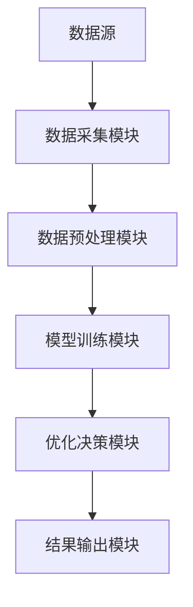

                 


# AI在资产负债匹配动态优化中的应用

> 关键词：人工智能，资产负债，动态优化，强化学习，深度学习，金融优化

> 摘要：随着人工智能技术的迅速发展，其在金融领域的应用日益广泛。本文详细探讨了AI技术在资产负债匹配动态优化中的应用，从理论基础到算法实现，再到系统架构设计和项目实战，全面解析了如何利用AI技术优化资产负债配置，提升金融系统的稳定性和收益能力。

---

## 第1章 AI在资产负债匹配动态优化中的应用概述

### 1.1 资产负债匹配的基本概念

#### 1.1.1 资产与负债的定义与分类
资产是指企业拥有的资源或权利，能够为企业带来经济利益。负债是企业需要偿还的债务或义务。资产负债匹配是指在不同时间段内，资产和负债的金额、期限和风险特性相匹配的过程。

| 资产类别       | 负债类别       |
|----------------|----------------|
| 流动资产       | 流动负债       |
| 非流动资产      | 非流动负债      |

#### 1.1.2 资产负债匹配的目标与意义
目标：实现资产与负债在时间、金额和风险上的匹配，以优化企业的财务状况。意义：通过动态优化，降低企业的财务风险，提高资金使用效率。

#### 1.1.3 动态优化的核心思想
动态优化是指在市场环境变化的情况下，实时调整资产和负债的配置，以适应新的市场条件。

### 1.2 AI在金融领域的应用背景

#### 1.2.1 人工智能在金融行业的应用现状
AI技术在金融行业的应用包括智能投顾、风险管理、信用评估等领域。AI技术的引入显著提高了金融决策的效率和准确性。

#### 1.2.2 资产负债匹配中的传统方法与局限性
传统方法主要依赖于静态模型和人工判断，存在反应速度慢、适应性差等问题。AI技术的应用能够克服这些局限性。

#### 1.2.3 AI技术如何变革资产负债匹配优化
通过机器学习和强化学习等技术，AI能够实时分析市场数据，动态调整资产和负债配置，实现更高效的优化。

### 1.3 本章小结

#### 1.3.1 核心概念回顾
资产与负债的定义与分类，动态优化的核心思想。

#### 1.3.2 人工智能在资产负债匹配中的潜力
通过AI技术实现动态优化，提升资产配置效率，降低风险。

---

## 第2章 资产负债匹配动态优化的理论基础

### 2.1 资产负债匹配的数学模型

#### 2.1.1 资产负债匹配的基本模型
$$
\text{目标函数} = \sum_{t=1}^{T} \lambda_t \cdot (A_t - L_t)
$$
其中，$A_t$表示第$t$期的资产，$L_t$表示第$t$期的负债，$\lambda_t$为权重。

#### 2.1.2 动态优化的数学表达
$$
\min_{A, L} \sum_{t=1}^{T} (A_t - L_t)^2
$$
其中，$A$和$L$分别为资产和负债的向量。

#### 2.1.3 相关数学公式与推导
通过拉格朗日乘数法，可以将约束条件下的优化问题转化为无约束问题。

### 2.2 AI技术在优化中的应用原理

#### 2.2.1 机器学习在动态优化中的作用
机器学习通过学习历史数据，预测未来市场趋势，为优化提供输入。

#### 2.2.2 强化学习在资产配置中的应用
强化学习通过与环境的交互，学习最优策略。

#### 2.2.3 深度学习在复杂系统优化中的优势
深度学习能够处理高维数据，发现复杂模式。

### 2.3 资产负债匹配中的风险与收益平衡

#### 2.3.1 风险管理的核心原则
风险分散、风险对冲、风险转移等。

#### 2.3.2 收益与风险的量化方法
使用夏普比率、波动率等指标衡量风险与收益。

#### 2.3.3 AI在风险收益平衡中的应用
通过AI技术实现风险与收益的动态平衡。

### 2.4 本章小结

#### 2.4.1 理论基础总结
资产与负债匹配的数学模型，AI技术的应用原理。

#### 2.4.2 AI技术在优化中的关键作用
AI技术能够实时分析数据，动态调整配置，提升优化效率。

---

## 第3章 AI算法在资产负债匹配中的实现原理

### 3.1 常见AI算法及其特点

#### 3.1.1 机器学习算法概述
包括线性回归、支持向量机等。

#### 3.1.2 强化学习算法概述
包括Q-learning、Deep Q-Network等。

#### 3.1.3 深度学习算法概述
包括神经网络、卷积神经网络等。

### 3.2 基于强化学习的资产配置算法

#### 3.2.1 强化学习的基本原理
通过与环境交互，学习最优策略。

#### 3.2.2 资产配置中的状态空间与动作空间
状态空间包括市场状况、资产价格等，动作空间包括买入、卖出等操作。

#### 3.2.3 算法实现的数学模型
$$
Q(s, a) = Q(s, a) + \alpha (r + \gamma \max Q(s', a') - Q(s, a))
$$

### 3.3 基于深度学习的动态优化模型

#### 3.3.1 深度神经网络在优化中的应用
通过神经网络学习复杂的市场模式。

#### 3.3.2 深度学习模型的设计与训练
使用神经网络结构，通过大量数据训练模型。

### 3.4 本章小结

#### 3.4.1 AI算法的特点
机器学习、强化学习、深度学习的特点。

#### 3.4.2 强化学习与深度学习在优化中的应用
强化学习适用于策略优化，深度学习适用于模式识别。

---

## 第4章 资产负债匹配动态优化的系统架构设计

### 4.1 系统功能设计

#### 4.1.1 系统功能模块
包括数据采集、模型训练、优化决策、结果输出等模块。

#### 4.1.2 功能模块的交互流程
数据采集模块负责获取市场数据，模型训练模块进行模型训练，优化决策模块根据模型输出决策。

### 4.2 系统架构设计

#### 4.2.1 系统架构图


#### 4.2.2 模块之间的交互关系
数据采集模块将数据传递给预处理模块，预处理模块将数据传递给模型训练模块，训练好的模型传递给优化决策模块，优化结果传递给结果输出模块。

### 4.3 系统接口设计

#### 4.3.1 数据接口
包括数据输入接口和数据输出接口。

#### 4.3.2 API接口
提供RESTful API，供其他系统调用。

### 4.4 本章小结

#### 4.4.1 系统功能设计
数据采集、模型训练、优化决策、结果输出等功能模块。

#### 4.4.2 系统架构设计
模块化的系统架构，各模块之间交互清晰。

---

## 第5章 项目实战

### 5.1 项目背景与目标

#### 5.1.1 项目背景
某金融机构希望优化其资产负债配置，降低风险，提高收益。

#### 5.1.2 项目目标
实现基于AI的动态优化系统，提升资产配置效率。

### 5.2 系统核心实现

#### 5.2.1 数据采集与预处理
使用Python的pandas库进行数据处理。

#### 5.2.2 模型训练与优化
使用TensorFlow框架进行模型训练。

#### 5.2.3 优化决策与结果输出
根据模型输出结果，调整资产和负债配置。

### 5.3 项目代码实现

#### 5.3.1 数据采集代码
```python
import pandas as pd

data = pd.read_csv('market_data.csv')
```

#### 5.3.2 模型训练代码
```python
import tensorflow as tf

model = tf.keras.Sequential([
    tf.keras.layers.Dense(64, activation='relu'),
    tf.keras.layers.Dense(1, activation='linear')
])
model.compile(optimizer='adam', loss='mse')
model.fit(data, labels, epochs=100, batch_size=32)
```

### 5.4 实际案例分析

#### 5.4.1 案例背景
假设市场出现波动，需要调整资产配置。

#### 5.4.2 模型输出与决策
模型预测未来资产价格，调整资产和负债配置。

### 5.5 项目小结

#### 5.5.1 项目实现的关键点
数据采集与预处理，模型训练与优化，结果输出与调整。

#### 5.5.2 项目成果
实现了基于AI的动态优化系统，提升了资产配置效率。

---

## 第6章 总结与展望

### 6.1 总结

#### 6.1.1 核心内容回顾
AI技术在资产负债匹配动态优化中的应用，从理论到实践的详细探讨。

#### 6.1.2 AI技术的关键作用
AI技术能够实时分析数据，动态调整配置，提升优化效率。

### 6.2 未来展望

#### 6.2.1 技术发展
深度学习、强化学习等技术的进一步发展。

#### 6.2.2 应用场景扩展
AI技术在更多金融领域的应用，如智能投顾、风险管理等。

---

## 作者：AI天才研究院/AI Genius Institute & 禅与计算机程序设计艺术 /Zen And The Art of Computer Programming

