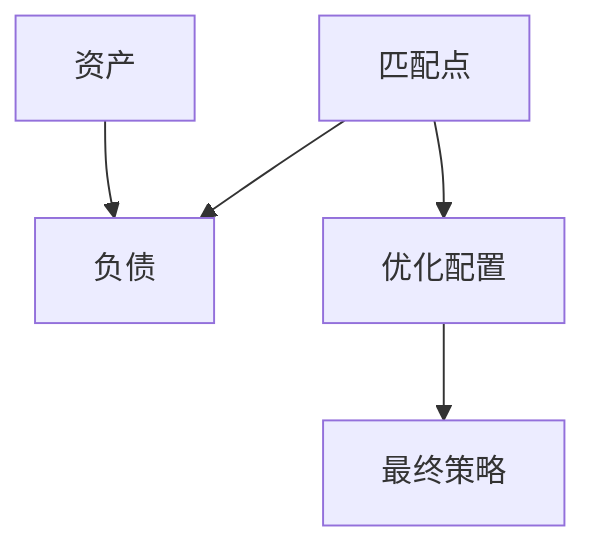
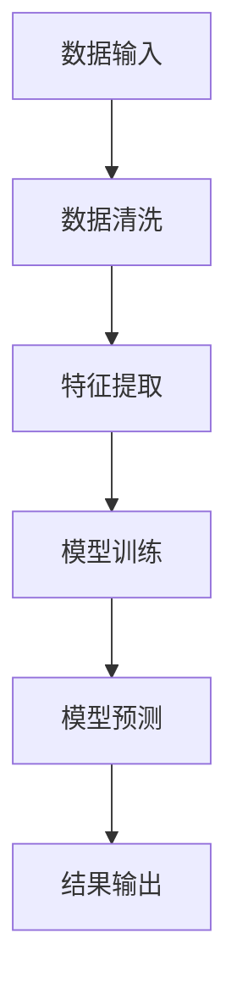
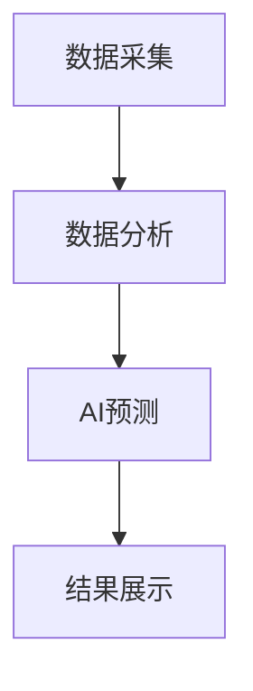
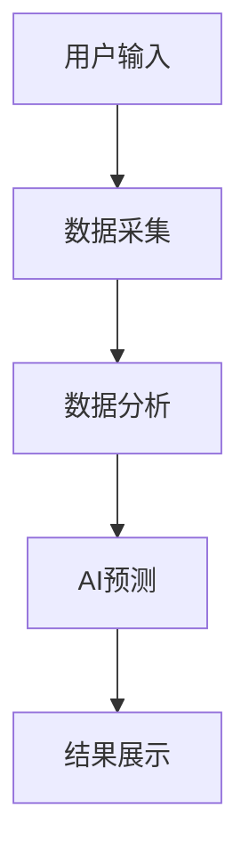

                 


# AI在资产负债匹配管理中的应用

> 关键词：人工智能、资产负债匹配、风险管理、机器学习、深度学习、金融技术、系统架构

> 摘要：本文探讨了人工智能（AI）在资产负债匹配管理中的应用，分析了AI技术如何优化资产负债匹配管理的效率和准确性。文章从背景介绍、核心概念、算法原理、系统架构、项目实战到最佳实践，全面解析了AI在资产负债匹配管理中的应用。通过本文，读者可以深入了解AI如何帮助企业和金融机构优化资产负债配置，降低风险，提高财务绩效。

---

# 第一部分: 资产负债匹配管理与AI的结合

## 第1章: 资产负债匹配管理与AI的结合

### 1.1 资产负债匹配管理的定义与背景

#### 1.1.1 资产负债匹配管理的核心概念
资产负债匹配管理是指通过对资产和负债的合理配置，确保企业在不同时间点上资产和负债的规模、期限和风险相匹配。这种匹配不仅有助于企业降低财务风险，还能提高资金使用效率。

#### 1.1.2 AI技术在金融领域的应用背景
人工智能（AI）技术近年来在金融领域的应用日益广泛。通过机器学习、深度学习等技术，AI能够处理海量数据，识别复杂模式，并提供智能化的决策支持。AI在金融领域的应用涵盖了风险评估、投资决策、信用评分、市场预测等多个方面。

#### 1.1.3 资产负债匹配管理与AI的结合意义
将AI技术引入资产负债匹配管理，能够显著提升管理的效率和准确性。AI可以通过分析历史数据和市场趋势，预测未来资产和负债的变化趋势，从而优化配置策略。此外，AI还能够实时监控市场动态，及时调整资产负债结构，降低企业的财务风险。

---

### 1.2 资产负债匹配管理的业务流程

#### 1.2.1 资产负债匹配的基本原理
资产负债匹配的基本原理是通过分析资产和负债的期限、规模和风险特征，确保两者在时间和金额上保持平衡。传统的资产负债匹配管理依赖于人工分析和经验判断，存在效率低、准确性差的问题。

#### 1.2.2 传统资产负债匹配管理的挑战
传统资产负债匹配管理面临以下挑战：
1. 数据量大：资产和负债涉及大量的数据，人工分析效率低下。
2. 模型复杂：资产负债匹配需要考虑多种因素，传统模型难以捕捉复杂关系。
3. 实时性差：传统方法难以实时调整资产负债结构，导致错失市场机会或承担额外风险。

#### 1.2.3 AI在资产负债匹配管理中的优势
AI技术能够显著提升资产负债匹配管理的效率和准确性：
1. 数据处理能力强：AI可以快速处理海量数据，提取有价值的信息。
2. 模型复杂度高：AI可以通过深度学习等技术，捕捉复杂的市场关系和模式。
3. 实时性强：AI可以实时监控市场动态，及时调整资产负债结构。

---

### 1.3 AI在资产负债匹配管理中的应用现状

#### 1.3.1 全球AI技术的发展趋势
近年来，AI技术在金融领域的应用呈指数级增长。根据相关数据显示，全球金融机构在AI技术上的投资持续增加，AI在金融领域的应用范围也在不断扩大。

#### 1.3.2 资产负债匹配管理中的AI应用案例
目前，AI已经在资产负债匹配管理中得到了广泛应用。例如，某银行利用机器学习技术，预测未来利率走势，优化资产配置策略；某保险公司通过深度学习技术，评估市场风险，调整负债结构。

#### 1.3.3 当前应用中的主要问题与挑战
尽管AI在资产负债匹配管理中取得了一些成果，但仍面临以下问题：
1. 数据质量问题：部分企业数据不完整或存在偏差，影响AI模型的准确性。
2. 模型解释性差：复杂的AI模型难以解释其决策过程，影响管理者的信任度。
3. 技术门槛高：AI技术的复杂性使得部分企业难以独立开发和应用相关系统。

---

### 1.4 本章小结
本章介绍了资产负债匹配管理的核心概念和AI技术在金融领域的应用背景。通过分析传统资产负债匹配管理的挑战和AI技术的优势，探讨了当前AI在资产负债匹配管理中的应用现状及存在的问题。

---

## 第2章: 资产负债匹配管理的核心概念

### 2.1 资产负债匹配管理的理论基础

#### 2.1.1 资产负债匹配管理的数学模型
资产负债匹配管理可以通过以下数学模型进行描述：
$$
\text{资产配置} = f(\text{负债结构}, \text{市场风险}, \text{时间因素})
$$
其中，$f$ 表示资产配置函数，$\text{负债结构}$ 表示负债的规模和期限，$\text{市场风险}$ 表示市场波动对资产和负债的影响，$\text{时间因素}$ 表示时间跨度。

#### 2.1.2 资产负债匹配管理的业务模型
资产负债匹配管理的业务模型包括以下几个步骤：
1. 数据收集：收集资产和负债的相关数据，包括规模、期限、利率等。
2. 数据分析：通过数据分析技术，识别资产和负债之间的匹配点。
3. 模型构建：构建资产和负债匹配的数学模型，评估匹配程度。
4. 优化配置：根据模型结果，优化资产和负债的配置策略。

#### 2.1.3 资产负债匹配管理的业务流程图（Mermaid）



---

### 2.2 AI在资产负债匹配管理中的核心作用

#### 2.2.1 AI在风险评估中的应用
AI可以通过分析历史数据和市场趋势，预测未来风险，评估资产和负债的风险敞口。例如，利用机器学习技术，可以预测利率波动对资产和负债的影响。

#### 2.2.2 AI在资产配置中的应用
AI可以通过分析市场数据，优化资产配置策略。例如，利用深度学习技术，可以预测资产价格走势，制定最优的资产配置方案。

#### 2.2.3 AI在负债管理中的应用
AI可以通过分析市场数据，优化负债结构。例如，利用强化学习技术，可以预测负债成本的变化，制定最优的负债管理策略。

---

### 2.3 资产负债匹配管理中的关键指标

#### 2.3.1 资产负债匹配率
资产负债匹配率是衡量资产和负债匹配程度的重要指标。其计算公式如下：
$$
\text{资产负债匹配率} = \frac{\text{资产匹配负债部分}}{\text{总负债}}
$$

#### 2.3.2 资产负债期限匹配度
资产负债期限匹配度是衡量资产和负债期限匹配程度的指标。其计算公式如下：
$$
\text{期限匹配度} = \frac{\text{资产期限与负债期限匹配部分}}{\text{总负债期限}}
$$

#### 2.3.3 资产负债风险敞口
资产负债风险敞口是衡量资产和负债在不同市场条件下的风险暴露程度。其计算公式如下：
$$
\text{风险敞口} = \text{资产价值变化} - \text{负债价值变化}
$$

---

### 2.4 本章小结
本章详细介绍了资产负债匹配管理的核心概念，包括其理论基础、业务模型和关键指标。同时，探讨了AI技术在资产负债匹配管理中的核心作用。

---

## 第3章: AI算法在资产负债匹配管理中的应用

### 3.1 机器学习在资产负债匹配管理中的应用

#### 3.1.1 监督学习在资产配置中的应用
监督学习可以通过分析历史数据，预测资产价格走势，制定最优的资产配置策略。例如，利用线性回归模型，可以预测股票价格的变化趋势。

#### 3.1.2 无监督学习在风险评估中的应用
无监督学习可以通过聚类分析，识别资产和负债之间的潜在风险点。例如，利用K-means算法，可以将资产和负债分为不同的风险类别。

#### 3.1.3 强化学习在负债管理中的应用
强化学习可以通过模拟市场环境，优化负债管理策略。例如，利用Q-learning算法，可以预测负债成本的变化，制定最优的负债管理策略。

---

### 3.2 深度学习在资产负债匹配管理中的应用

#### 3.2.1 卷积神经网络在资产风险评估中的应用
卷积神经网络（CNN）可以通过分析资产价格的波动性，评估资产的风险等级。例如，利用CNN模型，可以预测资产价格的波动趋势。

#### 3.2.2 循环神经网络在负债预测中的应用
循环神经网络（RNN）可以通过分析负债的历史数据，预测未来负债的变化趋势。例如，利用LSTM模型，可以预测负债规模的变化。

#### 3.2.3 图神经网络在资产负债网络中的应用
图神经网络（GNN）可以通过分析资产和负债之间的关系，优化资产负债的匹配结构。例如，利用图神经网络模型，可以识别资产和负债之间的潜在匹配点。

---

### 3.3 基于AI的资产负债匹配管理算法流程图（Mermaid）



---

### 3.4 本章小结
本章详细介绍了AI算法在资产负债匹配管理中的应用，包括机器学习和深度学习在资产配置、风险评估和负债管理中的具体应用。

---

## 第4章: 资产负债匹配管理系统的架构与设计

### 4.1 资产负债匹配管理系统的架构设计

#### 4.1.1 系统功能模块划分
资产负债匹配管理系统可以划分为以下几个功能模块：
1. 数据采集模块：负责收集资产和负债的相关数据。
2. 数据分析模块：负责对数据进行清洗和特征提取。
3. AI预测模块：负责利用AI算法进行预测和优化。
4. 结果展示模块：负责展示预测结果和优化建议。

#### 4.1.2 系统架构设计（Mermaid）



---

### 4.2 系统接口设计

#### 4.2.1 资产负债数据接口
资产负债数据接口用于接收资产和负债的相关数据。接口设计如下：
```python
def get_asset_data():
    # 获取资产数据
    pass

def get_liability_data():
    # 获取负债数据
    pass
```

#### 4.2.2 AI模型调用接口
AI模型调用接口用于调用AI算法进行预测和优化。接口设计如下：
```python
def train_model():
    # 训练AI模型
    pass

def predict(asset_data, liability_data):
    # 利用AI模型进行预测
    pass
```

---

### 4.3 系统交互设计

#### 4.3.1 系统交互流程图（Mermaid）



---

### 4.4 本章小结
本章详细介绍了资产负债匹配管理系统的架构设计和接口设计，展示了系统各模块之间的交互关系。

---

## 第5章: 项目实战——AI驱动的资产负债匹配管理系统

### 5.1 环境安装与配置

#### 5.1.1 Python环境安装
需要安装以下Python库：
- `numpy`
- `pandas`
- `scikit-learn`
- `keras`
- `tensorflow`

安装命令：
```bash
pip install numpy pandas scikit-learn keras tensorflow
```

---

#### 5.1.2 数据集准备
需要准备以下数据集：
- 资产数据：包括资产规模、资产期限、资产利率等。
- 负债数据：包括负债规模、负债期限、负债利率等。

---

### 5.2 系统核心实现源代码

#### 5.2.1 数据清洗与特征提取
```python
import pandas as pd
import numpy as np

def clean_data(data):
    # 删除缺失值
    data = data.dropna()
    # 标准化数据
    data = (data - data.mean()) / data.std()
    return data

asset_data = pd.read_csv('asset.csv')
liability_data = pd.read_csv('liability.csv')

asset_cleaned = clean_data(asset_data)
liability_cleaned = clean_data(liability_data)
```

---

#### 5.2.2 AI模型训练与预测
```python
from sklearn.model

