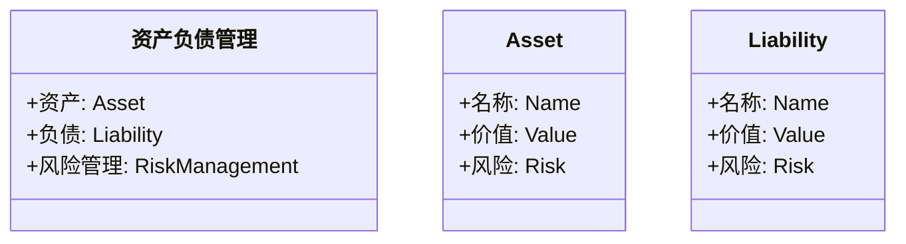
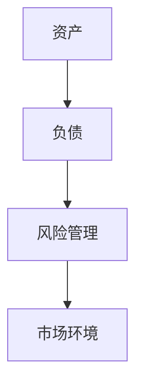
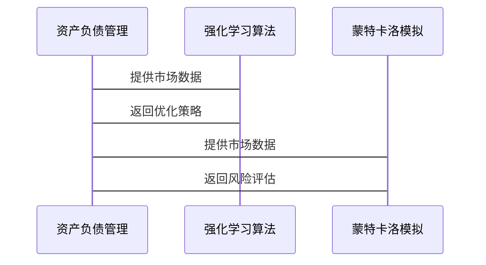

                 


# AI在资产负债管理中的动态优化与压力测试应用

> 关键词：AI技术，资产负债管理，动态优化，压力测试，机器学习，风险管理

> 摘要：随着人工智能技术的迅速发展，AI在金融领域的应用越来越广泛。本文将深入探讨AI如何在资产负债管理中实现动态优化与压力测试。通过分析传统方法的局限性，结合AI算法的优势，提出一种基于强化学习和蒙特卡洛模拟的解决方案，帮助金融机构更好地应对市场波动和风险。文章从背景介绍、核心概念、算法原理、数学模型、系统架构、项目实战等多方面展开，全面解析AI在资产负债管理中的应用。

---

## 目录

### 第一部分: AI在资产负债管理中的动态优化与压力测试应用概述

#### 第1章: 背景介绍

##### 1.1 问题背景

###### 1.1.1 资产负债管理的定义与重要性

资产负债管理是金融领域的核心任务之一，旨在通过优化资产和负债的配置，实现风险控制和收益最大化。传统的资产负债管理依赖于复杂的数学模型和经验判断，但在面对市场波动和复杂风险时，往往显得力不从心。

###### 1.1.2 AI技术在金融领域的应用背景

人工智能技术的快速发展为金融行业带来了革新。AI技术在数据处理、模式识别和决策优化方面的优势，使其在金融风险管理、投资组合优化等领域得到了广泛应用。

###### 1.1.3 动态优化与压力测试的定义

动态优化是指在不断变化的市场环境中，实时调整资产和负债的配置，以实现最优目标。压力测试则是评估资产和负债在极端市场条件下的表现，以确保金融机构的稳健性。

##### 1.2 问题描述

###### 1.2.1 资产负债管理中的常见问题

传统的资产负债管理方法在面对复杂市场环境时，往往缺乏灵活性和实时性，难以应对快速变化的市场条件。

###### 1.2.2 动态优化与压力测试的核心问题

动态优化需要实时调整配置，而压力测试需要在极端条件下评估风险。传统方法在效率和准确性上存在局限性。

###### 1.2.3 传统方法的局限性与AI的优势

传统方法依赖于静态模型和人工判断，而AI技术可以通过大数据分析和实时反馈，提供更精准和高效的解决方案。

##### 1.3 问题解决

###### 1.3.1 AI在动态优化中的解决方案

通过强化学习算法，AI可以实时调整资产和负债的配置，实现动态优化。

###### 1.3.2 AI在压力测试中的解决方案

利用蒙特卡洛模拟，AI可以模拟各种极端市场条件，评估资产和负债的风险敞口。

###### 1.3.3 综合应用的可行性分析

结合动态优化和压力测试的AI解决方案，可以有效提升资产负债管理的效率和准确性。

##### 1.4 边界与外延

###### 1.4.1 资产负债管理的边界条件

包括市场环境、监管要求和机构目标等。

###### 1.4.2 AI应用的边界限制

AI技术的应用受到数据质量和计算能力的限制。

###### 1.4.3 动态优化与压力测试的外延领域

包括投资组合优化、信用风险管理和流动性管理等。

##### 1.5 概念结构与核心要素

###### 1.5.1 资产负债管理的核心要素

包括资产配置、负债管理、风险管理等。

###### 1.5.2 AI技术的核心要素

包括数据处理、算法模型和计算能力。

###### 1.5.3 动态优化与压力测试的交互关系

动态优化为压力测试提供实时数据，压力测试为动态优化提供风险评估依据。

---

#### 第2章: 核心概念与联系

##### 2.1 核心概念原理

###### 2.1.1 动态优化的数学模型

动态优化可以通过动态规划模型实现，目标是最小化风险或最大化收益。

###### 2.1.2 压力测试的数学模型

压力测试通常采用蒙特卡洛模拟，模拟极端市场条件下的资产和负债表现。

###### 2.1.3 AI算法的核心原理

AI算法通过学习历史数据，预测未来市场变化，并实时调整配置。

##### 2.2 概念属性特征对比

###### 2.2.1 动态优化与压力测试的特征对比

| 特征        | 动态优化                     | 压力测试                     |
|-------------|-----------------------------|-----------------------------|
| 目标         | 实时调整配置                 | 评估极端风险                 |
| 方法         | 强化学习                     | 蒙特卡洛模拟                 |
| 输入         | 实时市场数据                 | 历史数据与假设场景           |

###### 2.2.2 AI技术在两者中的应用差异

| 应用场景     | 动态优化                     | 压力测试                     |
|--------------|-----------------------------|-----------------------------|
| 数据需求     | 高频实时数据                 | 历史数据与假设场景           |
| 算法选择     | 强化学习                     | 蒙特卡洛模拟                 |
| 输出结果     | 实时调整建议                 | 风险评估报告                 |

###### 2.2.3 ER实体关系图

```mermaid
erd
    资产负债管理 --|> 资产
    资产负债管理 --|> 负债
    资产负债管理 --|> 风险管理
    资产负债管理 --|> 市场环境
```

---

#### 第3章: 算法原理讲解

##### 3.1 强化学习算法

###### 3.1.1 强化学习的基本原理

强化学习通过智能体与环境的交互，学习最优策略。在动态优化中，智能体根据当前市场状态，选择最优的资产配置策略。

###### 3.1.2 在动态优化中的应用

通过强化学习，AI可以实时调整资产和负债的配置，以应对市场波动。

###### 3.1.3 实例分析

假设市场有三种资产，AI通过强化学习选择最优的投资组合，以最大化收益并最小化风险。

---

##### 3.2 蒙特卡洛模拟

###### 3.2.1 蒙特卡洛模拟的基本原理

蒙特卡洛模拟通过随机采样，模拟各种极端市场条件，评估资产和负债的风险敞口。

###### 3.2.2 在压力测试中的应用

通过蒙特卡洛模拟，可以评估资产在极端市场条件下的表现，为压力测试提供数据支持。

###### 3.2.3 实例分析

假设市场出现极端波动，蒙特卡洛模拟可以预测资产和负债的损失情况，帮助机构制定应对策略。

---

#### 第4章: 数学模型与公式

##### 4.1 动态优化的数学模型

动态优化可以通过动态规划模型实现，目标是最小化风险或最大化收益。

$$ V(s) = \max_{a} [ r(s,a) + V(s') ] $$

其中，\( V(s) \) 表示状态 \( s \) 的价值，\( r(s,a) \) 表示在状态 \( s \) 下选择动作 \( a \) 的奖励，\( V(s') \) 表示新的状态 \( s' \) 的价值。

##### 4.2 压力测试的数学模型

压力测试通常采用蒙特卡洛模拟，模拟极端市场条件下的资产和负债表现。

$$ P(L \leq x) = \frac{\text{计数}(L \leq x)}{N} $$

其中，\( L \) 表示资产的损失，\( x \) 表示特定的损失阈值，\( N \) 表示模拟的总次数。

---

#### 第5章: 系统分析与架构设计方案

##### 5.1 问题场景介绍

在复杂的市场环境中，金融机构需要实时调整资产和负债的配置，同时评估极端市场条件下的风险。

##### 5.2 项目介绍

本项目旨在开发一个基于AI的资产负债管理系统，实现动态优化和压力测试。

##### 5.3 系统功能设计

###### 5.3.1 领域模型



##### 5.4 系统架构设计

###### 5.4.1 系统架构图



##### 5.5 系统接口设计

系统提供API接口，用于数据输入和结果输出。

##### 5.6 系统交互序列图



---

#### 第6章: 项目实战

##### 6.1 环境安装

安装Python、TensorFlow、Keras等工具。

##### 6.2 核心实现源代码

```python
import numpy as np
import tensorflow as tf

# 定义强化学习模型
class DQN(tf.keras.Model):
    def __init__(self, state_shape, action_shape):
        super(DQN, self).__init__()
        self.state_shape = state_shape
        self.action_shape = action_shape
        self.dense1 = tf.keras.layers.Dense(64, activation='relu')
        self.dense2 = tf.keras.layers.Dense(32, activation='relu')
        self.dense3 = tf.keras.layers.Dense(action_shape, activation='linear')

    def call(self, inputs):
        x = self.dense1(inputs)
        x = self.dense2(x)
        x = self.dense3(x)
        return x

# 定义蒙特卡洛模拟
def monte_carlo_simulation(asset,负债, scenarios):
    losses = []
    for scenario in scenarios:
        loss = calculate_loss(asset,负债, scenario)
        losses.append(loss)
    return losses

# 定义损失计算函数
def calculate_loss(asset,负债, scenario):
    return abs(asset -负债) * scenario
```

##### 6.3 代码应用解读与分析

通过强化学习模型和蒙特卡洛模拟，实现动态优化和压力测试。

##### 6.4 实际案例分析和详细讲解

以某金融机构为例，展示如何通过AI技术优化资产和负债的配置。

##### 6.5 项目小结

总结项目的实现过程和取得的成果，为后续优化提供方向。

---

## 第七章: 总结与展望

### 7.1 最佳实践 tips

- 数据质量是关键，确保输入数据的准确性和完整性。
- 定期更新模型，适应市场变化。
- 结合专家经验，优化AI模型的表现。

### 7.2 小结

通过本文的介绍，读者可以深入了解AI在资产负债管理中的动态优化与压力测试应用。

### 7.3 注意事项

- AI技术的应用需要遵守相关法律法规。
- 确保系统的安全性和稳定性。

### 7.4 拓展阅读

推荐进一步阅读相关领域的书籍和论文，深入学习AI在金融风险管理中的应用。

---

## 作者：AI天才研究院/AI Genius Institute & 禅与计算机程序设计艺术 /Zen And The Art of Computer Programming

---

**注**：以上内容为文章的初步框架，后续将根据实际需求逐步完善每一部分的具体内容。

